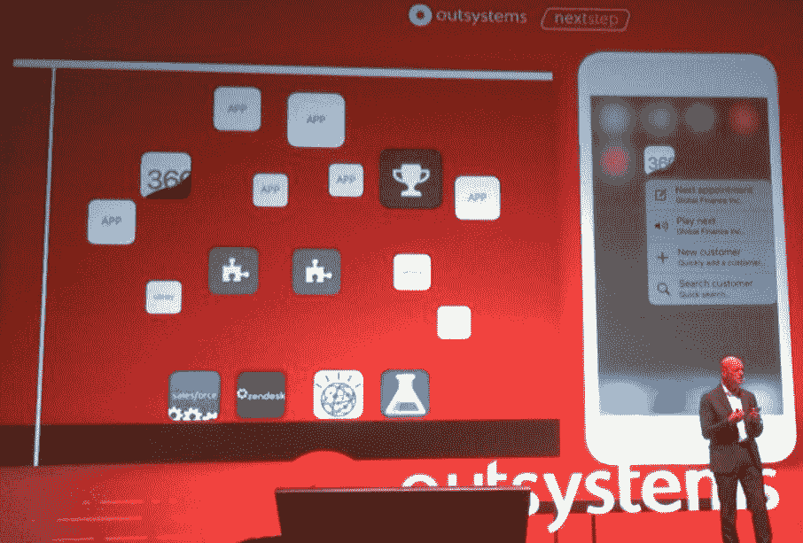
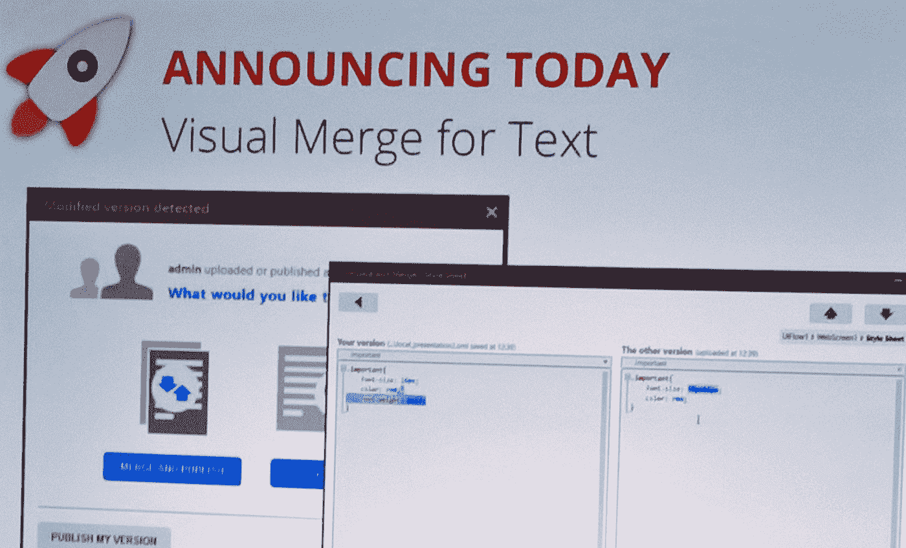
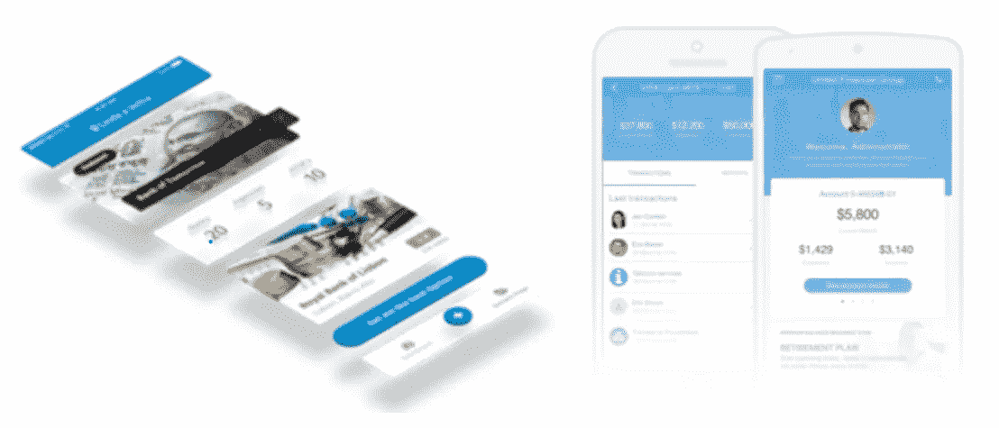
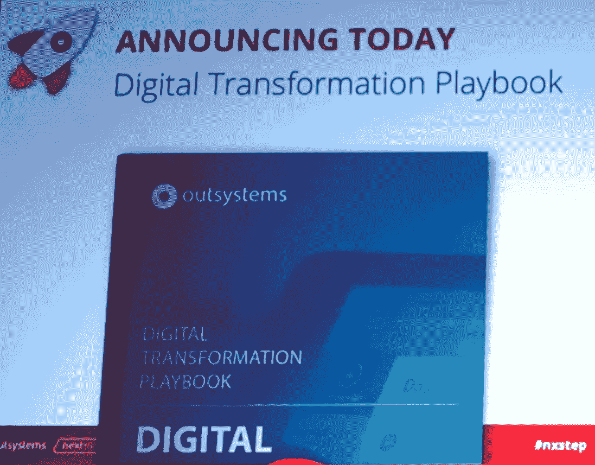
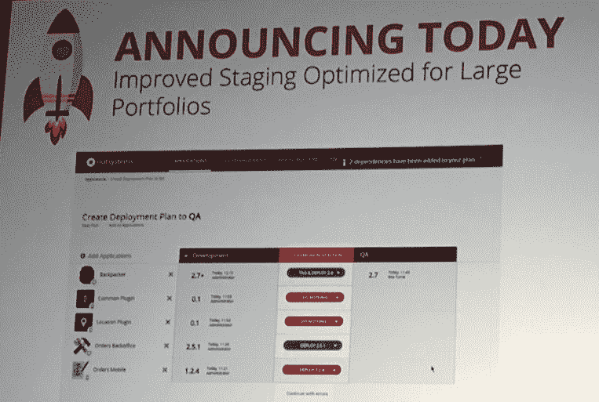
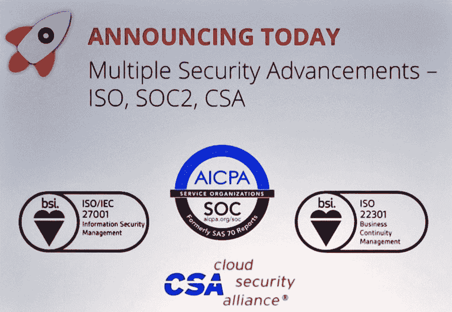
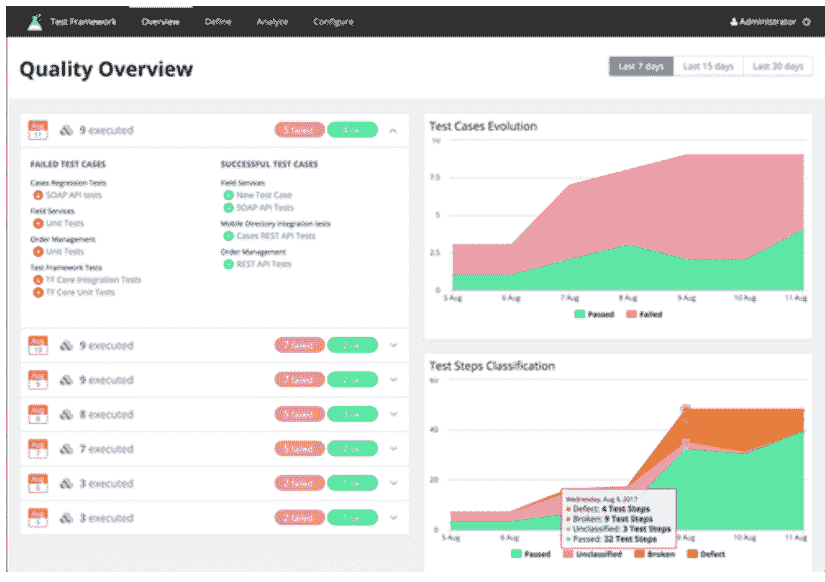
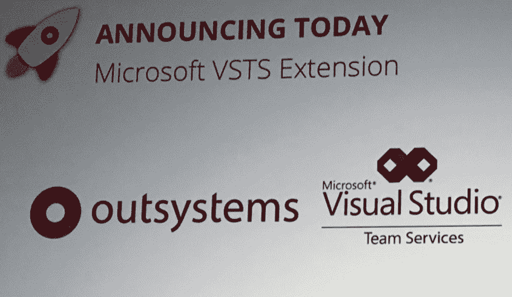
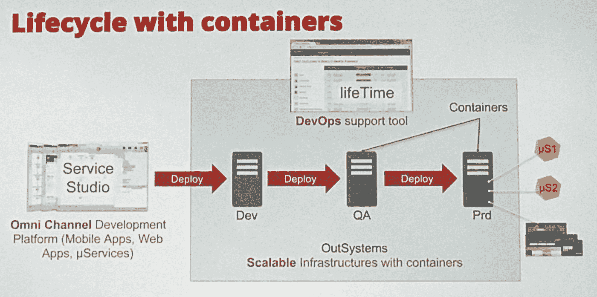

# Outsystems 下一步 2017

> 原文：<https://itnext.io/outsystems-next-step-2017-ab4ba5210dc8?source=collection_archive---------0----------------------->

OutSystems [NextStep](https://www.outsystems.com/nextstep/HomePage.aspx) 是数字转型和低代码的头号会议。在 NextStep 2017 会议上，他们推出了新 OutSystems 平台的几个新功能。这些新功能包括:

[*点击这里在 LinkedIn*](https://www.linkedin.com/cws/share?url=https%3A%2F%2Fitnext.io%2Foutsystems-next-step-2017-ab4ba5210dc8) 上分享这篇文章

1.  更多组件
2.  开发者协作
3.  像素完美的用户界面
4.  本机应用调试器
5.  数字化转型行动手册
6.  巨大的可扩展性
7.  企业安全
8.  大型系统的质量保证
9.  打开 devops
10.  微服务和容器

# 1.更多组件

**移动组件-已经可用**

新功能可以充分利用移动设备的传感器和组件，如声音、摄像头等。

**ML、IoT、AI 组件-即将上市**

将有新的组件与微软 Azure、IBM Watson 和 AWS 提供的物联网、机器学习和人工智能功能集成。

# 2.开发者协作

**可视合并文本-已经可用**

javascript 和 CSS 文本的可视化合并是开发人员需要很长时间的东西。OutSystems 提供了这个特性来帮助开发人员(特别是移动设备)。

此工具类似于现有的工具，用于比较突出显示已更改元素的主要可视组件。

**最佳实践-即将推出**

OutSystems 将发布新的内容，让开发者更快地学习如何使用该平台。

此外，将有一个工具来帮助开发人员在编程时，了解什么是没有被应用的最佳实践。

**画布对齐-已经可用**

OutSystems 引入了画布线来帮助开发人员对齐和定位流的元素。拖动节点时，线条会显示出来。

# 3.像素完美的用户界面

**Silk UI 模式和模板——已经可用**

IOS 和 Android 的新模式和模板可以用于移动和桌面应用程序，为 Android 和 IOS 提供原生的外观和感觉。

很容易选择一个主题颜色或图片，并在桌面或手机上使用。与设计所有主题应用程序不同，模板可以很容易地让开发人员快速启动他们的应用程序。

**Pixel perfect ui-即将推出**

这个新工具将帮助开发人员在不编写 CSS 代码的情况下改进界面的构建。只需点击几下，就可以轻松配置屏幕上每个项目的外观。

# 4.本机应用调试器

**全栈调试-已经可用**

一个允许调试移动应用程序客户端代码的新工具。开发人员努力调试客户端动作，现在他们有了全栈调试！

# 5.数字化转型行动手册

**行动手册-即将推出**

OutSystems 将发布一套包含指南和内容的行动手册，为如何实现公司的数字化转型提供指导。

# 6.巨大的可扩展性

**改进的暂存-已经可用**

将应用程序部署到其他环境时，也需要部署应用程序的依赖项。OutSystems 升级了部署的暂存工具，以自动添加所需的依赖项。这对于具有许多依赖项的大型应用程序组合尤其重要。

# 7.企业安全

**政策和认证-已经推出**

对安全性的需求正在增加。OutSystems 基于云的解决方案必须遵循安全政策和程序，以符合数据安全、隐私和安保方面的国际标准和认证。作为遵循安全云计算环境的云安全联盟(CSA)最佳实践的示例。

**移动实体安全-即将推出**

一些移动应用具有关键的安全性要求，并且本地实体的数据需要加密。OutSystems 将提供一个解决方案，通过额外的安全层来满足这些需求。

# 8.大型系统的质量保证

**测试框架-即将推出**

一个[测试框架](https://www.outsystems.com/forge/2464/)将包含在新的平台版本中。它是一个开源应用程序，支持管理和自动执行外部系统单元和 API 测试。它还允许自动回归测试设置和执行，同时与 [BDD](http://www.outsystems.com/forge/component/1201/bddframework) 和[单元测试框架](http://www.outsystems.com/forge/component/387/unit-testing-framework)轻松集成

# 9.打开 devops

**与 VSTS 集成-已经可用**

OutSystems 平台将与[Visual Studio Team Services](https://www.visualstudio.com/team-services/)集成，以跟踪和管理发布和操作。通过这种方式，DevOps 团队将能够监控和操作应用程序的持续部署，以及自动化测试结果。OutSystems 将把该平台与 Jenkins 自动化服务器集成在一起，并随着开发提供持续集成能力。

# 10.微服务和容器

**out systems 中的集装箱即将上市**

web 服务数量的增加使得跟踪、维护和管理它们变得很困难。

因此，OutSystems 将发布基于容器和微服务的新平台版本。可以使用市场上可用的工具(如 Docker)将它分发到多个环境中。

随着这一举措，OutSystems 也将跟随行业趋势，响应企业的需求。

# 编辑注释

本文发表于 2017 年 11 月 10 日 OutSystems 在荷兰乌特勒支举办的 Next Step 活动之后。它是根据参与者的笔记和互联网上的内容编写的。

编辑:Marco Arede /共同编辑:Kees Kleybeuker，Kiarash Irandoust。

# 标签

# out systems # low code # NX step[# digital transformation](https://twitter.com/hashtag/DigitalTransformation?src=hash)# it next