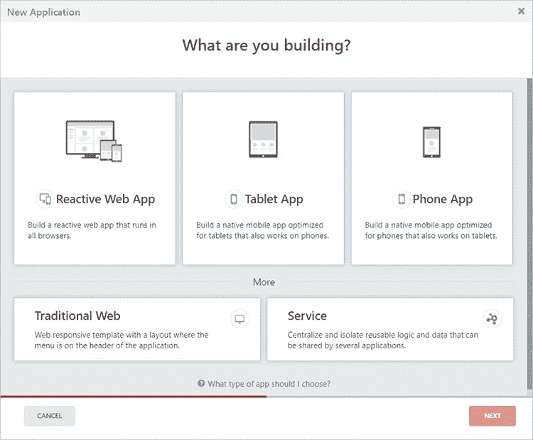
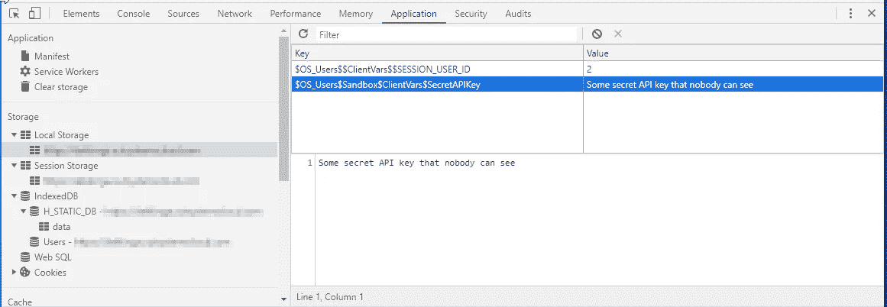
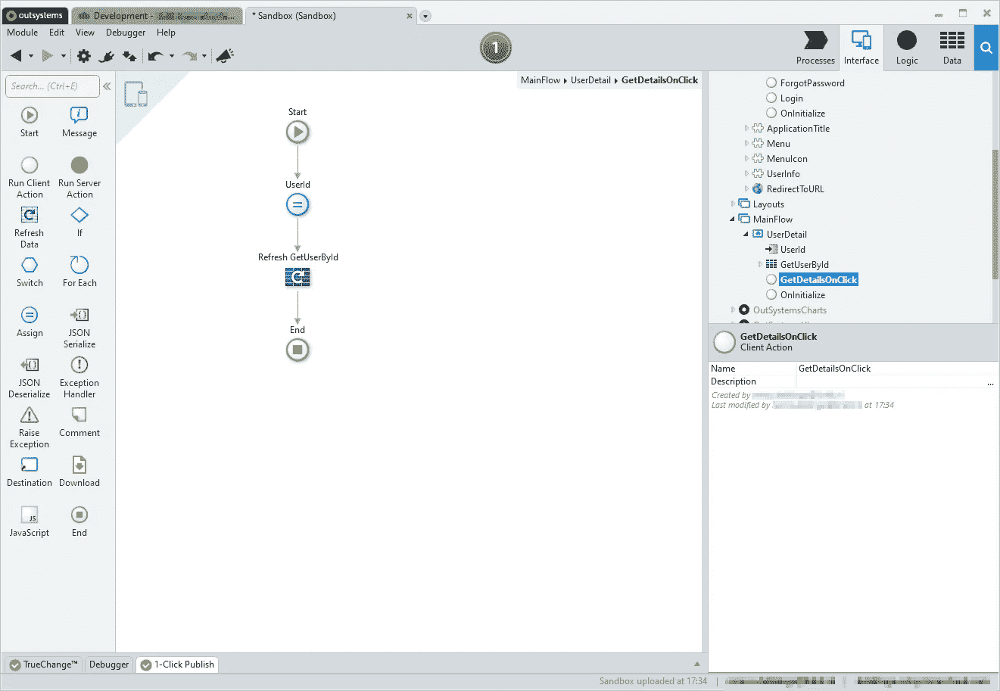
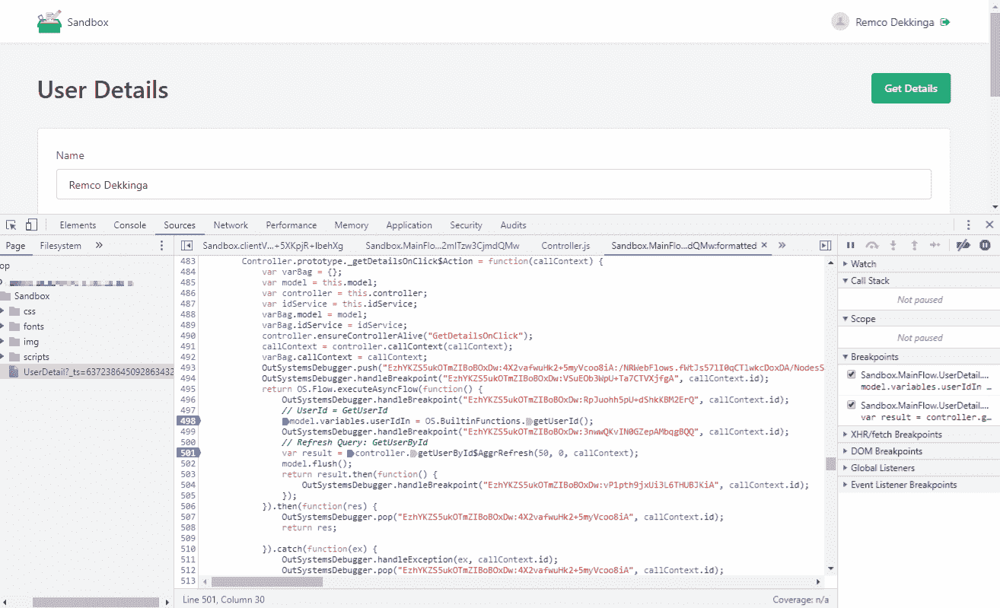
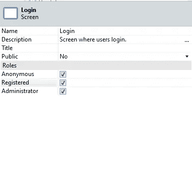
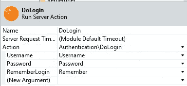
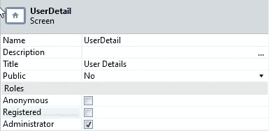
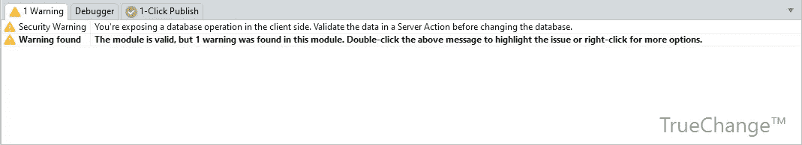

# 外部系统反应安全

> 原文：<https://itnext.io/outsystems-reactive-security-8ca98c3639f9?source=collection_archive---------6----------------------->

确保主动保护您的外部系统反应式应用程序

OutSystems Platform 于 2019 年 10 月发布了一款新的 web 应用，名为 Reactive Web App。从那时起，几个[更新已经发布](https://www.outsystems.com/whats-new/)，随着每个新版本的推出，反应式网络应用变得越来越好。这让我想知道，我们都习惯于传统 Web 应用程序的安全功能是否仍然适用于反应式 Web 应用程序。

外部系统中的不同风味

一个反应式 Web App 由两部分组成，**客户端**和**服务器端**。对双方来说，你需要考虑不同的安全措施。

# 客户端

安全性的经验法则是，一旦代码在客户端，它就可能被最终用户滥用。

客户端安全性

## 不要在客户端公开敏感数据

**客户端代码** (UI、客户端动作、屏幕和块变量、输入参数)转换成 web 资源(HTML、JavaScript 和 CSS)。这意味着它可以被操纵。因此，我们需要确保所有安全敏感的代码和数据都在服务器端。

当使用**客户端变量**时，记住它们存储在浏览器的本地存储器( [HTML Web 存储器](https://www.w3schools.com/html/html5_webstorage.asp))中，并且它们可以在应用程序之间[共享。确保永远不要将敏感数据存储在客户端变量中，也不要使用它们来控制应用程序的流程，因为它们可以使用](https://success.outsystems.com/Documentation/11/Developing_an_Application/Use_Data/Share_a_Client_Variable_between_apps) [Chrome DevTools](https://developers.google.com/web/tools/chrome-devtools) 进行操作。

带有密码的客户端变量在本地存储中是可见的

当你需要数据时，不要提取所有的字段。仅获取屏幕所需的数据。获取太多列带来的风险是最终用户可以看到不应该共享的数据。从最新版本开始，**聚合得到优化**，OutSystems 平台为您处理这一安全风险。当您使用旧版本时，请更新您的平台或通过限制从聚合返回的数据来最小化此风险。

当您**从服务器**获取数据时(查询或 API 调用)，不要使用对返回数据有影响的输入参数。最终用户可以更改这些值并获取一些其他数据。考虑获取一些属于当前登录用户的特定于客户端的详细信息。

您可以将 GetUserId()分配给一个名为 UserId 的局部变量，并将其用作查询或服务器操作的输入参数来获取用户详细信息。

这个确切的功能可以被黑客攻击，如下面的短视频所示。想象一下人们可以用这些选项和自动化脚本做什么…

一个简单的解决方法是将 GetUserId()放在聚合中。聚合运行在服务器上，服务器是安全的，黑客不能再修改这个查询。

同样的解决方法适用于基于用户角色获取数据，或者从服务器获取数据，并将标识符或唯一标识元素的另一个元素作为输入参数发送给服务器。

## 使用角色保护屏幕和聚合

对于客户端的每个**聚合和服务器动作**，有一个 **REST API 方法暴露出来**来处理它的请求。

当聚合或服务器操作所属的屏幕是公共的(选择了匿名角色)时，REST API 也是公共的。

确保当您在公共屏幕中从服务器获取数据时，输入参数不能以任何方式被操作来获得不同的记录。

以 DoLogin()为例。这个是公开的，但是如果没有有效的用户名和密码组合，就不能使用它。

当屏幕不是公共的(分配给除匿名角色以外的一个或多个角色)时，**系统基于登录用户实现一个认证机制**。

只有登录的用户才能使用这个 REST API。

当您有一个基于不同角色的具有不同功能的屏幕时，最简单的方法是为每个角色创建一个具有其自身功能的单独屏幕。在一个屏幕上混合角色会影响应用程序的安全性。

## 实施安全机制来保护公开暴露的屏幕

对于公共屏幕，你有时需要做一些特殊的事情，比如创建一个账户，重置忘记的密码等等。

在这些情况下，您需要申请一个[一次性授权码](https://en.wikipedia.org/wiki/One-time_authorization_code) (OTAC)。为此，用户需要表明自己的身份。

当你忘记密码时，你是怎么做的？使用用户可以接收 OTC 的第二个设备实现流程。想象一下，在一个短信流程中，您会收到一个令牌、一封带有基于时间的特殊 URL 的电子邮件或一个返回令牌的验证器应用程序。使用这些流中任何一个的结果来唯一地识别您并登录。此时，您已经登录，可以正常使用服务器操作，因为它是安全的。登录后，您可以将重置密码屏幕显示为强制选项。

作为第二种选择，您可以在同一个请求中进行身份验证和重置密码。您请求一个令牌，然后该令牌用于在密码重置流程中识别您的身份。当令牌不正确时，您的密码将不会更新。

第三种选择是使用一个 [JWT 令牌](https://jwt.io/introduction/)来加密会话，并且只发送加密的数据。

# 服务器端

## 验证核心模块的安全性

当您向反应式应用程序公开服务器操作时，您应该始终考虑用户未被正确识别的可能性。开始对用户进行验证的操作；GetUserId()和 Role 检查<rolename>角色()，查看该用户是否被允许执行该操作。</rolename>

# 技巧

与传统网络相比，反应式网络的安全性不再是理所当然的，你必须为它做些实际的事情。按照下面的提示进行快速验证。

1.  牢记[中的警告，真正改变](http://gemoc.org/pub/20190625-MLE19/paper9.pdf)。他们将指导你克服最大的错误，并帮助你提高客户端代码的质量。
2.  作为额外的选择，您还可以查看架构仪表板，因为这个工具也有几个[代码分析模式](https://success.outsystems.com/Documentation/Architecture_Dashboard/Code_Patterns)。
3.  不要将测试屏幕部署到开发环境之外的其他环境中。它们通常是公共屏幕，具有相当多的功能，您可以使用它们来玩数据库。
4.  跟踪您正在使用的第三方插件。它们也可能包含漏洞。如果您不定期检查或更新组件，您就有可能通过已知的漏洞受到攻击。

我希望你从这篇文章中学到了一些东西，当你能够修复一个或多个应用程序中的安全问题时，我希望在下面的回复中看到一个简短的评论。

亲切的问候，

雷姆科·德金加