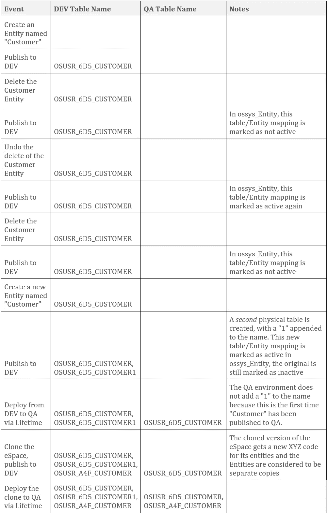

# OutSystems 服务器端数据模型:几乎所有需要知道的东西

> 原文：<https://itnext.io/outsystems-server-side-data-model-almost-everything-to-know-11a03590b99?source=collection_archive---------2----------------------->

在日常工作中，外部系统数据模型“正常工作”,您不需要了解太多就能完成工作。但是使用这个工具一段时间后，你会开始碰到一些你可能不理解的东西。诸如“当我重命名一个实体或属性时会发生什么？”或者也许是“物理表名在所有环境中都是一样的吗？”甚至是“在部署期间到底发生了什么事情？”都回答了！

(快速注意，在本文中，“*”是通配符占位符，“XYZ”是正好三个字母的占位符)

Yeeeeeeaaaaaahhhh 哥们！是时候进入数据模型了！(对于善于观察的人来说，是的，我每年 7 月 7 日都会庆祝，每天都有一把红色的钥匙)

# 命名规格

您将在数据库中看到许多表名模式。主要类别有:

*   OSSYS_*:系统表
*   OSLTM_*:生命周期的数据表
*   OSLOG_*:日志表(您在服务中心看到的日志)
*   OSUSR_XYZ_*:应用数据表，映射到空间中的实体
*   OSUSR_XYZ_*_t:视图位于多租户实体的应用程序数据表之上，它们是按租户 ID 过滤的
*   OSUSR_XYZ__ML*:静态实体的翻译

# 系统表

小心使用 OSSYS_*表！扰乱它们会导致您的环境变得不稳定，甚至完全崩溃。在几乎所有的情况下，不要*而不是*做出任何模式改变，或者在这里创建/更新/删除数据，除非你*非常确定*你知道你在做什么(换句话说，来自外部系统支持的某人告诉你做出改变)并且知道如果需要如何取消改变，比如在改变一个值之前做一个数据库的备份。

对于典型的故障排除，您会经常看到这些表格:

*   OSSYS_User:存储用户实体下的用户基本信息；如果需要编辑用户数据，可以通过用户实体访问这些数据。
*   OSSYS_Role:系统中的角色列表
*   OSSYS_User_Role:角色到用户的映射。您可以阅读本文来了解用户是否具有特定角色，而无需调用 Check*Role，这在跨应用程序或租户工作时尤其有用。您还可以编写代码来处理这里的数据(使用 User_Role 实体)以创建用户角色管理(忽略我所说的永远不要接触这些表……)。我以前也不得不通过直接 SQL 在这个表中强制输入值来修复一个管理员用户。如果你觉得有必要，这些都是你应该和客户成功经理或经验丰富的外部系统开发人员一起做的事情。
*   OSSYS _ Espace:Espace 列表，您可以将它映射到用户、角色等等。要查看数据“属于”哪个空间
*   OSSYS_Tenant:多租户空间的租户列表。还要注意的是，*每个*空间都作为一个“租户”出现，即使它不是一个多租户空间。在 eSpace 中创建的用户，如果这些 eSpace 是用户提供者，但没有分配特定的租户，则将有一个租户 Id 设置为其用户提供者 eSpace 的 eSpace ID。
*   OSSYS_Entity:物理表和空间中的逻辑实体(而不是扩展中的实体)之间的映射
*   OSSYS_Entity_Attr:实体与实体中的属性之间的映射

在许多系统表中，您会看到一个名为 SS Key 的列。SS Key 是一个标识符，Studio 和平台使用它来标识某个东西，不管它部署到哪个环境或安装。一般来说，在服务工作室被*切割*的东西会保留它们的 SS 键值，但是被*复制*的东西会得到一个新的。例如，每个 eSpace 都有一个 SS 密钥，无论该 eSpace 在哪里发布，它都是相同的…直到您使用“Clone”为克隆提供一个新的 SS 密钥。不要被 SS 键看起来像 GUID 的事实所迷惑，它并不总是唯一的值。例如，实体上使用的 SS 键可以有副本(如果克隆了 eSpace)，以便支持合并之类的操作。

# 日志表

有一组日志表与服务中心“监控”下的每个选项卡相对应。这些日志表都以 0-9 的数字结尾，表示一周。还会有一个没有数字的视图，指向当前周的表，以及上一周的表。该平台每周轮换日志，其中它将更新当前周的视图以指向一个干净的表，前一周的视图现在将绑定到前一周的表，然后清除最早的表。保留周数是通过前端服务器上的配置工具配置的，范围可以是 1 到 10 周。哪个表将保存最新的日志没有模式。[在 Platform 11 中，日志的存储方式和其中的数据有一些显著的不同](https://success.outsystems.com/Support/Enterprise_Customers/Upgrading/Keep_OutSystems_log_data_in_a_separate_database)。这不是一个完整的列表，而是最重要的日志表和视图:

*   OSLOG_Cyclic_Job_*，OSLOG_Timer 视图:计时器执行的详细信息
*   OSLOG_Email_*表格，OSLOG_Email 视图:电子邮件发送日志
*   OSLOG_Error_*，OSLOG_Error_Detail_*表，OSLOG_Error 视图:错误信息，包括堆栈跟踪
*   OSLOG_Extension_*表，OSLOG_Extension 视图:系统中扩展的数据
*   OSLOG_General_* tables，OSLOG_General view:“常规”日志的数据，包括应用程序“审计”信息
*   OSLOG_Screen_* tables，OSLOG_Screen view:记录显示屏幕或刷新 Ajax 所需的时间

# 应用数据表

应用数据表是数据库中最重要、最复杂和最常见的表。如果您正在考虑商业智能、报告编写、ETL 和其他需要直接访问数据库的任务，那么理解它们是如何工作的是至关重要的。

OSUSR_XYZ_*的命名惯例分为:

*   OSUSR:表示应用数据表(“用户”数据)
*   XYZ:一个由三个字符组成的代码，通过空间对表格进行分组
*   *:名称，其*大致与实体名称*相关联

XYZ 代码在每个空间都是独一无二的。每个空间都有一个*首选的* XYZ 代码可以使用。如果我有一个名为“CustomerPortal”的空间，并且在我的开发环境中，它的表获得了 XYZ 代码“6D5”，然后我将 CustomerPortal 部署到我的 QA 环境中，QA 中的 XYZ 代码也应该是“6D5”。然而，这不是一个保证。一个例外是，如果有另一个空间使用相同的 XYZ 代码，在这种情况下，将使用一个新的。如果您将一个 eSpace 部署到一个环境中，删除该 eSpace，然后再将它部署到该环境中，就会经常发生这种情况。另一个例外是，重命名 eSpace 将改变新实体的首选 XYZ 代码。

根据您的版本和数据库提供者，表名的名称部分是实体名的截断版本。如果有理由使用相同的截断名称创建两个表，它们将被附加一个数字，从 1 开始。在两种情况下，您会看到这种情况:如果删除一个实体，然后创建一个具有相似名称的新实体，或者如果两个实体的名称在将被转换为名称的部分中具有相同的字符。例如，areallyongentitynamethatwillbetruncated 和 areallyongentitynamethallisolbetruncated 可能会变成 OSUSR _ 6D5 _ AREALLYLONGENTITYNAME 和 OS usr _ 6 D5 _ areallyongentityname 1。第一种情况更复杂，可能会导致不同环境之间的物理表名不同。第二种情况只适用于截断实体名来生成表名的版本和配置。

考虑下面的时间线来理解表命名是如何工作的:

这个开发人员能决定如何处理这个实体吗？！？！

所有这些的诀窍是当在 Service Studio 中创建实体时分配给每个实体*的 SS 密钥。该 SS 键用于在系统中识别它，并且在 OSSYS_Entity 中使用。当您在 Service Studio 中“撤消”实体删除，或在 Service Center 中回滚到先前版本的 eSpace 时，系统会看到 SS 键与 OSSYS_Entity 中存储的相同，并继续使用相同的物理表，但会将 OSSYS_Entity 中的记录再次设置为“活动的”(遵循软删除模式)。但是，如果您创建一个同名的新实体，它将获得一个新的 SS 键值，将没有现有的映射，系统将根据公式生成名称。这与 DEV、QA 和 PROD 中的物理表名可以不同的原因是一样的，即使这些实体具有相同的名称。无论何时删除实体，物理表都会保留下来，以便回滚或撤消可以恢复表而不会丢失数据。*

# 属性行为

属性/列信息存储在 OSSYS_Entity_Attr 表中。就像实体一样，每个属性在创建时都会被分配一个 SS 键。与实体不同，没有映射，物理列名与逻辑属性名相同。这意味着删除一个属性，然后回滚 eSpace 或撤消更改并重新发布将使用与以前相同的物理列，并且数据将被恢复。如果删除该属性，然后用新名称创建一个相同的属性，它将重用现有的同名物理列。如果新属性的数据类型无法将现有列的数据转换为新类型，则 eSpace 发布将会失败。

# 警告！警告！警告！

在两种情况下，修改属性会变得很糟糕(T2 ):

*   改变一个属性的数据类型:根据它是什么数据类型以及你要把它改变成什么类型，这将导致*无法发布*(例如，从文本值到整数)
*   重命名属性:这将*总是*导致您的数据对您的应用程序不再可见，直到您将它重命名回以前的名称

以下说明解释了如何在不丢失数据或无法发布的情况下执行上述两个过程。在这两组指令中，您将需要在多个部署迭代或 sprint 中工作，以完全完成开发工作，但是这项工作可以与您在这些 sprint 中需要做的任何其他开发工作一起完成。

# 安全地更改数据类型

## 迭代 1

1.  使用临时名称创建所需数据类型的新*属性。如果我们将“Total”属性从“Text”更改为“Integer ”,您将创建一个名为 TEMPTotal 的 Integer 类型的属性。*
2.  更新您的应用程序，在所有使用总温度的地方引用总温度*。Service Studio 的“查找使用实例”功能(F12)和“在所有空间中查找使用实例”(CTRL + F12)功能，结合结果上的“替换所有出现的实例”(查找搜索结果右下角的按钮)，将使这项任务进行得更快。*
3.  编写代码(比如一个时间表为“发布时”的计时器，或者一个仅管理部分中的屏幕)来检查系统中的每条记录，将 Total 的内容复制到 TEMPTotal(进行任何所需的验证、错误处理和转换)，将 Total 的值设置为 NullIndentifier(用于引用属性)、空字符串或 0(根据目标数据类型的情况)以清除原始值，并更新记录。
4.  部署到测试/QA，运行数据迁移，测试，然后向上游推进，直到生产。

## 迭代 2

1.  删除*原来的*总属性
2.  创建一个与 TEMPTotal 具有相同数据类型的*新的【TEMPTotal”属性(所需的最终数据类型)*
3.  再次更新应用程序以引用 Total 而不是 TEMPTotal
4.  编写一个新的数据迁移系统，将数据从 TEMPTotal 复制到 Total
5.  部署、迁移数据、测试直至生产

## 迭代 3

1.  删除临时总计属性
2.  部署到生产环境

# 安全地重命名属性

## 迭代 1

1.  创建一个*新的*属性，其名称和数据类型与原来的*属性相同。例如，如果要将“Total”(类型 Integer)重命名为“WidgetCount”，请创建类型为 Integer 的 WidgetCount。*
2.  更新您的应用程序，在所有使用总计的地方引用 WidgetCount *。Service Studio 的“查找使用实例”(F12)和“在所有空间中查找使用实例”(CTRL + F12)功能，结合“替换所有出现的实例”(查找搜索结果右下角的按钮)，在这里将非常有用。*
3.  编写代码(比如一个时间表为“发布时”的计时器，或者一个管理员专用部分的屏幕)来遍历系统中的每一条记录，将 Total 的内容复制到 WidgetCount，并更新记录。
4.  部署、迁移带有计时器或动作的数据，并测试到生产。

## 迭代 2

1.  删除总计属性
2.  部署到生产。

# 访问数据

因为不能保证 DEV、QA、PROD 等中的物理表或列名。环境将相互匹配，并且如果实体被删除然后重新创建，名称有可能会改变，*您不应该编写直接通过物理名称访问这些表的 SQL 代码*。[我已经写了一篇文章，充分解释了你的选择](https://medium.com/@jmjames/data-warehousing-business-intelligence-with-outsystems-e7b80ca7cce3)，但是一般来说，使用 View4Entity(如那篇文章所述)是最好的方法。

这里可能没有解释数据模型的更多细节。如果你有具体的问题，请让我知道，我会补充到文章中。我也希望在不久的将来能有这篇文章的手机版。

J.是