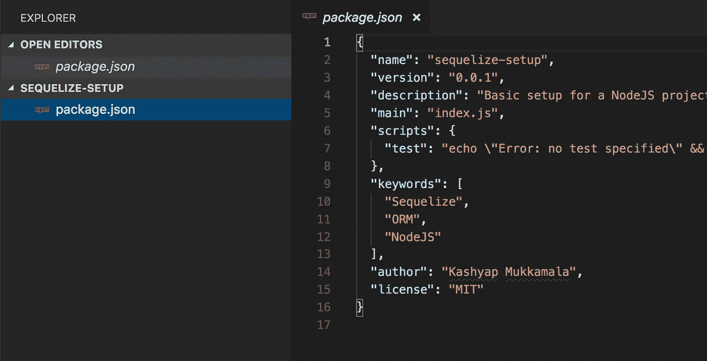
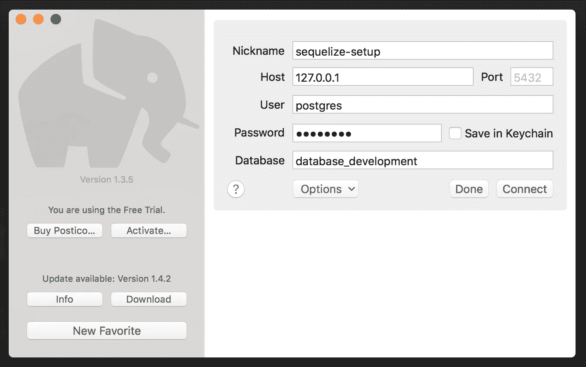
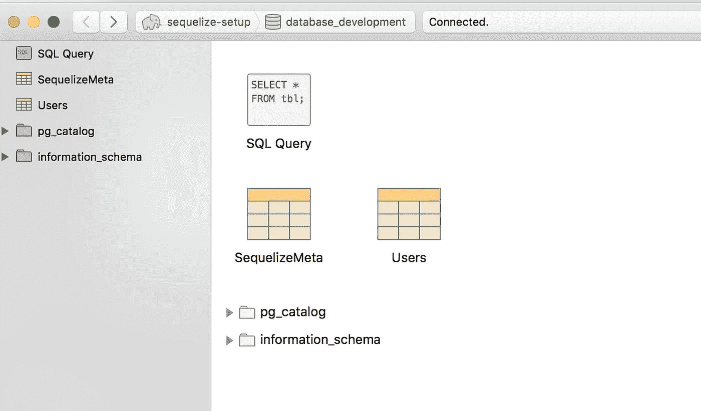
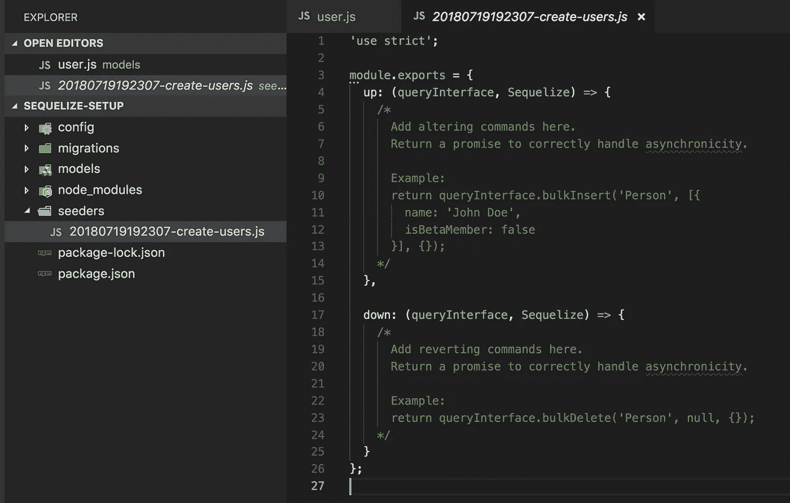
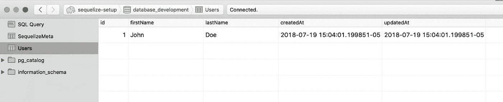
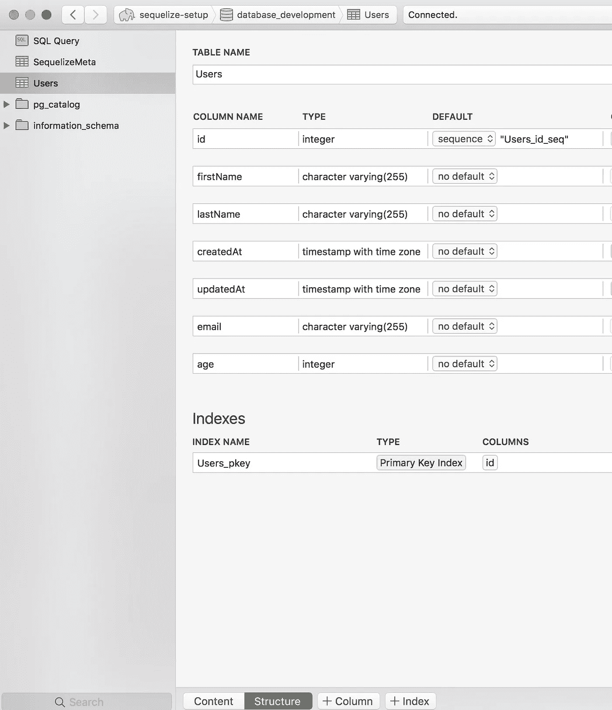

# 克服连续打嗝

> 原文：<https://itnext.io/overcoming-sequelize-hiccups-24e916ebb4c4?source=collection_archive---------1----------------------->


Sequelize 可能是可供开发者使用的最好的 NodeJS ORM 库之一。然而，就像任何工具或框架一样，当我们第一次开始使用 Sequelize 时，会遇到一些问题。[他们的文档](http://docs.sequelizejs.com/)非常详尽，列出了他们提供的所有功能，在这篇文章中，我们将看到一种非常连贯的方式来建立一个带有 Sequelize 的项目，以及我们如何根据我们不断发展的应用程序对我们的模型进行更改。

# 项目设置

在大多数应用程序中，您将创建(或使用预先存在的)API 应用程序，该应用程序是使用基于 NodeJS 的框架(如 ExpressJS 或 NextJS)构建的。

在我们的例子中，我们将只关注 Sequelize，而不依赖于 NodeJS 框架。为此，让我们首先创建一个空白的 NodeJS 项目。为此，创建一个您的项目文件夹`sequelize-setup`，然后在该文件夹的根目录下运行以下命令。回答关于项目描述的提示问题。

```
npm init
```

一旦您回答了所有的问题，您将会看到在根目录下生成的基本的`package.json`文件



现在，为了能够在我们的项目中使用 Sequelize，我们需要为我们选择的数据库安装 Sequelize 和相应的数据库客户机。我们需要数据库客户端，因为 Sequelize 只是一个*库*，它实现了 ORM 技术，以面向对象的方式操作和查询数据，并且不包含与底层数据库交互的附加层。

```
npm i -S sequelize pg
```

在本例中，我们将使用 Postgres，其安装说明可从[这里](https://www.postgresql.org/docs/9.3/static/install-procedure.html)获得，然而，安装服务最简单的方法是使用[自制软件](https://brew.sh/)。所以安装 Homebrew，然后运行下面的命令来设置你的 Postgres。

我们刚刚在 Postgres 数据库中设置的`role`是用户名和密码，它可以在将来使用超级用户权限连接到任何数据库。

我们还将使用 Postico 为数据库提供 GUI，因此请在这里下载它。

# 初始化序列

为了能够建立一个基于序列的项目并成功运行它，我们需要以下内容:

1.  配置—运行序列所需的配置
2.  迁移—包含我们对表所做的任何和所有更改的文件
3.  模型——我们的表的结构及其属性
4.  seeders——用默认数据初始化我们的表

要准备好必要的文件，我们可以手动创建这些文件夹，或者更好的方法是简单地使用 Sequelize CLI 来完成。

要安装 cli，请运行以下命令:

```
npm install --save sequelize-cli
```

我们现在可以使用位于`node_modules/.bin/sequelize`的 cli。为了简单起见，我将省略`node_modules/.bin/`前缀，只使用`sequelize`关键字来处理所有命令。

要使用 CLI 初始化项目，请在项目根目录下的终端上运行以下命令:

```
sequelize init
```

它记录了以下内容:

```
Sequelize CLI [Node: 8.10.0, CLI: 4.0.0, ORM: 4.38.0]Created “config/config.json”Successfully created models folder at “/sequelize-setup/models”.Successfully created migrations folder at “/sequelize-setup/migrations”.Successfully created seeders folder at “/sequelize-setup/seeders”.
```

它实际上是我们的 config + empty 文件夹，包含模型、迁移和种子。

# 配置

正如所料，config 文件夹包含一个名为`config.json`的文件，该文件具有生成的默认对象，因为我们只担心`development`流，所以从`config.json`对象中删除`test`和`production`条目，这样我们就有了以下内容:

从上面可以看到，我们将`dialect`指定为`postgres`，用户名和密码与项目设置中配置的相同。因为我们在本地运行数据库，所以`host` IP 是 localhost (127.0.0.1)。

这个`config`现在可以用来执行任何和所有后续与 postgres 的交互。

## 正在创建数据库

拥有配置的用例之一是创建必要的数据库。现在我们已经启动并运行了 postgres 服务，我们需要首先创建一个数据库，这个数据库可以保存我们的表。在我们的配置中，这个数据库用关键字`database`表示。要使用 Sequelize 创建数据库，我们只需运行以下命令:

```
sequelize db:create
```

这将记录以下内容:

```
Sequelize CLI [Node: 8.10.0, CLI: 4.0.0, ORM: 4.38.0]Loaded configuration file “config/config.json”.Using environment “development”.Database database_development created.
```

现在，为了验证创建，我们将使用之前下载的 Postico。打开 Postico 并点击`New Favorite`，这将打开面板以配置数据库连接，输入我们刚刚创建的数据库名称以及连接到该数据库所需的用户名和密码。



点击`connect`按钮，您将进入该数据库的表格视图，该视图目前应该是空的。

# 模型

我们现在准备创建我们的第一个模型，即一个实体，我们将映射到一个表。如果您使用 Sequelize CLI，创建模型也是一项非常简单的任务。我们将创建一个非常简单和通用的实体，比如属性为`firstName`和`lastName`的`User`。要生成`User`，只需运行以下命令:

```
sequelize model:generate --name User --attributes firstName:string,lastName:string
```

您会看到以下结果:

```
Sequelize CLI [Node: 8.10.0, CLI: 4.0.0, ORM: 4.38.0]New model was created at /sequelize-setup/models/user.js .New migration was created at /sequelize-setup/migrations/20180719190326-User.js .
```

既然我们的第一个模型和迁移已经创建，让我们快速地看一下生成的文件包含什么。

在 models 文件夹下生成的用户模型包含我们定义的属性的`User`的定义，它包含一个名为`associate`的占位符，我们可以在其中定义任何未来的关联。

以及在迁移文件夹下创建的迁移:

您可以看到，这个文件包含了一些超出我们预期的额外字段，这是因为第一次创建模型时，其相应的迁移是将模型创建为一个表。因此，当我们为`User`创建模型时，Sequelize 会自动建议我们使用所请求的属性(名字和姓氏)和附加属性(如`id`、`createdAt`和`updatedAt`)来创建表`Users`。

有趣的是，迁移由两部分组成:`up`和`down`。通过更仔细的观察，我们了解到`up`返回我们希望在应用迁移时执行的承诺，而`down`包含我们希望在撤消时执行的迁移。所以我们在`up`和`down`函数中指定了相反的东西。

迁移文件名在开头包含时间戳也是有原因的。使用 Sequelize CLI，我们可以生成许多迁移文件，并可以根据需要应用或撤消它们。稍后将详细介绍。

## 应用迁移

我们已经有了`User`模型和它的初始迁移。要运行此迁移并创建表，只需运行以下命令:

```
sequelize db:migrate
```

它记录了以下内容:

```
Sequelize CLI [Node: 8.10.0, CLI: 4.0.0, ORM: 4.38.0]Loaded configuration file “config/config.json”.Using environment “development”.== 20180719190326-create-user: migrating ========= 20180719190326-create-user: migrated (0.054s)
```

切换到 Postico 以验证更改:



我们可以看到，到目前为止，它包含 2 个内容，如预期的`Users`表和包含所有已应用于该数据库的迁移列表的`SequelizeMeta`表。

# 播种者

我们的数据库已经设置好了，我们的用户模型和表也已经设置好了，下一个合乎逻辑的步骤是向这个表添加一些数据，让我们开始吧。我们将再次使用 Sequelize CLI 来生成必要的种子:

```
sequelize seed:generate --name create-users
```

我们只是运行一个命令来生成一个记录以下内容的种子:

```
Sequelize CLI [Node: 8.10.0, CLI: 4.0.0, ORM: 4.38.0]seeders folder at “.../sequelize-setup/seeders” already exists.New seed was created at .../sequelize-setup/seeders/20180719192307-create-users.js .
```

原始格式的文件除了具有与迁移文件相同的结构(即具有一个`up`和一个`down`函数)之外，不包含太多内容:



但是与初始迁移不同，seeder 没有填充我们希望它拥有的实际功能，相反，它包含了我们可能能够做什么的模糊示例，在本例中是`bulkInsert`和`bulkDelete`。

## 运转播种机

我们现在可以在种子文件中创建必要的逻辑，将我们选择的数据添加到`Users`表中

为了运行播种机，我们可以再次使用 Sequelize CLI。有了 seeder，我们可以获得更精细的控制，如果需要，我们可以运行特定的 seeder 文件；如果需要，我们也可以运行它们 *all* 。在我们当前的场景中，我们将运行所有。

> 我们需要记住的一个小问题是，seeder 将针对迁移中指定的结构运行，而不是模型中指定的结构，也就是说，不要排除您想要在数据库表中显示的任何字段。如果你跳过了一个设置为非空约束的字段，将会抛出一个错误。

记住上面的内容，我们可以为用户表创建如下种子:

我们可以用下面的命令来运行它:

```
sequelize db:seed:all
```

完成时输出成功消息:

```
Sequelize CLI [Node: 8.10.0, CLI: 4.0.0, ORM: 4.38.0]Loaded configuration file “config/config.json”.Using environment “development”.== 20180719192307-create-users: migrating ========= 20180719192307-create-users: migrated (0.009s)
```

我们可以在`Users`表中使用 Postico 进行验证:



# 变更和修改

很多时候，尤其是在应用程序开发的早期阶段，实体的结构还没有确定下来，在一些场景中我们需要引入一些变化。例如，在这种情况下，我们在`Users`表中只有`firstName`和`lastName`字段。让我们改变这一点。

我们将添加一个名为`age`和`email`的新列。为此，首先让我们使用 Sequelize CLI 创建一个新的迁移文件:

```
sequelize migration:generate --name user-updates
```

这将记录新生成的文件路径:

```
Sequelize CLI [Node: 8.10.0, CLI: 4.0.0, ORM: 4.38.0]migrations folder at “.../sequelize-setup/migrations” already exists.New migration was created at .../sequelize-setup/migrations/20180719202036-user-updates.js .
```

在这个文件中，我们现在将添加我们需要在`up`和`down`阶段做出的更改:

我们只是添加/删除列，并将其作为迁移中的一个承诺返回(注意承诺链)。当我们运行此迁移时:

```
sequelize db:migrate
```

我们看到了预期的结果:

```
Sequelize CLI [Node: 8.10.0, CLI: 4.0.0, ORM: 4.38.0]Loaded configuration file “config/config.json”.Using environment “development”.== 20180719204635-user-updates: migrating ========= 20180719204635-user-updates: migrated (0.018s)
```

我们也可以在 Postico 中验证这一点:



尽管我们已经指定了一些规则(验证)，但是它们并没有真正出现在数据库中(很明显)，因为 sequelize 在我们试图访问模型进行读取或更新时应用了这些规则。我们将在另一篇文章中对此进行探讨。

# 更新模型

尽管我们已经创建并运行了迁移，但是如果我们更新种子并运行它，我们将会看到预期的数据。让我们使用 CLI 创建一个新的种子文件:

```
sequelize seed:generate --name add-email-age
```

如下记录输出，注意这里的文件名:

```
Sequelize CLI [Node: 8.10.0, CLI: 4.0.0, ORM: 4.38.0]seeders folder at “.../sequelize-setup/seeders” already exists.New seed was created at .../sequelize-setup/seeders/20180719210102-add-email-age.js .
```

让我们将新的字段添加到这个种子中，它看起来与现有的种子文件非常相似，只是稍有更新:

现在要运行它，我们将只选择这个文件并运行它，因为我们已经添加了来自上一个种子文件的数据:

```
sequelize db:seed --seed 20180719210102-add-email-age
```

这允许我们只运行一个文件，输出可以在 Postico:


既然我们已经获得了预期的数据，现在让我们添加一个小脚本来尝试查询数据。在项目的根目录下，创建一个名为`index.js`的文件，并添加以下逻辑来根据用户的年龄查询用户:

我们现在可以获得用户，当我们记录时，我们看到登录的用户缺少了`email`和`age`字段。

```
Kashyap-MBP:sequelize-setup kashyap$ node index.jsExecuting (default): SELECT “id”, “firstName”, “lastName”, “createdAt”, “updatedAt” FROM “Users” AS “User” WHERE “User”.”age” >= 20;{ id: 2,firstName: ‘Jane’,lastName: ‘Doe’,createdAt: 2018–07–19T21:08:51.998Z,updatedAt: 2018–07–19T21:08:51.998Z }
```

这是因为我们没有将模型更新为与我们的迁移文件同步，该迁移文件用于更新`Users`表的列。让我们首先用相同的字段更新模型:

当我们重新运行之前运行的`index.js`文件来查询`Users`表时:

```
Kashyap-MBP:sequelize-setup kashyap$ node index.jsExecuting (default): SELECT “id”, “firstName”, “lastName”, “email”, “age”, “createdAt”, “updatedAt” FROM “Users” AS “User” WHERE “User”.”age” >= 20;{ id: 2,firstName: ‘Jane’,lastName: ‘Doe’,email: ‘jane.doe@email.com’,age: 20,createdAt: 2018–07–19T21:08:51.998Z,updatedAt: 2018–07–19T21:08:51.998Z }
```

现在我们可以看到，它按照预期打印了用户对象的整个结构。

# 结论

Sequelize 有一些非常强大的特性，如果利用得当，可以使开发过程变得容易得多。在这篇文章中，我们已经探索了一些相当简单的选项来解决我们的开发过程。还有更复杂的迁移可以应用于 Sequelize，我将在另一篇文章中讨论。

完整的代码库可以在这里找到[。](https://github.com/40x/sequelize-setup)

请在下面的评论区留下问题和评论。

*如果你喜欢这个博客，一定要为它鼓掌或者关注我的* [*LinkedIn*](https://www.linkedin.com/in/kashyap-mukkamala/)