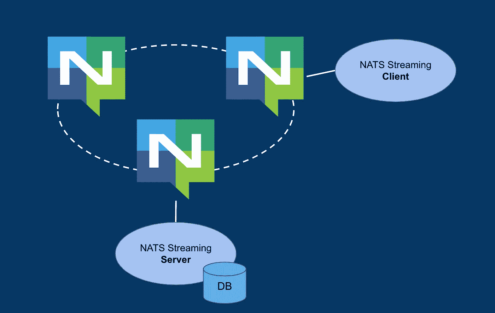
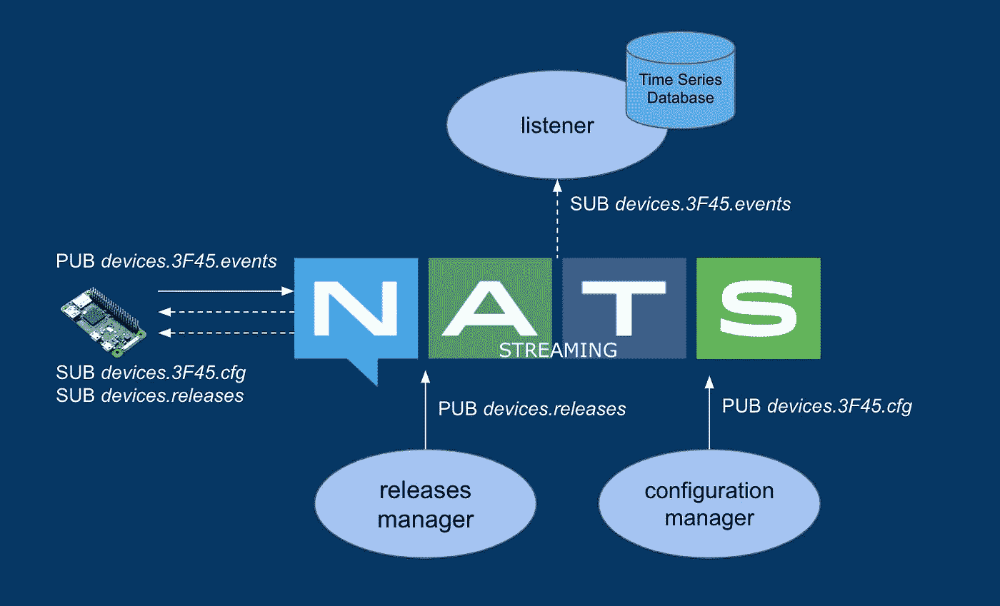
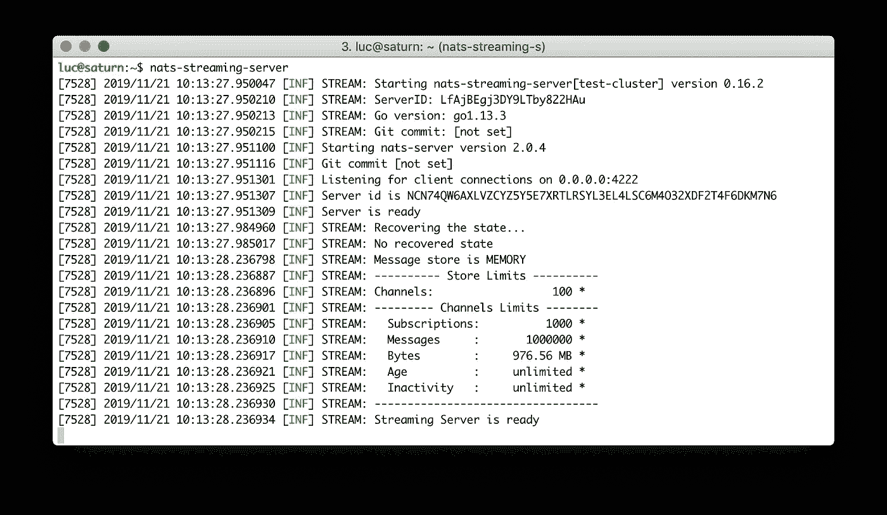
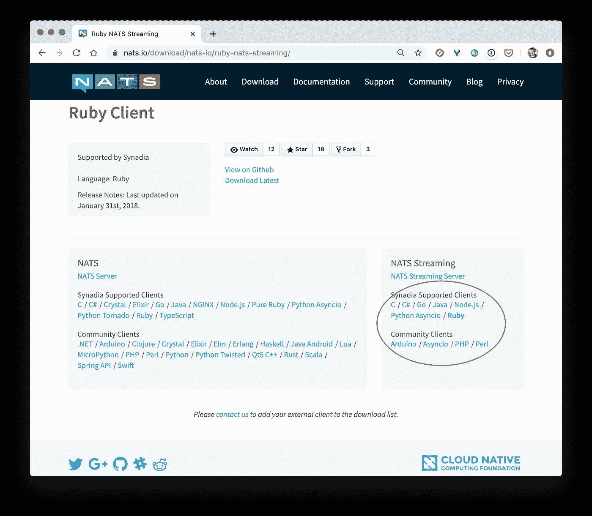
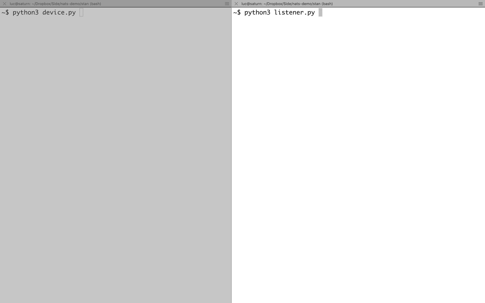
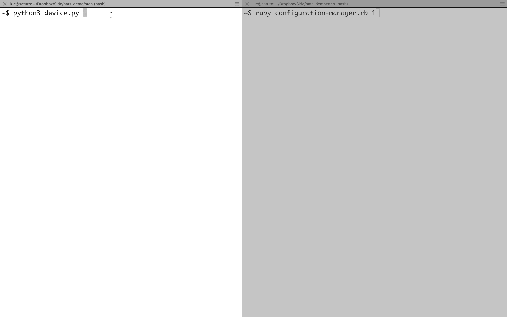
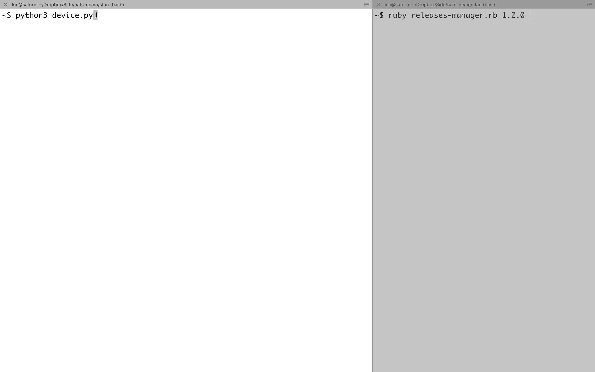

# NATS 流媒体概述

> 原文：<https://itnext.io/overview-of-nats-streaming-ea0e80449507?source=collection_archive---------1----------------------->

## 用物联网使用案例举例说明


NATS 流媒体，也称为斯坦，在 NATS 的基础上增加了额外的功能。在本帖中，我们将在一个演示项目中展示其中的一些。

# 温和的介绍

当允许消息丢失或应用程序自己处理消息传递时，核心 NATS 是一个很好的解决方案，当我们需要消息持久性并确保没有消息丢失时，NATS 流是一个很好的解决方案。例如，如果消费者必须接收不在线时发布的消息，这是一个很好的选择。

从架构的角度来看，NATS 流媒体服务器是 NATS 的客户端，为 NATS 增加了持久性、消息重放和持久订阅。NATS 流媒体的客户端是通过 NATS 与 NATS 流媒体服务器通信的应用程序。以下模式说明了整体架构。



NATS 流—架构概述

注意:NATS 流媒体服务器嵌入了 NATS 服务器，但可以配置为使用现有的 NATS 服务器/集群

正如我们从[官方文档](https://docs.nats.io/)中看到的，NATS 流媒体在 NATS 的基础上增加了以下功能:

*   一个增强的消息协议:NATS 流媒体的客户端和服务器通过底层的 NATS 服务器使用[谷歌协议缓冲区](https://developers.google.com/protocol-buffers/)交换二进制消息
*   内存、文件或数据库中的消息持久性
*   至少一次传递:发布到 NATS 流服务器的消息和传递给消费者的消息都被确认
*   限制发布者在任何给定时间可能拥有的未确认消息数量的可能性
*   可以限制已发送但未确认的消息数量。只要超过此阈值，NATS 流就会暂停向订户发送消息
*   允许新订户重播历史消息
*   创建持久的*订阅的可能性，该订阅在服务器端跟踪客户端最后确认的消息序列号。对于此持久订阅，使用相同名称重新连接的客户端将被重新传送最早的未确认消息*

NATS 流使用*通道*的概念来表示有序的消息集合。我们可以把一个通道想象成一个先进先出(FIFO)队列，客户端可以在这个队列中进行发布和消费。

## 客户订阅的类型

订阅频道时，NATS 流媒体的客户端可以使用以下订阅类型之一:

*   **常规**订阅在创建时指定其频道位置的位置。例如，它可以指定获取频道历史记录中的所有消息，仅获取给定日期之后的消息……如果应用程序崩溃、断开连接或取消订阅，位置将丢失
*   **持久**订阅将其位置存储在流媒体服务器中。通道位置通过断开连接来保持，并允许从先前停止的地方恢复消息使用
*   一个**队列**订阅允许几个订阅者共享同一个频道，服务器将每条消息发送给组中的一个订阅者

对于每种类型的订阅，如果订阅者在 *ack_wait* 参数中指定的延迟之前没有确认消息，则消息会自动重新发送(稍后将详细介绍)

在下面的例子中，我们将考虑*常规*和*持久*订阅。

注意:NATS 流也被称为斯坦，我们将在这篇文章中使用这两个名字

# 示例使用案例

假设我们有一个物联网应用。位于不同位置的几个物联网设备读取温度信息，并每隔几分钟向应用程序发送一次(附带时间戳)。每个设备都以一个 HTTP 端点为目标，该端点对应于负责收集、解析和保存每条数据的后端服务。其他服务负责向设备发送 TCP 消息(重新配置命令、新固件的可用性等)。

为了增强整个流程，我们决定使用 NATS 作为我们系统的主干，以确保不同组件之间的通信。换句话说，通过这种新的架构，设备将发布和订阅 NATS，而不会直接与后端微服务通信。

对于这种新体系结构，主要要求如下:

**相关数据**

*   设备在"*设备上发布消息。ID . events*subject(ID 是当前设备标识符)并等待来自流服务器的确认**。**此 ack 确保消息已被 NATS 流正确接收，但并不表示任何关于向潜在订户交付的信息。发送的消息示例:

```
{ 'ts': '2019–11–29T23:12:00Z', 'temp': '20.4' }
```

*   *监听器*微服务应该订阅*设备。*.事件*”因此它接收包含由它订阅的每个设备发送的温度信息的消息

**配置经理**

*   负责配置设备的*配置管理器*微服务在“*设备上发布消息。ID.cfg"* 主题。这些消息中的每一条都包含设备的配置信息。用于将发送频率(设备发送每条消息的间隔秒数)配置为 60 秒的消息示例:

```
{ 'ts': '2019–11–30T02:12:00Z', 'sending_frequency': '60' }
```

*   每个设备都订阅了"*设备。ID.cfg* " subject (ID 是它的实际标识符)在它脱机时接收发送给它的特定消息

**发布经理**

*   每次有新版本时，*发布管理器*微服务在“*设备.发布”*主题上发布消息。发布的消息示例:

```
{ 'ts': '2019–11–30T02:12:00Z', 'version': '1.2.0'}
```

*   每个设备订阅“ *devices.releases* ”主题，因此它接收由发布管理器发布的消息。收到每条消息后，设备应下载并安装新固件。在固件安装失败的情况下，我们需要将消息自动重新发送到设备，以便它可以再次尝试安装。

除了这些要求之外，我们还需要对通信进行 TLS 加密，并且每个客户端(设备或服务器端组件)都必须在系统中进行身份验证和授权。在[上一篇文章](/secure-pub-sub-with-nats-fcda983d0612)中，我们详细介绍了如何使用 TLS 运行 NATS，并概述了 NATS 2.0 的 authn / authz 部分的特性。在这篇文章中，我们将重点关注不同类型订阅的功能部分和设置。

由于设备和服务器服务可能不会总是同时在线，并且因为我们需要自动消息重新传递，所以我们将使用 NATS 流(又名 STAN)。

下面的模式说明了上面列出的组件。



整体架构-几个发布/订阅在起作用

现在让我们设置不同的组件。

# **运行 NATS 流媒体服务器**

NATS 流媒体服务器是一个 GO 二进制文件，可以使用以下命令下载(需要先安装 [Golang](https://golang.org/dl/) ):

```
$ go get github.com/nats-io/nats-streaming-server
```

使用默认配置启动 NATS 流服务器非常简单，如下所示:



运行 NATS 流服务器

**注意**:如果我们使用监控选项运行 NATS 流服务器(例如 *-m 8222* )，我们可以访问列出当前 NATS 客户端的 HTTP /connz 端点。我们还没有连接到 NATS 的任何客户，但从下面的截图，我们可以看到 3 个客户已经在那里。


NATS 流媒体服务器创建的 NATS 客户端

这 3 个客户端(*_ NSS-测试-集群-发送*、*_ NSS-测试-集群-通用 _、*和*_ NSS-测试-集群-确认*)都是 NATS 实现 NATS 流媒体服务器功能的客户端。请记住，NATS 流服务器和 NATS 流客户端使用底层的 NATS 服务器进行通信。

# 连接 NATS 流媒体客户端

现在让我们设置在我们上面描述的用例中定义的组件。在这个例子中，我们将使用 Ruby 和 Python 客户端，但是 NATS 流客户端也可用于许多其他语言(甚至用于 [Arduino](https://www.arduino.cc/) 设备)



NATS 流媒体客户端支持多种语言

## 处理数据

让我们从*监听器*微服务开始，这个监听器从它订阅的一组设备中监听新数据。下面用 Python 编写的代码片段说明了监听器过程:

```
import asyncio
import signal
import sys
from nats.aio.client import Client as NATS
from stan.aio.client import Client as STANasync def run(loop):
    # Connect to NATS
    nc = NATS()
    await nc.connect(io_loop=loop) # Start session with NATS Streaming cluster.
    sc = STAN()
    await sc.connect("test-cluster", "**listener-3F45**", nats=nc) # Callback called on each message received
    async def cb(msg):
        print("Received (#{}): {}".format(msg.seq, msg.data))
        print("parsed and saved to db !") # Subscribe to get messages since last acknowledged
    subject = "**devices.3F45.events**"
    await sc.subscribe(subject, **durable_name="3F45"**, cb=cb)if __name__ == '__main__':
    loop = asyncio.get_event_loop()
    loop.run_until_complete(run(loop))
    loop.run_forever()
```

这里需要注意几件重要的事情:

*   客户端通过指定客户端 id ( ***【监听器-3f 45】***)连接到 NATS 流服务器，以在重新连接时识别客户端。此客户端 id 必须是唯一的，并且不能被几个应用程序同时使用。在这个例子中，监听器显式地订阅来自设备 3F45 的事件，这个标识符用在 client-id 中。

注意:为了增强架构，我们可以使用一个**队列**订阅，并使用几个侦听器后端的实例来处理传入的消息。对于这种类型的订阅，重新启动后客户端 id 不必相同，因此可以自动生成。

*   在订阅期间，选项“ **durable_name** ”被设置为设备 ID 的值，使得订阅属于类型 **durable** 。这意味着频道位置存储在服务器端，并且在客户端断开一段时间的情况下可以被检索
*   *监听器*订阅了“***devices . 3F45 . events***”主题，因此它将接收设备 3f 45 发送的关于该主题的事件。

注意:对于长期订阅，不可能使用包含通配符的主题。这将在 NATS 流媒体的下一个版本 Jetstream 中得到改变

现在让我们考虑 ID 为 **3F45** 的设备，它定期从它的一个传感器读取外部温度，并将这些信息发布到 NATS 流。这可以通过下面这段代码来说明(我的 Python 知识相当生疏，这段代码可能不是最优化的代码:-)。

```
import asyncio
import time
import datetime
import random
import json
import sys
from nats.aio.client import Client as NATS
from stan.aio.client import Client as STANasync def main():
    # Connect to NATS
    nc = NATS()
    await nc.connect() # Start session with NATS Streaming cluster.
    sc = STAN()
    await sc.connect("test-cluster", "**device-3F45**", nats=nc) while True:
        # Get timestamp and dummy temperature
        now = datetime.datetime.utcnow()
        ts = now.strftime("%Y-%m-%dT%H:%M:%ST")
        temp = round(random.uniform(20,25), 2) # Build message
        msg = json.dumps({'ts': ts, 'temp': temp}).encode() # Send message and wait for an ACK
        async def cb(ack):
            print("Received ack: {}".format(ack.guid))
        await sc.publish("devices.3F45.events", msg, ack_handler=cb) # Wait before sending next message
        await asyncio.sleep(3)asyncio.run(main())
```

这里需要注意一些事情:

*   客户端使用客户端 id ***设备-3F45*** 连接到 NATS 流媒体服务器
*   客户端发布了主题为"***devices . 3f 45 . events***"的消息(该消息包含当前时间戳和随机温度)

下面的动画演示了以下流程:

*   监听器微服务正在运行
*   设备发送常规消息，并接收每个消息的确认(来自 STAN)
*   侦听器微服务已停止
*   该设备持续发送信息
*   监听器会重新启动



收听者在持久订阅上接收设备的消息

当侦听器重新联机时，它从序列号#6 开始获取设备在脱机时发送的所有消息。使用持久订阅可以确保订阅者不会丢失任何消息，即使它碰巧处于脱机状态。

## 处理配置

让我们模拟一个专门向给定设备发布新配置的微服务。Python 代码演示了这个*配置管理器*服务，它发布了一个关于“*设备. 3F45.cfg* 主题的消息。这个消息是一个 JSON 对象，包含一个时间戳和 *sending_frequency* ，它将替换设备使用的当前值(默认为 3)

```
require 'stan/client'
require 'json'sc = STAN::Client.new# Get the sending frequency from a command line parameter
sending_frequency = ARGV[0] || 3# Get timestamp
ts = Time.now.utc.strftime('%Y-%m-%dT%H:%M:%SZ')# Customize connection to NATS
opts = { servers: ["nats://127.0.0.1:4222"] }
sc.connect("test-cluster", "configuration-manager", nats: opts)# Publish new configuration to device
msg = {"ts":ts, 'sending_frequency':sending_frequency}
sc.publish("**devices.3F45.cfg**", msg.to_json) do |guid|
  puts "Received ack with guid=#{guid}"
end# Close connection
sc.close
```

现在，让我们修改设备的应用程序代码，使其也订阅在“ *device.3F45.cfg* ”主题上发送给它的配置消息。代码的结构略有修改:定义了两个任务，第一个任务用于事件发送，第二个任务用于处理传入的配置消息。

```
import asyncio
import time
import datetime
import random
import json
import sys
from nats.aio.client import Client as NATS
from stan.aio.client import Client as STANsending_frequency = 3# Connect to NATS Streaming
nc = NATS()
sc = STAN()async def sending_event():
    while True:
      # Get timestamp and dummy temperature
      now = datetime.datetime.utcnow()
      ts = now.strftime("%Y-%m-%dT%H:%M:%ST")
      temp = round(random.uniform(20,25), 2) # Build message
      msg = json.dumps({'ts': ts, 'temp': temp}).encode() # Send message and wait for an ACK
      async def ac(ack):
          print("Received ack: {}".format(ack.guid))
      await sc.publish("devices.3F45.events", msg, ack_handler=ac) # Wait before sending next message
      await asyncio.sleep(sending_frequency)async def handling_cfg():
    # Subscribe to cfg messages from a durable subscription
    async def cb_cfg(msg):
        print("cfg message #{}: {}".format(msg.seq, msg.data))
        data = json.loads(msg.data.decode())
        global sending_frequency
        sending_frequency = int(data['sending_frequency']) subject = "devices.3F45.cfg"
    await sc.subscribe(subject, durable_name='3F45-cfg', cb=cb_cfg)async def main():
    # Connect to NATS
    await nc.connect() # Start session with NATS Streaming cluster.
    await sc.connect("test-cluster", "device-3F45", nats=nc) # Create additional tasks
    event = asyncio.create_task(sending_event())
    cfg = asyncio.create_task(handling_cfg())
    await event
    await cfgasyncio.run(main())
```

当接收到配置消息时，设备提取 sending_frequency 参数并更新其当前使用的值。

下面的动画演示了以下流程:

*   设备以默认的结束频率启动(每 3 秒一条消息)
*   配置管理器进程运行时，它发送一条消息，将发送频率更新为 1 秒
*   设备接收消息并更新其*发送频率*参数
*   配置管理器进程再次运行，它发送一条消息，将发送频率更新为 5 秒
*   该设备接收该消息并再次更新其配置



在持久订阅上接收配置消息的设备

## 处理释放

现在让我们模拟一个微服务，用于在有新版本固件可用时提醒设备。固件是整个设备的端应用程序，固件的更新通常是一个更微妙的过程，可能需要相当长的时间。下面的 Ruby 代码演示了发布管理器，它发布了一个关于“ *devices.releases* ”主题的消息。

```
require 'stan/client'# Get the sending frequency from a command line parameter
version = ARGV[0]sc = STAN::Client.new# Customize connection to NATS
opts = { servers: ["nats://127.0.0.1:4222"] }
sc.connect("test-cluster", "release-manager", nats: opts)# Build message
ts = Time.now.utc.strftime('%Y-%m-%dT%H:%M:%SZ')
msg = {"ts":ts, 'version': version}# Publish new release version
sc.publish("devices.releases", msg.to_json) do |guid|
    puts "Received ack with guid=#{guid}"
end# Close connection
sc.close
```

可以使用以下命令运行此代码，向所有设备发送固件 1.2.0 可用的信息:

```
ruby releases-manager.rb 1.2.0
```

以下是发送的消息示例:

```
{"ts":"2019-11-30T14:50:32Z","version":"1.2.0"}
```

设备现在订阅“*devices . releases”*主题，以便在新固件可用时得到提醒。下面的代码片段是设备代码的更新:

```
async def cb_rel(msg):
    print("release message (seq={}): {}".format(msg.seq, msg.data))
    data = json.loads(msg.data.decode())
    version = data['version']
    try:
       print("Getting and installing firmware...") **# Doing the update
       ...** print("Firmware updated !")
       await nc.ack(msg)
    except Exception as error:
       print("Error during update")
       print("Update canceled")
await sc.subscribe("devices.releases", durable_name='releases', cb=cb_rel, manual_acks=True, ack_wait=90)
```

此示例与在“*devices . 3f 45 . CFG”*主题上完成的订阅非常相似，但由于固件更新是一个更复杂的过程，因此我们的处理方式略有不同。这里有几点需要注意:

*   在"*devices . releases*"*主题上创建一个**持久**订阅，以确保如果设备脱机一段时间，不会丢失任何消息*
*   *我们设置 *ack_wait* 来指定 NATS 流服务器等待从设备获得确认的秒数。由于更新过程可能需要一些时间，我们设置了一个高于默认值(30 秒)的值。如果在该延迟之前没有收到 ack，将尝试新的消息传递*
*   *我们将 *manual_acks* 参数设置为 *True* ，以指定将手动发送交付确认。如果更新无误，则消息 ack 被发送到服务器(指令" *await nc.ack(msg)* ")。如果更新产生错误，则在 *ack_wait 中指定的延迟后，不发送 ack，触发消息重新发送。**

*下面的动画演示了在更新过程中模拟故障的以下流程*

*   *一台设备每隔几秒钟发送一条消息(并收到对每条消息的确认)*
*   *当新的 1.2.0 固件可用时，发布管理器在“*设备上发送消息。发布**
*   *设备接收消息，开始固件更新，但是该更新出错，并且不发送确认*
*   *由于更新过程会在每次消息传递时引发错误，因此会无限期地重新传递该消息*

*注意: *ack_delay* 的较低值用于加速流程*

**

*由于未发送送达确认，邮件已重新送达*

*如果更新最终顺利完成，并在 *ack_wait* 参数指定的延迟内完成，则调用指令“ *await sc.ack(msg)* ”向服务器发送确认。在这种情况下，不再需要重新传递消息。*

# *摘要*

*通过对 NATS 流的基本使用，我希望这篇文章能让你对它的功能有一个大致的了解。Jetstream (NATS 流媒体 v2)正在路上，技术预览版应该很快就会发布。它的架构与 NATS 流媒体截然不同，因为所有的流媒体功能都将嵌入 NATS 本身。这将允许一些伟大的功能，也增加了流媒体处理的额外能力，其中包括:支持无法通过协议缓冲区通信的设备，创建通配符的持久订阅，…一旦有技术预览，下面的帖子将专门用于 Jetsteam。*