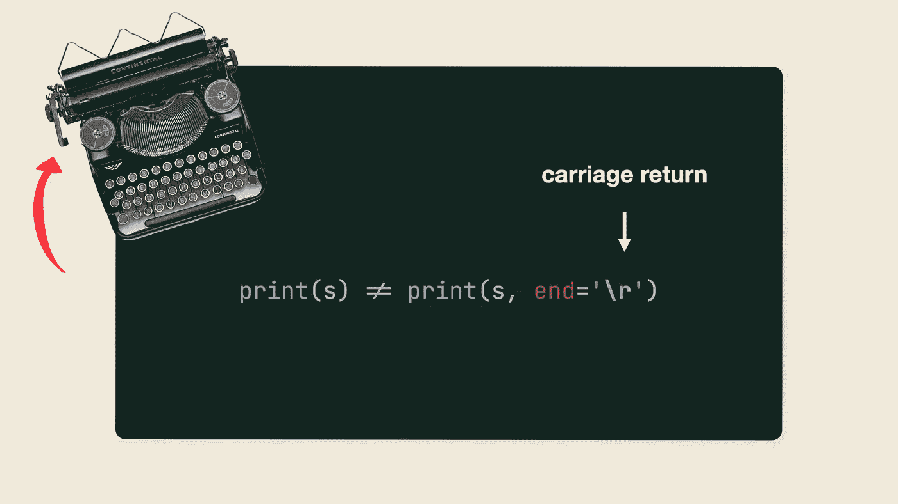
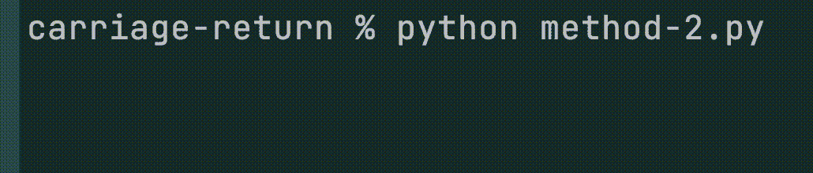
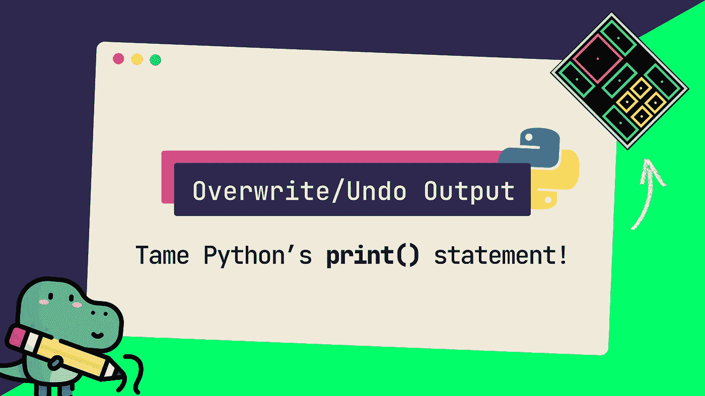

# 覆盖以前打印的行

> 原文：<https://itnext.io/overwrite-previously-printed-lines-4218a9563527?source=collection_archive---------1----------------------->

## Python 中覆盖 print 语句的两种方法

大家好，这里是 Thijmen，在这篇文章中我将演示两种方法来使用 [ANSI 转义 sequence cues](https://en.wikipedia.org/wiki/ANSI_escape_code)用 Python 重写之前 **打印的** **行**。

这篇文章在 YouTube 上也有视频格式。

如果你想提供连续的输出 *而不弄乱屏幕，撤销打印语句会非常有用。*

每种方法的实现和预期结果略有不同，所以使用哪种方法实际上取决于您的用例。一旦你理解了它们的工作原理，它们的优缺点就会变得显而易见，所以让我们马上开始第一种方法。

> 💡在本文中，我提供了一些背景知识，帮助您理解这些方法是如何工作的以及为什么工作。如果你更喜欢速战速决，有 TL；博士垫底。

# 方法 1:回车

*快速*和*简单。*

## 摘要

1.  打印行，但是以回车符而不是换行符结束。这将光标移回到打印行的开头。
2.  打印另一行，但是因为光标现在位于前一行的开头，新的输出将打印在前一行的顶部的*上。*

## 方法

默认情况下，Python 的`print`语句用一个换行符`\n`结束传递给函数的每个字符串。这个行为可以用函数的`end`参数覆盖，这是这个方法的核心。

我们没有用换行符结束输出，而是使用了回车符。

当我们用回车结束一条`print`语句时，我们实质上是将光标向后*移动到打印行*的开头，而不是移动到下一行。然后，如果我们打印另一个字符串，文本将打印在前一个字符串的“顶部”。在 Python 中，回车用`\r`表示。

> 💡最初，术语“回车”指的是打字机上的一种机械装置或杠杆，在打完一行文字后，它将机器的打印部件排回到纸的左侧。

## 示例案例

假设我们有一个简单的字符串，我们希望逐字符打印，每 0.5 秒打印一个字符:

示例案例(尚未覆盖)。

使用默认的`print`语句，如下所示:

示例案例(尚未覆盖)。

现在看看如果我们用回车来结束每个`print`语句会发生什么:

方法 1:示例案例(带回车)。

所有字符都打印在同一行！

方法 1 在实践中。

**容易吧？不幸的是，这里有一个警告。因为我们基本上是在前一个输出的之上输出每个连续的`print`语句*，所以打印一个比前一行更短的行是不可行的。***

看看如果我们在循环结束时打印“done”会发生什么:

方法 1 警告:打印较短的行。

我们可以通过**在打印更短的字符串之前清除前面的行**来防止这种情况。

第 6 行的 ANSI 序列表明光标所在的行*应该被删除(注意 for 循环末尾的`\r`)。通过使用`LINE_CLEAR`变量作为`end`参数，我们确保不打印额外的换行符。*

方法一:工作实例。

# 方法二:“直截了当”

稍微复杂一点，但是*更清洁*输出和*更灵活**。*

## *摘要*

1.  *打印行(默认以换行符结尾)。*
2.  *就在下一个`print`语句之前:向上移动光标并清空该行。可以重复此操作来撤消多行打印。*
3.  *打印下一行。*

## *方法*

*在这个方法中，我们不改变用于显示输出的`print`语句的`end`参数。相反，我们添加了一个额外的 `print`语句，该语句使用两个 ANSI 转义码来清除前一行:*

*方法二:工作实例。*

1.  *分配给`LINE_UP`的 ANSI 代码表示光标应该上移一行。*
2.  *分配给`LINE_CLEAR`的 ANSI 代码擦除光标所在的行(也用于第一种方法)。*

*请注意，我们已经修改了 *extra* `print`语句的`end`参数，以防止打印默认换行符。*

**

*方法二在实践中。*

*在功能上，这种方法为**提供了两个优于第一种方法的优势**:*

1.  *你不用担心下一行的长度。*
2.  *光标不会在视觉上干扰打印行。*

**整齐*对吧？*

# *TL；速度三角形定位法(dead reckoning)*

*我们生活忙碌。我懂了。*

*如果你从这篇文章中学到了一些新东西，请考虑订阅我的 [YouTube 频道](https://www.youtube.com/channel/UCkihi0v-znRdhS_Fib4Vqxg)。谢谢！🙂*

*这篇文章和相应的视频是我的 Python 片段系列的一部分，其中我们以字节大小的格式讨论了围绕 Python 编程的各种主题。*

**