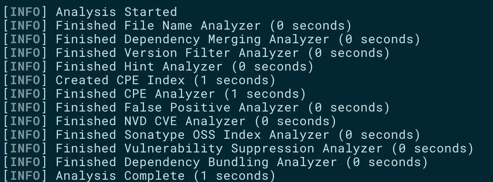
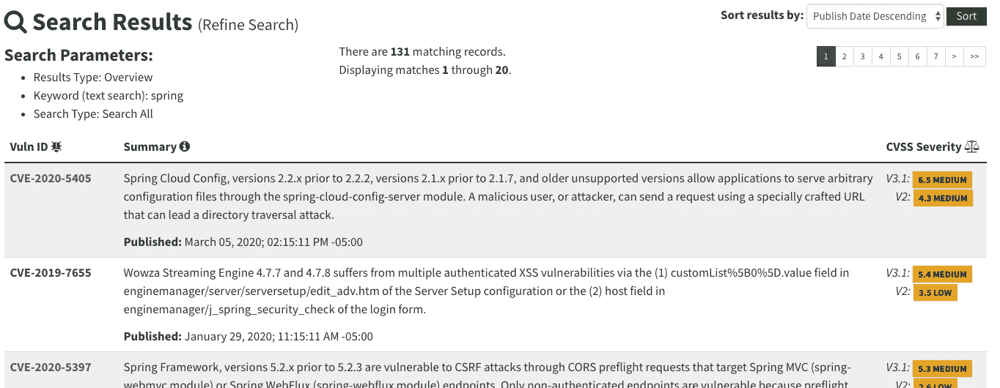
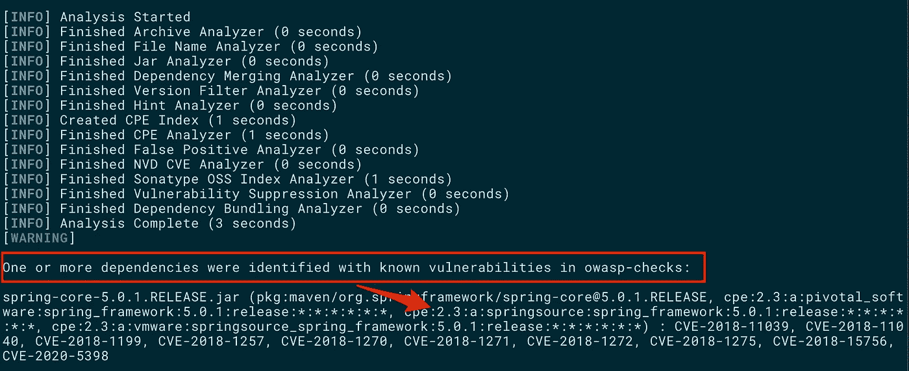
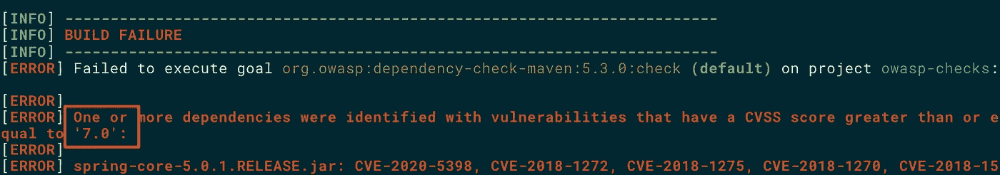
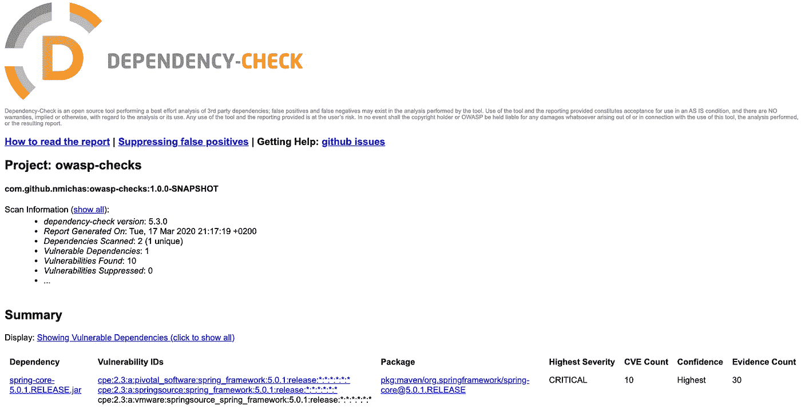

# 使用 Maven 进行 OWASP 漏洞检查

> 原文：<https://itnext.io/owasp-dependency-check-maven-vulnerabilities-java-898a9cf99f5e?source=collection_archive---------1----------------------->

## 如何在 Java 构建中引入自动安全扫描


由[米歇尔·博斯马](https://unsplash.com/@michelbosma?utm_source=medium&utm_medium=referral)在 [Unsplash](https://unsplash.com?utm_source=medium&utm_medium=referral) 上拍摄的照片

虽然我们大多数人在开发项目时采取了积极的措施来防范已知的安全漏洞，但有一系列被动的行动和检查经常被忽视。

开放网络应用安全项目( [OWASP](https://owasp.org/) )是一个致力于提高软件安全性的非营利性基金会。OWASP 发布并维护了几个关于如何编写安全代码的建议，并得到了众多公司的支持，如 Accenture、Adobe、Dell 和 Salesforce，它们在世界各地都有分支机构。

OWASP 运行的项目之一是 *OWASP 依赖性检查*。
依赖关系检查是一种软件组合分析(SCA)工具，它试图检测项目依赖关系中包含的公开披露的漏洞。它通过确定给定依赖项是否有公共平台枚举(CPE)标识符来实现这一点。如果找到，它将生成一个链接到相关 CVE 条目的报告。

在这篇文章中，我将向您展示如何在您的 Java/Maven 项目中快速集成 OWASP 依赖检查。

# 依赖性检查器简介

Dependency-Check 执行的检查可能不是您希望在开发过程中执行的每一个构建上运行的，所以我们将把插件作为 Maven 概要文件来介绍:

```
<profiles>
  <profile>
    <id>owasp-dependency-check</id>
    <build>
      <plugins>
        <plugin>
          <groupId>org.owasp</groupId>
          <artifactId>dependency-check-maven</artifactId>
          <version>${dependency-check-maven.version}</version>
          <executions>
            <execution>
              <goals>
                <goal>check</goal>
              </goals>
            </execution>
          </executions>
        </plugin>
      </plugins>
    </build>
  </profile>
</profiles>
```

对于上面的代码片段，您需要将插件的版本定义为 Maven 属性:

```
<properties>
  <dependency-check-maven.version>5.3.0</dependency-check-maven.version>
</properties>
```

您现在可以通过发出:
`mvn clean install -Powasp-dependency-check`来调用您的构建中的检查

由于这是您第一次运行依赖性检查，因此需要一些时间来获取漏洞数据库并将其存储在您的本地环境中。这可能需要 5-15 分钟(取决于您的互联网连接速度)，但它只会发生一次。后续的构建只会获取更新，因此速度会快很多。

在 Maven 输出的末尾，您应该会看到漏洞分析的输出:



空项目的分析输出(图片由作者提供)

显然，分析没有发现任何漏洞，因为没有外部依赖(除了`owasp-dependency-check`本身)被引入到项目中。

是时候引入一些易受攻击的代码了。

# 引入易受攻击的代码

依赖性检查的漏洞的主要来源是国家漏洞数据库( [NVD](https://nvd.nist.gov/) )。让我们浏览一下 [Spring 相关报告](https://nvd.nist.gov/vuln/search/results?form_type=Basic&results_type=overview&query=spring&search_type=all)的公开常见漏洞和暴露(CVE)列表:



匹配 NVD 的简历(图片由作者提供)

可供选择的有很多，那就挑一个介绍到我们的`pom.xml`里吧。我们要去的是 Spring Core Maven artefact，版本 5.0.1，2017 年发布:

```
<dependencies>
  <dependency>
    <groupId>org.springframework</groupId>
    <artifactId>spring-core</artifactId>
    <version>5.0.1.RELEASE</version>
  </dependency>
</dependencies>
```

用`mvn clean install -Powasp-depency-check`重新构建我们的代码:



Maven 构建期间报告的来自 NVD 的 Spring 依赖项的 CVEs(图片由作者提供)

依赖性检查插件成功地识别了我们在 Maven 中引入的 Spring 依赖性，并报告了关于它的已知漏洞。但是，项目的构建继续进行并成功结束。如果我们要求不允许构建易受攻击的代码，该怎么办？

接下来让我们看看如果找到 CVE，如何使构建失败。

# 存在漏洞时停止构建

对特定漏洞的严重性进行分类是一个复杂的过程。对于那些想知道漏洞评分是如何实现的人，维基百科上有一个有趣的页面，关于[通用漏洞评分系统](https://en.wikipedia.org/wiki/Common_Vulnerability_Scoring_System) (CVSS)。总之，CVE 的分数是根据一个公式计算出来的，这个公式依赖于几个衡量漏洞利用难易程度和影响的指标。分数范围从 0 到 10，10 表示最严重的漏洞。

您可以利用依赖项检查插件中的评分系统来配置 Maven，以便在发现 CVE 大于特定分数时使构建失败。如果您不知道什么样的确切分数适合您的项目，一个好的起点是任何大于或等于 7 的分数(表示高或严重的漏洞)。

要将构建断路器引入到您的项目中，您需要在项目的`pom.xml`中添加一个配置节来修改插件，如下所示:

```
<configuration>
   <failBuildOnCVSS>7</failBuildOnCVSS>
</configuration>
```

让我们尝试使用易受攻击的 Spring 依赖项来重新构建测试项目:



CVSS ≥7 的构建失败(图片由作者提供)

这一次构建失败了。Maven 还通知我们，有一个或多个依赖项没有达到 CVSS < 7 的阈值指标。

# 生成 HTML 报告

如果您喜欢在浏览器而不是 CLI 中浏览检测到的漏洞，依赖项检查会在名为`dependency-check-report.html`的`target`文件夹中创建一个 HTML 报告:



您的漏洞的 HTML 报告(图片由作者提供)

该报告包含了大量的信息，并链接到 NVD 以获取更多的详细信息。

# 排除误报

由于依赖性检查插件识别组件的方式和 NVD 中的组件命名约定，您可能偶尔会得到误报。

要排除误报，请打开 HTML 报告，找到您需要的漏洞，然后单击`suppress`链接(步骤 1)。要抑制误报，您需要创建一个包含抑制列表的 XML 文件，并将其传递到依赖检查插件的配置选项中。如果您还没有为您的项目创建这样一个文件，首先选择`Complete XML Doc option`(步骤 2)并复制建议的 XML 文本(步骤 3):


排除误报(图片由作者提供)

您现在需要创建一个新文件，可以随意命名，并将复制的 XML 内容粘贴到。接下来，通过在依赖项检查插件上添加一个配置选项，修改 Maven 配置以引用该文件，例如:

`<excludes>owasp-dc-exclude.xml</excludes>`。

未来的抑制可以通过在`<suppressions></<suppressions>`标签之间插入新元素来添加。

# 结论

源代码漏洞对您的项目是一个非常现实的威胁。除非您有一个自动监控项目漏洞的系统，否则很可能在某个时候您会引入一个易受攻击的第三方依赖项。

将依赖性检查插件扫描器引入到 Maven 项目中只需要几分钟，而且完全不会干扰到您可能正在使用的任何东西。我建议你今天多花几分钟，修改你的`pom.xml`来包含它。我保证您会对您可能发现的许多以前未发现的漏洞印象深刻。

感谢您阅读这篇文章。希望下一部能见到你。