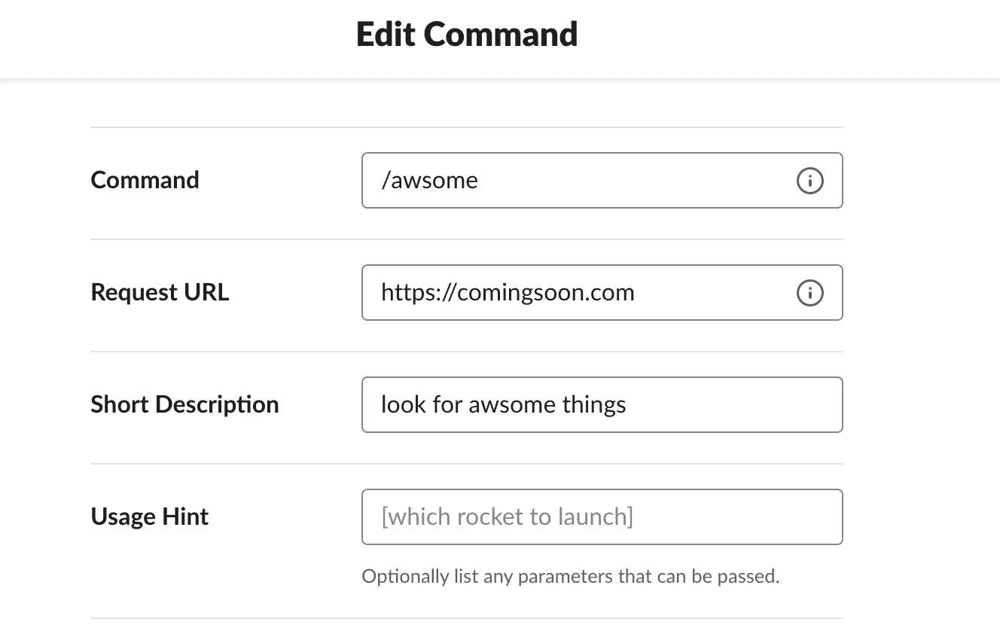

# 使用 AWS CDK 将 Lambda 函数打包并部署为 Docker 容器

> 原文：<https://itnext.io/package-and-deploy-a-lambda-function-as-a-docker-container-with-aws-cdk-fd0df5e37de7?source=collection_archive---------0----------------------->

## *使用基础设施即代码(IaaC)为 Slack 部署无服务器后端*

我在[之前的一篇博文](/using-aws-lambda-function-url-to-build-a-serverless-backend-for-slack-a292ef355a5d)讲述了如何通过使用 [Lambda 函数 URL](https://docs.aws.amazon.com/lambda/latest/dg/lambda-urls.html) 作为一个 webhook 来为 Slack 构建一个无服务器的后端。

[](/using-aws-lambda-function-url-to-build-a-serverless-backend-for-slack-a292ef355a5d) [## 使用 AWS Lambda 函数 URL 构建 Slack 的无服务器后端

### 与 Giphy API 集成的 Slack 应用程序

itnext.io](/using-aws-lambda-function-url-to-build-a-serverless-backend-for-slack-a292ef355a5d) 

因为我想专注于应用程序本身，所以简化了基础设施设置部分——使用 AWS CLI，将函数打包为 zip 文件，进行配置，最后创建一个函数 URL 以及所需的权限。

在这篇博客中，您将最终部署相同的解决方案，但这次使用 IaaC(基础设施即代码)和 [AWS 云开发套件](https://docs.aws.amazon.com/cdk/v2/guide/home.html) (CDK)，这是一个用代码定义云基础设施并通过 AWS CloudFormation 提供它的框架。您可以从支持的编程语言列表中进行选择(在编写时— TypeScript、JavaScript、Python、Java、C#/。Net，并(在开发者预览版中))将基础设施组件定义为代码，就像您对任何其他应用程序所做的那样！


Guillaume Bolduc 在 [Unsplash](https://unsplash.com?utm_source=medium&utm_medium=referral) 上拍摄的照片

您将学习如何使用 [Go CDK 库](https://pkg.go.dev/github.com/aws/aws-cdk-go/awscdk/v2)来处理基础设施组件:

*   定义一个λ函数，
*   添加一个 Lambda 函数 URL，
*   将函数部署为 Docker 容器(不是 zip 文件)

在这篇博文结束时，你应该已经有了和之前的[博客](/using-aws-lambda-function-url-to-build-a-serverless-backend-for-slack-a292ef355a5d)中描述的一样的设置。

> *代号为* [*可在 GitHub*](https://github.com/abhirockzz/awsome-slack-backend) *上获得，一如既往！*

# 先决条件

*   [创建一个 AWS 帐户](https://portal.aws.amazon.com/gp/aws/developer/registration/index.html)(如果您还没有)并登录。您使用的 IAM 用户必须有足够的权限进行必要的 AWS 服务调用和管理 AWS 资源。
*   安装[自动气象站 CDK](https://docs.aws.amazon.com/cdk/v2/guide/getting_started.html#getting_started_install)
*   设置[码头](https://docs.docker.com/get-docker/)
*   [安装 Go](https://go.dev/dl/)
*   [安装 Git](https://git-scm.com/downloads)
*   [如果没有，创建一个宽松的工作空间](https://slack.com/create)。
*   创建一个 GIHPY 帐户(这是免费的！)和[创建一个 app](https://developers.giphy.com/dashboard/?create=true) 。您创建的每个应用程序都有自己的 API 密钥。

# IaaC 的 CDK—快速浏览

CDK 代码非常简洁，但它完成了工作！让我们快速浏览一遍。

首先，我们定义函数及其打包格式(作为 Docker 容器):

```
*// environment variable for Lambda function*
lambdaEnvVars := &map[string]*string{slackSecretEnvVar: jsii.String(slackSecret), giphyAPIKeyEnvVar: jsii.String(giphyAPIKey)}function := awslambda.NewDockerImageFunction(stack, jsii.String("awsome-func-docker"), &awslambda.DockerImageFunctionProps{FunctionName: jsii.String(functionName), Environment: lambdaEnvVars, Code: awslambda.DockerImageCode_FromImageAsset(jsii.String("../function"), nil)})
```

注意 [NewDockerImageFunction](https://pkg.go.dev/github.com/aws/aws-cdk-go/awscdk/v2@v2.22.0/awslambda#NewDockerImageFunction) 是如何被使用的(传统上，人们会使用 [NewFunction](https://pkg.go.dev/github.com/aws/aws-cdk-go/awscdk/v2@v2.22.0/awslambda#NewFunction) 并引用一个 zip 文件进行部署)。在这种情况下，我们指向函数代码所在的文件夹(使用[DockerImageCode _ from imageasset](https://pkg.go.dev/github.com/aws/aws-cdk-go/awscdk/v2@v2.22.0/awslambda#DockerImageCode_FromImageAsset))。

对于要打包成 Docker 映像的函数，我使用了 [Go:1.x 基础映像](https://gallery.ecr.aws/lambda/go) ( [参见 Dockerfile](https://github.com/abhirockzz/awsome-slack-backend/blob/master/function/Dockerfile) )。但是，你也可以探索其他的选择。在部署期间，Docker 映像在本地构建，被推送到一个[私有 ECR 注册表](https://docs.aws.amazon.com/AmazonECR/latest/userguide/Registries.html)，最后 Lambda 函数被创建——所有这一切，只需几行代码！

使用 [NewFunctionUrl](https://pkg.go.dev/github.com/aws/aws-cdk-go/awscdk/v2@v2.22.0/awslambda#NewFunctionUrl) 函数 URL 位很简单:

```
funcURL := awslambda.NewFunctionUrl(stack, jsii.String("awsome-func-url"), &awslambda.FunctionUrlProps{AuthType: awslambda.FunctionUrlAuthType_NONE, Function: function})
```

> *在这个示例应用程序中，我们使用* `*NONE*` *作为认证类型。这意味着 Lambda 函数的 URL 将可以公开访问*

# 在空闲时创建/配置命令

首先登录你的 [Slack Workspace](https://slack.com/signin) 和[创建一个新的 Slack 应用](https://api.slack.com/apps/new)。

完成后，创建一个斜线命令——转到应用程序的设置页面，然后在导航菜单中点击*斜线命令*功能。您将看到一个标有*创建新命令*的按钮，当您点击它时，您将看到一个屏幕，要求您用所需信息定义新的*斜线命令*。

输入所需信息:

*   `/awsome`为命令。
*   在“请求 URL”部分，输入一个虚拟 URL，例如[https://comingsoon.com](https://comingsoon.com)

> *这是临时的，部署后将被 Lambda 函数 URL 替换*



最后，将应用程序安装到您的工作区—单击导航菜单中的*基本信息*功能，选择*将应用程序安装到您的工作区*，然后单击*将应用程序安装到工作区*。这将把应用程序安装到您的 Slack 工作区，以测试您的应用程序并生成您需要与 Slack API 交互的令牌。

一旦你安装完应用程序，*应用程序凭证*就会出现在同一页面上。你需要从那里获取你的*松弛签名秘密*

> *记下你的应用签名密码，因为你以后会用到它*


# 使用 CDK 部署该功能并更新备用配置

克隆 Github repo 并移动到正确的目录:

```
git clone https://github.com/abhirockzz/awsome-slack-backend
cd awsome-slack-backend/function
```

构建 Go 函数:

```
GOOS=linux go build -o awsome
```

部署功能:

```
export SLACK_SIGNING_SECRET=<enter the slack signing secret>
export GIPHY_API_KEY=<enter the giphy API key>cd ../cdk && cdk deploy
```

> *记下作为输出接收的 Lambda 函数 URL*

回到 Slack 并更新配置以反映 Lambda 函数 URL。

一切都已经设置和配置好了。现在转到您的 Slack 工作区，调用您刚刚配置的 Slack 命令！试试这个:

```
/awsome serverless
```

# 清除

完成后，您可以删除该功能和相关资源:

```
cdk destroy
```

在这篇博文中，我们介绍了如何使用 AWS CDK 简化我们的无服务器后端的部署过程！