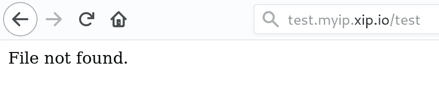

# 在 Docker for Kubernetes 中打包、部署和扩展快速 CGI 应用程序

> 原文：<https://itnext.io/packaging-and-scaling-fast-cgi-applications-in-docker-for-kubernetes-done-right-8440829fe1e9?source=collection_archive---------5----------------------->


此外，像 PHP 这样的快速 cgi 语言的需求也在不断减少，我不时收到一些请求和问题，问我如何在不放弃 docker 和 kubernetes 所有优点的情况下正确部署这些应用程序。

尤其是像 PHP 这样的语言，它们经常伴随着像 WordPress 这样丑陋的应用程序，开发人员在这些应用程序的基础上引入了他们自己的问题。但是让我们从最初的问题开始，让你的应用程序实际上对网络可用。有许多如何“打包”应用程序的“指南”和“教程”。当您看到它们使用卷，在两个容器之间共享它们的文件，或者指示您在同一个容器中运行多个进程时，最好忽略它们，因为这不仅是一种不好的做法，而且还会引入它们自己的问题。但是首先，让我们从问题的根源开始，并提供适当的解决方案。

# 构建过程

在构建应用程序和 docker 容器时，有几个问题会直接出现。我应该使用变量 x 还是 y，在我们的例子中是 apache 还是 php-fpm？入口真的能接触到他们吗？我如何提供我的静态内容？动态内容呢？还有插件，比如…有点动态的那种？

这里的共同想法似乎是构建一个包含 nginx 和执行代码文件的进程的容器来交付内容。对 docker 和 docker 最佳实践稍微熟悉一点的人都知道:等等，我不应该在每个 docker 容器中运行多个进程！那么接下来呢？一个快速的谷歌搜索带来了解决方案，创建两个容器并共享一个卷来在两者之间复制文件。听起来是个好主意！是吗？

TL；DR；它不是，它实际上是一个可怕的想法！

为了理解如何正确地解决我们的问题，我们需要一些关于 kubernetes 的知识和一些通用的架构原则。

## Kubernetes 网络基础知识

如果我们将应用程序部署到两个容器中，我们如何处理另一个容器呢？或者我们可以直接指向入口，在我们的例子中是指向 fcgi 的 nginx 入口？

第一个问题的答案是，在 kubernetes 中，我们有 pods 的概念，所以我们可以只处理 localhost。这是可能的，因为一个 pod 可以包含共享同一个 NIC 的多个容器。如果你想更深入地了解网络是如何工作的，你可以在这里阅读我的深入文章 kubernetes 网络是如何工作的:[https://neu vector . com/network-security/advanced-kubernetes-Networking/](https://neuvector.com/network-security/advanced-kubernetes-networking/)

所以第一个问题很容易解决，第二个问题的答案是两折。是的，我们可以，但我们可能不应该！这总是取决于您如何交付您的应用程序。如果你通过 CDN 交付你所有的静态内容，直接指向入口就可以了。但是，除此之外，无论如何您都将拥有静态内容，因此您将需要一个解决方案来交付它们。而这个解决方案就是 nginx！简而言之，我们还没有考虑太多的第二个问题，静态内容，使得我们关于 nginx 的第二个容器的想法更有意义。它不再仅仅是一个中间人，通过交付我们的静态内容，它本身就有价值。

## 可伸缩应用程序的架构原则

构建可伸缩的应用程序有一些非常简单的原则。第一个是摆脱本地状态，尽一切办法避免共享磁盘状态。这意味着当你有文件需要服务时，把它们转移到一个专门的服务上。

以下是一些例子:

*   **For Files** :一个优化的图像服务服务，它有低级别的优化，比如通过 haystack 设计论文的发现优化的文件系统:[https://www . usenix . org/legacy/event/osdi 10/tech/full _ papers/beaver . pdf](https://www.usenix.org/legacy/event/osdi10/tech/full_papers/Beaver.pdf)。
*   **移动状态**:当我们谈论缓存时，在内存 LRU 中保持一小部分*热，其余的转移到专用的缓存服务，如 *memcached* 或 *redis* 。*
*   **持久数据**:使用合适的分布式数据库，可以水平伸缩，比如*cocroach db*:[https://www.cockroachlabs.com/](https://www.cockroachlabs.com/)

另一个重要的原则是:有一个可重复的过程，没有不必要的初始化。当您想要扩展时，这只会降低部署速度。这也意味着将数据从一个地方复制到另一个地方，以避免在同一个容器中有多个进程，因为在这里旧的 unix 原则仍然适用:“编写程序，使**做一件事**而**做**它**做好**”。

但是，您为什么要避免缓慢的部署呢？

答案很简单:如果你正在扩展你的服务，这个过程**需要**尽可能快地**。想一想，你什么时候扩展，为什么？答案是当你**需要**的时候，如果你需要，这意味着否则你会失去一些东西。这可能是由于较长的加载时间而导致的较低的转换率，从而造成真正的金钱损失，甚至当您面临整个系统过载的风险并使其处于完全被拒绝的风险时，服务连续性也会受到影响。为了避免这一切，你需要尽可能快地设计整个部署，通常你的链中已经有足够多的慢组件，所以至少不要搞砸你自己的东西。以你的主机或云提供商为例，他们为你提供的现成系统不够快(尤其是像 azure 这样的大型云，通常非常慢，我已经经常需要 5-15 分钟来交付你的机器)。
因此，请始终记住，时间就是金钱，因此要预测扩展需求，尽早开始扩展，并尽可能缩短扩展过程。**

# **插件地狱**

**进入下一个话题，插件。你马上会在这里遇到一个问题，那就是持久动态内容。其中之一就是插件，这也是为什么像 wordpress 这样的应用程序很难被正确部署，或者跨多个主机无问题扩展的原因。丑陋的事实是，这些应用程序的开发从来没有考虑到这些东西，而且有很多地方是“错误的”。它只是从插件开始，然后继续 wordpress 自带的自我升级机制。**

**但这并不是说你不能手动安装任何插件，或者你必须使用 wordpress 的内置机制来更新它，而不是手动完成。事实上，手动操作才是你需要走的路。插件的安装需要发生在你的构建步骤中，对于 wordpress 的更新，你可以创建一个更新例程，在每次重建时运行。幸运的是，对于大多数(如果不是所有的话)为这种形式的可扩展性而构建的应用程序来说，这是正确的。如果你想以“正确”的方式做这件事，这是起码的。然而，存在一个问题:**

**你失去了安慰！**

**这对你来说可能不是问题，但如果你只是想为其他用户托管 wordpress 之类的应用程序，这些用户想安装他们自己的插件，但不愿意经历*“手动”*安装的过程，这就成问题了。在这种情况下，您实际上被迫回到任何网络文件系统，最好的情况是分布式的或者至少是复制的。这是一个例外，你基本上没有选择，但这样做并使用共享的“本地磁盘”状态，但你应该指示你的用户在扩展时有问题，至少要将所有数据卸载到 CDN 或 minio 等自托管 S3 存储，并设置代码文件的执行器将它们缓存在内存中，而不是从磁盘重新读取它们。**

**所以无论如何，避免设计糟糕的软件。有软件证明你可以在不破坏可扩展性的情况下开发插件。这里举一个例子:vBulletin Board 将它的插件和代码存储在数据库中，然后对其进行评估。虽然我从不建议使用任何评估，但这是保持可伸缩性的完美方法**和**让用户感到舒适。因此，坚持使用设计良好的软件，而不是在事后淋雨，那时已经太晚了。**

# **您自己的应用程序**

**但是说够了，让我们假设您正在尽最大努力构建您的应用程序，并遵循所有的最佳实践和原则。**

**你会很快体会到，一旦你熟悉了不同种类储物的合适解决方案，它们就会变得不需要动脑筋，并在你的书架上固定下来。这里有一个小奖励，这是一组不同类型存储的示例:**

## **隐藏物**

*   **https://memcached.org/的 memcached**
*   **雷迪斯[https://redis.io/](https://redis.io/)**
*   **redislab[https://redislabs.com/](https://redislabs.com/)**

## **文件**

*   **迷你尼奥(S3)[https://www.minio.io/](https://www.minio.io/)**
*   **seaweedfs —草堆设计实施[https://github.com/chrislusf/seaweedfs](https://github.com/chrislusf/seaweedfs)**

## **不变数据**

*   **https://www.cockroachlabs.com/**
*   **https://www.mongodb.com/**
*   **http://www.actordb.com/**

## **图形数据**

*   **https://www.arangodb.com/**

**配备了用于**任务**的**右**工具，您就准备好构建和发布您的**可伸缩**应用程序了。**

**因此，看看我们的 PHP 应用程序，我们需要决定:PHP-FPM + NGINX 或 Apache。简而言之，有很多原因可以避免 Apache 而支持 NGINX，最大的原因可能是 Apache 的可伸缩性有限，这是因为它的设计是每个连接只开放一个线程。但与 Apache 不同，PHP-FPM 不能直接交付给客户端，它需要一个 web 服务器来处理它的 HTTP 请求，并通过 FCGI 传递它。我们将需要两个容器，一个装有 NGINX，一个装有 PHP-FPM，这似乎是一个开销，但这种开销可以通过给 NGINX 一些任务本身来减少，而不仅仅是一个通道。在 web 应用程序中，我们总是有这个任务，我们之前已经讨论过了:**

**通过构建一个已经包含静态内容的 NGINX 容器来交付静态内容。**

**这样，我们从各个方面受益，PHP-FPM 执行我们的 PHP 文件的性能和 NGINX 转发到 PHP-FPM 的性能，交付静态资产，甚至可能缓存。**

****

# **构建我们的部署**

**现在理论上一切都清楚了，让我们来看一些例子！**

**在我们的例子中，我们不会将任何内容放入我们的容器中，而只是使用基本图像，您可能会使用。所以对于 PHP 用例，这将是简单的: *php:7-fpm* 和 *nginx。***

**如前所述，我们将为包含两个容器的 pod 编写一个部署，以利用相同的网络堆栈。为了让 nginx 能够有效地访问 php 守护进程，根本不需要修改映像。我们可以挂载一个配置映射，我们将使用它来**覆盖**的***default . conf .*****

****所以我们为 php 选择了一些基本的重写配置，你可以根据自己的需要进行调整，让 nginx 作为默认服务器监听端口 80。没有更多的设置，没有虚拟主机通过服务器名称，事实上，我们留为空白“_”。只是一个愚蠢的 nginx 发送内容，或重定向，如果没有。****

****最后，我们将以下配置插入到配置图中，如下所示:****

```
**---
apiVersion: v1
kind: ConfigMap
metadata:
  name: nginxthroughpass
data:
  default.conf: |-
    server {
            listen 80 default_server;
            server_name  _;
            index index.php; location / {
                try_files $uri $uri/ /index.php?$args;
            }

            location ~ \.php$ {
                fastcgi_split_path_info ^(.+\.php)(/.+)$;
                fastcgi_pass 127.0.0.1:9000;
                fastcgi_index index.php;
                include fastcgi_params;
                fastcgi_param SCRIPT_FILENAME /scripts$fastcgi_script_name;
            }
        }**
```

****这就是这里的配置，我们基本上完成了，您当然可能有特殊要求，如您可能想要配置缓存。但是我会把它留给你。****

****接下来的事情就是前面提到的，**装上**！****

****所以没有更多的话，这里是我们的部署配置，包括我们的配置图的*卷安装*。****

```
**---
apiVersion: apps/v1
kind: Deployment
metadata:
  name: phpapp
  labels:
    app: production
    type: app
    service: phpservice
spec:
  replicas: 1
  selector:
    matchLabels:
      app: production
      type: app
      service: phpservice
  template:
    metadata:
      labels:
        app: production
        type: app
        service: phpservice
    spec:
      containers:
        - image: php:7-fpm
          imagePullPolicy: IfNotPresent
          name: app
        - image: nginx
          imagePullPolicy: Always
          name: nginx
          volumeMounts:
            - mountPath: /etc/nginx/conf.d
              name: nginxconf
              readOnly: true
      volumes:
        - configMap:
            defaultMode: 256
            name: nginxthroughpass
            optional: false
          name: nginxconf**
```

****部署和快速测试显示:****

********

****我们从 php-fpm 而不是 nginx 404 中得到一个没有找到的文件。任务完成了！****

****php-fpm 日志现在显示:****

********

****所以它重写了 index.php，正如我们所期望的那样。所以我们现在都完成了！****

# ****结论****

****为 php 和其他需要两个组件才能实际工作的 fcgis 构建一个适当的可伸缩设置并不太难，但是很难区分好的信息和坏的信息。最重要的是要记住，仅仅使用 kubernetes 和 docker 并不能让你的应用程序具有可伸缩性，只有这样，构建一个合适的构建和部署链才变得重要。
所以，在开发过程中，要记住预先扩展的最佳实践，因为**当你需要扩展时，已经太迟了**。在这种情况下，我希望我成功地帮助您摆脱了糟糕的建议，更重要的是，我给了您不仅仅是一个指导，一些思考方式，关于如何正确地构建和打包您的应用程序，以及如何为正确的任务选择正确的工具。****