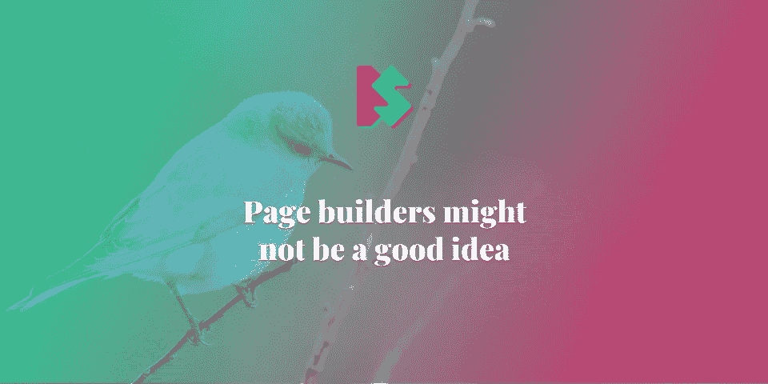

# 页面生成器可能不是一个好主意

> 原文：<https://itnext.io/page-builders-might-not-be-a-good-idea-d044878a901e?source=collection_archive---------8----------------------->

## wordpress 软件

## 页面生成器的 7 个问题

我是这样想的:页面生成器可能不是一个好主意。在这篇文章中，我想分享我对页面生成器的想法，以及为什么你在考虑(再次)使用它之前会三思。

这些观察是主观的，但基于我的经验。我在这里指的是 WordPress 和 Shopify 生态系统，但是这些问题也可以在其他平台上发现。

> *免责声明:如果你使用页面生成器并且没有这些问题，请在评论区告诉我。我很想知道你是怎么做到的。*

# TL；速度三角形定位法(dead reckoning)

在我看来，以下是最常见的问题:

1.  内容不可重复使用(不能在其他页面上重复使用内容)。
2.  设计不一致(页面经常看起来不一样)。
3.  网站不可维护(一个页面上的更改不会传播到其他页面)。
4.  内容不可维护(内容不容易从数据库中提取)。
5.  这个网站的性能不是很好(页面构建者加载了很多额外的资源)。
6.  总有一个缺失的功能(页面生成器不能解决你所有的问题)。
7.  了解页面生成器并不会让你成为一名开发人员(把这项工作留给专业人士)。

# 一点历史

在我从事 web 开发期间，我不断遇到使用页面生成器构建的项目。页面生成器是一种工具，允许在不编写代码的情况下构建网站页面(大多数情况下)。

回到 2014 年，我试图建立我的页面生成器( [Twitter 页面仍然存在](https://twitter.com/citacms):)。它被认为是一种拖放式的解决方案，就像当今大多数现代页面生成器一样。过了一段时间，我意识到这个世界不需要另一种工具。虽然这是一个正确的决定，但它基于错误的论点。那时，我对性能、可访问性或可维护性一无所知，如果我开发一个全方位的解决方案，我永远也不会搞清楚这些。这些只是页面生成器最大的敌人中的几个。现在，让我告诉你一个关于页面生成器的其他问题的故事。

# 页面构建者引入了许多问题

当使用页面生成器时，大多数用户逐页构建。没有原创的设计和结构。你为什么要为自己能做的事情付钱呢？

所以他们从创建第一页开始。然后他们开始摆弄页面生成器，一旦他们满意了，他们就宣布页面完成了。然后他们创建第二页。他们再次开始摆弄页面生成器，并再次声称页面已经完成。

但是接下来会发生什么呢？在两个页面上，有相同的组件。他们更新了一个页面上的组件，但是忘记了更新另一个页面上的组件。这里是第一个问题:**内容不可重用**。

这是一个真实的场景。它发生在我身上，而且不是一次。当然，可以选择保存组件并在另一个页面上重用它。但是用户不用这个选项。

即使当用户创建一个可重用的组件时，他们也经常给每个实例添加一个内联样式。而那就是第二个问题:**设计不符合**。大多数页面生成器都提供定制样式，在每个组件上添加额外的填充和边距、颜色和字体。这些设置几乎总是隐藏在一些设置下，只需点击几下鼠标。用户忘记了这些设置在哪里。这增加了网站的视觉不一致性，这几乎总是一个不幸的副作用。

这就带来了第三个问题:**站点不可维护**。这个问题是大多数开发者的噩梦。开发者不喜欢重复。开发人员想要可重用的、结构良好的代码，这些代码可以在他们最喜欢的代码编辑器中轻松操作。开发人员不喜欢在没有像自动完成或智能这样奇特功能的浏览器中编码。但是用户并不在乎，因为他们从来没有使用过代码编辑器。你不能错过你从未经历过的事情。

所以，虽然网站很小，只有几个页面，但手动更新组件不成问题。当网站不再小的时候，问题就出现了。用户通常在这个时候购买或开发一个新的主题。现在我们来看第四个问题:**内容不可迁移**。

由于大多数页面构建者不保存原始信息，也就是内容，我们不能轻易地将内容迁移到一个新的主题。页面生成器将短代码、HTML 代码和内联样式与内容一起存储。没有直接的方法来提取实际内容的乱码。这意味着所有现有的内容都将被忽略和浪费。只有当页面生成器存在时，它才会存在，用户必须编写新的内容。有时这正是他们想要的，但当情况不是这样时，重写内容将是乏味的，往往会阻塞问题。

既然我们提到了乱码，我们发现了第五个问题:**这个站点的性能不是很好**。这是用户希望提高其 PageSpeed Insights 得分的时候。不幸的是，页面生成器引入了几个问题，从内联 CSS 到加载额外的资产，如 CSS、JavaScript 和字体文件。用户直到在速度测试工具上看到红色分数才知道这些问题。此时，一些用户喜欢安装额外的插件。

这就引出了第六个问题:**总有一个缺失的特性**。没有一个页面生成器可以为每个用户提供一个完整的全方位解决方案。当用户安装插件时，有时他们并不与页面生成器一起工作。现在用户喜欢开发一个新功能。这些任务并不简单，而且会带来额外的成本。

这是第七个问题:**使用页面生成器并不能让你成为开发者**。开发者和用户的想法不一样。开发者的大脑工作方式完全不同，它总是试图用最高效的方式解决问题。有经验的开发人员在问题出现之前就能预测和预料到问题。

我不想冒犯任何人，但是构建页面不仅仅是编写内容并将其放在页面上的某个位置。你应该把这项工作交给专业人士，尤其是如果你想长期维护网站的话。请专家为你提出替代方案，比如构建一个定制的 WordPress 主题或者使用一个静态站点生成器。

# 结论

页面生成器是非常有用的工具，可以用来玩游戏，甚至学习页面是如何工作的。但是页面生成器被想象成一个适用于所有可能场景的通用工具，这通常是行不通的。

所以珍惜你的数据，它是你网站的重要组成部分。你可能会认为这是设计，但用户回来是为了内容，而不是设计。把你的内容交给专业人士，而不是页面构建者。

*原载于*[*https://www . silvestar . codes*](https://www.silvestar.codes/articles/page-builders-might-not-be-a-good-idea/)*。*