# 使用微前端和服务器端的页面构建包括

> 原文：<https://itnext.io/page-building-using-micro-frontends-c13c157958c8?source=collection_archive---------1----------------------->

从一开始，在全世界分享信息、知识和想法就是互联网的主要目标。

> 开端是作品最重要的部分——柏拉图

我们面临着轻松创建个人页面的需求。这就是为什么拉斯马斯·勒德尔夫创建了 PHP，并在第一个版本出现时将其命名为个人主页，而几年后这还不够。因此，我们创建了 CMS 平台，以便轻松创建和分发内容。

如今，微前端将微服务的设计原则扩展到了前端世界，提供了在页面中分发和组合视图的能力。然而，为了实现这个前提，我们需要回过头来，重新开始将这些视图视为服务，而不是代码中可重用的组件。

页面布局——金融科技时报

印刷媒体和网站上的页面布局定义了页面内的元素以及它们如何排列在一起。在一个页面中组合来自不同微前端的视图是我们实现微前端架构所面临的挑战之一，但是我们可以通过下一个实现方法使它变得更容易。

# 新星建筑

Nova 是作为一个基础架构出现的，它可以使用 [hypernova](https://github.com/airbnb/hypernova) 轻松开发微前端。

如果你想知道更多关于 Nova 是如何创建的，你可以阅读我的[以前的文章](https://medium.com/@felipegaiacharly)。

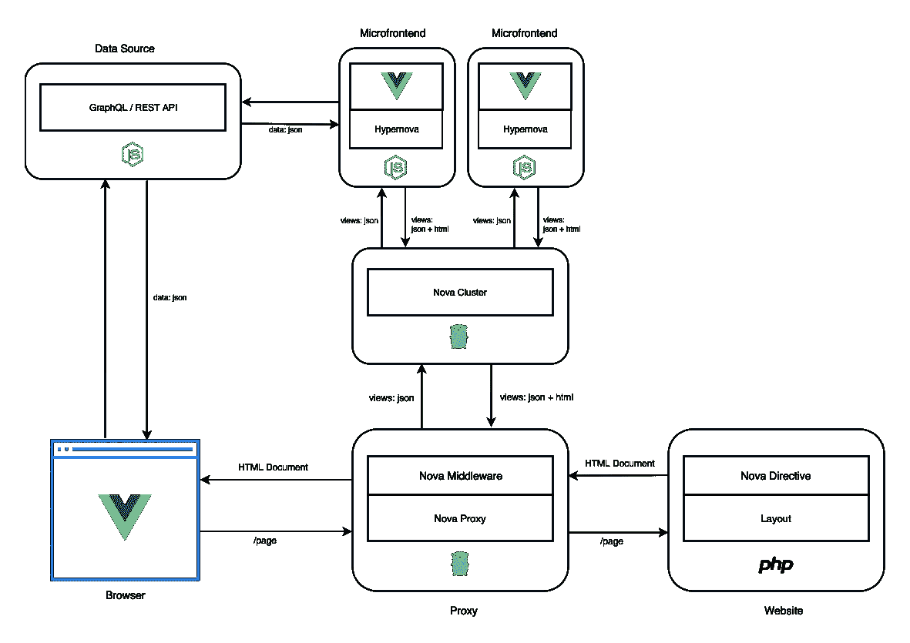

**Nova 指令:**这是一个定制的实现，它使用必要的数据呈现一个占位符，使 Nova 中间件能够请求并包含页面中的视图。

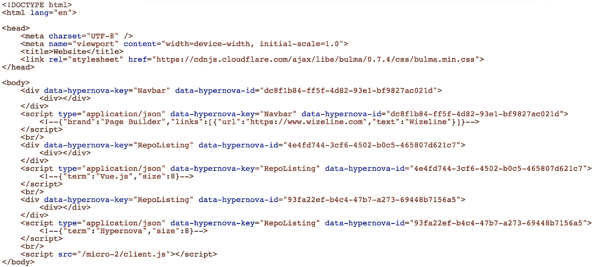

使用 Nova 指令生成的 HTML。

Nova proxy and middleware: 它是一个代理服务器，用于使用 transclusion 的服务器端 Include(SSI)微前端。Nova 中间件解析从源服务器生成的 HTML 以获取必要的信息，从而向 Nova 集群请求视图并将其包含在页面中。

**Nova cluster:** 这是一个微前端聚合器，使消费者只需要他们想要的视图，而不知道哪个微前端可以呈现它们。

# 它是如何工作的？

1.-用户向 Nova 代理请求页面。

2.- Nova 代理将请求传递给网站服务器。

3.-网站根据布局呈现页面。该网站需要一个 Nova 指令实现来定义微前端视图将在页面内呈现的位置。(图中显示了一个 PHP 网站，但是您可以选择任何您想要的编程语言和 web 框架)。

4.-网站将生成的 HTML 发送回 Nova 代理。

5.- Nova 代理解析 HTML 以收集请求微前端视图所需的所有信息。

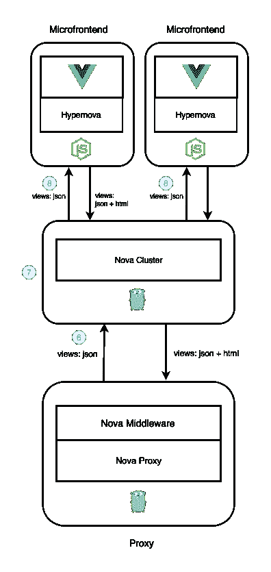

6.- Nova 代理向 Nova 集群发出批处理请求，以获取所有微前端视图。

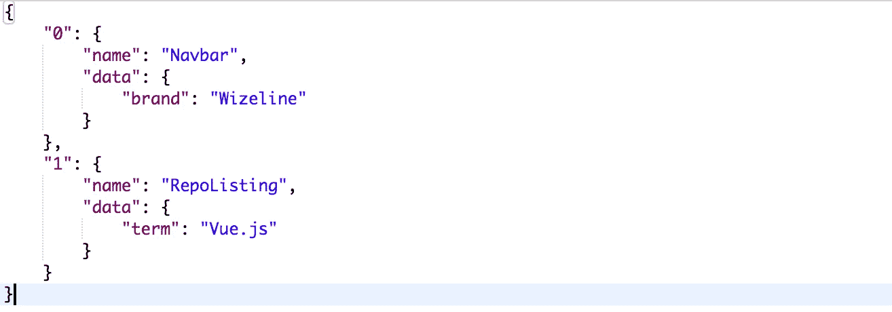

对 Nova 集群的批处理请求。

7.- Nova cluster 为每个涉及的微前端创建一个批处理请求。

8.- Nova 集群并行向每个微前端发出批量请求。

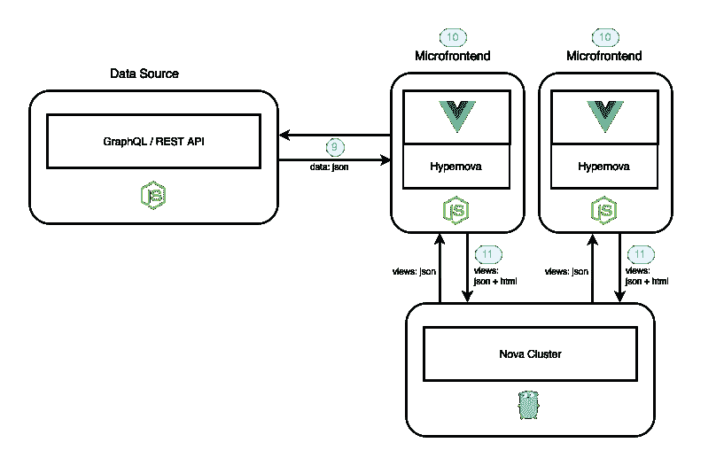

9.-微前端可以收集所有必要的数据来呈现来自外部数据源(如 Rest API 或 GraphQL)的视图。

10.-微前端服务器端使用收集的数据或使用 Nova 集群提供的数据呈现视图。

11.-微前端将渲染视图发送回 Nova 集群。

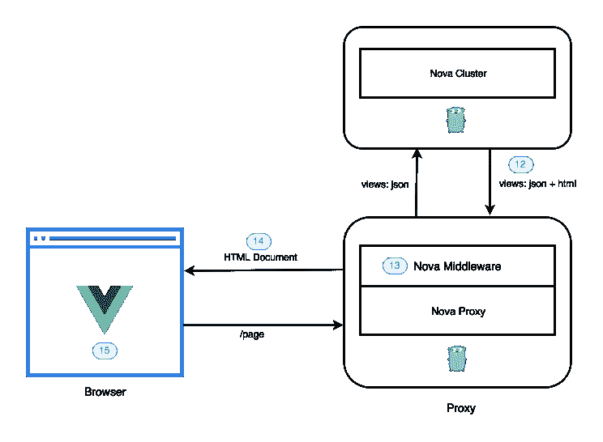

12.- Nova 集群聚合微前端响应，并将它们发送回 Nova 代理。

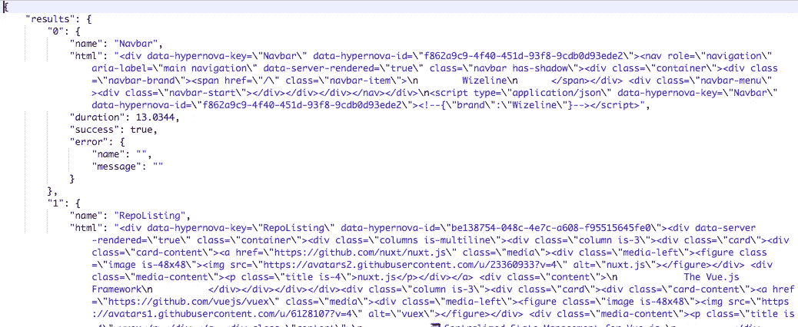

来自 Nova 集群的渲染视图。

13.- Nova proxy 将占位符替换为成功结果的 HTML，并保留错误结果的占位符，以使客户端脚本渲染器能够在浏览器中呈现视图作为后备。

14.- Nova 代理将修改后的响应发送回用户。

15.-在浏览器上，JavaScript 用于逐步增强应用程序并使其动态化。

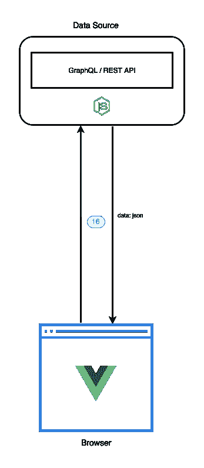

16.-用户可以与视图交互，以便显示从同一数据源收集的更多信息，用于服务器端呈现。

# 我们要建造什么？

我们将使用 [Vue.js.](https://vuejs.org/) 创建三个由它们自己的域限定范围的微前端

*   **常用**(微 1) **:** 导航栏。
*   **Github** (micro-2) **:** 基于搜索词列出存储库的网格视图。
*   **页面生成器**(页面生成器):定制网站页面。

此外，我们将使用 [AdonisJS](https://adonisjs.com/) 创建一个**网站**，它将使用微前端来编写页面。

**此处代码:**

 [## Marconi 1992/页面生成器-微前端

### 使用微前端的页面生成器。为 Marconi 1992/page-builder-micro-frontends 开发做出贡献，创建一个

github.com](https://github.com/marconi1992/page-builder-micro-frontends) 

# 网站(全球资讯网的主机站)

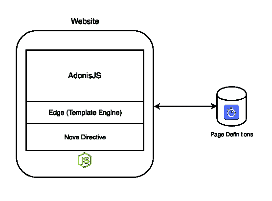

网站图

网站负责三件事:

*   基于存储在 [Algolia](https://www.algolia.com/) 中的布局，使用模板视图 Nova 指令呈现页面。
*   显示页面生成器以修改页面布局。
*   提供一个端点，使页面生成器能够保存页面布局。

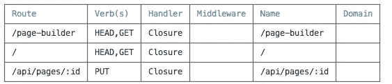

网站端点。

## 使用布局呈现页面

主页的路由处理程序。

路由处理器使用 Algolia 客户端根据页面路径搜索页面布局，如果存在，则将其传递给模板引擎，否则，路由处理器返回 404 错误页面。

模板视图使用 Nova 指令来呈现基于页面布局中声明的组件的微前端的占位符。

# 微前端#1(普通)

导航栏。

这个微前端的范围是在几个网站上分发像导航栏一样的公共视图。我创建了这个简单的微前端来演示 Nova 集群如何让我们在不知道视图来自哪里的情况下请求视图。

# 微前端#2 (Github)

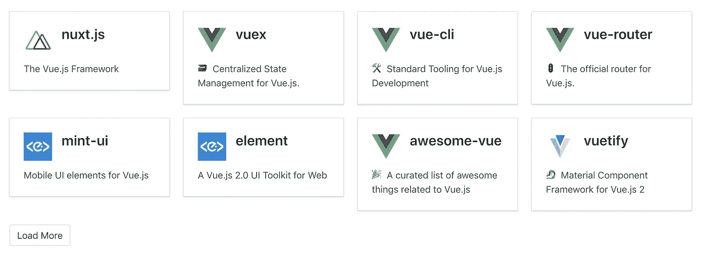

存储库列表视图。

这个微前端的范围是为视图提供来自 GitHub 的信息，在这个例子中，我们有一个网格视图，列出了基于一个术语的存储库。

# **页面生成器**

这个微前端只是客户端渲染，它安装在网站的`page-builder`页面

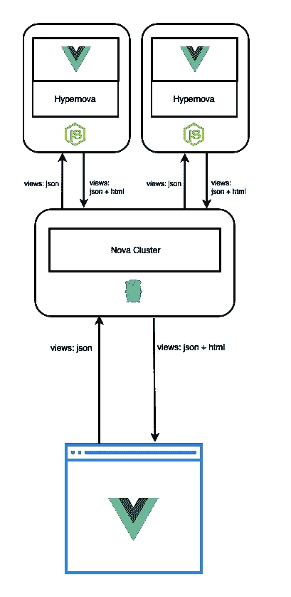

.

*   使用 Nova 指令中提供的信息来初始化页面生成器。

页面生成器的模板视图。

*   一旦页面生成器被初始化，它就使用在页面生成器被初始化时为网站提供的页面布局来请求视图到 Nova 集群。
*   一旦 Nova 集群作出响应，它就将每个结果的 HTML 带到客户端呈现视图。
*   每次用户更改页面布局中的视图数据时，它都会使用新数据再次请求视图，以便预览更改。

## 最后的想法

使用 Nova Architecture + page builder 使媒体发布平台能够让不同的团队拥有自己的微前端视图，这些视图可以从不同的数据源收集内容。