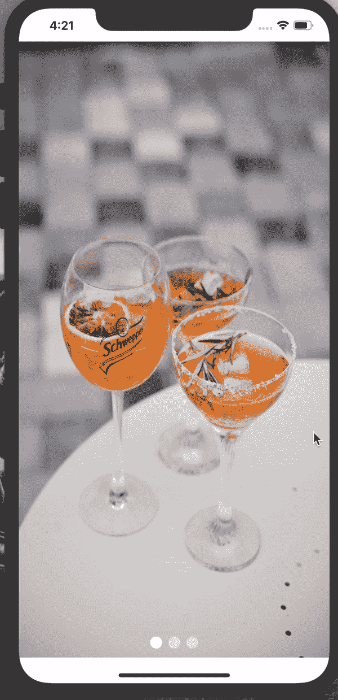

# SwiftUI 中的 PageViewer 又名 PageViewController

> 原文：<https://itnext.io/pageviewer-is-swiftui-aka-pageviewcontroller-8a53b1c37970?source=collection_archive---------2----------------------->

做软件开发在大多数应用程序中，有一些简单解释给定应用程序基本功能的入门屏幕。由于 SwiftUI 已经推出一段时间了，它并不支持这种视图，所以让我向您展示如何使用这个神奇的框架实现 UIPageViewController 行为！

Unsplash.com

## 这篇文章可以在我的博客页面[这里](https://gregios.eu/2019/12/21/pageviewer-is-swiftui-aka-pageviewcontroller/)找到！(此处 medium 不截断 gists！)

## 项目设置

1.  归档新项目

所以…是的，我喜欢 Swift Playgrounds，但在这种情况下，Playgrounds 不能很好地与 SwiftUI 和 DragGesture 识别器一起工作，所以本文将在新的 SwiftUI 项目中实现。

## SwiftUI？

SwiftUI 定义是一个允许以声明方式构建用户界面的框架。但这意味着什么呢？

一种声明式的思维方式意味着你不必关心告诉应用程序状态的更新。等等……什么？

让我们假设您想要展示一个电子邮件作者。按照命令式的思维方式，我们将被迫声明一个电子邮件编辑器视图，每当我们想要显示它时，我们都需要调用一些函数来呈现这个视图。然而，声明性的方式允许定义一些属性，这些属性将被电子邮件编辑器视图观察到，无论该视图是否应该被显示。这里最重要的是，你需要一次性申报这个财产，再也不用关心州与州之间的迁移了！

所以是的，让我们开始吧！

## 页面视图

页面视图确认视图协议，这意味着它将实现“某些视图”类型的属性。

这里的一些关键字定义了不透明的结果类型，它是在 Swift 5.1 中引入的，你可以在这里了解更多信息[https://docs . Swift . org/Swift-book/language guide/opaquetypes . html](https://docs.swift.org/swift-book/LanguageGuide/OpaqueTypes.html)

我们需要定义内部视图属性:

*   “图像”对应于 UIImage 类型，它只显示一幅图像。此图像应用了两个构建器函数:
*   resizable() —这告诉图像适合屏幕
*   clipped()-这告诉 image 它不应该在父视图之外发出刺耳的声音

仅此而已。

PageViewData 符合可识别协议。你可以在这里了解更多:【https://nshipster.com/identifiable/】T4

一般来说，可识别允许 SwiftUI 引擎通过识别给定视图是否需要从头开始创建或者 SwiftUI 引擎是否可以重用已经创建的视图来优化内存。

## 圆形按钮

这个难题的第二个元素是 CircleButton，它是一个比 PageView 更高级的视图。CircleButton 将指示当前显示的页面，并允许用户在页面之间导航。

所以让我们把圆形按钮分成第一部分:

*   @ Binding**var**is selected:Bool

呼呼，呼呼，@Binding var…那是什么。让我解释一下。@Binding 是属性包装器，属性什么…？属性包装是一种通用数据结构，允许您更改属性的读写方式。这里的绑定意味着这个属性可以动态改变，而且 SwiftUI 会观察到这个属性的任何变化。让我们看看它是怎么做的。

圆圈()。前景颜色(**本身**)。isSelected？color . white:color . white . opacity(0.5))

每当 self.isSelected 属性发生变化时，此圆形视图的前景色将随之更新！斯威夫特 UI 摇滚，是吗？

let action 只是一个快速的回调函数，当用户点击这个按钮时就会被执行。

## SwiperView

这个视图比其他视图稍微复杂一点，但是没有什么值得你害怕的。让我们从声明所需的属性开始:

属性:

*   信函页面:[页面视图数据]
*   @Binding var index: Int
*   @ State private var offset:CG float = 0
*   @ State private var isuser swiping:Bool = false

因此，在这个视图中引入了一个新的属性包装器，它叫做@State，是一个值的包装器，视图将基于它的当前状态。@State property 只能由视图本身编辑，这就是为什么 Apple 建议总是将 State 声明为私有财产。您可以在这里查看有关@State 属性包装器的更多信息:

【https://developer.apple.com/documentation/swiftui/state. 

*   页面表示视图数据元素的集合，允许创建相应的视图
*   @Binding var index: Int 表示显示在屏幕上的页面视图的当前索引
*   @State var offset: CGFloat = 0 表示用户在屏幕上滑动时手指在屏幕上的当前偏移量
*   @ State private var isuserwisping:Bool 允许 SwiftUI 指示任何正在进行的滑动动作，或者滑动动作结束。

现在我们可以在 SwiperView 中声明 body

在主体内部，我们声明:

*   geometry reader——这个对象只不过是一个允许读取当前容器几何图形的准视图。你可以在这里查看更多关于这个物体的信息:[https://swiftui-lab.com/geometryreader-to-the-rescue/](https://swiftui-lab.com/geometryreader-to-the-rescue/)
*   ScrollView —这是 SwiftUI 对象，直接对应于 UIScrollView，并允许更改其内容的偏移量。(我们将会这样做)
*   HStack —水平堆栈视图。
*   ForEach(self.pages) —这种特殊的循环允许枚举 body 属性中的对象。它用于创建我们的页面视图对象。

ScrollView content.offset 更新:

因为我们希望在 scrollView 中滚动页面视图，所以我们需要控制 ScrollView 的内容偏移属性。为此，我们将使用一些 SwiftUI 魔法。

*   content.offset 是一个生成器函数，它允许在滚动视图中指示视图对齐的当前偏移量。
*   基于 isUserSwipping 布尔值计算偏移量。当它为 true 时，offset 从 DragGesture.onChanged 回调中读取，当用户不交换时，offset 等于当前页面索引乘以屏幕宽度。
*   。frame 定义了 scrollView 应该适合屏幕，并且在加载时，视图应该是前导对齐的。(如果没有这一行，我们的 scrollView 将在加载时显示中间的页面视图)
*   。gesture()方法允许为此视图添加手势识别器。

拖拽手势

*   当用户滑动屏幕时调用 onChanged 闭包，然后我们将 isUserSwiping 赋值为 true，并根据“value.translation.width”属性计算内容偏移量
*   在这里我们需要计算页面视图应该向左还是向右移动，以及下一个索引应该显示在哪个页面上。
*   withAnimation { }告诉 SwiftUI 这个闭包内的任何更改都应该是动画的

## 内容视图

内容视图包含:

*   pages-PageViewData 对象的数组
*   @State **private**

在主体内部，我们声明:

*   z stack——允许在同一轴上对齐其子视图的视图(第二个视图总是在第一个视图之上)
*   SwiperView —我们刚刚创建的视图，它显示浏览量
*   HStack —该堆栈视图将用于显示页面视图导航按钮
*   ForEach(0..<self.pages.count index="" in="" that="" allows="" us="" to="" create="" navigation="" buttons=""></self.pages.count>
*   padding which defines bottom padding for HStack view

And Boom, the effect is magnificent!

Thanks for ready! Full code can be found [这里](https://github.com/gregiOS/PageViewer)！