# 对数据操作中的数据进行分页、排序和过滤

> 原文：<https://itnext.io/paginating-sorting-and-filtering-data-from-a-data-action-f5cb997fdc60?source=collection_archive---------2----------------------->

*这是一篇关于用* [*OutSystems 平台*](https://www.outsystems.com/) *开发的文章。如果您还没有使用 OutSystems 进行开发，您应该:)。*

# 前言

在反应式应用程序中，可以使用屏幕聚合来检索数据。如果您在表格小部件中显示数据，并且您想要对数据进行分页、排序和/或过滤，您需要在您的屏幕聚合中解决这些问题，如官方文档中的[所述。然而，数据经常来自调用 REST 服务方法或服务动作的数据动作，这些动作可能不支持分页、排序或过滤，而是返回所有可用记录的完整、未分页且可能未排序的列表。不幸的是，OutSystems 没有描述在这种情况下如何处理分页、排序和/或过滤的规范方法。在这篇文章中，我将描述我认为最好、最快的方法。](https://success.outsystems.com/Documentation/11/Developing_an_Application/Design_UI/Creating_and_editing_tables/Table_pagination_and_sorting)

# 页码

让我们先来看看分页。在反应式应用程序中，分页由 OutSystems UI *分页*小部件处理。分页小部件有三个重要参数， *StartIndex* 、 *MaxRecords* 和 *TotalCount* 。

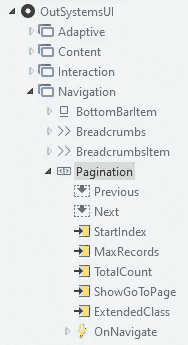

分页小部件，导航 UI 流的一部分。

StartIndex 是显示的第一条数据记录的索引，MaxRecords 是显示的记录总数，TotalCount 是所有页面的记录总数。Pagination 小部件使用 MaxRecords 和 TotalCount 计算总页数，使用 MaxRecords 和 StartIndex 计算当前页面。它还使用这些值来显示 100 个项目中的第 1 到第 10 个消息(其中 1 是 StartIndex 的值，10 是 StartIndex+max records-1 的值，100 是 TotalCount 的值)。

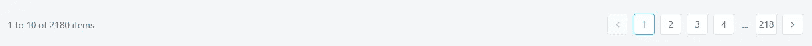

运行中的分页小部件。这个表中有很多记录。

值得注意的是，分页小部件显示的内容完全独立于表格小部件显示的内容。在传统的 Web 应用程序中，表记录小部件保存总列表，通过从 RichWidgets 引用的一些操作，表记录本身负责显示正确的页面，使其与 RichWidgets List_Navigation 小部件(它是 OutSystems UI Pagination 小部件的传统 Web 等价物)同步。但是在反应式应用程序中，表格小部件显示其源属性列表中的任何内容。因此，开发人员有责任确保它显示正确的内容，并与分页小部件保持同步。

正如我在这篇文章的前言中所写的，如果源是一个屏幕集合的输出，那么 OutSystems 文档会详细告诉您该做什么。但在数据行动的问题上，它不幸保持沉默。现在可能很清楚了，因为 Table 小部件显示源列表中的所有内容，所以您需要确保源列表只包含单个页面的记录，页面由 Pagination 小部件决定。如果您从数据操作中收到一个完整的记录列表，您将需要从该列表中提取一个子部分，并将其用作源列表。

为此，您当然需要一个数据操作(在屏幕的上下文菜单中称为“从其他来源获取数据”)。在数据操作中，您调用 REST 方法、服务器操作、服务操作或 SQL 查询，甚至是提供数据的聚合。当然，在使用 SQL 或 Aggregate 时，您可以使用规定的方法进行分页，但是特别是对于不返回太多记录(比如最多几千条)的繁重查询，您可能最好提取一次数据，而不是在用户跳到另一个页面时刷新查询(或者对数据进行排序或过滤，请参阅本文后面的内容)。数据操作应该输出获取的整个列表——这将成为您的源列表。但是不要使用这个列表作为表的来源！正如我上面提到的，这将显示表中的所有记录，并且没有分页。

当您将 Pagination 小部件拖到画布上时，它的属性窗格会为强制输入参数以及 OnNavigate 事件的处理程序屏幕操作显示红色边框。每当用户单击其中一个导航按钮(后退、前进、页码)或输入页码(如果 ShowGoToPage 属性设置为 True)时，将触发该事件。

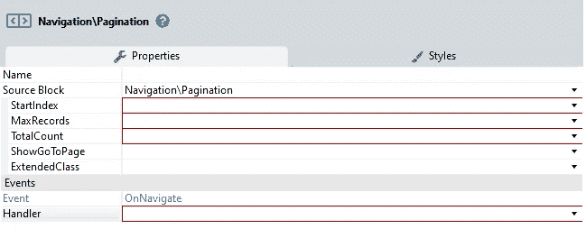

分页属性窗格

如果单击处理程序的向下箭头，并选择 *New Client Action* ，将创建一个名为 PaginationOnNavigate 的客户端操作，它有一个名为 NewStartIndex 的输入参数。

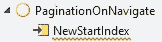

自动生成的分页导航

创建 paginationnavigate 后，将数据操作的“获取后打开”属性设置为 paginationnavigate，NewStartIndex 为 0。

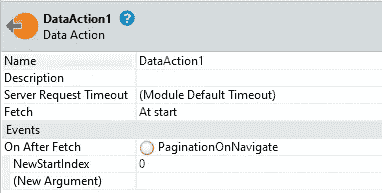

Fetch 后的 On 设置为 PaginationOnNavigate。

这确保了无论我们做什么来确保正确的数据被显示，它也将发生在数据刚刚被获取的时候。

由于表不能直接使用数据动作的输出作为源，我们需要一个屏幕局部变量来保存我们实际想要显示的数据。为了简单起见，我在这里假设列表的数据类型与数据动作的输出相同，但是根据您是否希望基于数据执行任何计算或查找，您可以使用不同的结构。对于我们的例子，让我们调用本地变量*page data*。接下来，将 PagedData 设置为表的源。

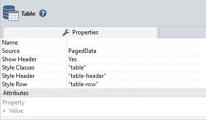

我们的 PagedData 列表现在是我们的表的来源

Pagination 小部件仍然有错误，因为我们还没有设置 StartIndex、MaxRecords 和 TotalCount 属性。我们将为此创建三个屏幕局部变量，为了简单起见，我们称它们为 *StartIndex* 、 *MaxRecords* 和 *TotalCount* 。将这些分配给分页的属性:

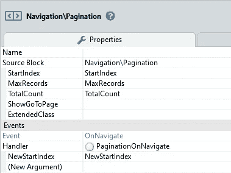

分页小部件属性全部填写完毕

为了防止分页在屏幕打开时显示错误，请将 MaxRecords 默认值设置为您希望每页显示的记录数，例如 10。

在 PaginationOnNavigate 操作中，我们现在需要用数据操作输出的正确记录填充 PagedData 列表。由于平台没有为我们提供开箱即用的操作来从列表中提取一部分，因此我们需要使用 For Each 来实现这一点。我们使用等于 NewStartIndex 输入变量的开始索引和等于 MaxRecords 的最大迭代次数来迭代数据操作的输出。在 For Each 内添加一个 ListAppend，它将数据操作输出列表的当前追加到 PagedData 列表中。因为 PaginationOnNavigate 将被多次调用，所以我们还需要在 For Each 的前面列出 Clear PagedData，否则列表会随着每次调用而增长。

我们需要做的最后一件事是将屏幕局部变量 StartIndex 设置为 NewStartIndex 输入变量，将 TotalCount 设置为数据操作输出列表的长度，这样 Pagination 小部件就可以使用正确的值。

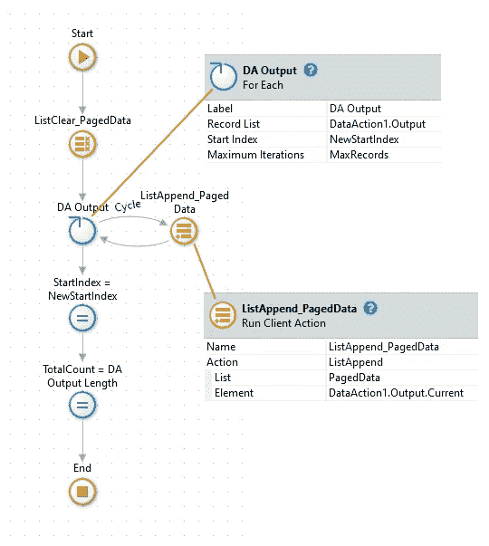

已完成的分页导航。为了清楚起见，任务被分开了，但是你通常把它们放在一个单独的任务中。

这样，我们的分页就完成了！

# 整理

接下来我们来看看排序。表格小部件支持开箱即用的排序。如果你点击一个标题单元格，你会看到它的一个属性叫做*排序属性*。如果设置了该选项，列名称后会自动出现一个双箭头，您可以单击该箭头对列进行排序。默认情况下，当您将变量拖到表上时，Service Studio 将自动为所有列创建排序。删除不想排序的列的排序属性文本。

表的另一个属性是 On Sort 事件，该事件在用户单击可排序列的标题时触发。要生成用于排序的屏幕操作，请单击向下箭头并选择“排序客户端操作时新建”。然后，Service Studio 将创建一个名为 OnSort 的操作，参数为 SortBy。在表属性中，SortBy 被设置为 *ClickedColumn* 。这是当您单击可排序的标题时，表生成的排序事件的输出。它被设置为您为列的排序属性设置的任何文本。Service Studio 还生成一个名为*表排序*的屏幕局部变量。该变量在自动生成的 OnSort 操作中使用，并将保存当前排序列的排序属性值。

如果您打开 OnSort 操作，您将看到以下自动生成的代码:

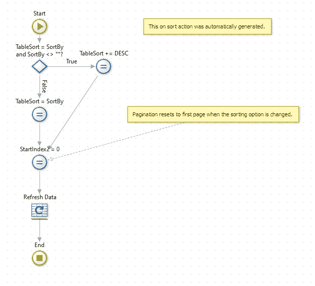

自动生成的分类代码。是的，第一个 If 上面只有四条网格线，而其他的都有五条😠。

我们不能直接使用这个代码，如果只是因为它有一个刷新数据，我们不会使用。但是让我们分析一下代码到底做了什么。在 If 中，代码检查被点击的列是否有变化。为此，它将 TableSort 局部变量与 SortBy 输入进行比较。由于 TableSort 保存当前排序列的 Sort 属性的值(见下文)，当 TableSort 等于 SortBy 时，没有变化。我不确定它为什么检查 SortBy 是否为空——据我所知，SortBy 总是被填充。当有变化时，True 分支中的赋值将“DESC”(带有前导空格)添加到 TableSort 变量中。这做了两件事:它确保如果您再次单击该列，if 将转到 False 分支(因此它在升序和降序排序之间切换)，其次，如果您有一个 Screen Aggregate，它应该使用 TableSort 作为动态排序，并且通过添加 DESC，它将降序排序而不是升序排序。False 分支简单地将 TableSort 设置为 SortBy 输入，然后两个分支都将 StartIndex 设置为 0，因此我们的分页小部件知道从第 1 页开始。注意，这里写的是 StartIndex2，这似乎是 Service Studio 中的一个错误:它创建了另一个 StartIndex 变量，而我们自己已经创建了一个。最后，它调用 Refresh Data 来刷新您的表可能绑定到的屏幕聚合。

正如我所说的，我们不能使用这段代码，但我们将创建类似的东西来排序我们的内存中数据操作输出列表。首先，在列名中添加“DESC”是没有用的，因为我们不使用聚合。因此，我们将添加另一个屏幕局部变量，称为 IsSortDesc。如果为真，我们将降序排列，否则我们将升序排列。像在自动生成的代码中一样，我们首先通过比较 TableSort 和 SortBy 来检查我们是否单击了同一个列。如果它们相等，我们切换 IsSortDesc 的值(通过将“not IsSortDesc”赋给 IsSortDesc)。否则，我们将把 SortBy 赋给 TableSort，并将 IsSortDesc 设置为 False，因为我们总是希望从升序开始排序。

为了对列表进行排序，我们使用 ListSort。我们将排序的列表是数据操作的输出(*而不是*paged Data，当然，我们希望页面显示一页的全部排序数据，而不仅仅是对页面上的内容进行排序)。必须在表达式中使用 If，根据 TableSort/SortBy 的值(由于赋值，它们相等)设置“By”属性。升序属性可以设置为“不是 IsSortDesc"⁴.

接下来，我们调用 PaginationOnNavigate，使用 0 的 NewStartIndex。因为 PaginationOnNavigate 使用数据操作的输出来填充 PagedData 列表，所以它现在将使用排序后的列表。

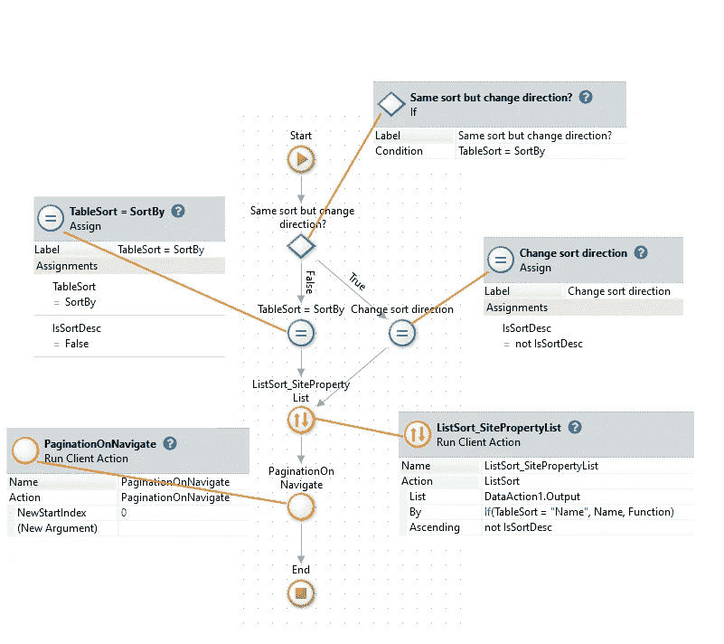

我们自己的 OnSort 排序操作。看看每样东西的间隔是多么的均匀！🥰注意到“名称”和“功能”是 DataAction1 的两个属性。本例中的输出列表结构。

最后要做的一件事是，如果数据操作返回一个排序列表(通常 REST 方法或服务操作将返回按某个属性排序的列表，或者您可以在数据操作中使用 ListSort 在检索后对其进行排序)，则给 TableSort 一个默认值，该值等于排序所依据的列。如果不这样做，用户第一次单击该列标题时什么也不会发生，因为 TableSort 不等于 SortBy，ListSort 将按升序排序。

排序到此为止！

# 过滤

我们通常想做的最后一件事是允许用户过滤列表。我将假设您在一个表单中有一些过滤输入字段，一个“过滤”按钮用于过滤输入，一个“清除”按钮用于清除输入。您可能有不同的实现，这并不重要，只要有一些值来过滤列表。

首先要意识到的是，因为我们没有聚合来进行过滤，所以我们需要 ListFilter 来过滤我们的列表。过滤列表通常是总列表的子集，因此在我们的例子中是数据动作输出的子集。正是这个子集需要分页和排序，所以排序和分页都需要应用于子集。为了实现这一点，我们首先创建另一个屏幕局部变量来保存这个过滤后的列表，其类型与数据动作的输出类型相同。我们称之为 FilteredData。

接下来，在 PaginationOnNavigate 操作中，我们用 FilteredData(来自 DataAction)替换 For Each 记录列表输入。Output)和带有 FilteredData.Current 的 ListAppend 元素。此外，对 TotalCount 的赋值被更改，以便它采用 FilteredData 列表的长度，而不是数据操作的输出 list⁵.

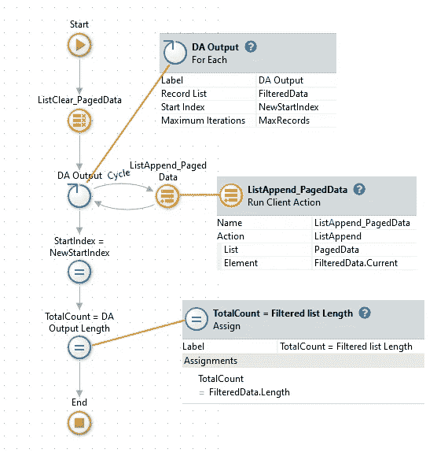

对 PaginationOnNavigate 操作的更改

接下来，我们需要能够实际过滤列表。为此，我们创建了一个名为 OnFilter 的新屏幕操作。我们还将“过滤器”按钮的点击事件设置为新的 OnFilter 动作。接下来我们需要编写 OnFilter 的逻辑。首先，我们将把数据操作的输出分配给 FilteredList —如果我们根本不过滤(因为我们的过滤器输入是空的)，这是默认情况。接下来，我们将检查屏幕上的每个过滤器输入，看用户是否输入了什么。对于这个例子，我将假设“Name”列和“Function”列的过滤器输入。我还为过滤器输入使用了一个名为 *Filter* 的结构类型的本地屏幕变量，但是如果你愿意，你也可以使用单独的变量。

如果一个过滤器输入被填充，我们将一个 ListFilter 应用到过滤后的列表，使用您想要用于过滤的任何条件。在这个例子中，我有一些自由文本输入，我想根据该文本的出现情况过滤列表，类似于聚合中的“like”。为此，我们使用一个条件，该条件使用内置的 Index 函数，在附属的 list 属性中搜索过滤器输入，将两者都转换为小写(因为我们希望比较不区分大小写，就像在数据库搜索中一样)。之后，我们将 ListFilter 的输出分配给 FilteredData。我们对每个滤波器 input⁶.重复这一过程

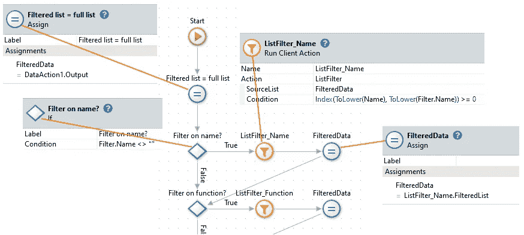

我们目前所做的。但这还不是全部！

接下来要做的是对过滤后的列表进行排序。当然，如果数据动作的输出列表已经被过滤，排序列表也将被过滤。但是，如果在过滤之后，用户对列表进行了不同的排序，我们需要对过滤后的列表进行排序，而不是对数据操作的 output⁷.进行排序为此，我们在过滤后调用 OnSort 操作。但是，您可能还记得，OnSort 从检查表排序是否等于排序开始，如果等于，就恢复排序顺序。在应用过滤器的情况下，当然不应该这样做，因为每次用户过滤列表时，排序顺序都会颠倒。因此，我们向 OnSort 操作添加了一个非强制布尔参数，称为 IsFromFilter，它指示是从 OnFilter 操作(True)还是从表的 OnSort 事件(False)调用它。

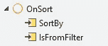

添加了 IsFromFilter 的 OnSort。

然后我们从 OnFilter 调用 OnSort，将 IsFromFilter 设置为 True。注意，由于 OnSort 已经调用了 PaginationOnNavigate，所以我们不需要从 OnFilter 调用该操作。

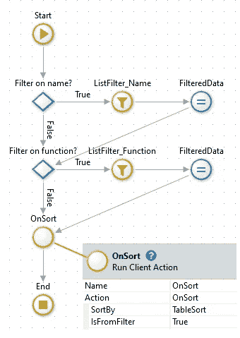

OnFilter 的最终版本，增加了 OnSort。

现在我们需要处理“清除”按钮。按下时，所有过滤器应被清除，表中的数据应代表这一点。你可以用两种方法来做这件事:添加一个单独的名为 OnFilterClear 的屏幕操作，或者类似的操作，在这个操作中，你可以清除赋值操作中的过滤器并调用 OnSort。或者，这也是我通常选择的，向 OnFilter 添加一个非强制的 *IsClear* 输入参数，在“Clear”按钮的单击事件中将其设置为 True(在为其分配 OnFilter 之后)，并在 OnFilter 中处理它。因为这些都很琐碎，所以我在下面照原样展示。

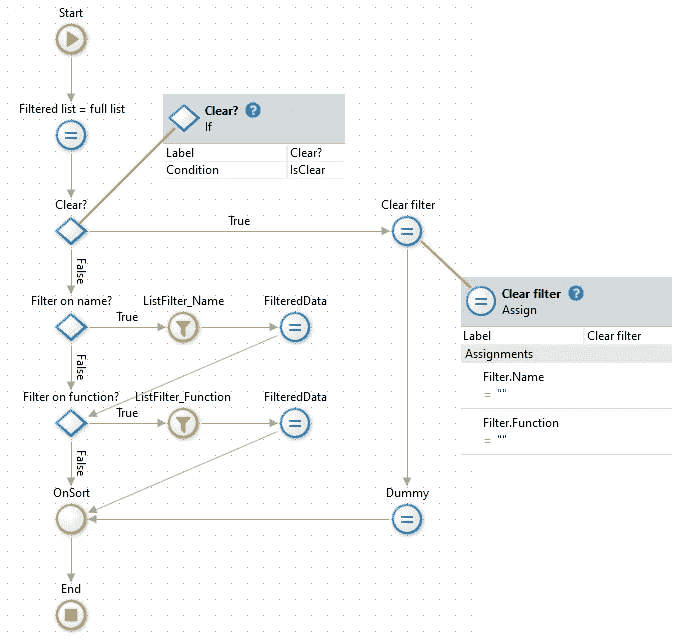

OnFilter 操作包括清除过滤器。“虚拟”赋值只是为了让箭头顺畅地流动。

倒数第二件要做的事情是更新。首先，我们需要使用新的 IsFromFilter 输入参数。如果它的值为 True，我们将绕过检查要排序的列的代码，直接进行排序。此外，由于我们现在应该使用 FilteredData 列表而不是数据操作的输出，ListSort 必须使用 filtered 列表。

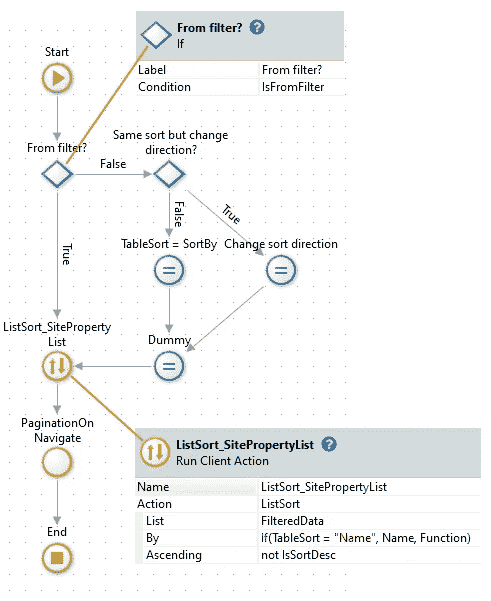

OnSort 增加了对 IsFromFilter 的检查，并修改了 ListSort。

最后，因为 PaginationOnNavigate 和 OnSort 现在都使用 FilteredData 而不是数据操作的输出列表，所以我们需要在数据操作完成后直接将输出列表分配给 FilteredData。目前，我们在 Fetch 动作之后调用 PaginationOnNavigate as On，但是我们不能在那里分配它，因为那样会将过滤列表重置为完整列表，并使任何过滤列表的尝试无效。相反，我们应该调用 OnFilter，因为赋值已经在那里了。额外的好处是，如果我们有一个非空的默认过滤器，列表将根据该过滤器进行过滤(并随后正确排序)，并显示给用户，而无需他们按下“过滤器”按钮。

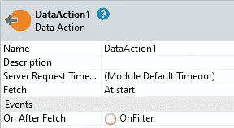

在 Fetch 之后现在调用 OnFilter

就这样，我们现在也有了过滤功能！

# 结束语

当您有一个屏幕集合来获取您的数据时，似乎是一件相当琐碎的事情，即。当数据来自返回非分页列表的数据操作时，分页、排序和过滤就不那么简单了(在我的经验中，这是一种常见的情况)。在本文中，我已经展示了如何在客户端使用 ListAppend、ListSort 和 ListFilter 来实现这一点——我希望这能有所帮助。作为参考，我还[上传了一个 Forge 组件](https://www.outsystems.com/forge/component-overview/12354/paginating-data-action-example)来展示上面的操作，使用一个虚拟的 REST 服务来检索数据。一如既往，快乐编码！

或者，可能是故意的，因为 Service Studio 不知道我们已经拥有的 StartIndex 是否用于当前表，因为表和分页小部件之间没有连接。

我见过类似“If(IsSortDesc = True，False，True)”的代码，但是看在上帝的份上，请不要这样做！

当然，如果您真的需要，您可以跟踪每一列的最后排序顺序，并使用它，但我不建议这样做，因为它可能会使用户感到困惑。

⁴Alternatively 您可以使用一个名为 IsSortAsc 的变量，将其默认值设置为 True，如果 TableSort 不等于 SortBy，则将其赋值为 True，并将其直接用作升序的输入。

⁵There's 不止一个位置，我们可以分配总数。我们最初是在 PaginationOnNavigateAction 中完成的，因为它是在数据操作完成之后调用的(因为数据操作是在 Fetch 操作之后进行的)。虽然我们将改变这个位置，但它仍然是一个方便的位置，因为我们只需要一次赋值。

⁶It 可以使用单个列表过滤器，结合所有过滤器的条件。然而，一旦你有一两个以上的过滤器，代码很快就会变得难以辨认，所以我总是选择单独的列表过滤器。根据我的经验，这不会导致性能或内存问题，但是如果您有一个非常大的列表，为了提高性能，可能需要组合过滤器。但一如既往，不要过早优化！

⁷Alternatively，我们可以对输出列表进行排序，然后在每次用户应用不同的排序时对其进行过滤，但与只对过滤后的列表进行排序而不对输出列表进行再次过滤相比，这将是非常浪费的。