# 在外部系统中平移和缩放图像

> 原文：<https://itnext.io/panning-and-zooming-images-in-outsystems-29fefed6a4fb?source=collection_archive---------2----------------------->

## 如何将 JavaScript 组件集成为可重用的小部件

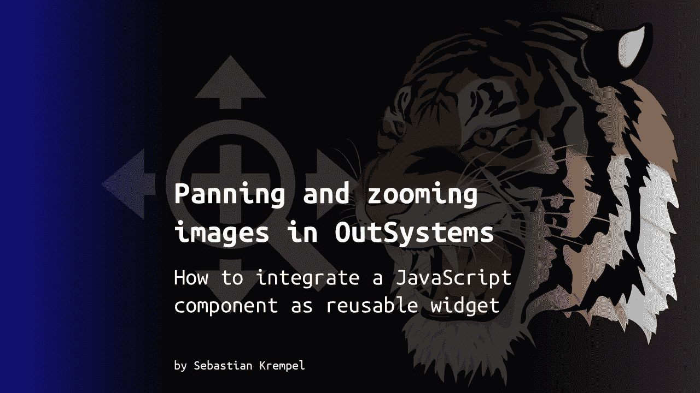

在我的一个项目中，我需要一个允许在大图像中平移和缩放的小部件。在这个简短的教程中，我想与您分享我是如何基于 Timmy Willison 的精彩 panzoom 组件实现它的。

# 摘要

您将在本教程中学到什么:

*   如何集成外部 JavaScript 组件
*   如何实现可重用的小部件
*   如何在简单的演示应用程序中使用它

如果您只需要组件，您可以选择快捷方式，滚动到本文的末尾。

# 你需要什么

如果您想自己跟踪实施情况，您需要:

*   一个外部系统账户(一个[免费的个人环境](https://www.outsystems.com/free-edition/)就足够了)
*   外部系统服务工作室
*   [提米·威廉森的 JavaScript panzoom 库](https://timmywil.com/panzoom/)(麻省理工学院授权)

对于本教程，您应该已经有了一些使用外部系统构建反应式 web 应用程序的经验。

因为我们的目标是一个可重用的组件，所以我决定将这个项目分成两个独立的外部系统模块:小部件本身和一个测试它的演示应用程序。

# 构建可重用的小部件

## 获取 panzoom JavaScript 库

Timmy Willison 已经构建了一个很好的 JavaScript 组件，它利用 CSS 转换来实现在网页上平移和缩放的高性能方式。你可以玩玩他的演示，在他的[主页](https://timmywil.com/panzoom/)上了解更多。GitHub 上的所有源代码都有许可证:

[](https://github.com/timmywil/panzoom) [## GitHub - timmywil/panzoom:一个使用 CSS 变换平移和缩放元素的库

### 一个使用 CSS 变换平移和缩放元素的库:mag: - GitHub - timmywil/panzoom:一个用于…

github.com](https://github.com/timmywil/panzoom) 

您可以在那里找到几个构建源代码的选项。对于我们的 OutSystems 组件，我们只需要编译好的 JavaScript，它可以从 cdn 加载:

[https://UNP kg . com/@ pan zoom/pan zoom @ 4 . 5 . 1/dist/pan zoom . min . js](https://unpkg.com/@panzoom/panzoom@4.5.1/dist/panzoom.min.js)

由于各种原因，我想让组件独立于 cdn，所以我从 cdn 链接中抓取了一个缩小的版本，并将其导入到 OutSystems 模块中。

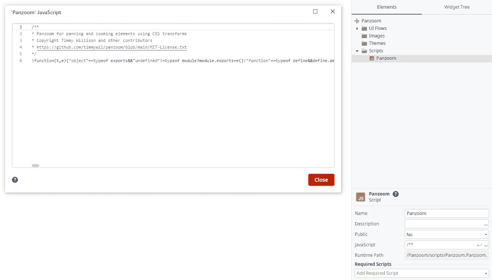

添加 panzoom JavaScript

## 创建可重用的 web 块

接下来，我们必须将 JavaScript 集成为一个可重用的 ui 组件。在 OutSystems 中，这是通过(web)块完成的，就像屏幕一样，存在于 ui 流中。默认情况下，您的模块包含一个名为 *MainFlow* 的流。我建议将其重命名为与您的小部件模块相同的名称，这样以后您可以很容易地在使用它的项目中找到您的模块的所有块。

让我们重命名 ui 流，并向其中添加一个新块 *Panzoom* 。由于我们想从其他模块中使用这个 web 块，我们需要将它的属性 *Public* 设置为 *Yes* 。因为它依赖于 panzoom JavaScript，我们还需要添加*脚本。将*平移至所需的脚本。

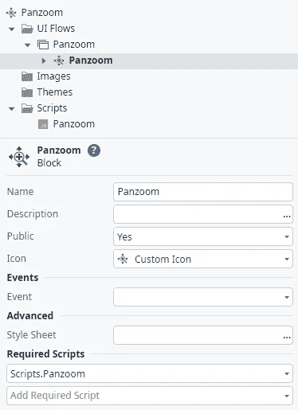

添加 panzoom web 块

如果您愿意，也可以添加自定义图标。

使用 panzoom 小部件的屏幕将通过输入参数与小部件通信。组件本身提供了各种选项，我选择在 OutSystems 中使用一个结构 *PanzoomOptions* 来保存它们。

```
/**
 * PanzoomOptions
 *
 * @property {bool} [Animate] = False
 * Whether to animate transitions
 *
 * @property {bool} [Canvas] = False
 * This option treats the Panzoom element's parent as a canvas. Effectively,
 * Panzoom binds the down handler to the parent instead of the Panzoom
 * element, so that pointer events anywhere on the "canvas" moves its
 * children. See issue #472.
 * Note: setting this option to true also changes where the cursor style is
 * applied (i.e. the parent).
 *
 * @property {int} [Duration] = 200
 * Duration of the transition (ms)
 *
 * @property {string} [Easing] = "ease-in-out"
 * CSS Easing used for transitions
 *
 * @property {string} [ExcludeClass] = "panzoom-exclude"
 * Add this class to any element within the Panzoom element that you want to
 * exclude from Panzoom handling. That element's children will also be
 * excluded. e.g. links and buttons that should not propagate the click event.
 *
 * @property {string} [Overflow] = "hidden"
 * The overflow CSS value for the parent. Defaults to 'hidden'
 *
 * @property {decimal} [StartScale] = 1
 * Scale used to set the beginning transform
 *
 * @property {decimal} [StartX] = 0
 * X value used to set the beginning transform
 *
 * @property {decimal} [StartY] = 0
 * Y value used to set the beginning transform
 *
 * @property {string} [TouchAction] = "none"
 * This value is used to set touch-action on both the Panzoom element and its
 * parent. It is needed because that the native scroll on mobile interferes
 * with panning and pinch zooming. Set this to empty string to re-enable
 * scrolling on mobile, but note that both scrolling and panning cannot work
 * at the same time.
 *
 * @property {string} [Contain] = ""
 * "inside" | "outside"
 *
 * @property {string} [Cursor] = "move"
 * The cursor style to set on the panzoom element
 *
 * @property {bool} [DisablePan] = False
 * Disable panning functionality. Note: disablePan does not affect focal point
 * zooming or the contain option. The element will still pan accordingly.
 *
 * @property {bool} [DisableXAxis] = False
 * Pan only on the Y axis
 *
 * @property {bool} [DisableYAxis] = False
 * Pan only on the X axis
 *
 * @property {bool} [PanOnlyWhenZoomed] = False
 * Disable panning while the scale is equal to the starting value
 *
 * @property {bool} [RoundPixels] = False
 * Round x and y values to whole numbers. This can help prevent images and
 * text from looking blurry, but the higher the scale, the more it becomes
 * necessary to use fractional pixels. Use your own judgment on how much to
 * limit zooming in when using this option.
 *
 * @property {bool} [DisableZoom] = False
 * Disable zooming functionality
 *
 * @property {decimal} [MaxScale] = 4
 * The maximum scale when zooming
 *
 * @property {decimal} [MinScale] = 0.125
 * The minimum scale when zooming
 *
 * @property {decimal} [Step] = 0.3
 * The step affects zoom calculation when zooming with a mouse wheel, when
 * pinch zooming, or when using zoomIn/zoomOut
 */
```

现在我们已经创建了结构，我们可以将类型为 *PanzoomOptions* 的输入参数 *Options* 和输入参数 *ExtendedClass* 添加到 web 块中。这将允许以后配置 panzoom 组件和设置附加的 CSS 类。我们还需要一个局部变量 *PanzoomObject* 来保存我们的 panzoom 对象的引用，这样我们就可以通过 JavaScript 来访问它。

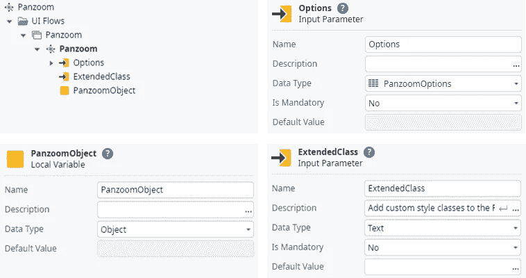

web 块 Panzoom 的输入参数和局部变量

为了让以后的应用程序将平移和可缩放的内容放入小部件，我们还需要向小部件树添加一个容器和一个占位符。该容器是一个获取 ExtendedClass als 样式类的包装器。占位符的名称对于使用我们组件的开发人员来说是可见的，因此“内容”是一个描述性选项。稍后在我们的 JavaScript 中也会引用它来标识呈现 panzoom 组件的 HTML 元素。

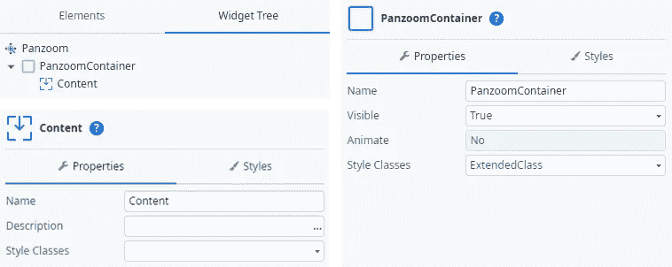

web 块 Panzoom 的小部件树

为了让 panzoom 变得生动，是时候写点脚本了。当呈现我们的 web 块的 DOM 时，我们需要初始化 panzoom 组件，让它也将其 HTML 元素呈现到 DOM 中。为此，我们在 OutSystems 中有一个 *OnRender* 事件，当块在第一次渲染后准备就绪时触发该事件。

您可以将定制的 JavaScripts 添加到您的 OutSystems 客户机流中，并在它和 OutSystems 流之间传输数据，您可以定义输入和输出参数。不幸的是，这里不能选择结构作为数据类型，所以我们必须首先将我们的选项序列化为 JSON。如上所述，我们需要一个对 panzoom 应该渲染到的 HTML 元素的引用。这是通过参数 *ElementId* 完成的，也是类型 *Text* 。JavaScript 将输出一个表示 panzoom 组件的对象，我们希望将它存储在本地变量 *PanzoomObject* 中。最后，我们在 Ready 上触发自己的事件*以允许小部件的消费者在初始化 panzoom 后执行自定义操作。出于稍后描述的原因，我们还将对 panzoom 对象的引用传递给消费者。*

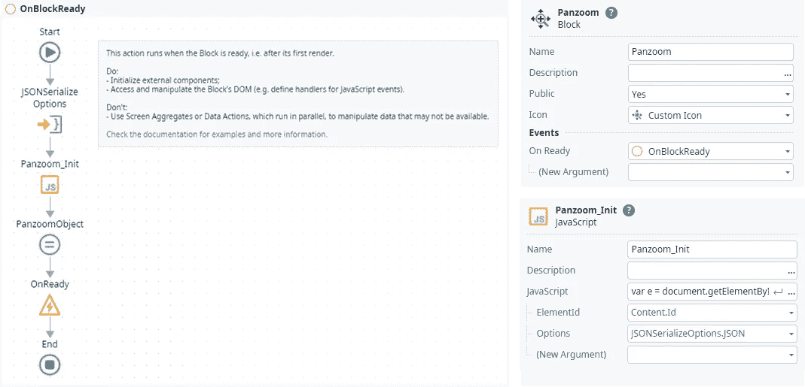

web 块 Panzoom 的 OnRender 事件处理程序

您可以将下面的清单复制并粘贴到上面添加的 JavaScript 中:

```
/**
 * Panzoom_Init
 *
 * @param {string} ElementId
 * @param {string} Options
 * @return {object} PanzoomObject
 */
var e = document.getElementById($parameters.ElementId);
if(!e) throw 'Could not find element "' + $parameters.ElementId + '" for panzoom component.';
var o = JSON.parse($parameters.Options);
var p = Panzoom(e, o);
e.parentElement.addEventListener('wheel', p.zoomWithWheel);
e.addEventListener('panzoomchange', (event) => {
  $actions.PanzoomChange(event.Detail);
})
$parameters.PanzoomObject = p;
```

如您所见，我们向 panzoom 的 JavaScript 事件 *panzoomchanged* 添加了一个事件监听器，该事件监听器调用名为 *PanzoomChange* 的客户端操作。panzoom 组件将包含有关更改信息的对象传递给事件处理程序。为了使它的值在 OutSystems 中可用，我们需要用额外的 JavaScript 解析事件对象。然后，我们将详细信息 *X* 、 *Y* 和*比例*(所有类型都是*十进制*)传递给我们自己的 *OnPanzoomChange* 事件，以通知消费者我们的小部件。

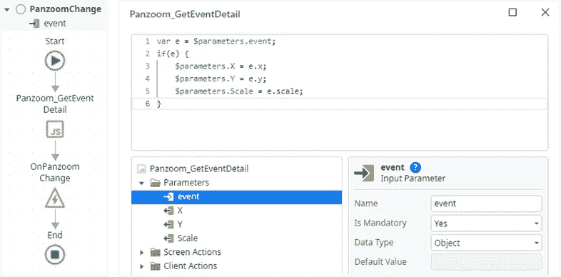

panzoom 的 panzoomchanged 事件的处理程序

```
/**
 * Panzoom_GetEventDetail
 *
 * @param {object} event
 * @param {decimal} x
 * @param {decimal} y
 * @return {decimal} scale
 */
var e = $parameters.event;
if(e) {
  $parameters.X = e.x;
  $parameters.Y = e.y;
  $parameters. Scale = e.scale;
}
```

当 web 块从外部系统的屏幕上卸载时，为了正确地整理一切，还有另一个事件 *OnDestroy* 。这也是摧毁全景部件的正确位置。

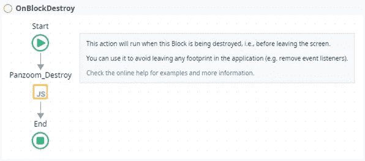

web 块 Panzoom 的 OnDestroy 事件处理程序

JavaScript 删除我们在初始化时为鼠标滚轮添加的事件监听器，并调用 panzoom 对象的相应方法，该对象作为输入参数 *PanzoomObject* 传递，我们在初始化后将其存储到局部变量 *PanzoomObject* 。

```
/**
 * Panzoom_Destroy
 *
 * @param {string} ElementId
 * @param {object} PanzoomObject
 */
var p = $parameters.PanzoomObject
if(p) {
    var e = document.getElementById($parameters.ElementId);
    if(e) e.parentElement.removeEventListener('wheel', p.zoomWithWheel);
    p.destroy();
}
```

现在还剩下一个重要的块事件: *OnParametersChanged* ，每当 web 块的一个输入参数发生变化时，就会触发这个事件。例如，在我们的例子中，当 panzoom 小工具所在的屏幕改变了*选项*时，就会发生这种情况。为了正确处理该事件，我们需要更新 panzoom 组件的选项。

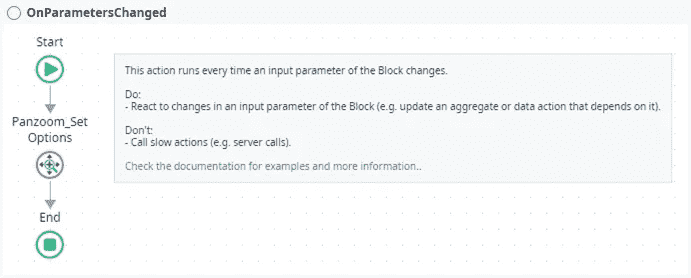

web 块 Panzoom 的 OnParametersChanged 事件处理程序

这个看起来奇怪的客户端动作 *Panzoom_SetOptions* 来自哪里？现在，我们将把它和其他一些客户端动作一起实现，并发布给小部件的消费者。

## 实现一些公共客户端操作来与 panzoom 交互

您已经学习了通过输入参数和事件与块通信的正式方式。我们在这里集成的 panzoom 组件额外提供了一些可以直接调用的 JavaScript 方法。这些都是在初始化期间由我们保存在局部变量 *PanzoomObject* 中的 panzoom 对象公开的。

在 OutSystems 中，块只能公开输入参数和事件，而不能公开客户端操作。因此，使组件的方法对消费者应用程序可用的唯一方法是实现公共客户端操作，并通过我们希望方法在其上执行的 panzoom 对象传递输入参数。这就是我们在 *OnReady* 活动中把它传递给消费者的原因。

下面您会发现客户端动作流和相应的 JavaScripts。输入参数 *PanzoomObject* 也作为输入参数传递给所有 JavaScripts。

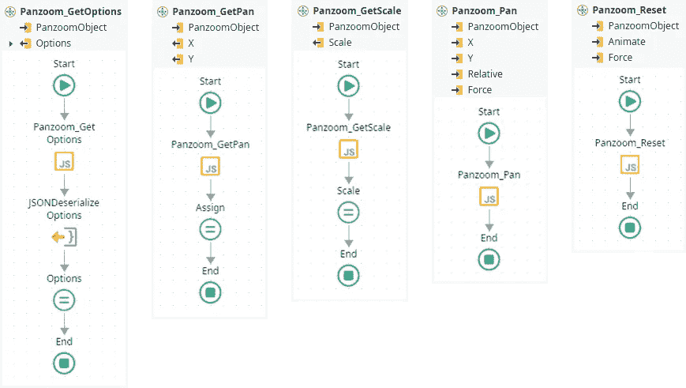

与 panzoom 组件交互的客户端操作(第 1/2 部分)

***pan zoom _ get Options***返回我们 OutSystems 结构中当前 options 对象的副本 *PanzoomOptions* 。因为我们不能在 OutSystems 中将结构传递给 JavaScriptss 或从 JavaScript 传递结构，所以我们必须将其序列化和反序列化为 JSON。

```
/**
 * Panzoom_GetOptions
 *
 * @param {object} PanzoomObject
 * @return {string} Options
 */
if ($parameters.PanzoomObject) {
  var o = $parameters.PanzoomObject.getOptions();
  $parameters.Options = JSON.stringify(o);
}
```

***Panzoom_GetPan*** 返回当前平移位置(x/y 平移)。

```
/**
 * Panzoom_GetPan
 *
 * @param {object} PanzoomObject
 * @return {decimal} x
 * @return {decimal} y
 */
if($parameters.PanzoomObject) {
    var p = $parameters.PanzoomObject.getPan();
    $parameters.X = p.x;
    $parameters.Y = p.y;
}
```

***pan zoom _ get scale***返回当前缩放比例。

```
/**
 * Panzoom_GetScale
 *
 * @param {object} PanzoomObject
 * @return {decimal} Scale
 */
if($parameters.PanzoomObject) $parameters.Scale = $parameters.PanzoomObject.getScale();
```

***平移 zoom_Pan*** 平移到给定的 x 和 y 坐标。

```
/**
 * Panzoom_Pan
 *
 * @param {object} PanzoomObject
 * @param {decimal} x
 * @param {decimal} y
 * @param {bool} Relative
 * @param {bool} Force
 */
if($parameters.PanzoomObject) {
    $parameters.PanzoomObject.pan(
        $parameters.X,
        $parameters.Y,
        {
            relative: $parameters.Relative,
            force: $parameters.Force
        }
    );
}
```

***pan zoom _ Reset***将平移和缩放复位到 *startX* 、 *startY* 和 *startScale* 。默认情况下，它会忽略全局选项来设置动画(将*动画*设置为*假*以覆盖)。该方法还忽略 *disablePan* 、 *disableZoom* 和*panonlywhenzoom*选项(覆盖 set *Force* 到 *False* )。

```
/**
 * Panzoom_Reset
 *
 * @param {object} PanzoomObject
 * @param {bool} Animate
 * @param {bool} Force
 */
if($parameters.PanzoomObject) $parameters.PanzoomObject.reset(
    {
        animate: $parameters.Animate,
        force: $parameters.Force
    }
);
```

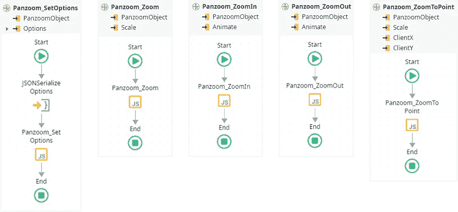

与 panzoom 组件交互的客户端操作(第 2/2 部分)

***Panzoom _ set options***用给定的 *PanzoomOptions* 结构更新 pan zoom 实例的选项，当然必须序列化为 JSON 才能传递给 JavaScript。

```
/**
 * Panzoom_SetOptions
 *
 * @param {object} PanzoomObject
 * @param {string} Options
 */
if ($parameters.PanzoomObject) {
    var o = JSON.parse($parameters.Options);
    $parameters.PanzoomObject.setOptions(o);
}
```

***Panzoom_Zoom*** 将 Panzoom 元素缩放到给定的比例。

```
/**
 * Panzoom_Zoom
 *
 * @param {object} PanzoomObject
 * @param {decimal} Scale
 */
if($parameters.PanzoomObject) $parameters.PanzoomObject.zoom($parameters.Scale);
```

***pan zoom _ zoom in***使用选项中设置的预定增量放大。默认动画，忽略全局选项(设置*动画*为*假*覆盖)。

```
/**
 * Panzoom_ZoomIn
 *
 * @param {object} PanzoomObject
 * @param {bool} Animate
 */
if($parameters.PanzoomObject) $parameters.PanzoomObject.zoomIn({ animate: $parameters.Animate, });
```

***pan zoom _ zoom out***使用选项中设置的预定增量缩小。默认动画，忽略全局选项(设置*动画*为*假*覆盖)。

```
/**
 * Panzoom_ZoomOut
 *
 * @param {object} PanzoomObject
 * @param {bool} Animate
 */
if($parameters.PanzoomObject) $parameters.PanzoomObject.zoomOut({ animate: $parameters.Animate, });
```

***Panzoom _ zoom point***使用给定的*比例*和点(*ClientX*/*ClientY*)将 pan zoom 元素缩放到焦点。

```
/**
 * Panzoom_ZoomToPoint
 *
 * @param {object} PanzoomObject
 * @param {decimal} Scale
 * @param {decimal} ClientX
 * @param {decimal} ClientY
 */
if($parameters.PanzoomObject) $parameters.PanzoomObject.zoomToPoint(
    $parameters.Scale,
    {
        clientX: $parameters.ClientX,
        clientY: $parameters.ClientY
    }
);
```

恭喜，您现在已经将 panzoom JavaScript 组件集成为 OutSystems 的可重用小部件。现在是时候在一个演示应用程序中尝试一下了。

# 构建演示应用程序

我们现在将实现的小演示应用程序的目的是显示 SVG 图形，并允许“全景缩放”和测试上面实现的功能。

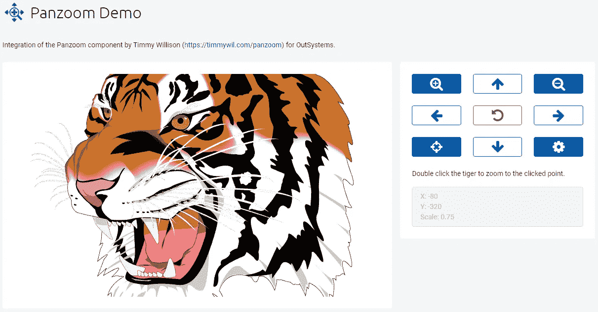

演示应用的用户界面

我们首先向保存 panzoom 小部件的模块添加一个依赖项，并激活块、客户端动作和结构的所有复选框。之后，我们必须将主屏幕，我简单地命名为“演示”，添加到*主流程*中。该布局基于一个*自适应块。左栏包含 panzoom 组件，右栏包含一个控制面板，用于播放演示。*


演示 ui 左栏的小部件树

为了配置 panzoom 组件，我们扩展了添加的 *Panzoom* 块的*选项*参数。通过这样做，我们可以看到底层结构 *PanzoomOptions* 的所有属性，并为所有选项提供初始值。本例中使用的值适用于所用的 tiger 图形，但请随意使用它们或根据您想要使用的内容更改它们。该块还具有 *ExtendedClass* 参数，该参数在这里被设置为*“全高”*以确保 panzoom 区域占用其父容器中的可用空间。

我们希望成为可平移和可缩放的内容被放入 *Panzoom* 块的*内容*占位符中。在这个例子中，我们简单地使用了一个 SVG 图形。在这个例子中，我们使用一个 SVG 图形，它的优点是可以无损缩放。为了在 OutSystems 中直接显示 SVG 图形，在 *OutSystemsUI* 中有 *Utilities\InlineSVG* 块，它嵌入了给定的 *SVGCode* 。因为这个输入参数的类型是 *Text* ，所以我们必须用双引号将 SVG 括起来，并对所有包含双引号的内容进行编码。为了您的舒适和这篇文章更好的可读性，您可以在我的要点上找到准备复制的示例图形。请不要忘记给 InlineSVG 小部件一个名称(这里简称为“SVG”)，因为我们稍后需要它在 JavaScript 中引用 HTML 元素。

父容器通过使用以下 CSS 类来设置样式:

```
background-neutral-0 padding-m border-radius-soft
```

接下来，我们想要实现一些代码来测试 *Panzoom* 小部件提供的不同功能。首先，我们需要一个类型为 *Object* 的局部变量 *Panzoom* 来保存 Panzoom 对象并实现 *Panzoom* 小部件的事件处理程序:

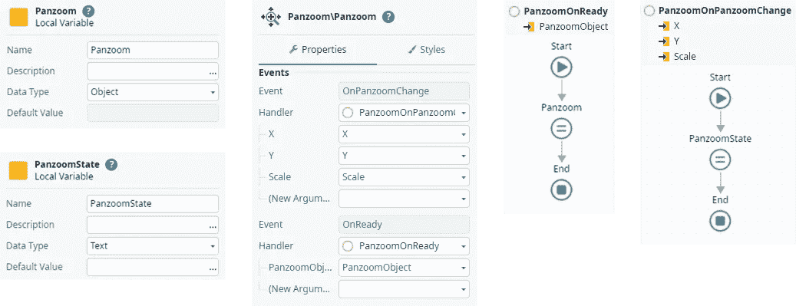

panzoom 小部件的变量和事件处理程序

***PanzoomOnReady***简单地将收到的 *PanzoomObject* 赋值给局部变量 *Panzoom* 。

***PanzoomOnPanzoomChange***在每次 panzoom 组件的状态改变时被触发。为了稍后监视屏幕上的状态，事件处理程序编写了一个*文本*，并通过使用以下表达式将其分配给局部变量 *PanzoomState* :

```
"X: " + X + NewLine() + "Y: " + Y + NewLine() + "Scale: " + Scale
```

第二个屏幕栏(右侧)中的控制面板提供了一个用于不同客户端操作的按钮字段和一个用于显示当前全景缩放状态的控件。

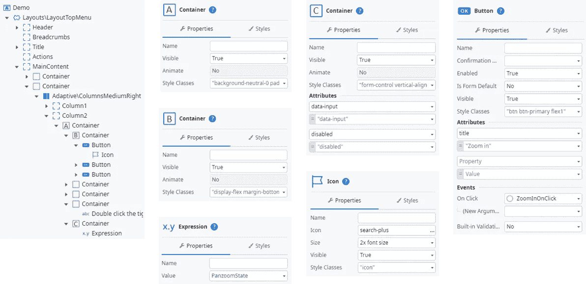

演示 ui 右栏的小部件树

控制面板由一个父容器(A)组成，其中排列了三个按钮容器(B ),每个容器有三个按钮。附加属性 *title* 用于获取按钮的简单工具提示。为了简单起见，您可以在这里找到要复制的样式类:

```
Container A: background-neutral-0 padding-m border-radius-soft
Container B: display-flex margin-bottom-m
Buttons:     btn btn-primary flex1
```

利用两个附加属性 *data-input* 和 *disabled* ，控件 zu display 当前 panzoom 状态由假装为禁用输入控件的容器(C)构成。里面的表达式被绑定到局部变量 *PanzoomState* 。

每个按钮都有一个相应的 *OnClick* 事件处理程序，它调用我们的 Panzoom 组件的相关客户端操作:

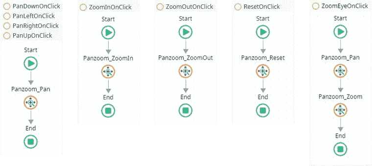

控制面板按钮的事件处理程序

***平移【方向】OnClick*** 调用*平移缩放 _ 平移*客户端动作，参数如下:

```
Down:  X =   0, Y =  10, Relative = True
Left:  X = -10, Y =   0, Relative = True
Right: X =  10, Y =   0, Relative = True
Up:    X =   0, Y = -10, Relative = True
```

***缩放点击*** 使用以下参数缩放至“老虎之眼”:

```
Panzoom_Pan:  X = -40, Y = 91, Relative = False
Panzoom_Zoom: Scale = 3.6
```

带有齿轮图标的最后一个按钮打开一个弹出对话框，允许用户操作 *PanzoomOptions* 结构的所有选项。为了简单起见，这是作为一个基本的 JSON 编辑器实现的。因此，我们需要屏幕中的以下局部变量和客户端操作:

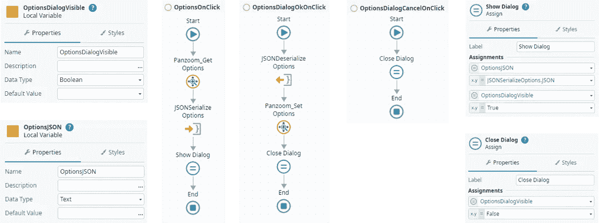

选项弹出对话框的变量和事件处理程序

***选项单击*** 处理当 cog 按钮被单击时，并通过 *Panzoom_GetOptions* 向 panzoom 组件请求当前选项，序列化返回的 *PanzoomOptions* 结构，将结果 JSON 赋给局部变量 *OptionsJSON* ，并通过将 *OptionsDialogVisible* 设置为 *True* 来显示弹出窗口。

***options dialogokonclick***处理当点击弹出对话框的 OK 按钮时，在 *OptionsJSON* 中反序列化 JSON 用户输入，并通过 *Panzoom_SetOptions* 更新 panzoom 组件。之后，通过将*选项对话框可见*设置为*假*来关闭弹出对话框。

***选项对话框取消点击*** 处理点击弹出对话框的取消按钮。

选项弹出对话框的用户界面构建如下图所示:

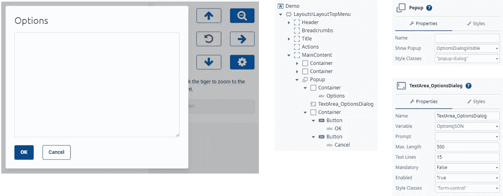

选项弹出对话框的用户界面

我们想要实现的最后一个功能是放大用户双击的图形点的能力。因此，我们必须实现客户端动作 *ImageOnDblClick* 来处理用户双击时的情况，并将其注册为浏览器中的事件侦听器。这可以通过我们放入屏幕的 *OnReady* 事件中的 JavaScript 来实现。它通过一个输入参数接收 InlineSVG 小部件的 *ElementId* 。

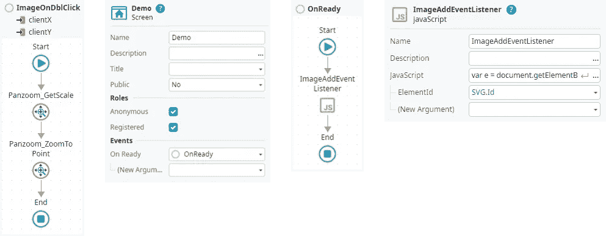

双击图形的事件处理程序

```
/**
 * ImageAddEventListener
 *
 * @param {string} ElementId
 */
var e = document.getElementById($parameters.ElementId)
e.addEventListener('dblclick',(event) => {
    $actions.ImageOnDblClick(event.clientX, event.clientY);
});
```

干得好！您已经通过了测试，并创建了演示应用程序。现在可以发布和测试应用程序和 panzoom 组件集成了。

# 从熔炉中取出现成的组件

我已经在 out systems Forge([pan zoom Reactive](https://www.outsystems.com/forge/component-overview/14319/panzoom-reactive))上发布了这个组件，所以你也可以在你的应用程序中使用它。如果你留下一些掌声和/或一杯咖啡，我会很高兴😉

我希望您喜欢阅读本教程，并在您的环境中重新创建它。如果你对这篇文章感兴趣，我会很高兴你能在媒体上关注我。如果您有任何问题或建议我改进，请通过 medium 或我的 [OutSystems 档案](https://www.outsystems.com/profile/enrntqhemy/)联系我。