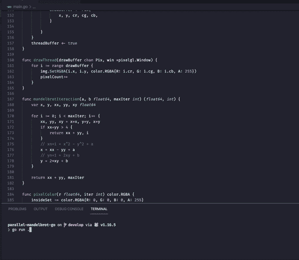
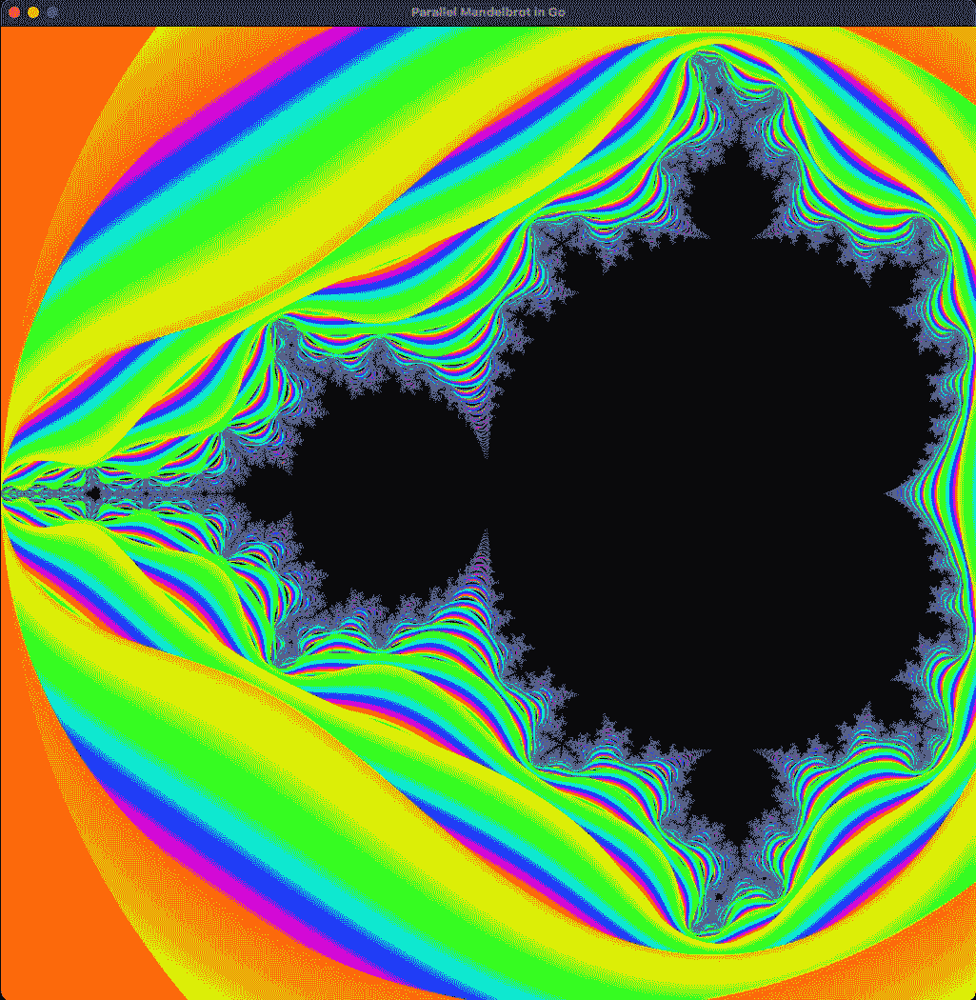

# 使用 Golang 的并行 Mandelbrot 集

> 原文：<https://itnext.io/parallel-mandelbrot-set-using-golang-6d59b593829a?source=collection_archive---------1----------------------->

这篇文章解释了如何使用 Golang *goroutines* 并行生成 Mandelbrot 集合。

这里的源代码:[https://github.com/GiselaMD/parallel-mandelbrot-go](https://github.com/GiselaMD/parallel-mandelbrot-go)

# 曼德尔布罗集合

对于那些对什么是曼德尔布罗特集感兴趣的人来说，去看看 https://en.wikipedia.org/wiki/Mandelbrot_set

设定公式基于 **x** 和 **y** 坐标的位置:

```
x = x*x — y*y + a
y = 2*x*y + b
```

我们还检查`x*x + y*y > 4`是否设置了颜色。

但是我不想讨论数学细节，我想解释一下我们如何使用 *goroutines* 在屏幕上呈现 Mandelbrot 集合。

# 进入代码

该程序基于将影响 Mandelbrot 集合的性能和分辨率的 4 个主要值。

```
maxIter = 1000
samples = 200numBlocks = 64
numThreads = 16
```

*   `maxIter`定义 Mandelbrot 公式将被计算多少次，产生`x`和`y`值。
*   `samples`是生成 RGB 颜色值的交互次数。
*   `numBlock`是将图像分成多少块。
*   `numThreads`是将要创建的 *goroutines* 的数量。

为了在屏幕上渲染结果，我使用了像素库([github.com/faiface/pixel](https://github.com/faiface/pixel))。在主函数上我们有这样的东西:

```
func main() {
    pixelgl.Run(run)
}
```

调用`pixelgl.Run`将 PixelGL 置于主函数的控制之下，我们再也无法在主函数中运行任何代码。这就是为什么我们需要在`pixelgl.Run`内部传递另一个函数，也就是`run`函数。

```
func run() {
    log.Println("Initial processing...")
    pixelCount = 0
    img = image.NewRGBA(image.Rect(0, 0, imgWidth, imgHeight))
    cfg := pixelgl.WindowConfig{
        Title:  "Parallel Mandelbrot in Go",
        Bounds: pixel.R(0, 0, imgWidth, imgHeight),
        VSync:  true,
    }

    win, err := pixelgl.NewWindow(cfg)
    if err != nil {
        panic(err)
    }
    log.Println("Rendering...")
    start := time.Now()
    workBuffer := make(chan WorkItem, numBlocks)
    threadBuffer := make(chan bool, numThreads)
    drawBuffer := make(chan Pix, pixelTotal)

    workBufferInit(workBuffer)
    go workersInit(drawBuffer, workBuffer, threadBuffer)
    go drawThread(drawBuffer, win)

    for !win.Closed() {
        pic := pixel.PictureDataFromImage(img)
        sprite := pixel.NewSprite(pic, pic.Bounds())
        sprite.Draw(win, pixel.IM.Moved(win.Bounds().Center()))
        win.Update()

        if showProgress {
            fmt.Printf("\r%d/%d (%d%%)", pixelCount, pixelTotal, int(100*(float64(pixelCount)/float64(pixelTotal))))
        }

        if pixelCount == pixelTotal {
            end := time.Now()
            fmt.Println("\nFinished with time = ", end.Sub(start))
            pixelCount++

            if closeOnEnd {
                break
            }
        }
    }
}
```

`run`函数负责初始化和更新窗口，以及创建将用于我们的 *goroutines* 的通道。

`workBuffer`是负责添加各块信息的通道(基于`numBlocks`)。在`workBufferInit`内部，初始和最终的`x`和`y`值被发送到通道，这样每个 *goroutines* 就可以计算颜色，而不需要知道全局数据，只需要知道那个块的`x`和`y`的范围。

```
func workBufferInit(workBuffer chan WorkItem) {
    var sqrt = int(math.Sqrt(numBlocks))

    for i := sqrt - 1; i >= 0; i-- {
        for j := 0; j < sqrt; j++ {
            workBuffer <- WorkItem{
                initialX: i * (imgWidth / sqrt),
                finalX:   (i + 1) * (imgWidth / sqrt),
                initialY: j * (imgHeight / sqrt),
                finalY:   (j + 1) * (imgHeight / sqrt),
            }
        }
    }
}
```

`threadBuffer`负责基于`numThreads`创建 *goroutines* 并控制 *goroutine* 何时完成其工作，以便我们可以在它的位置运行另一个。那里面的逻辑`workersInit` *goroutine* 。

```
func workersInit(drawBuffer chan Pix, workBuffer chan WorkItem, threadBuffer chan bool) {
    for i := 1; i <= numThreads; i++ {
        threadBuffer <- true
    }

    for range threadBuffer {
        workItem := <-workBuffer

        go workerThread(workItem, drawBuffer, threadBuffer)
    }
}
```

对于我们从`workBuffer`(每个块)接收的每个`workItem`，我们创建一个名为`workerThread`的 *goroutine* 来处理所有的 Mandelbrot 集合逻辑。

```
func workerThread(workItem WorkItem, drawBuffer chan Pix, threadBuffer chan bool) {
    for x := workItem.initialX; x < workItem.finalX; x++ {
        for y := workItem.initialY; y < workItem.finalY; y++ {
            var colorR, colorG, colorB int
            for k := 0; k < samples; k++ {
                a := height*ratio*((float64(x)+RandFloat64())/float64(imgWidth)) + posX
                b := height*((float64(y)+RandFloat64())/float64(imgHeight)) + posY
                c := pixelColor(mandelbrotIteraction(a, b, maxIter))
                colorR += int(c.R)
                colorG += int(c.G)
                colorB += int(c.B)
            }
            var cr, cg, cb uint8
            cr = uint8(float64(colorR) / float64(samples))
            cg = uint8(float64(colorG) / float64(samples))
            cb = uint8(float64(colorB) / float64(samples))

            drawBuffer <- Pix{
                x, y, cr, cg, cb,
            }

        }
    }
    threadBuffer <- true
}func mandelbrotIteraction(a, b float64, maxIter int) (float64, int) {
    var x, y, xx, yy, xy float64

    for i := 0; i < maxIter; i++ {
        xx, yy, xy = x*x, y*y, x*y
        if xx+yy > 4 {
            return xx + yy, i
        }
        // xn+1 = x^2 - y^2 + a
        x = xx - yy + a
        // yn+1 = 2xy + b
        y = 2*xy + b
    }

    return xx + yy, maxIter
}

func pixelColor(r float64, iter int) color.RGBA {
    insideSet := color.RGBA{R: 0, G: 0, B: 0, A: 255}

    // check if it's inside the set
    if r > 4 {
        // return hslToRGB(float64(0.70)-float64(iter)/3500*r, 1, 0.5)
        return hslToRGB(float64(iter)/100*r, 1, 0.5)
    }

    return insideSet
}
```

`drawBuffer`是从正在计算 Mandelbrot 集合的*go routine*接收值的通道，一旦接收到数据，`drawThread` *goroutine* 将像素 RGB 值设置到图像中，然后`run`函数更新窗口。

```
func drawThread(drawBuffer chan Pix, win *pixelgl.Window) {
    for i := range drawBuffer {
        img.SetRGBA(i.x, i.y, color.RGBA{R: i.cr, G: i.cg, B: i.cb, A: 255})
        pixelCount++
    }
}
```

我们还有一些实用程序函数，用于生成随机数据并将 *hsl* 和*色调*转换为 *RGB* :

```
var randState = uint64(time.Now().UnixNano())

func RandUint64() uint64 {
    randState = ((randState ^ (randState << 13)) ^ (randState >> 7)) ^ (randState << 17)
    return randState
}

func RandFloat64() float64 {
    return float64(RandUint64() / 2) / (1 << 63)
}

func hueToRGB(p, q, t float64) float64 {
    if t < 0 { t += 1 }
    if t > 1 { t -= 1 }
    switch {
    case t < 1.0 / 6.0:
        return p + (q - p) * 6 * t
    case t < 1.0 / 2.0:
        return q
    case t < 2.0 / 3.0:
        return p + (q - p) * (2.0 / 3.0 - t) * 6
    default:
        return p
    }
}

func hslToRGB(h, s, l float64) color.RGBA {
    var r, g, b float64
    if s == 0 {
        r, g, b = l, l, l
    } else {
        var q, p float64
        if l < 0.5 {
            q = l * (1 + s)
        } else {
            q = l + s - l * s
        }
        p = 2 * l - q
        r = hueToRGB(p, q, h + 1.0 / 3.0)
        g = hueToRGB(p, q, h)
        b = hueToRGB(p, q, h - 1.0 / 3.0)
    }
    return color.RGBA{ R: uint8(r * 255), G: uint8(g * 255), B: uint8(b * 255), A: 255 }
}
```

最终结果:



并行 Mandelbrot 执行



长话短说:随着 *goroutines* 工作的完成，新的工作被实例化，并继续处理这些块，直到整个图像呈现在屏幕上。

今天到此为止！

希望你喜欢它😊

🇧🇷这篇文章也有葡萄牙语版本，由参与这个项目的丹尼尔发表。查看他的帖子:[https://danielferreiradev . medium . com/fractal-de-Mandelbrot-parallelo-usando-golang-4ba 497d 9 bb C5](https://danielferreiradev.medium.com/fractal-de-mandelbrot-paralelo-usando-golang-4ba497d9bbc5)

这里的源代码:【https://github.com/GiselaMD/parallel-mandelbrot-go 