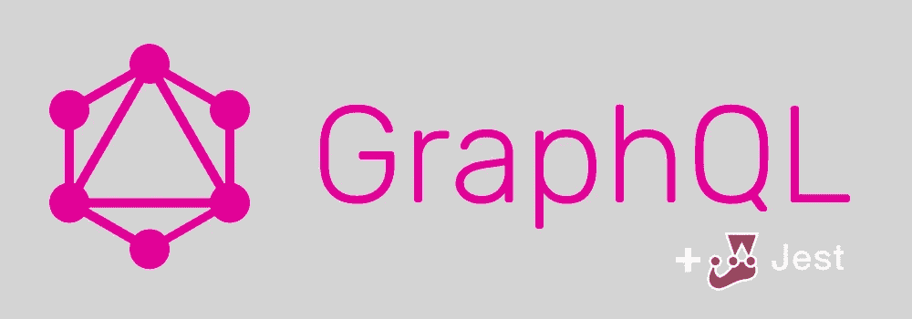
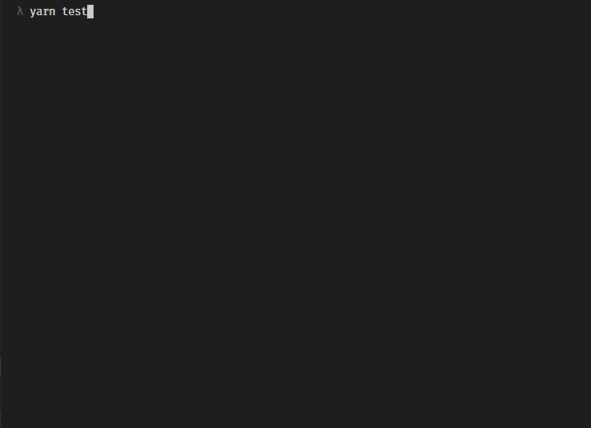
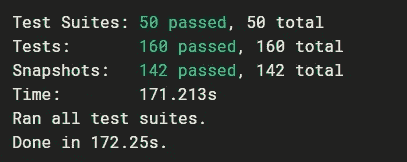
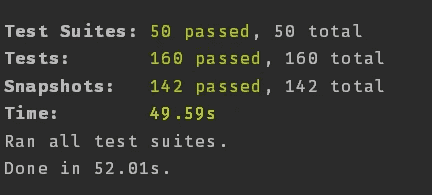

# 用 Jest 和 MongoDB 并行测试 GraphQL 服务器

> 原文：<https://itnext.io/parallel-testing-a-graphql-server-with-jest-44e206f3e7d2?source=collection_archive---------1----------------------->



> 这个故事被移到:[https://jonathancardoso . com/en/blog/parallel-testing-a-graphql-server-with-jest/](https://jonathancardoso.com/en/blog/parallel-testing-a-graphql-server-with-jest/)

这是西贝利厄斯·塞拉菲尼写的一篇精彩文章的后续:

 [## 使用 Jest 测试 GraphQL 服务器

### 我创建了这个样板文件，以便于使用 DataLoader 启动一个新的 GraphQL 项目…

medium.com](https://medium.com/entria/testing-a-graphql-server-using-jest-4e00d0e4980e) 

之前在 [Entria](https://github.com/entria) 这里，我们使用`--runInBand`标志运行我们的测试，这使得 Jest 连续工作，一个接一个地运行测试。

这是必要的，因为我们正在创建一个物理临时数据库，供所有的测试使用，因此，我们不能让两个测试同时运行，因为这会在不同的测试之间产生数据不一致。所以这个想法基本上是在每次测试之前连接到数据库，填充数据库并运行必要的测试，然后删除数据库，这样它就可以在下一次测试中重新创建。重复这一步骤，计算我们的测试次数。

我们通过 [@nodkz](https://twitter.com/nodkz) 的出色的库 mongodb-memory-server 解决了这个问题

[](https://github.com/nodkz/mongodb-memory-server) [## nodkz/MongoDB-内存-服务器

### mongodb-memory-server -在内存中运行 mongod 以进行快速测试。如果您并行运行测试，这个库有助于…

github.com](https://github.com/nodkz/mongodb-memory-server) 

为了使用它，我们创建了自己的 jest 测试环境，它只是一个文件:

并配置 jest 来使用它，通过设置`[testEnvironment](https://facebook.github.io/jest/docs/en/configuration.html#testenvironment-string)`设置:

```
//...
  "jest": { "testEnvironment": "<rootDir>/test/environment/mongodb",
    "resetModules": true, //...
```

注意这里的`resetModules`设置，如果你使用 Mongoose 的话，这也很重要，否则它会试图重用之前运行的测试中的相同连接。这是因为我们使用 mongose 中的默认连接来设置我们的模型，该连接直接存储在导出的 mongose 对象上。

就是这样，你可以在我们在 Entria 创建的样板文件中看到它，这里是 PR 添加它:[https://github . com/Entria/graph QL-data loader-boilerplate/pull/80](https://github.com/entria/graphql-dataloader-boilerplate/pull/80)



以前


在...之后

我们最大的项目之一:



以前



在...之后