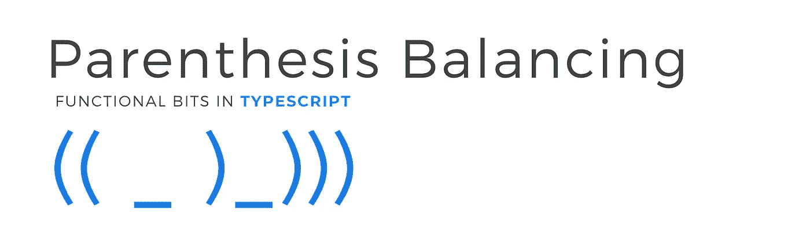

# 在类型脚本中使用幺半群平衡括号

> 原文：<https://itnext.io/parenthesis-balancing-using-monoids-in-typescript-56e5c994e497?source=collection_archive---------1----------------------->

**来源**:[https://code sandbox . io/s/括号-平衡-使用 monoids-8ktvs](https://codesandbox.io/s/parenthesis-balancing-usingmonoids-8ktvs)

括号平衡问题是一个经典问题，它说:

> **给定一个表达式字符串 exp，写一个程序检查 exp 中“("，")的对和顺序是否正确。**

所以这个`(()()()())`是平衡的，但是这个`()))`不是

在本文中，我们将使用 Typescript 和上一篇文章中的幺半群以函数的方式解决这个问题。

 [## 打字稿中的幺半群

### "或者，范畴理论的基本概念是幺半群的概念. "

medium.com](https://medium.com/@dimpapadim3/monoids-in-typescript-59a9c1510993) 

我们将定义一个简单的 balance 类型，它将保存左端和右端值的数量。

这惊人地形成了幺半群。因为我们可以连接两个 balance 对象并获得一个新的 Balance。

希望这能让这个想法的其余部分显而易见。

1.  我们将把字符串分割成一个字符数组
2.  然后，我们将转换平衡中的每个字符(解析)
3.  然后我们用平衡幺半群来简化数组。

简单的解析函数应该是这样的:

所以最后我们可以这样写计算:

在这里运行完整的[脚本](https://codesandbox.io/s/parenthesis-balancing-usingmonoids-8ktvs)