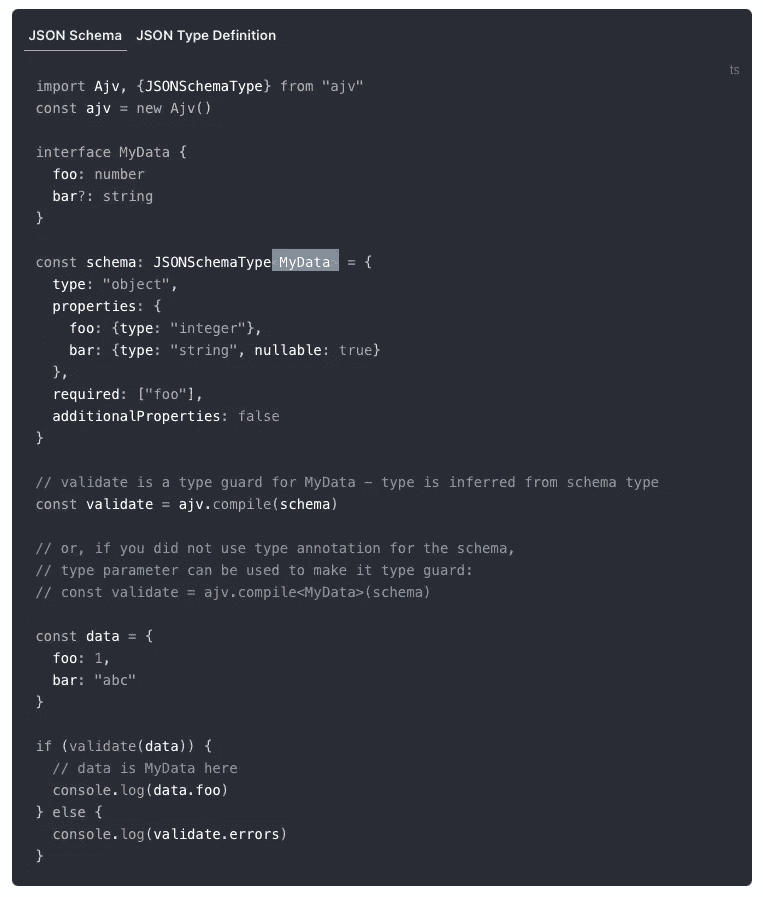

# 解析而不是验证 TypeScript 中的传入数据。

> 原文：<https://itnext.io/parse-dont-validate-incoming-data-in-typescript-d6d5bfb092c8?source=collection_archive---------2----------------------->

## 如何使用 io-ts、Runtypes 和 Zod 等库来安全地解析应用程序类型中的所有传入和传出数据。

我们离链路层有点远，但最终这是关于我们如何处理我们从互联网上读取和写入的数据。

每个人都知道验证用户输入是所有 web 编程的基础。事实上，所有进入(也许还有离开)你的软件的数据都应该被验证。那么这种对解析它的嘲弄是什么呢？这是什么[解析，不验证](https://lexi-lambda.github.io/blog/2019/11/05/parse-don-t-validate/)(你可能想以后再看)的胡言乱语？

# 让我们从一个验证示例开始。

让我们抓住一个流行的 JavaScript 验证库，比如[是的](https://github.com/jquense/yup)。请注意，我们也可以使用其他流行的库，如 [joi](https://github.com/sideway/joi) 或 JSON 验证器，如 [ajv](https://github.com/ajv-validator/ajv/) 来代替，我们要表达的观点仍然保持不变。*(编辑:由于一些反馈，最后有一个关于 ajv 的附录部分)*

用[对](https://github.com/jquense/yup)进行数据验证。

上面的代码很好地验证了`data`，并确保根据我们的`schema`它是有效的。我们有很好的机会创建精确的模式，并且对定制验证逻辑有很好的支持。它也很容易维护，易于重用，扩展等等。那么问题出在哪里？

在第 24–27 行中，我们可以轻松地处理通过/失败的情况，如果数据有效，则继续我们的业务逻辑(如果无效，则可能返回 400 错误或类似的错误)。然而，我们的`data`仍然没有*型*。还是`any/unkown`。当然，我们可以对它进行类型转换，但这带来了一个问题:我们现在必须手动地分别维护一个`schema` **和**一个`type`，而且没有什么能真正确保它们匹配。

谁来确保“用户模式”和“用户类型”保持同步？它们代表的是同一个东西吗？

如果有某种方法让`schema`和`type`总是匹配的话，那么我们就可以像这样声明“验证器”:
`function parseUserData(data: any): UserType | Error`。

注意，这样的“验证器”实际上是**将数据解析**成用户类型(这可能会失败，因此会出现错误！)而不仅仅是验证一些东西。所以一般来说解析实际上只是`function <T>parse(x: any, schema): T | Error`。

你可能也注意到了，在上面的例子中，我们没有给`schema`任何类型……我们稍后会回到这个话题。然而，首先让我们看看我们如何首先转向解析。

# 那么“解析”到底是什么呢？

在我们继续之前，让我们快速澄清什么是解析。

> **>解析**、**句法分析**或**句法分析**是对[符号](https://en.wikipedia.org/wiki/Symbol_(formal))的一个[字符串](https://en.wikipedia.org/wiki/String_(computer_science))进行分析的过程，可以是[自然语言](https://en.wikipedia.org/wiki/Natural_language)、[计算机语言](https://en.wikipedia.org/wiki/Computer_languages)或[数据结构](https://en.wikipedia.org/wiki/Data_structure)，符合一个[形式语法](https://en.wikipedia.org/wiki/Formal_grammar)的规则。
> 
> *[*https://en.wikipedia.org/wiki/Parsing*](https://en.wikipedia.org/wiki/Parsing)*

**这里的关键部分是“*分析*的过程”和“*符合一个* [ *事物* ]的规则”。 *Thingy* 是我们的 schema &类型，在这种情况下可以认为构成了我们的*形式语法*(如果你不知道那是什么意思，不用担心)。*分析*的过程是我们的代码在试图使数据符合模式&类型时所做的工作。我们之所以说“模式&类型”是因为我们希望它们在某种程度上是同一个东西，而不是两个可能同步也可能不同步的独立的东西。**

**在我们的例子中，我们将解析 JavaScript 或 JSON 对象，它们的具体结构是未知的。解析字符串或二进制数据是另一回事。由于许多不同的数据格式可以很容易地转换成 JSON/JavaScript 对象，这在 web 编程中是一个很常见的问题。**

# **解析，而不是验证，很难**

**让我们通过使用前面例子中的`yup`以及一些好的类型脚本特性:类型别名和类型保护，将一些未知数据解析到`UserType`。这仍然是一种有点手动和冗长的方式来拉取*“解析，不验证”**方法，但它已经修复了我们原始解决方案中的一些问题:1)不需要类型转换，或者 2)单独维护一个`type` + `schema`。***

***这里发生了什么？***

*   *****业务逻辑现在可以将任何数据解析到** `**UserType**` **。只要记得检查是否有错误就行了。*****
*   *****我们使用了比** `**string**` **或** `**number**` *…更精确的类型。由于类型别名的工作方式，我们的电子邮件类型仍然只是一个字符串，即使我们的类型保护更好。我们稍后再来讨论这个问题。****
*   *****容易出错、危险、类型检查不好的代码仅限于类型守卫。让我们好好测试它们，为特定类型编写解析器可以轻而易举地完成:)*****
*   ***TS 编译器确保我们的解析器实际工作。在类型检查器的良好支持下，我们可以安全地编写我们的解析器函数。***
*   ***编写解析器和类型守卫仍然需要大量的工作。它们看起来也很老套，肯定存在一些带有预建类型保护和工具的库来构建解析器吧？***

# ***像你看到了光一样解析***

***是时候引入一种不同的数据验证库了，它是专门为 TypeScript 设计的，并且使用了我们在这里介绍的思想。 [Runtypes](https://github.com/pelotom/runtypes) 、 [Zod](https://github.com/colinhacks/zod) 以及最后但并非最不重要的 [io-ts](https://github.com/gcanti/io-ts) ，都是类似的“运行时类型验证器”，可以将你的数据解析成特定的类型(或者失败)。有人称之为(解)序列化，有人称之为编码/解码，有人称之为解析或验证。抛开术语不谈，他们做的事情本质上是一样的。我们来看第一个，runtypes。***

***Runtypes 并不是最有趣的选择，但是它仍然是一个很好的介绍。***

*   ***解析变得非常简单和简洁。Runtypes 提供了一个为 JS 对象创建解析器的基本工具箱，甚至近乎优雅。***
*   *****类型==模式==解析器。** *无需分别维护三者。Runtypes 对象集类型、模式和解析器于一身！****
*   *****我们仍在使用某些类型的防护装置(带约束)。** *原始数据验证库仍然包含重要的&有用的验证逻辑，我们可以在这里使用，因为 Runtypes 附带了非常基本的类型。类型保护是支持 TypeScript 中“解析，不验证”样式库的语言特性。****
*   *****。check 抛出一个错误，所以不要忘记捕捉它！** *我更喜欢处理返回类型，例如* `*UserType | Error*` *而不是，但我们仍然非常接近这里已经很好了。Zod 和*[*Funtypes*](https://github.com/ForbesLindesay/funtypes)*(Runtypes fork)修复这个，不过。****

# ***结论***

****“解析，不验证”*的咒语就是将输入数据解析为特定的类型，或者在解析失败时以可控的方式失败。它是关于在你的代码中使用可信的、安全的和类型化的数据结构，并确保所有输入的数据都在你的程序的边缘被处理。不要将传入的数据深入到代码中，立即解析它，如果需要的话，快速失败。***

***解析比验证要好，因为解析迫使您显式地处理所有传入的数据。它为您提供了一种类型安全的工作方式，使您很难在应用程序和数据存储中传播恶意内容。然而，解析确实经常包括验证数据。***

> ***如果你对目前为止所学的内容感到满意，现在是一个很好的时机来点击 clap &跟随并尝试 Runtypes 或 Zod！然而，我认为你绝对应该看看下面的奖金部分！***

# ***额外收获:解析起来就像你看过矩阵一样***

***这不会比 Runtypes 或 Zod 更短或更容易，但事情变得更加健壮和类型安全。我们还需要更加小心副作用，因为`io-ts`(它的表亲`fp-ts`)不会让我们得逞。***

****强制免责声明:有些人会批评* `*io-ts*` *因为它带你下兔子洞到* `*fp-ts*` *。的确，对于许多团队来说，Runtypes 或 Zod 就足够了。然而，我们来这里是为了更深入地探索。****

***我们进入了兔子洞:标记类型，IO 解码，…和折叠任一单子！***

***我们得到了 Runtypes 的所有优点，但是还有一些额外的安全性:***

*   *****真正独特、具体且可安全重复使用的类型。** *Email 是一个实际的 Email，不是随便什么字符串。它仍然类似于前面的类型别名+类型保护组合，但是这次有更严格的安全保证。****
*   ***UserType 有一些很好的工具来接受各种不同的日期显示方式，但是没有默认设置。 *提供当前时间默认值实际上会使编解码器变得不纯(您可能需要在测试中模仿* `*Date*` *)。纯编解码器对于可测试性和可预测性是有意义的。如果你感兴趣，这就是为什么* [*IO 单子存在*](https://dev.to/gcanti/getting-started-with-fp-ts-io-36p6) *。或者您可以在解码后在逻辑中使用默认值。****
*   *****解析(解码)返回一个必须适当处理的结果。** *不然是不会编译的！抛出错误是不安全的，应该返回值。结果实际上是* `*Either<Left, Right>*` *单子，它有一堆有用的功能和属性…但像往常一样，也有一些学习曲线。****

***虽然`io-ts`可以提供更多的安全保证，并迫使开发人员朝着功能纯净的方向努力，但它也带来了额外的负担`fp-ts`，并需要学习 M-word 的意思。***

> ***在不久的将来，我会写更多关于 io-ts、fp-ts 和单子的内容。= >点击拍手按钮并跟随按钮继续收听:)***

***发现错误？有问题吗？想打个招呼吗？看看这些:***

*   ***[https://www . Reddit . com/r/typescript/comments/pig 0 gr/parse _ dont _ validate _ incoming _ data _ in _ typescript/](https://www.reddit.com/r/typescript/comments/pig0gr/parse_dont_validate_incoming_data_in_typescript/?utm_source=share&utm_medium=web2x&context=3)***
*   ***[https://news.ycombinator.com/item?id=28425435](https://news.ycombinator.com/item?id=28425435)***

# ***附录:带打字稿的 ajv***

***ajv 库实际上对 TypeScript 有相当酷的支持，编译器可以帮助你保持类型和 JSON 模式同步！他们自己的例子演示了这一点，如果提供的`JSONSchemaType` 定义与`MyData`不匹配，那么您将得到编译错误:***

******

***ajv 有很好的类型脚本支持，编译器可以判断出你的类型和模式是否匹配。***