# 通过用巴别塔解析 JSX，学习可视化 React 组件

> 原文：<https://itnext.io/parse-react-components-with-babel-and-visualize-them-45062046cb72?source=collection_archive---------4----------------------->

大型 JavaScript 应用程序中存在大数据结构或组件是很自然的。有时，这些数据结构或组件是应用程序的核心，但对于新开发人员或从事该项目的非技术人员来说，理解起来确实很困难。在这些情况下，有可能将数据结构或组件本身可视化，以使数据结构和组件更易于访问。在大多数情况下，手工做一次就足够了，但是如果您有变化的组件或数据结构，那么自动化将是一件很棒的事情。这个自动化步骤将在这篇博客文章中解释。我们要做的如下:

*   学习解析编程语言
*   使用 Babel 掌握 JavaScript 解析的诀窍
*   创建反应组件的抽象语法树(AST)
*   将这个抽象语法树(AST)简化为更好的格式
*   可视化抽象语法树的改进格式

## 编程语言的结构

每种编程语言都是逻辑运算的构造。最后，每种语言都以某种方式被编译成某种计算机或运行系统能够理解的代码。使语言能够被转换需要特定的格式。这就是抽象语法树发挥作用的地方。在这种意义上，树只是一个具有多个子节点的根节点，子节点也可以有子节点。重要的是只有一个根节点。抽象语法树中的每个节点都定义了源代码的某种结构。例如，在 HTML 中，带有文本的 a 标签应该是两个节点。第一个节点是类型为`a`的 HTML 标签，它会有一个子节点，这个子节点可能是一个文本节点，里面的值为`Hello World`。在这种情况下，根节点是 HTML 节点。我需要在这里提到，HTML 本质上不是编程语言，但像其他语言一样是可解析的。

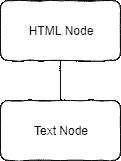

简单 HTML 树的结构

为了理解稍微复杂一点的例子，让我们看看下面的 HTML 结构结构:

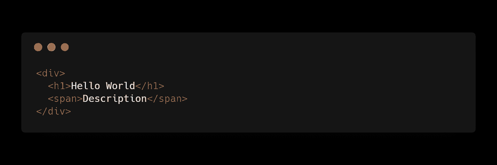

它是一个简单的`div`元素，带有一个标题和一个内联文本元素。该树的结构如下图所示。

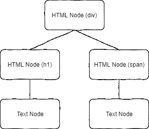

更复杂的 HTML 结构的树

如你所见，我们有一个根节点，它基本上是`div`元素，包含子节点，这些子节点也是 HTML 节点，但也只包含一个子节点，即文本。这些可视化是我想要实现的，用来显示 React 组件，因为它们有相似的结构。为此，我们需要能够解析负责它的 JavaScript。

## 使用 Babel 掌握 JavaScript 解析的诀窍

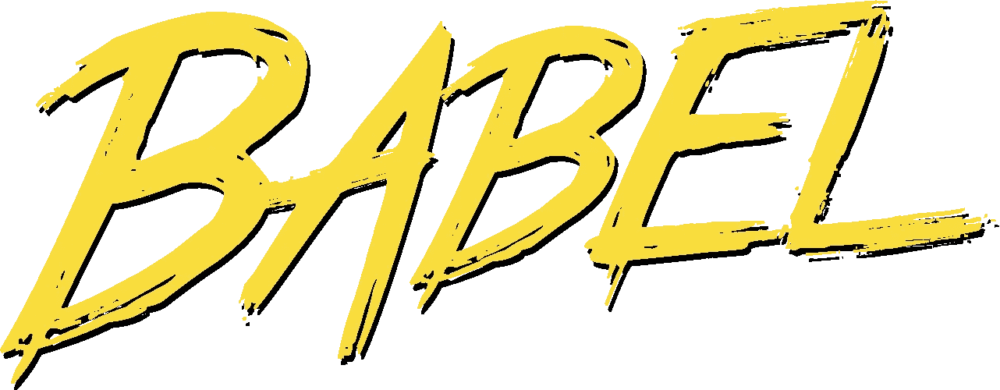

Babel 是一个 JavaScript 编译器，提供了很多功能。通常情况下，它会将 ES6 和更新的语法编译成旧版本，这样 JavaScript 就可以在任何浏览器上运行，但开发者可以编写现代语法。这对开发人员来说非常有用，因为他们不需要编写与 Internet Explorer 兼容的代码。

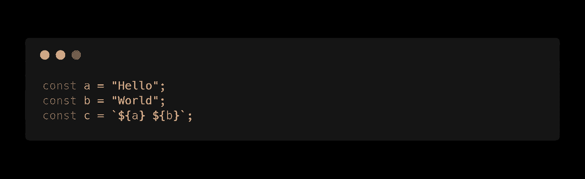

ES6 代码

在上图中，你可以看到一些符合 ES6 的代码，它们可以在大多数现代浏览器上运行，但试图在 Internet Explorer 中运行这些代码会失败，因为它不支持这种现代语法，如`const` [ [MDN](https://developer.mozilla.org/en-US/docs/Web/JavaScript/Reference/Statements/const) 或模板文字[ [MDN](https://developer.mozilla.org/en-US/docs/Web/JavaScript/Reference/Template_literals) ]。但是因为这些新特性可以以某种方式重写，所以 Babel 能够将这些源代码编译成一个版本的源代码，这个版本的源代码甚至可以在 Internet Explorer 这样的旧浏览器中运行。你可以在下面看到编译好的代码，也可以在 Babel 网站上试用。他们提供了一个你可以四处游玩的 REPL:[https://babeljs.io/en/repl](https://babeljs.io/en/repl)

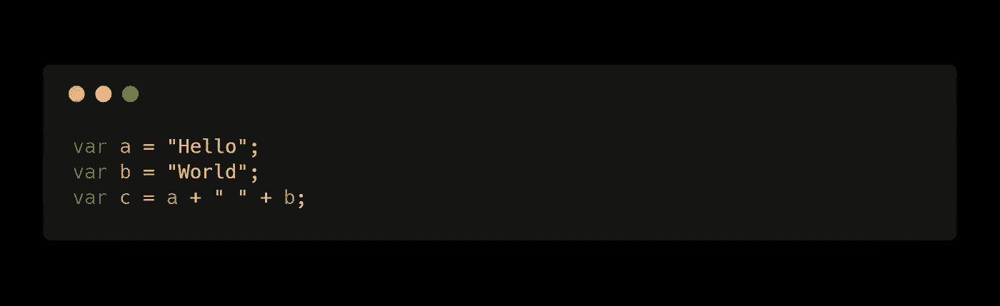

用巴别塔编译代码

巴别塔看起来已经很棒了，但是它是怎么做到这样的呢？

Babel 有很多实用程序，但是第一个使用的实用程序是 Babel parser。它可以从 [npm](https://www.npmjs.com/package/@babel/parser) 单独下载，你可以在这里找到关于这个包的文档:[https://babeljs.io/docs/en/babel-parser](https://babeljs.io/docs/en/babel-parser)。基本上，该功能可以描述为引用自文档:

> 巴别塔解析器根据巴别塔 AST 格式生成 AST。它基于 ESTree 规范[…]

该软件包提供了两个功能，但我们将只关注`parse`功能。这是一个带有两个参数的单一函数。第一个参数是要解析的代码，第二个可选参数是给函数的选项。这个函数的输出将是一个抽象的语法树。为了了解这个抽象语法树的样子，我们将使用工具 AST explorer。这是一个 web 应用程序，你可以在其中粘贴一些代码，它会给你一个抽象的语法树，以可视化这些代码是如何被解析的。你可以在这里找到申请:[https://astexplorer.net/](https://astexplorer.net/)

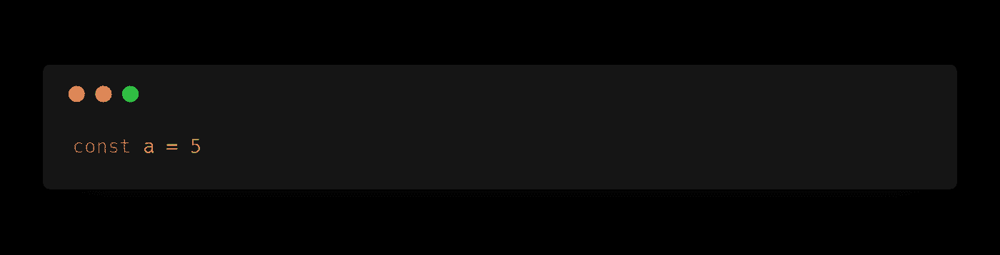

这是我们将粘贴到 AST explorer 中的源代码。务必将解析器从`acord`设置为`babylon`。Babylon 是之前在 Babel 中使用的解析器，但是它给你的输出和`@babel/parser`差不多。将源代码粘贴到内部会得到类似的输出，如下面的 JSON:

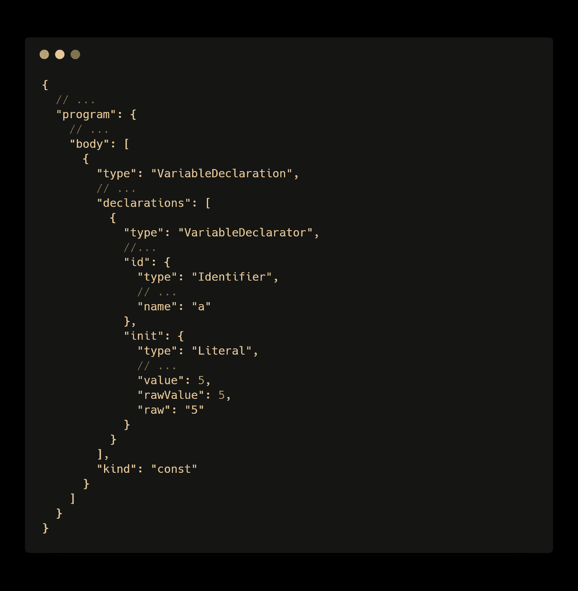

您可以看到这在某种程度上代表了一棵树，因为只有一个根节点`program`。然后你会越来越多地嵌套到声明和其他元素中。随着程序和源代码越来越大，这个树的规模将会急剧增长。所以 Babel 现在做的，是检查这些类型的声明，等等，并分析树结构，看看它是否能转换一些节点。在这个例子中，要将`const`转换为`var`，只需检查整个树中类型为`VariableDeclaration`的节点，并检查`kind`属性是否为`const`就很容易了。如果是这种情况，可以将树重写为`kind` `var`。有了这个结构，我们可以再次从树中创建 JavaScript。这也在一个巴别塔包中给出，但我不会在这篇博客文章中演示。只要理解这是可能的就够了，因为这对我们来说并不重要。

这是每个编译器工作的基本结构。一种语言可以被解析成抽象的语法树，然后可以被转换。这是一个很深的计算机科学主题，主要在大学课程中涉及，但理解起来真的很好，因为它也可以用于各种工作场景。

## 创建反应组件的抽象语法树(AST)

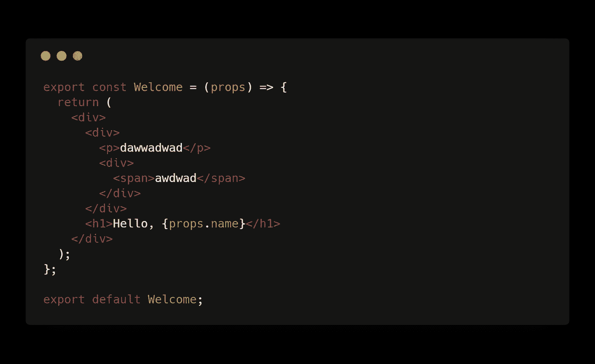

有了我们收集的知识，我们就可以开始解析 React 组件了。在左侧，您可以看到一个简单的功能性 React 组件。由于 JSX 是“符合 JavaScript”的语法，我们可以直接开始尝试解析它。为此，让我们创建一个新的 Node.js 项目，并将依赖项`@babel/parser`添加到该项目中。

完成这些之后，我们可以开始编写代码来解析 React 组件。应该比较容易。我们需要从 Node.js 导入解析器和文件读取实用程序，之后，我们将 React 组件的内容读入一个变量，然后将这个变量作为解析功能的参数。我们从函数中得到的结果应该是组件的抽象语法树。源代码应该如下所示:

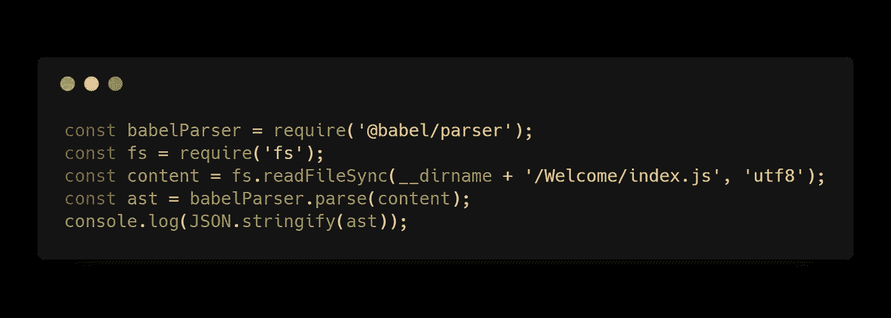

执行这段代码会导致一个错误🤷`SyntaxError: Unexpected token (3:4)`。这是因为 Babel 不能解析 JSX，默认情况下也不支持模块。为此，我们需要向`babelParser`的`parse`函数传递一个配置对象。之后的源代码应该如下图所示:

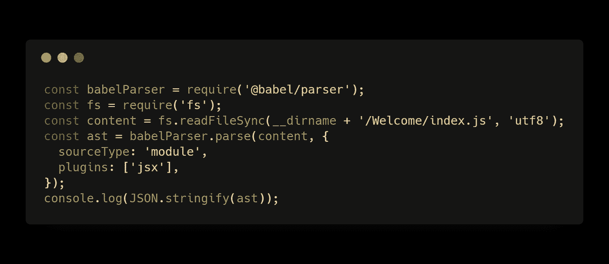

在这之后，我们的控制台会发出一个很长的 JSON。这个 JSON 表示 React 组件的抽象语法树。它非常长，但是包含了对抽象语法树进行大量操作的所有细节。你可以在这个[要点](https://gist.github.com/igeligel/212b7fb90b5b9c13ed287d129b6f2fb8)中找到完整的 JSON。

这非常简单，并且真正展示了巴别塔的建筑有多伟大。在我看来，这个工具本身做了很多事情，并且还处理了编程世界中最复杂的事情之一，但是它将功能分解成小的可重用模块，所以你实际上可以理解一个简单的模块来使用它。非常感谢伟大的巴别塔团队:)

## 将这个抽象语法树(AST)简化为更好的格式

在这个[要点](https://gist.github.com/igeligel/212b7fb90b5b9c13ed287d129b6f2fb8)中显示的当前抽象语法树包含 600 行 JSON，这是很难处理的。在这种情况下，我们的任务是可视化 JSX 组件的 HTML 结构。因此，为了了解这些信息在哪里，我们需要以某种方式观察抽象语法树。我以某种方式减少了树中的一个元素，为我们提供了重要的信息，如下图所示。

您可以看到我们有一个类型为`JSXElement`的顶级节点。在里面我们有像`openingElement`和`closingElement`这样的属性，还有`children`。在这种情况下，我们应该关注 JSXElement 节点并寻找它们的属性`openingElement.name.name`，因为这是我们正在寻找的信息。如果我们在整个 JSON 中扫描类型为`JSXElement`的节点，我们会发现六个这种类型的节点，其中`openingElement.name.name`如下:

*   `div`
*   `div`
*   `p`
*   `div`
*   `span`
*   `h1`

这种结构可以解释，因为巴别塔是递归遍历树。它将从一个节点转到下一个可能的子节点，然后尝试转到下一个节点，直到不再可能。每一个被访问的节点都将被标记，如果当前指针位于不能找到未被访问的节点的点上，它将返回到它的父节点。那么该算法将尝试去更多未标记的子节点。只要有未访问的节点，就会这样做。在我们的例子中，它将深入 JSX 组件，首先查看内部的`span`和`p`标记，然后返回到根`div`，然后访问另一个`h1`标记。

我们最终想要的，会是这样一个表示:

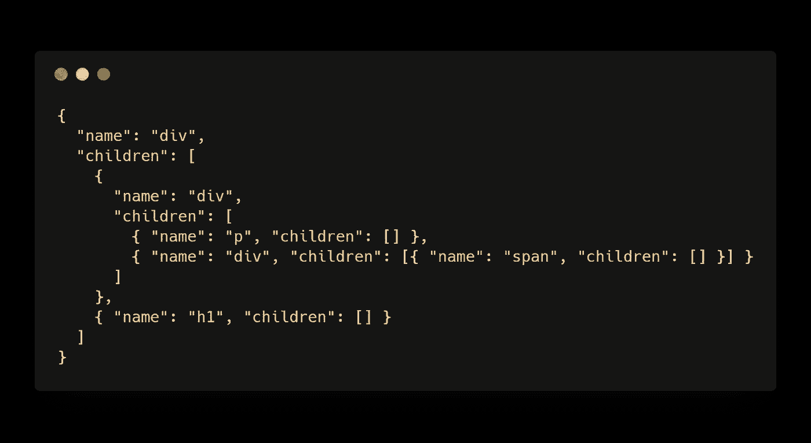

这是一个完全简化的抽象语法树，只有 JSX 组件中 HTML 元素的结构。为了达到这个目的，我们需要简化巴别塔解析器给出的原始抽象语法树。您可以在我创建的存储库的这个文件中找到完整的代码:[https://github . com/igeli gel/jsx-to-simple-ast/blob/master/src/parser . js](https://github.com/igeligel/jsx-to-simple-ast/blob/master/src/parser.js)

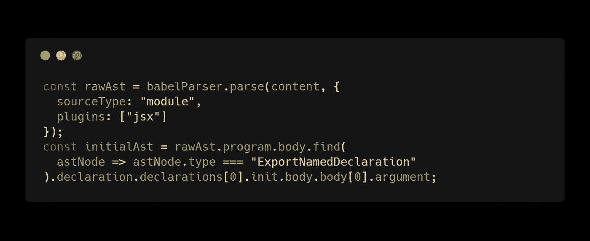

我们的第一步是找到文件的主体。我称之为`initialAst`,因为这是抽象语法树的第一个简化版本。我们首先扫描一个指定的出口声明，然后遍历正确的声明来找到声明的主体。调用它时使用的参数实际上是 export 语句的值。这是我们在这里可以得到的“最原始”的树节点。从现在开始，我们有一个带有几个孩子的根节点，并以某种方式重复，这样我们就可以轻松地遍历树。

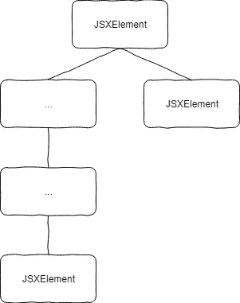

遍历树通常是一个递归函数。这是因为我们在这里逐个节点地工作，只扫描节点是否属于某种类型，然后检查它是否有子节点。所以第一步是遍历每个节点，检查类型是否是`JSXElement`。如果没有，我们只是或多或少地跳过这个节点，不做任何事情。这是因为我们不能直接删除节点，因为这样我们就不再有结构了，因为父子关系会丢失。想象图像中文本旁边的一个`...`节点将被删除。对子节点的引用也将丢失，我们将不再知道底部的`JSXElement`节点实际上引用了根节点。相反，我们所做的是给当前节点一个父节点的子节点属性的引用，这样我们就可以在那里分配适当的子节点。如果我们发现一个类型为`JSXElement`的新节点，我们会给这个节点分配一个新的子节点数组，并将这些子节点再次传递给真正的 AST 子节点。所以基本上我们对每个节点都这样做，这就是为什么递归函数是我们现在能做的最好的。您可以在下面的代码片段中看到该功能:

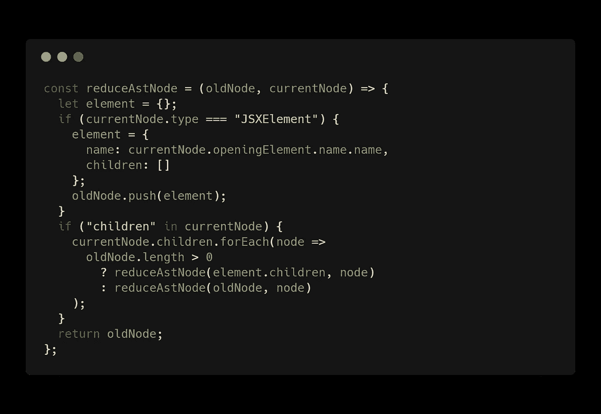

`oldNode`在这个例子中只是一个被传递给函数的新数组。因此，我们实际上在这里创建了一个全新的树，只是传递新树的节点，以不破坏旧树的顺序，旧树是当前节点。

现在将初始的抽象语法树与该功能相结合，将得到以下简化的抽象语法树:

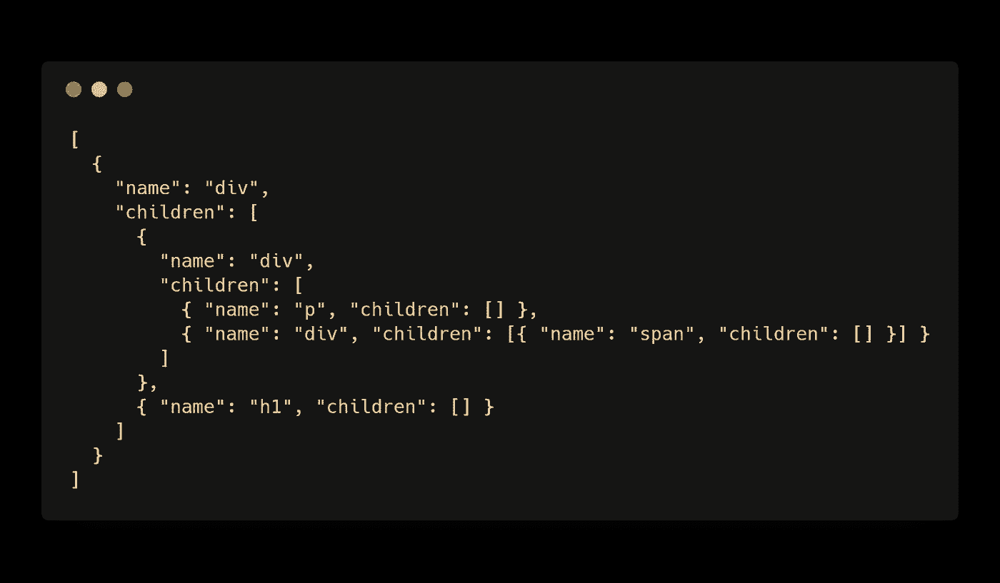

这正是我们想要实现的目标。现在我们有了一个简化的 HTML 结构的实际形式，它被表示为一个简单的抽象语法树。现在我们可以使用这种树形结构。可能性有:

*   生成 HTML 代码
*   生成图表
*   分析嵌套和其他复杂性趋势

这里的可能性是无限的。如何处理它取决于你的任务。

## 可视化抽象语法树的改进格式

视觉化是我想通过这个项目实现的最后一步。经过一些研究，我还没有找到这个问题的即插即用解决方案，但我在 codepen 上找到了一个很好的 D3.js 树形布局解决方案的例子[zhulinpiyu](https://codepen.io/zhulinpinyu/)，并将其移植到 codesandbox 中。

要改变树的结构，我们需要转到`src`文件夹的`index.js`文件。在那里，我们可以找到 Node.js 程序生成的树的确切配置。如果您更改了 Node.js 项目中的 React 组件结构，并让该项目再次运行，您将看到更改后的输出。只需将其粘贴到 codesandbox 中，并让您的树得到渲染。

用 JavaScript 实现可视化还有很多可能性。如果您对这些图表感兴趣，我可以明确地推荐以下工具和库:

*   [code sandbox . io](https://codesandbox.io)——一个非常棒的 JavaScript 应用在线编辑器
*   [d3.js](https://d3js.org/) —用于创建图表的库
*   [jsx-to-simple-ast](https://github.com/igeligel/jsx-to-simple-ast) —树生成器的存储库

> 感谢你阅读这篇文章。你摇滚*🤘*
> 
> 也可以查看我的其他博客文章，比如 JavaScript 中的[函数参数](https://medium.com/@kevin_peters/function-parameters-in-javascript-clean-code-4caac109159b)，[学习如何用真实的例子重构 Vue.js 单个文件组件](https://medium.com/@kevin_peters/learn-how-to-refactor-vue-js-single-file-components-on-a-real-world-example-501b3952ae49)或者 Python 的自动格式化器[。](https://medium.com/3yourmind/auto-formatters-for-python-8925065f9505)
> 
> 如果你有任何反馈或者想给这篇文章添加一些东西，请在这里评论。您也可以在 [twitter](https://twitter.com/kevinpeters_) 上关注我，或者访问我的[个人网站](https://www.kevinpeters.net/)来了解我的博客文章和许多其他内容。