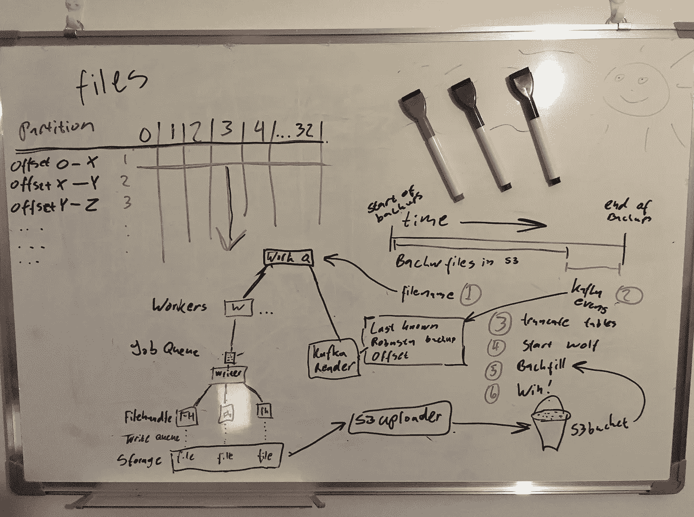
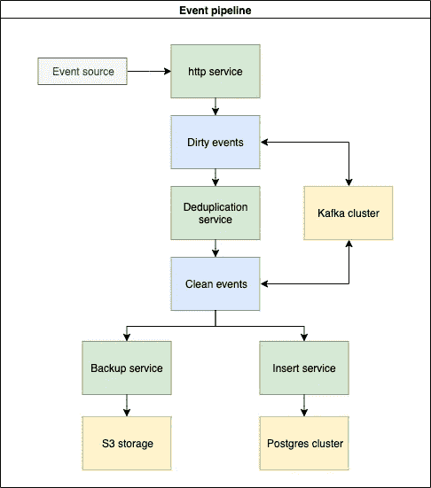
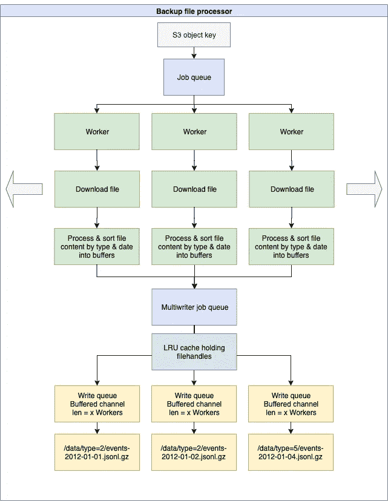
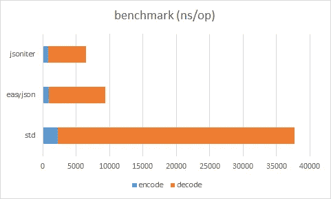
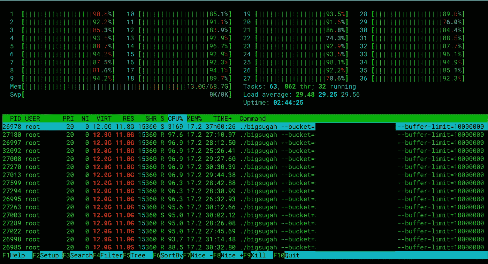

# 用 Go 解析 180 亿个 JSON 行

> 原文：<https://itnext.io/parsing-18-billion-lines-json-with-go-738be6ee5ed2?source=collection_archive---------0----------------------->

在我的雇主 [Tjek](https://shopgun.com) 处，我们最近决定重建我们的事件管道，并将其转移到[谷歌 BigQuery](https://cloud.google.com/bigquery/) 以降低堆栈的复杂性，并移除一些不再可维护的服务。

BigQuery 提供了一系列很好的工具来查询和可视化我们的数据，这将使我们的许多内部团队能够直接处理数据并与客户共享，而不必向工程部门提出请求。

替代旧 http 服务的新服务很容易编写，但是随之而来的问题是将历史数据转移到 BigQuery 中。

为了迁移旧数据，我们必须将过去 10 年积累的整个数据集回填到 BigQuery 中，这就是如何完成的故事。



# 闪回

这是在一个早先的帖子中描述的平台上完成的

[](/kubernetes-in-production-shopgun-2c280f0c0923) [## 生产中的 kubernetes @ shop gun

### —建造、装箱、运输

itnext.io](/kubernetes-in-production-shopgun-2c280f0c0923) 

这里还描述了上述平台的构建管道

[](/building-a-kubernetes-ci-cd-pipeline-on-aws-with-codepipeline-codebuild-shopgun-43ccf76277b5) [## 使用 CodePipeline & CodeBuild @ Shopgun 在 AWS 上构建 Kubernetes CI/CD 管道

### 手动构建容器并部署到集群可能非常繁琐。

itnext.io](/building-a-kubernetes-ci-cd-pipeline-on-aws-with-codepipeline-codebuild-shopgun-43ccf76277b5) 

# 流动状态

旧的事件管道本身就是一头野兽，它由用 [Erlang](https://www.erlang.org/) 编写的多个服务组成，并由一个 [Kafka 集群](https://kafka.apache.org/)Citus postgres 集群提供支持

*   一个 http 服务器，它将从我们的客户端接收事件，并将其发布到一个脏事件主题。
*   使用脏事件主题的重复数据消除服务在干净事件主题中发布新事件
*   一种备份服务，使用干净事件主题，并将它们存储在 [S3](https://aws.amazon.com/s3/) 中。
*   一种数据库服务，使用 clean events 主题并将它们插入到 Postgres 集群中。



这意味着我需要加载到 BigQuery 的事件要么在 S3，要么在卡夫卡，等待被写入备份

# 内在的敌人

我遇到的第一个障碍是 **BigQuery 不允许在您正在加载的 JSON 的字段名中使用标点符号**。

第二个问题是，它要求将要加载的数据已经根据目标表进行了**预分类**。

backups & Kafka 主题包含 11 种相互混合的不同事件类型。

> **这意味着我们在卡夫卡和 S3 中的每一行 JSON 都需要在加载到 BigQuery 之前进行转换…**


# 明天是昨天

还记得备份服务吗？它从 Kafka 主题中读取 X 个事件，保存它已经消耗的偏移量，然后 gzip 将其全部打包并发送到 S3。

当前设置是每个主题分区 100k 个事件，该主题有 32 个分区，这意味着在 clean Kafka 主题中可能有大约 300 万个事件等待备份。

为了从 Kafka 获取事件，我想我应该停止我们的备份服务，以便有一个稳定的偏移量来开始使用，并通过我刚才用于事件备份文件的同一个 JSON 解析器传递回数据

# **学习曲线**

下载一些 gzip 文件并对内容做一些事情听起来并不坏，所以我去了

我们当时有大约 37k 个文件，总计大约 800GB 的大约 10 年前的 gzipped JSON，这些文件都需要转换。

几年前，当我们搬到 Citus 时，以前的一位同事也做过类似的事情。当时使用的软件需要运行 50 份拷贝，几乎需要一整个星期才能完成。

我想在合理的时间内做到这一点，这样我就不必为结果等待几天，“Bash + AWS cli + jq”是不可能的。它需要快速且可扩展，以便一次处理多个文件

我们的备份文件是以卡夫卡为中心的，而不是围绕事件形式设计的。

Kafka 主题有 32 个分区，每个分区都有一个包含多达 11 种不同事件类型的文件，每个文件中的事件时间戳平均在 4-6 天之间。

> 000.00000000000000000000–00000000000000999999.jsonl.gz【000.00000000000001000000–00000000000001999999.jsonl.gz】T2
> 000.00000000000002000000–00000000000002999999.jsonl.gz
> 000.00000000000003000000–00000000000003999999.jsonl.gz
> 000.00000000000004000000–00000000000004999999.jsonl.gz
> …
> 031.00000000000566000000–00000000000566099999.jsonl.gz

我开始在 [Go](https://golang.org/) 中编写一个工具，运行下载备份文件并并行处理它们的工人，然后根据事件类型和备份文件来源将输出分类到不同的文件夹和文件中。

历史上，备份文件以 1M 的间隔写入，这意味着最初几年每个文件可能有数周的数据，并行打开 32 个文件试图将输出写入不同的文件被证明是太多了

IO 访问会激增，一切都会停止，因为在运行许多工作线程时，它会同时写入数千个文件


我发现我需要同时处理文件，同时将磁盘写入序列化到更少的更大的文件中，这在底层存储上应该更容易，让我可以更好地控制资源

我决定采用下面的文件格式(hive 启发的命名)。

/data/type = % d/event-YYYY-MM-DD . jsonl . gz

这将按每天和事件类型生成一个文件。

我创建了一个我称之为 [Multiwriter](https://github.com/roffe/multiwriter) 的 Go 包来帮助我做这件事。

你输入多写者文件名和一个 io。您希望持久存储到磁盘的阅读器。

然后，Multiwriter 使用 LRU 缓存来保存最新写入文件的文件句柄。它还使用信号量通道来防止同时进行超过 X 次写入。

我还改变了文件的输入顺序，不再从 S3 中读取按数字排序的文件，而是根据它们属于哪个分区将它们分类成片，并在分区间“水平地”消耗文件。

> 000.00000000000000000000–00000000000000999999.jsonl.gz
> 001.00000000000000000000–00000000000000999999.jsonl.gz
> 002.00000000000000000000–00000000000000999999.jsonl.gz
> …
> 031.00000000000000000000–00000000000000999999.jsonl.gz
> 然后在分区 0 上重新开始并增加偏移量
> 000.00000000000001000000–00000000000001999999.jsonl.gz
> 001.00000000000001000000–00000000000001999999.jsonl.gz
> 002.00000000000001000000–00000000000001999999.jsonl.gz
> …
> 031.00000000000001000000–00000000000001999999.jsonl.gz
> …

有了 32 个 worker，理论上我可以在 Kafka 流被写入时重放它，同时我也可以减少打开的文件，因为与“垂直”遍历整个文件列表相比，它将解析的文件包含基本相同的日期

偶数处理器中的内部数据流如下所示



# 有人来照看我

在解析器的第一次试运行期间，花了将近 6 个小时来解析所有的备份，记住 JSON 解码和编码是非常昂贵的，并且标准 JSON 包严重依赖于反射。

我已经看到了承诺比 stock 快得多的包，并决定尝试一下 json 迭代器，因为它声称替换率 100%。



它还有一个“最快”的设置，不对输出中的字段名进行排序，这样可以节省更多的 cpu 周期

# 荣誉日

在 AWS 的 36 核机器上运行备份解析器。



飞吧，小苍蝇

一旦所有文件都解析完毕，下一个问题就出现了。上传这些文件需要“很长时间”,因为将文件上传到 S3 的 CLI 客户端一次只能上传一个文件。

我在我的解析器中编写了一个函数，它将产生上传工人，并使用 [AWS SDK Go](https://github.com/Ticketmaster/aws-sdk-go) 一次上传 15 个文件，同时将传输时间减少到仅仅半小时。

从这里开始，只需要在 BigQuery 中创建传输作业，并观察它的运行和等待

总之， **18 315 948 132** 事件在大约 4 小时内被解析，重写&上传。

去掉上传的半个小时意味着该工具每分钟转换了大约 8720 万个事件


我希望你喜欢阅读我的 JSON 小冒险。如果您有任何问题，请随时评论！:)

Tjek 正在寻找另一位敬业的 DevOps 工程师。如果你热爱 [Cloud](https://aws.amazon.com/) 、 [Kubernetes](https://kubernetes.io/) 、Linux &、 [Docker](https://www.docker.com/) 并希望在弹性工作环境中工作，请点击此处[查看职位](https://tjek.breezy.hr/p/b27dedd16b4501-devops-engineer-with-a-passion-for-problem-solving)


# 笔记

我说的 JSON 行是指 [JSONL](http://jsonlines.org/) 。
也叫换行符分隔的 JSON (NDJSON)

示例:

```
{"name": "Gilbert", "wins": [["straight", "7♣"], ["one pair", "10♥"]]}
{"name": "Alexa", "wins": [["two pair", "4♠"], ["two pair", "9♠"]]}
{"name": "May", "wins": []}
{"name": "Deloise", "wins": [["three of a kind", "5♣"]]}
```