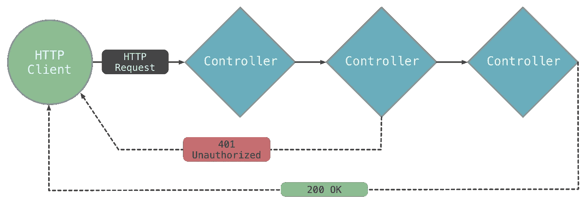
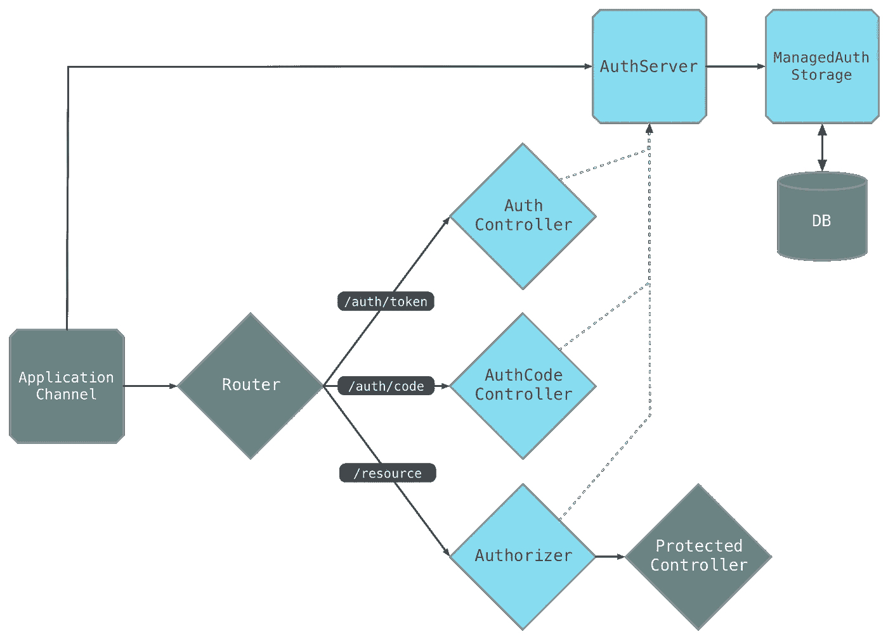

# 第 1 部分:使用 Aqueduct 构建 RESTful 应用程序的完整指南

> 原文：<https://itnext.io/part-1-a-complete-guide-for-building-restful-applications-using-aqueduct-668b07f62ad5?source=collection_archive---------2----------------------->


来源:[https://stable kernel . com/WP-content/uploads/2017/07/aqueduct-1500 x660 . png](https://stablekernel.com/wp-content/uploads/2017/07/aqueduct-1500x660.png)

本文是关于使用 Aqueduct 在 Dart 中构建 RESTful 应用程序的系列文章的第一篇。

如果你对渡槽及其核心概念不熟悉，下面给出对这些概念的简要介绍。如果你已经熟悉它们，请随意跳到下一部分(尽管快速刷新一下不会有什么坏处)。

# 什么是渡槽？

Aqueduct 是一个 HTTP web 服务器框架，用于构建用 Dart 编写的 REST 应用程序。REST 是表述性状态转移的缩写，允许使用 HTTP 协议进行客户端-服务器交互。每个 url 被称为 ***请求*** ，而发回的数据被称为 ***响应*** 。

RESTful API 是一个应用程序编程接口(API)，它使用 HTTP 请求来获取、上传、发布和删除数据。

# 核心概念

在我们继续实现之前，让我们快速浏览一下我们将用来构建 RESTful 应用程序的核心概念。

## **资源**

资源是应用程序通过其 HTTP API 公开的东西。例如，GitHub API 公开了组织、存储库、问题和拉请求资源；社交网络 API 有个人资料、帖子和用户关系。资源被组织成集合(例如，所有帖子)，该集合中的各个资源可以被唯一地标识(例如，单个帖子)。

## **路由**

一个应用程序为它管理的每个资源公开**和*路由*和**。路由是匹配请求路径的字符串。资源由 HTTP 请求的路径来标识。例如，URL `http://example.com/organizations`标识服务器`http://example.com`上的组织资源集合。路由`/organizations/:id`标识单个组织，并且将匹配路径`/organizations/1`、`/organizations/2`等等。

```
// Matches /organizations and /organizations/:id
route("/organizations/[:id]")...;

// Matches /organizations/:organizationId/posts 
// and /organizations/:organizationsId/posts/:postId
route("/organizations/:organizationsId/posts/[:postId]")...;

// Matches /organizations/:organizationsId/posts 
// and /organizations/:organizationsId/notes/:noteId
route("/organizations/:organizationsId/notes/[:noteId]")...;
```

## **控制器**

控制器是处理请求的对象。例如，控制器可能从数据库中获取行，并在响应正文中将它们发送给客户端。另一个控制器可能会验证请求的用户名和密码。*例如*，控制器可以返回一个带有 JSON 编码的组织列表的 200 OK 响应。控制器还可以检查请求，以确保其授权头中有正确的凭证。

有两种风格的控制器。一个*e***ndpoint 控制器** 和一个 ***中间件控制器*** 。

*   **端点控制器**

***端点控制器*** 对资源或资源集合执行操作，并且总是发送响应。端点控制器*通过返回资源状态或改变资源状态来满足*请求。您使用端点控制器编写大多数特定于应用程序的逻辑。

*   **中间件控制器**

一个 ***中间件控制器*** 对一个请求采取行动，但不负责完成该请求。中间件控制器可以做许多不同的事情，并且通常可以在许多渠道中重用。最常见的情况是，中间件控制器在请求到达端点控制器或发送请求响应之前验证请求，以防止该通道中的任何其他控制器处理请求。

> 一个通道必须正好有一个端点控制器。它前面可以有零个或多个中间件控制器。有关使用的详细信息，请参见[控制器](http://aqueduct.io/docs/http/controller/)和[资源控制器](http://aqueduct.io/docs/http/resource_controller/)上的指南。

```
class Authorizer extends Controller {
  @override
  Future<RequestOrResponse> handle(Request request) async {
    if (isValid(request)) {
      return request;
    }

    return Response.unauthorized();
  }
}
```

## 频道

控制器被链接在一起，形成一系列对请求采取的动作。这些链接在一起的控制器被称为一个 ***通道*** 。例如，通道可以验证请求的凭证，然后通过组合两个控制器来返回组织列表，这两个控制器执行这些操作。



## 申请渠道

***应用程序通道*** 是包含应用程序中所有控制器的对象。它指定一个控制器作为接收每个请求的第一控制器，该请求被称为其 ***入口点*** 。控制器被链接到入口点(直接地或过渡地)以形成整个应用程序通道。几乎在每个应用中，入口点都是路由器；该控制器将信道分成给定路由的子信道。

应用程序通道还负责初始化应用程序的服务、读取配置文件和其他与启动相关的任务。

> 详见[申请通道](http://aqueduct.io/docs/application/channel/)上的指南。

```
class AppChannel extends ApplicationChannel {
  @override
  Controller get entryPoint {
    final router = new Router();

    router
      .route("/users")
      .link(() => Authorizer())
      .link(() => UserController());

    return router;
  }
}
```

## 服务

一个 ***服务*** 是一个对象，它封装了复杂的任务或算法、外部通信或跨应用程序重用的任务。服务对象的主要用户是控制器。控制器通常需要从应用程序外部获取(或创建)信息。最常见的例子是数据库访问、另一个 REST API、连接的设备等。

一个 ***服务对象*** 封装了与外部系统协同工作所需的信息和行为，并通过将它们作为参数传递给控制器的构造函数来注入控制器。控制器保存对服务的引用，以便在处理请求时可以使用它。

> 有关注入服务的更多详细信息，请参见[应用程序通道](http://aqueduct.io/docs/application/channel/)上的指南。

```
class AppChannel extends ApplicationChannel {
  PostgreSQLConnection database;

  @override
  Future prepare() async {
    database = PostgreSQLConnection();
  }

  @override
  Controller get entryPoint {
    final router = new Router();

    router
      .route("/users")
      .link(() => new Authorizer())
      .link(() => new UserController(database));

    return router;
  }
}
```

## 孤立者

***隔离*** 是内存隔离的线程；在一个隔离上创建的对象不能被另一个隔离引用。当应用程序启动时，会产生一个或多个包含应用程序代码副本的隔离区。这种行为有效地在多个线程之间“负载平衡”了您的应用程序。

这种结构的一个好处是每个隔离都有自己的一组服务，比如数据库连接。这消除了对“数据库连接池”等技术的需要，因为整个应用程序被有效地“池化”。

## 粘合剂

请求可能包含需要在控制器代码中解析、验证和使用的头部、查询参数、主体和路径参数。 ***绑定*** 是添加到变量中的注释，自动执行这种解析和验证。当绑定值无法解析为预期类型或验证失败时，会发送适当的错误响应。

```
// Path Variable
@Bind.path(pathVariableName)// URL Query Parameter @Bind.query(queryParameterName)Header@Bind.header(headerName)// Request Body
@Bind.body()
```

## 查询和数据模型

手工编写数据库 ***查询*** 容易出错，并且没有利用静态分析工具。Aqueduct 的 ORM(对象关系映射)提供了易于编写和测试的静态类型查询。

应用程序的数据模型是通过创建 Dart 类来定义的。每个类都映射到一个数据库表，该类的每个属性都映射到该表中的一列。Aqueduct 的命令行工具可以生成数据库迁移文件，这些文件可以检测数据模型中的变化，这些变化可以应用于实时的版本化数据库。数据模型也可以表示为 JSON 对象，以便在应用程序之上构建工具。

> 有关更多详细信息，请参见关于[数据库](http://aqueduct.io/docs/db/)的指南。

```
// This is a table definition of an 'article'
class _Article {
  @Column(primaryKey: true)
  int id;

  String contents;

  @Column(indexed: true)
  DateTime publishedDate;
}
```

## 批准

OAuth 2.0 是一个标准化的授权框架。Aqueduct 包含一个 OAuth 2.0 服务器的符合规范的实现，可以直接集成到您的应用程序中。这种实现很容易定制——它可以在不同类型的数据库中存储授权工件，如令牌和客户端标识符，或者使用无状态授权机制，如 JWT。默认实现利用 Aqueduct ORM 在 PostgreSQL 中存储工件。



感谢您的阅读！欢迎在 LinkedIn [@zubairehman](https://www.linkedin.com/in/zubairehman/) 或在下面的回复中打招呼或分享你的想法！

# 下一篇文章

故事还没有结束，在下一篇文章中，我们将学习如何使用 aqueduct 配置和构建我们的第一个 API，敬请关注:)

这篇文章的其他部分:

*   第 1 部分:使用 Aqueduct 构建 RESTful 应用程序的完整指南(核心概念)
*   [第 2 部分:使用 Aqueduct 构建 RESTful 应用程序的完整指南(应用程序开发)](https://medium.com/@zubairehman.work/part-2-a-complete-guide-for-building-restful-applications-using-aqueduct-c58688ab8b8e)
*   第 3 部分:使用 Aqueduct 构建 RESTful 应用程序的完整指南(DB 配置，即将推出)

# 有用的资源

[http://aqueduct.io/docs/](http://aqueduct.io/docs/)

***这篇文章到此为止，如果你喜欢这篇文章，别忘了拍手👏尽可能多的表达你的支持，留下你的评论并与你的朋友分享。***