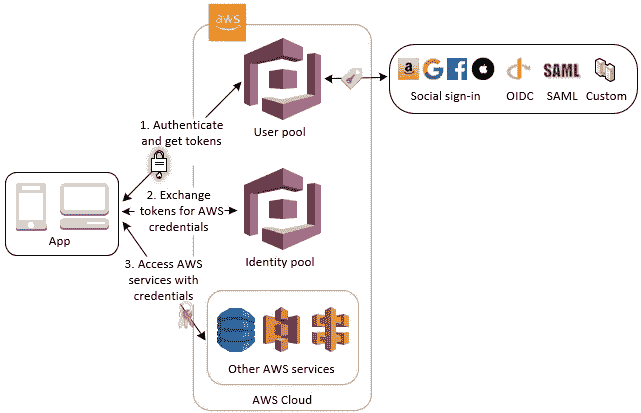
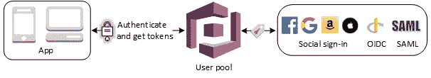
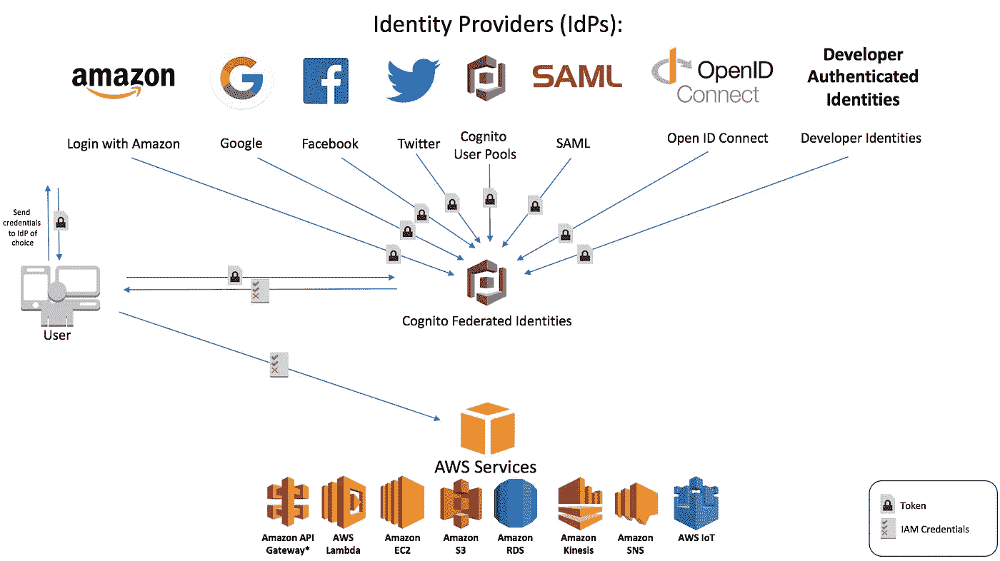

# 通过社交链接进行身份验证

> 原文：<https://itnext.io/part-1-authentication-with-social-linking-a3d124ff2ea9?source=collection_archive---------7----------------------->

任何构建面向消费者的应用程序的人，无论是移动应用程序还是 web 应用程序，都花时间研究不同的身份验证选项，而不仅仅是标准的用户名/密码模型，还有如何获得联合社交登录的乐趣。

当步入联合登录的世界时，需要做出决策和选择解决方案，我想我应该对一些选项提供一些帮助。

# Google Firebase 认证还是 AWS Cognito 用户池？

当看到 Google 和 AWS 的两大认证 SaaS 产品时，很明显他们对认证的看法不同。

开箱即用的 Firebase 非常好用。假设电子邮件地址匹配，它允许许多不同的身份验证方法都链接回一个用户。这很棒，因为它消除了大量匹配帐户的开发工作。越过 AWS Cognito，后端设置将变得更加复杂。Cognito 更像是一个 LDAP 平台，除了对消息和操作进行深度定制之外，它还允许捕获用户名和密码之外的用户详细信息。

你在这里的部分决定也将归结于你为后端技术做什么。我当时使用的解决方案是在 AWS 平台上，所以看看我是否能让 Cognito 按照我想要的方式运行是有意义的。如果我重新开始，我可能会使用谷歌 Firebase，因为它很简单。

# 用户池？联合身份？这是怎么回事？

AWS Cognito

在设置时，我不得不真正尝试理解 AWS 的不同选项，因为它们提供了两种认知服务，用户池和联合身份。当你第一次使用它时，你会对这两个服务感到困惑，因为它们是有联系的，但又不是。

# 用户池

让我们从用户池开始。这是您的标准用户数据库，如认证服务。它可以在注册时收集用户的详细信息，管理确认电子邮件，处理丢失的密码，并通常处理与登录相关的任何事情。如果您在 AWS 控制台中，我们将忽略“联盟”部分，我们将回到这个部分。如果你所寻找的只是验证用户，那么你就有了你的服务。

# 身份池

联合身份(身份池)

现在让我们看看联合身份。这是将角色和策略授予 AWS 平台内经过身份验证的用户的服务。如果你有 AWS 云中的技术，这是一个非常重要的部分，将允许用户离散访问数据库、API 或任何你想连接他们的东西。

# 你刚才说什么？

你现在可能完全糊涂了。你看着图表，看到社交登录连接到两者，现在认为是时候停止阅读，假装这一切都不存在。但让我试着帮你。

用户池保存您的用户数据。身份池向服务授予授权。真的就这么简单。您可以将社交登录直接链接到身份池，而不存储任何用户数据，只要他们是有效的、谷歌或脸书用户，就授予访问权限。当你想了解你的用户时，你现在需要把用户池混合在一起。您将看到，身份池将用户池视为另一个身份提供者，只是碰巧它在 AWS 中的同一服务中，这使这变得令人困惑。

# 联合社交登录选项

这就是我们做决定的地方。我会用其中一个选项(我认为最有意义的一个)进行一些设计，但我想给每个人一些似乎存在的信息。

**唯一账户**

我认为这是最不可取的，但它是用户池支持的默认设置，所以我想提到它。通过这种设置，来自每个身份提供者的每个登录都会获得自己的帐户。这意味着，如果你有一个用户名/密码的用户设置，然后他们使用谷歌登录，你最终会有两个帐户没有连接。如果你问我，我会觉得很疯狂。

**仅身份**

这依赖于身份池中联合身份的设置。该应用程序将进行身份验证，并从身份提供商处传入一个有效的令牌，然后用户就可以访问了。在这种模式下，您实际上并没有存储用户的任何详细信息，池中的身份可能会随着时间的推移而改变。可能适合一些使用案例，但不适合我的案例。

**单一账户所有！**

将最有可能的一个留到最后，这是用户池中有一个帐户并且所有身份提供者都链接到该帐户的设置。简单对吗？虽然这里也有一些配置选项。

*选项 1(首先设置用户名)*

此选项强制用户创建用户池帐户。为什么这么问？您可以通过这种方式收集用户的详细信息，但出于一个原因，这些信息不会来自身份提供者。它允许您的注册流程保持一致。创建用户后，如果用户尝试使用具有匹配电子邮件的身份提供商登录，它将自动链接他们。

*选项 2(自动创建)*

如果您没有额外的数据要收集，最好让用户使用身份提供者帐户注册。关于这一点的技巧是，您仍然应该创建您需要首先创建用户名用户池帐户，然后链接到它。为什么这么问？如果用户停止访问该身份提供者，或者想放弃使用该身份提供者，如果您没有该帐户，他们将无法恢复到用户名/密码。

*选项 3(强制链接)*

强制链接是最后一个选项。是 1 和 2 的混合体。这种方法的工作方式是让用户创建一个类似选项 1 的帐户，但不是让他们立即从社交按钮登录，而是让他们进入设置并将他们的身份提供商链接到帐户。你为什么会认为这是个好主意，你可能会想。如果你可以在电子邮件上匹配，选项 2 是很好的，但是如果用户有一个不同的电子邮件地址附加到他们的 Google 帐户，而不是他们注册的那个。他们没有社交登录的乌托邦。使他们手动链接帐户将允许在设置身份提供者链接时具有完全的灵活性。

# 那么下一步是什么？

我希望对 AWS Cognito 如何工作以及一些社交登录选项的初步了解是有用的。

让我知道这是否有帮助，我会努力更新文章，让每个人都觉得他们是 AWS Cognito 的大师。