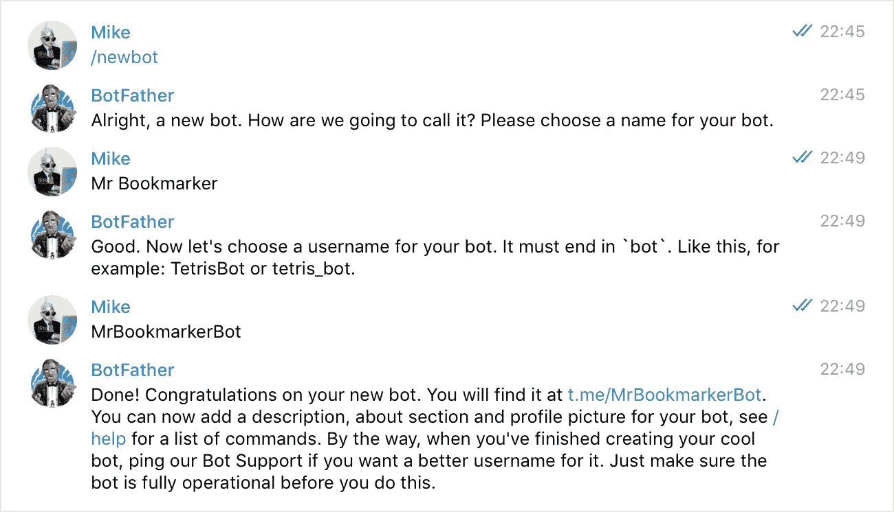
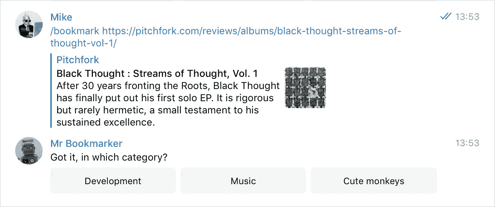
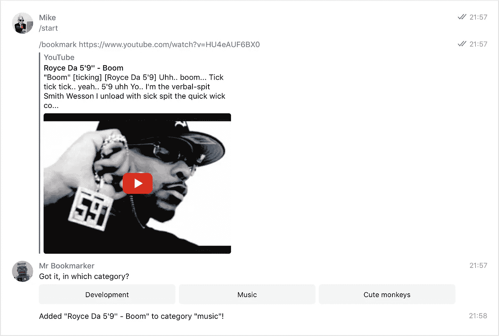
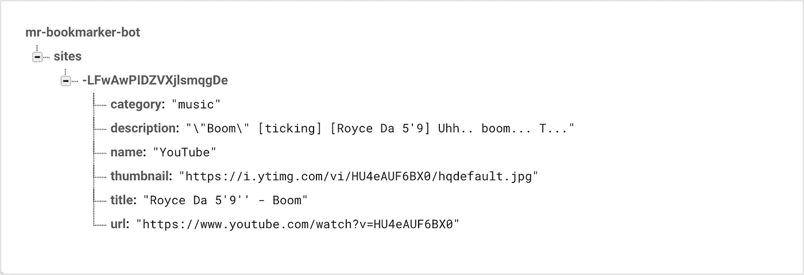

# 【第 1 部分】如何使用 Node.js 构建电报 Bot(构建书签管理器 Bot 系列)

> 原文：<https://itnext.io/part-1-building-a-bookmark-manager-telegram-bot-node-js-vue-js-972bb7198def?source=collection_archive---------1----------------------->

## 使用 Node.js 和 Vue.js


原照片由 [수안 최](https://unsplash.com/photos/tXB7yfP9gg0?utm_source=unsplash&utm_medium=referral&utm_content=creditCopyText)

本文是关于如何构建电报机器人和保存我们的书签、部署机器人以及在 Vue.js 中创建一个简单的界面来管理我们的书签的系列文章的一部分。在这一部分，我们将看看如何建立机器人。

尽管浏览器在设备之间实现了共享书签，并且有一堆服务可以帮助你跟踪你的书签，但我总是发现一些我不满意的地方。正如你将看到的，创建你自己的书签管理器实际上非常容易，你可以通过创建一个电报机器人从任何地方访问它！

## 开始之前

我假设你已经安装了某种软件包管理器，我将使用 [Yarn](https://yarnpkg.com/lang/en/) 但是 [NPM](https://www.npmjs.com/) 也能正常工作(但是安装包的命令会有所不同)。因为我们将使用 [Node.js](https://nodejs.org/en/) ，显然，您需要安装它。

你可以在 GitHub 上找到机器人[的完整代码。](https://github.com/Mikehrn/bookmark-bot/blob/master/index.js)

## 1:我们开始忙吧！

我们需要做的第一件事是创建我们的项目文件夹，现在我们需要的是一个项目文件夹和一个`index.js`文件。在终端中，转到您的项目文件夹，使用`init`创建一个`package.json`，并添加/安装我们将使用的模块，`node-telegram-bot-api`、`open-graph-scraper`和`firebase`:

```
cd your-project-folder
yarn init
yarn add node-telegram-bot-api open-graph-scraper firebase
```

`node-telegram-bot-ap`用于与 Telegram API 交互，我们将使用`open-graph-scraper`轻松删除我们书签网站上的 OG 数据。因为我们将使用 [**Firebase**](https://firebase.google.com/) 来存储数据，所以你还需要`firebase`模块。

## 僵尸父亲

幸运的是，Telegram 使得创建和管理机器人变得非常容易。将机器人父亲添加到 Telegram，并通过发送`/newbot` 命令开始创建一个新的机器人。BotFather 将指导您完成整个过程。他会给你一个*令牌*，你将需要它来使用 **HTTP API** 。



## 2:让我们最终建立一些东西

我们现在都设置好了，准备开始编程。您的项目应该有一个包含所需模块的`node_modules`文件夹。首先，我们需要确保使用 Node.js 的`index.js`文件中的`require()`来加载我们的模块:

```
const TelegramBot = require('node-telegram-bot-api');
const ogs = require('open-graph-scraper');
const firebase = require('firebase');
```

接下来，我们需要创建一些[常量](https://developer.mozilla.org/en-US/docs/Web/JavaScript/Reference/Statements/const)来保存我们的机器人的一些信息。常量与变量相似，只是它们的值不能改变(更多信息请参见 MDN 页面):

```
const token = 'your-token';
const bot = new TelegramBot(token, {polling: true});
```

确保用你的真实令牌替换`your-token`，否则你的机器人将无法连接！常量`bot`使用令牌的令牌常量从 *Node.js Telegram bot API* 创建一个新的 Bot 对象。

我们现在已经有了基本的设置！但是当它什么都不做的时候就有点无聊了。让它跟我们说话吧！为了让我们的机器人做一些事情，我们需要捕获一个事件，这样它就可以触发机器人去做我们指示它去做的任何事情。

```
bot.on('message', (msg) => {
  bot.sendMessage(msg.chat.id, 'Ill have the tuna. No crust.');
});
```

现在如果机器人收到消息，它会回复给我们！在我的例子中，它是订购一个三明治，但是你当然可以使用任何你想要的信息。让我们检查它是否工作！

## 3:测试机器人

因为我们使用 Node.js，所以测试我们的 bot 非常容易。只需进入终端并运行以下命令:

```
cd your-project-folder
node index.js
```

节点现在将为我们运行我们的脚本，我们可以去测试我们的机器人。在 Telegram 上把你的机器人添加为好友，试着给它发送一条消息，如果一切正常，你会收到机器人发来的消息！现在，在我们继续之前，让我们通过在终端中按下 *Control + C* 来停止 Node 运行我们的脚本。

## 4:连接到 Firebase

我们的机器人可以接收我们的消息并回复，但如果我们想让它将我们的链接加入书签，我们需要连接到一个数据库。借助 Firebase，我们可以创建一个基于云的数据库，并实时同步/读取我们的数据。这使得它非常适合我们的机器人(实际上 Firebase 可以做的不止这些，[这篇文章](https://hackernoon.com/introduction-to-firebase-218a23186cd7)给出了一个很好的概述)。登录你的谷歌账户，进入 [Firebase 控制台](https://console.firebase.google.com/u/0/)。点击**添加项目，**为您的项目选择一个名称，并逐步升级您的数据库。

当您的项目准备就绪时，您将被自动重定向到仪表板。在左侧菜单中点击**数据库**下的**开发**。创建一个新的**实时数据库**并在**测试模式下启动。太好了，我们的数据库也准备好了。要获得连接数据库所需的信息，请从左侧菜单进入**项目概述**并点击**将 Firebase 添加到您的 web 应用程序**。您可以在弹出窗口中找到您的凭证(在对象`config`中)。**

您可以删除我们为测试而创建的*消息*事件，因为我们不再需要它了。要连接到您的 Firebase，请将以下代码添加到您的脚本中，并添加我们刚刚从项目设置中获得的凭据:

```
const app = firebase.initializeApp({
  apiKey: "your-api-key",
  authDomain: "your-auth-domain",
  databaseURL: "your-database-url",
  projectId: "your-project-id",
  storageBucket: "your-storage-bucket",  
  messagingSenderId: "your-sender-id"
});
```

接下来，我们创建两个常量，`ref`保存对我们数据库的[引用](https://firebase.google.com/docs/database/web/read-and-write)，以及`sitesRef`保存对我们之前在 Firebase 控制台中创建的数据库中的*子*站点的引用:

```
const ref = firebase.database().ref();
const sitesRef = ref.child("sites");
```

因为我们想在将来给我们的机器人添加更多的功能，我们将创建一个命令来使我们的机器人书签成为一个链接，让我们称之为`/bookmark`。

```
let siteUrl;bot.onText(/\/bookmark (.+)/, (msg, match) => {
  siteUrl = match[1]; bot.sendMessage(msg.chat.id,'Got it, in which category?', {
    reply_markup: {
      inline_keyboard: [[
        {
          text: 'Development',
          callback_data: 'development'
        },{
          text: 'Music',
          callback_data: 'music'
        },{
          text: 'Cute monkeys',
          callback_data: 'cute-monkeys'
        }
      ]]
    }
  });
});
```

我们创建了一个空的字母[来存储收到的 URL。然后，我们使用 Telegram API 来捕获`onText`事件，并使用一个](https://developer.mozilla.org/en-US/docs/Web/JavaScript/Reference/Statements/let)[正则表达式](https://developer.mozilla.org/en-US/docs/Web/JavaScript/Guide/Regular_Expressions)将 URL 与命令分开。这将创建一个数组，我们将从中选择第二个值(因为数组从零开始，所以它是`[1]`)并将变量`siteUrl`设置为这个值。

机器人会回答“知道了，在哪一类？”(当然，您可以在这里使用任何您想要的消息)并使用 Telegram API 来拉起内联键盘(因为打字工作量太大，我们不想太累)。内嵌键盘是 Telegram 中的内置功能，它允许我们通过按下按钮来回复，而不是必须键入答案！键盘包含三个按钮，这是我们的三个类别。`text:`是将在按钮中显示的值，`callback_data:`是我们可以在脚本中使用的值。让我们保存并运行我们的脚本，通过从终端运行`node index.js`并向它发送一个 URL 来测试我们的机器人是否正在回复。



我们的机器人工作了！我们现在可以使用 Telegram 的内嵌键盘来回复我们的机器人。现在我们需要机器人抓取 OG 数据并保存它:

```
bot.on("callback_query", (callbackQuery) => {
  const message = callbackQuery.message; ogs({'url': siteUrl}, function (error, results) {
    *if*(results.success) {
      sitesRef.push().set({
        name: results.data.ogSiteName,
        title: results.data.ogTitle,
        description: results.data.ogDescription,
        url: siteUrl,
        thumbnail: results.data.ogImage.url,
        category: callbackQuery.data
      }); bot.sendMessage(message.chat.id,'Added \"' + results.data.ogTitle +'\" to category \"' + callbackQuery.data + '\"!')
} *else* {
      sitesRef.push().set({
        url: siteUrl
      });
      bot.sendMessage(message.chat.id,'Added new website, but there was no OG data!');
    }
  });
});
```

如果机器人收到一个回调查询(在这种情况下，意味着我们使用内嵌键盘向他发送了一些东西)，它将接收并处理这些信息。`callbackQuery`包含一堆信息，但是我们只关心消息，所以我们把它保存在一个常量中。`ogs`(打开 Graph Scraper)将我们传递的 URL Scraper 成一个 JSON 文件。如果抓取成功(我们通过使用`success`标志进行检查),它会将 OG 信息和站点 URL 一起推送到 Firebase，并向我们发送回复，让我们知道它添加了书签。然后它将触发机器人发回一条消息，我们从`message`常量中选择`chat.id`来获取聊天 ID，这样机器人就知道它需要向哪个聊天发送回复。

如果它无法抓取任何 OG 数据，它仍会将该网站推送到我们的数据库，并向我们发送不同的消息，让我们知道他无法抓取任何 OG 数据，但仍将该网站设为书签。根据我的经验，我会说我收藏的 95%的网站都运行良好，所以得不到任何信息的情况并不常见。

## 你做到了！

进入终端，再次启动我们的脚本来启动机器人。让我们给他发一个网址试试看:



起作用了！

看起来一切正常！最后要检查的是我们的数据库。转到您的 Firebase 项目，从左侧菜单中选择**数据库**。如果一切正常，您将看到您的书签出现在数据库中(您可能需要使用书签旁边的小“+”号展开子书签)。



恭喜你，你现在已经建立了自己的书签助手！

## **正在部署**

[点击这里](/part-2-deploying-a-telegram-bot-using-now-building-a-bookmark-manager-bot-series-9304104a64ae)进入本系列的下一部分，我们将看看如何部署我们的机器人。在以后的部分中，我们将使用 Vue.js 创建一个管理书签的简单界面！

**系列索引**
[【第 1 部分】如何使用 Node.js 构建电报机器人](/part-1-building-a-bookmark-manager-telegram-bot-node-js-vue-js-972bb7198def)
[【第 2 部分】如何使用 Now](/part-2-deploying-a-telegram-bot-using-now-building-a-bookmark-manager-bot-series-9304104a64ae)
*部署电报机器人下一部分即将推出！*