# 第 1 部分:用 Angular Material 和 AWS Amplify 构建渐进式 Web 应用程序(PWA)。

> 原文：<https://itnext.io/part-1-building-a-progressive-web-application-pwa-with-angular-material-and-aws-amplify-5c741c957259?source=collection_archive---------1----------------------->


卡斯帕·鲁宾在 [Unsplash](https://unsplash.com/search/photos/programming?utm_source=unsplash&utm_medium=referral&utm_content=creditCopyText) 上的照片

这是概述如何构建支持移动和桌面环境的多平台渐进式 Web 应用程序(PWA)的系列文章的第一篇。

*   **第 1 部分** **(你在这里)**:使用 Angular/Material、web 应用程序清单、服务工人、图标引导应用程序，并使用 AWS Amplify CLI 将 iOS (Safari)、Android (Chrome)和桌面的功能添加到主屏幕。
*   [**第 2 部分**:使用 Amazon Cognito 添加身份验证和授权，支持个人用户资料和私人内容。](https://medium.com/@michaellabieniec/part-2-adding-authentication-to-your-angular-material-aws-amplify-powered-pwa-2a9d0fbd305a)

> " PWAs 结合了 web 的灵活性和本地应用程序的体验."— [维基百科](https://en.wikipedia.org/wiki/Progressive_web_applications)

渐进式网络应用程序(PWA)是一种可通过网络浏览器(Chrome 或 Safari)安装在(受支持的)移动设备上的网络应用程序。主要特性和优势如下:

*   **可靠性和网络不可知** —即时加载，甚至在不确定的网络条件下加载。
*   **可安装** —可在移动设备上安装，可通过设备主屏幕使用。PWA 就像是设备上的一个本地应用程序，具有身临其境的用户体验。
*   **可搜索的** —因为 PWA 是一个网络应用程序，因此存在于互联网上。它可以被搜索引擎索引，并且不需要应用商店来安装。
*   **离线—** 在应用缓存和服务人员的帮助下，PWA 可以在离线和低连接环境中使用。它还支持使用 web [推送 API](https://developer.mozilla.org/en-US/docs/Web/API/Push_API) 的推送通知。

在第一篇文章中，我们将构建一个 PWA，它可以在 Android 和桌面(Mac、Windows 和 Chrome OS)设备上使用 Chrome 浏览器，在 iOS (11.3 以上)设备上使用 Safari 浏览器。应用程序将使用 Angular 7 和 Angular Material 构建。就 PWA 功能而言，与 Android/Chrome 相比，iOS Safari (Webkit)有一些需要特别考虑的注意事项。

2018 年 3 月 30 日，苹果发布了 iOS 11.3 更新，其中包括对 iPhones 和 iPads 上 pwa 的基本支持。在撰写本文时，这种支持仍然是基本的，还在开发中。Webkit 时间表概述了关键浏览器支持的状态，包括 [Web 应用程序清单](https://webkit.org/status/#specification-web-app-manifest)和服务工作人员。

*   清单中的图标大小并非都与 iOS 兼容。你可以在 index.html 文件中使用标签，就像我们下面要做的那样，以便在 Safari 中添加到主屏幕时正确显示图标。
*   在撰写本文时，Webkit 对 web 应用程序清单的支持仍在开发中。可以使用[pwa compat . js](https://developers.google.com/web/updates/2018/07/pwacompat)；在这里下载[。这将为图标、主屏幕、闪屏等添加丰富的 PWA 支持。在许多其他浏览器中，包括 Safari。](https://raw.githubusercontent.com/GoogleChromeLabs/pwacompat/master/pwacompat.js)
*   外部链接在 Safari 中不能开箱即用。对于像登录谷歌这样的事情，你可以将`[ux_mode](https://developers.google.com/identity/sign-in/web/reference#gapiauth2clientconfig)`设置为“重定向”,而对于其他人，你可以直接设置`window.location`。然而，请记住，Safari 没有显示后退按钮，所以一旦你离开，就没有办法有效地回到你的应用程序。
*   iOS 上的 Safari PWAs 目前没有深度链接。在 web 应用程序清单中，你可以提供`intent_filters`和一个`scope`，它只能在 Android/Chrome 上运行。详见[此处](https://developers.google.com/web/fundamentals/integration/webapks)。
*   Chrome 提供了一个自动弹出窗口，提示用户安装 PWA。Safari 目前不支持这一功能。您可以通过检测平台并显示自定义通知来实现这一点，这将在下面描述。

## 入门指南

我们将使用 Angular CLI (v7)引导应用程序，这将需要 Node.js (v8.11+)。然后，我们将使用 Angular Material UI 库来设计用户界面的样式，并使其对移动和桌面都有响应。最后，我们将使用 AWS Amplify CLI 将应用程序部署到亚马逊 S3 和 CloudFront。

## 要求

*   [Node.js 8.11+](https://nodejs.org)
*   [AWS 放大 JS 1.x](https://aws-amplify.github.io/media/get_started)
*   [AWS 放大 CLI 0.1.x](https://aws-amplify.github.io/media/get_started)
*   [角度 7.x](https://angular.io/)
*   [Angular CLI 7.x](https://cli.angular.io)
*   [角材 7.x](https://material.angular.io)

> 源代码可在 [GitHub](https://github.com/mlabieniec/AngularMaterialPWA) 上获得。

让我们开始吧。使用 Angular CLI 生成新的应用程序。这将生成一个锅炉板角度项目，并安装所有需要的依赖关系。它还将连接路由，并允许您选择自己喜欢的 CSS 框架。对于这个应用程序，我们将使用 SCSS，但你可以使用任何你喜欢的。

> 如果您的机器上没有安装 node.js(和 npm ),请遵循此处的操作系统安装说明。

```
$ npm install -g @angular/cli
$ ng new AngularPwaPostOne
$ ? **Would you like to add Angular routing?** Yes
$ ? **Which stylesheet format would you like to use?** SCSS
```

将[角形材料](https://material.angular.io)组件添加到应用中。该命令将连接角形材料并安装必要的附件。

```
$ cd AngularPwaPostOne
$ ng add @angular/material
$ ? **Enter a prebuilt theme name, or "custom" for a custom theme:** indigo-pink
$ ? **Set up HammerJS for gesture recognition?** Yes
$ ? **Set up browser animations for Angular Material?** Yes
```

这将引导你的应用程序依赖角度材料，更新配置，并执行初始化代码(更多细节见[此处](https://material.angular.io/guide/getting-started#alternative-2-angular-devkit-6-))。Angular 开箱即用 [Hammer.js](https://hammerjs.github.io) ，这是([正如他们的医生所说](https://hammerjs.github.io/getting-started/))一个“可以识别触摸、鼠标和指针事件所做手势的开源库。它没有任何依赖性，而且很小，只有 7.34 kB minified + gzipped！”

> Angular 动画系统是基于 CSS 构建的，这意味着您可以将浏览器认为可以动画化的任何属性动画化。这包括位置、大小、变换、颜色、边框等等。更多详情[此处](https://angular.io/guide/animations)。

接下来，您将生成一个新的角度模块，该模块将加载角度材料组件。这有助于在不污染应用程序模块的同时，分离加载和实例化所有材料组件的关注点。

> 这个模块将会加载所有的组件，但是，你也可以只加载你想在你的模块中使用的组件。

```
$ ng generate module material
```

打开`src/app/material/material.module.ts`文件，用这个[要点](https://gist.github.com/mlabieniec/821356ddc5cbf19124601981a23b12e3#file-material-module-ts)的内容更新内容。这个模块将加载所有的材质 UI 组件。

> 在生产场景中，您可能希望将这个列表缩减为您正在使用的组件，这将减少 JS 包的整体大小。

现在，将材料模块导入到您的应用程序模块中。编辑`app.module.ts`文件，添加粗体部分:

```
*import* { BrowserModule } *from* '@angular/platform-browser';
*import* { NgModule } *from* '@angular/core';
*import* { AppComponent } *from* './app.component';
*import* { BrowserAnimationsModule } *from* '@angular/platform-browser/animations';
***import* { MaterialModule } *from* './material/material.module';**@NgModule({
  declarations: [ AppComponent ],
  **imports**: [
    BrowserModule,
    BrowserAnimationsModule,
    **MaterialModule**
  ],
  providers: [],
  bootstrap: [AppComponent]
});*export* class AppModule { }
```

现在我们将创建一些路由和一个新的 home 组件，它们最终将由一个 [AuthGuard](https://angular.io/guide/router#guard-the-admin-feature) 保护。

*   用此[要点](https://gist.github.com/mlabieniec/821356ddc5cbf19124601981a23b12e3#file-app-component-html)替换`src/app.component.html`的内容。
*   用此[要点](https://gist.github.com/mlabieniec/821356ddc5cbf19124601981a23b12e3#file-app-component-ts)替换`src/app.component.ts`的内容。

在我们继续之前，让我们概述一下在`app.component.html`文件中找到的 html 元素上的【括号】(圆括号)和(*星号)是怎么回事。

```
<app-element #myElement
 directiveName
 [prop]="value"
 [class.className]="cssClass"
 [style.fontSize]="50%"
 [style.stylePropertyName.px]="8"
 [attr.type]="(hide) ? 'password' : 'text'"
 [role.button]="{{myAriaRole}}"
 (click)="onClickEvent()">
</app-element>
```

*   **directiveName —** 在结构指令中，长格式只能应用于<模板>标签。简写形式在<模板>中应用元素的地方包装元素
*   **[prop]="value"** 用于绑定到属性的对象(角度组件或指令的@Input()或 DOM 元素的属性)。

有一些特殊的形式:

*   **【class . class name】**绑定到 css 类以启用/禁用它
*   **【style . style property name】**绑定到一个样式属性
*   **【style . stylepropertyname . px】**绑定到带有预设单位的样式属性
*   **【attr . attributename】**将值绑定到属性(在 DOM 中可见，而属性不可见)
*   **【role . rolename】**绑定到 ARIA 角色属性(尚不可用)
    prop="{{value}} "将值绑定到属性。该值是字符串化的(也称为插值)
*   **(event)="expr"** 将事件处理程序绑定到@Output()或 DOM even
*   **#myElement** 根据上下文有不同的功能。
    在`*ngFor=”#x in y; #i=index”`中，为迭代创建作用域变量(在 beta.17 中，这被改为`*ngFor=”let x in y; let i=index”` )
    -在 DOM 元素上`<div #mydiv>`是对元素
    的引用-在角度组件上是对组件
    的引用-在定义了`exportAs:”ngForm”`的角度组件或具有角度指令的元素上，`#myVar=”ngForm”`创建对该组件或指令的引用。

更多细节可在角度文档[中找到，此处](https://angular.io/docs/ts/latest/guide/template-syntax.html)。

生成一个 home 组件，作为我们应用程序的主视图:

```
$ ng generate component home
```

接下来，在`src/app/app-routing-module.ts`文件中创建默认路线(添加粗体部分):

```
*import* { NgModule } *from* '@angular/core';
*import* { Routes, RouterModule } *from* '@angular/router';
***import* { HomeComponent } *from* './home/home.component';****const routes: Routes = [
  { path: '', component: HomeComponent }
];**@NgModule({
  imports: [RouterModule.forRoot(routes)],
  exports: [RouterModule]
});*export* class AppRoutingModule { }
```

> 在这个[要点](https://gist.github.com/mlabieniec/821356ddc5cbf19124601981a23b12e3#file-styles-scss)中有可用的素材主题样式，你也可以在你的`styles.scss`文件中添加/定制。

现在在你的终端中运行`ng serve`来启动你的 PWA。您应该会看到移动和桌面环境的响应视图。桌面侧边栏将在宽度超过 600 像素的视图上可见，而在小于 600 像素的显示器上，可折叠菜单图标将显示在菜单栏中，单击该图标将显示左侧模式菜单。

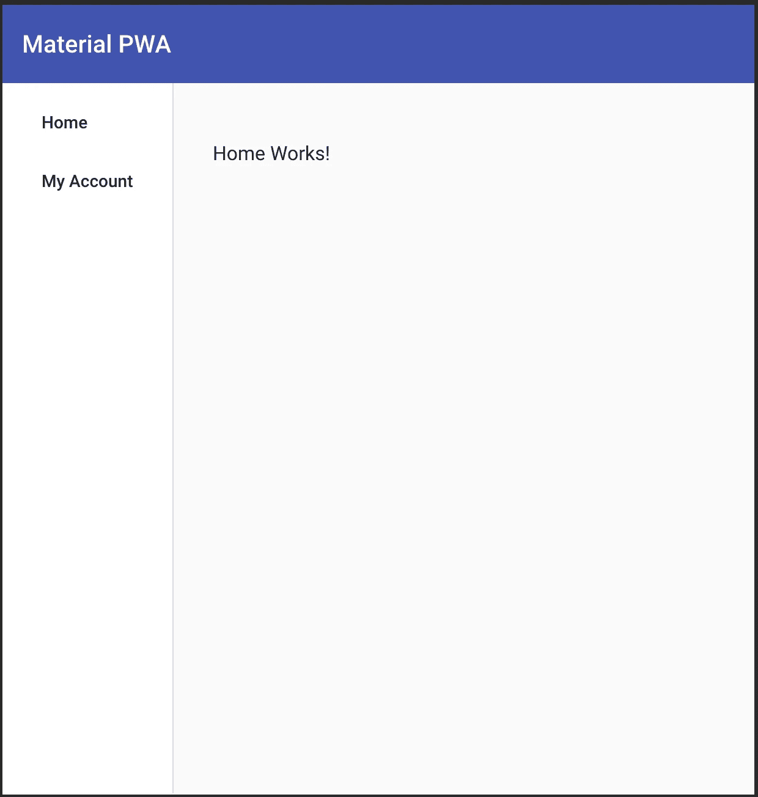

桌面视图(宽于 600 像素)

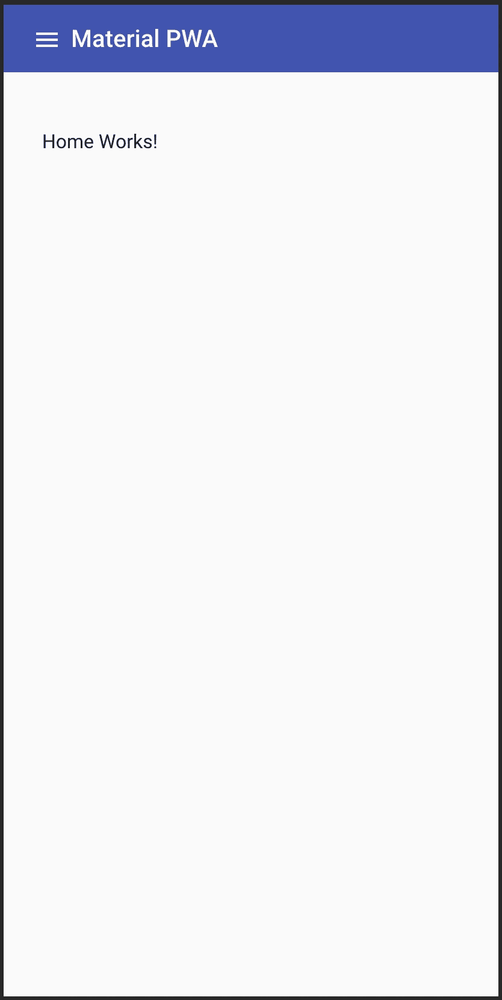

移动视图(小于 600 像素宽)

菜单项在`app.component.ts`文件中动态填充。

```
**//-->** [**app.component.ts**](https://gist.github.com/mlabieniec/821356ddc5cbf19124601981a23b12e3#file-app-component-ts-L17-L26)
nav = [
  {
    'title': 'Home',
    'path': '/'
  },
  {
    'title': 'My Account (part 2)',
    'path': '/auth' //<-- not yet used
  }
];**//-->** [**app.component.html**](https://gist.github.com/mlabieniec/821356ddc5cbf19124601981a23b12e3#file-app-component-html-L9-L13)
<mat-list>
  <mat-list-item **ngFor*="let route of nav">
    <a *mat-button* 
       *routerLink*="{{route.path}}" 
       *routerLinkActive*="active" 
       *(click)*="toggleMobileNav(lnav)">{{route.title}}</a>
  </mat-list-item>
</mat-list>
```

## PWA 设置

在本节中，我们将概述以下各项的配置和设置:

*   Web 应用程序清单
*   服务人员
*   闪屏
*   pwacompat.js 脚本
*   iOS 特定的标签

Angular 为生成和管理服务人员提供一流的支持。实现是自以为是的，如果你愿意，你可以选择使用你自己的服务人员。对于本教程，我们将使用 Angular service worker 生成和管理。更多详情请参见[此处](https://angular.io/guide/service-worker-getting-started)。

> 目前最新版本的 Chrome、Firefox、Edge、Safari、Opera、UC 浏览器(安卓版)和三星互联网都支持服务工作者。像 IE 和 Opera Mini 这样的浏览器不提供这种支持。要了解更多有关服务人员可用的其他浏览器的信息，请参见[我可以使用](https://caniuse.com/#feat=serviceworkers)页面和 [MDN 文档](https://developer.mozilla.org/en-US/docs/Web/API/Service_Worker_API)。

将服务人员添加到您的项目中:

```
$ ng add @angular/pwa --project AngularPwaPostOne...CREATE **ngsw-config.json** (441 bytes)
CREATE src/**manifest.json** (1091 bytes)
CREATE src/assets/icons/icon-128x128.png (1253 bytes)
CREATE src/assets/icons/icon-144x144.png (1394 bytes)
CREATE src/assets/icons/icon-152x152.png (1427 bytes)
CREATE src/assets/icons/icon-192x192.png (1790 bytes)
CREATE src/assets/icons/icon-384x384.png (3557 bytes)
CREATE src/assets/icons/icon-512x512.png (5008 bytes)
CREATE src/assets/icons/icon-72x72.png (792 bytes)
CREATE src/assets/icons/icon-96x96.png (958 bytes)
UPDATE angular.json (4229 bytes)
UPDATE package.json (1557 bytes)
UPDATE src/app/app.module.ts (1205 bytes)
UPDATE src/index.html (660 bytes)
```

该命令将:

*   将`@angular/service-worker`包添加到您的项目中，并启用服务人员构建对您的 angular CLI 的支持。
*   在您的应用模块`app.module.ts`文件中导入并注册服务人员。
*   更新`index.html`文件并包含`manifest.json`文件，并为`theme-color`添加适当的<元>标签。
*   安装示例图标文件。
*   创建一个名为`ngsw-config.json`的服务工作者配置，它指定了缓存行为。

运行该命令后，您需要构建带有`--prod`标志的应用程序，并且您的项目将被设置为使用 Angular service worker。

```
$ ng build --prod
```

使用服务工作者和 Angular 进行开发的一个警告是,`ng serve`命令目前不适用于服务工作者。因此，您需要安装并使用单独的 HTTP 服务器来本地测试您的应用程序。您可以使用任何 HTTP 服务器，在本教程中，我们将使用 Mac OS 内置的`python SimpleHTTPServer`。

> 您也可以使用 NPM 的 http-server 或任何其他本地 http 服务器。

现在在本地为您的新 PWA 服务:

```
$ pushd dist/AngularPwaPostOne; python -m SimpleHTTPServer; popd
```

> 如果你在 Python 3+上，省略`-m`参数:`python SimpleHTTPServer`。

默认情况下，应用程序将在 [http://localhost:8000 上运行。](http://localhost:8000.)将这个(或您使用的任何 http 服务器)命令添加到您的`package.json` **start** 脚本中，并更新 **build** 脚本以包含`--prod`参数。

```
"scripts": {
  "ng": "ng",
  **"start": "pushd dist/AngularPwaPostOne; python -m SimpleHTTPServer; popd",**
  "build": "ng build **--prod**",
  "test": "ng test",
  "lint": "ng lint",
  "e2e": "ng e2e"
},
```

现在，您可以通过从命令行运行`npm start`来本地服务您的应用程序。请记住，在调试或开发您的服务人员时，您需要在调试对本地缓存文件的任何更改之前运行`ng build --prod`。让我们通过 Chrome 开发工具来看看我们的注册服务人员。在 Mac 上按`cmd + shift + i`或者选择查看菜单、开发者、开发者工具选项。选择“应用程序”选项卡。

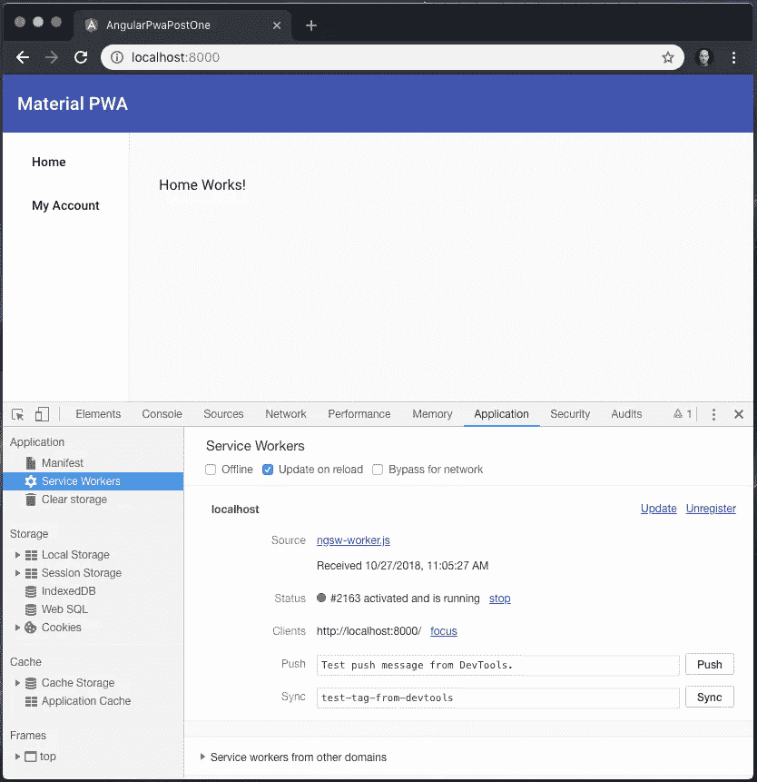

注意，不用编辑一行代码，我们现在就注册了一个服务人员。确保选中“重新加载时更新”标志；当新的服务人员可用时，这将自动重新加载服务人员。点击左边的“Manifest”链接，你也会注意到自动生成的图标。这些可以用你自己的图标编辑/重新保存。在清单部分，点击“添加到主屏幕”。这将提示您添加快捷方式；注意，名称和图标是用生成的`src/manifest.json`文件中的值填充的。如果您在 Android 设备上启动 PWA，您还可以添加到主屏幕，主屏幕将使用清单中引用的生成图标(或您创建的图标)。

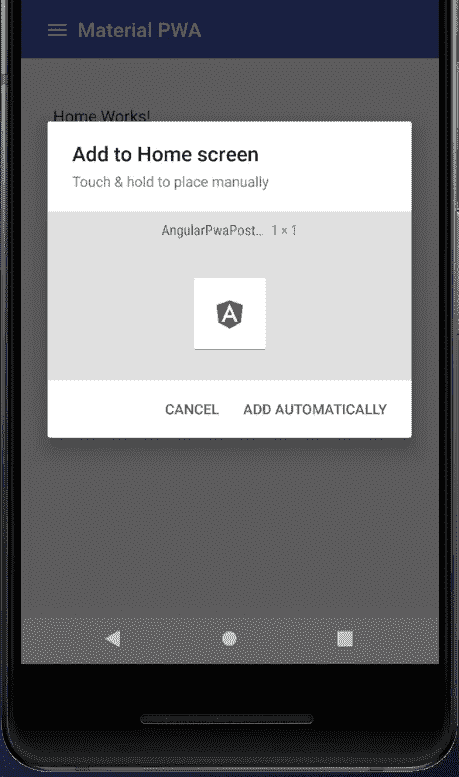

Android 添加到主屏幕

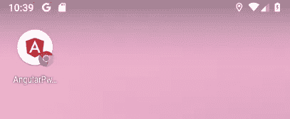

Android 主屏幕图标

## iOS 上的图标

如果你现在尝试用 Safari 在 iOS 设备上加载你的 PWA，它看起来就不那么好看了。您可以将它添加到主屏幕，但是您会注意到图标显示不正确。

> 通过访问端口 8000 上的本地 IP 地址，您可以在 iOS 设备上访问您的应用程序(确保您运行的是 iOS 11.3+)。在 Mac 上，您可以访问“系统偏好设置”,选取“网络”,然后记下列出的 IP 地址，比如 192.168.10.11。然后通过 iOS 设备访问这个地址[http://192 . 168 . 10 . 11:8000/](http://192.168.10.11:8000/)你的 PWA 应该加载了。在模拟器上，您可以通过 [http://localhost:8000/](http://localhost:8000/) 访问它

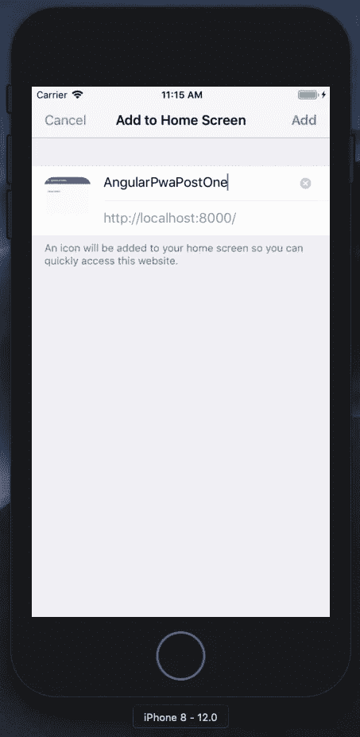

运行 iPhone 8 和 iOS 12.0 的 iOS 模拟器

为了解决这个问题，我们需要在`<head>`标签内的`index.html`文件中添加一些新图标和一些 meta 标签:

```
<meta *name*="apple-mobile-web-app-capable" *content*="yes"><link *rel*="apple-touch-icon" *href*="assets/icons/icon-512x512.png"><link *rel*="apple-touch-icon" *sizes*="152x152" *href*="assets/icons/icon-152x152.png"><link *rel*="apple-touch-icon" *sizes*="180x180" *href*="assets/icons/icon-192x192.png"><link *rel*="apple-touch-icon" *sizes*="167x167" *href*="assets/icons/icon-192x192.png">
```

> 关于 iOS 上网络应用程序的大小和功能的更多详细信息，请点击这里[。请注意，这些大小实际上并不指向匹配的 iOS 大小。你可以，也应该，为这些创造新的图标。由于长宽比是相同的，引用的图标实际上比要求的要大，为了简单起见，我使用它们。](https://developer.apple.com/library/archive/documentation/AppleApplications/Reference/SafariWebContent/ConfiguringWebApplications/ConfiguringWebApplications.html)

为了查看对缓存资源的更改，您需要清除本地数据，因为服务工作者将缓存资产。默认情况下，服务人员将缓存以下内容:

*   `index.html`
*   `favicon.ico`
*   构建工件(JS 和 CSS 包)
*   在`assets`下的任何东西

在模拟器中，您可以使用硬件，擦除所有内容和设置…选项来重新启动和加载。为了在开发过程中更好地处理这个问题，我们可以在`ngsw-config.json`文件中添加一个“version”属性，以便服务人员知道从服务器中重新加载缓存的内容。更新`ngsw-config.json`并添加版本属性。

```
{
  "index": "/index.html",
  **"version": 1,**
...
```

下次您想要查看缓存资源的任何更改时，您可以删除此版本并重新运行服务器:

```
$ ng build --prod
$ npm start
```

现在，再次尝试添加到主屏幕，当使用 Safari 时，您会看到 iOS 上显示的正确图标。

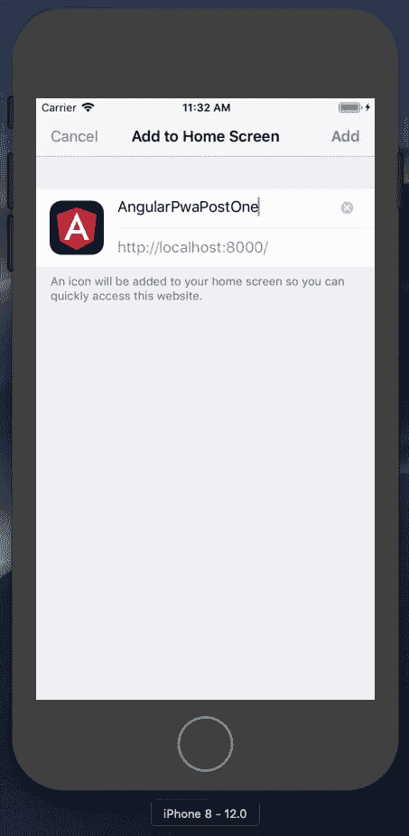

iOS 添加到主屏幕

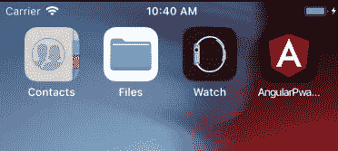

iOS 主屏幕图标

## 安装标准

为了使应用程序“可安装”,您的 PWA 需要尚未安装在设备上，并且包括至少提供以下内容的 web 应用程序清单:

*   `short_name`或`name`
*   `icons`包括至少 192 像素和 512 像素大小的图标
*   `start_url`
*   `display`是`fullscreen`、`standalone`或`minimal-ui`中的一种

> 你可以在这里了解更多关于 web 应用清单选项[的信息。](https://developer.mozilla.org/en-US/docs/Web/Manifest)

## 闪屏

在应用程序加载和缓存之前，会显示一个闪屏。这可以在 web 应用程序清单中定义，但是 iOS/Safari 目前不支持从清单中生成它，而是只显示一个白屏(当这些值未定义时，Chrome 也会显示白屏)。Chrome 会根据清单属性自动创建一个闪屏:

*   `name`
*   `background_color`
*   `icons`

> 你的`background_color`应该和你的加载屏幕颜色相同，这样用户从 splash 到你的应用程序就可以平滑过渡。

Chrome 将选择与该设备的 128dpi 图标最接近的图标。大多数情况下，提供 192 像素和 512 像素的图标就可以了，但是您也可以提供额外的图标。

iOS 设备上的 Safari 支持自定义 meta 标签来指定闪屏`apple-touch-startup-image`。启动屏幕的大小在 iOS 人机界面指南的图形部分中指定，可以在[这里](https://developer.apple.com/design/human-interface-guidelines/ios/icons-and-images/launch-screen/)找到。

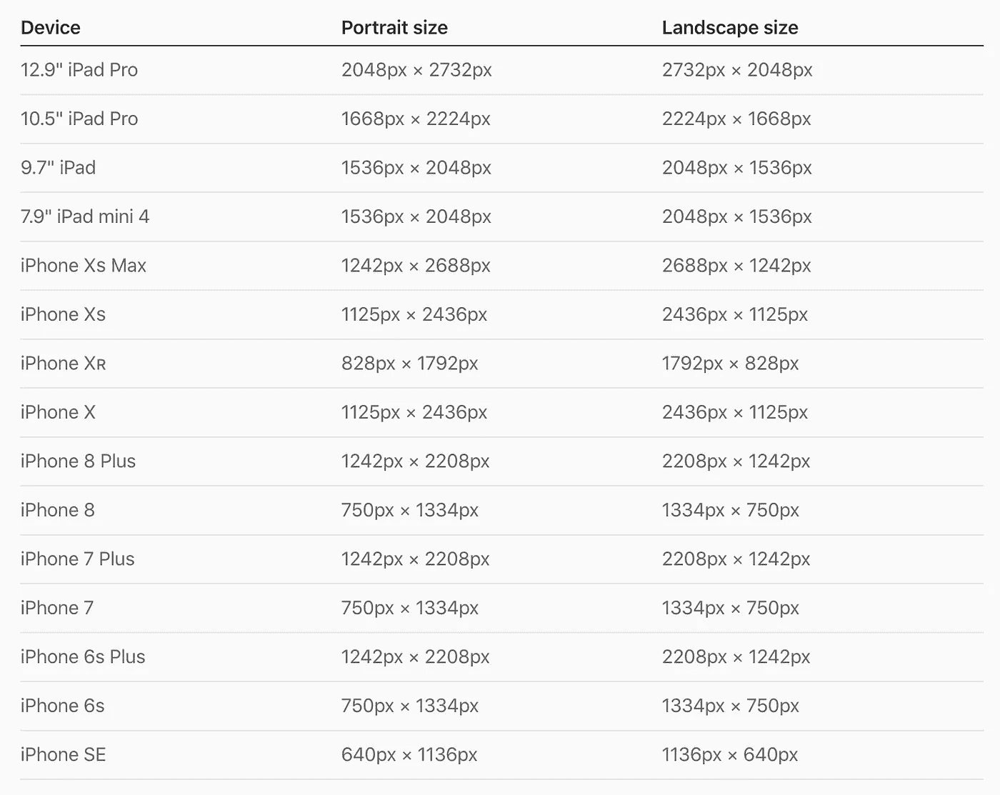

[https://developer . apple . com/design/human-interface-guidelines/IOs/icons-and-images/launch-screen/](https://developer.apple.com/design/human-interface-guidelines/ios/icons-and-images/launch-screen/)

为了这个启动画面，我从 unsplash.com 下载了一张[照片，并在这里](https://unsplash.com/photos/KYdqNRMF8f8)使用了一个草图模板[。一旦图像被创建，添加下面的元标签到你的`src/index.html`:](https://github.com/applification/pwa-splash-screens/blob/master/assets/PWA-Splash-Screens.sketch?raw=true)

现在，在模拟器或设备中加载您的应用程序，添加到主屏幕，在应用程序加载之前，您应该会看到您的闪屏显示。

```
$ ng build --prod
$ npm start
```

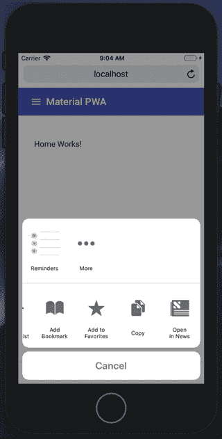

自定义 iOS 闪屏

**自定义 iOS 安装横幅** 当符合 PWA 的所有标准时，Android/Chrome 将显示友好的安装通知，询问用户是否要安装该应用程序。

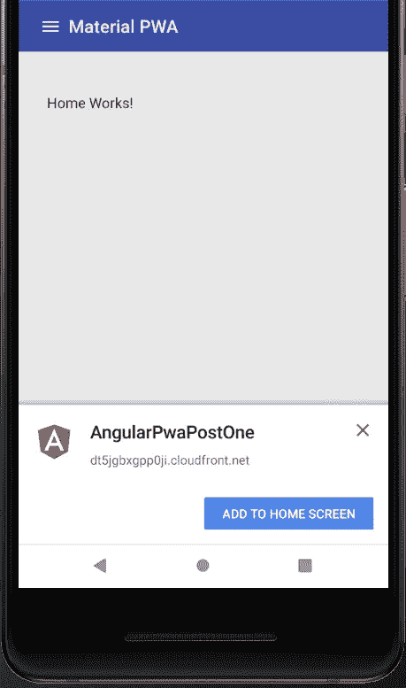

Android PWA 安装通知

> 提示:打开您的`src/manifest.json`文件，将`"short_name"`更改为 12 个字符以下的内容，[这是推荐的长度](https://developer.chrome.com/apps/manifest/name#short_name)，这样主屏幕就不会将其截断。

在 iOS/Safari 上不存在此功能，但我们可以在 Angular/Material 中创建一个，并使用 Angular Material[snack bar](https://material.angular.io/components/snack-bar/overview)显示一个自定义组件。

首先生成 SnackBar 将显示的自定义组件:

```
$ ng generate component iosInstall
```

因为我们将在 material SnackBar 中使用该组件，所以我们需要执行一个额外的步骤，以便 Angular 将强制加载该组件(这意味着它不会显示在模板中)。更新`src/app.module.ts`文件，向`@NgModule`指令添加一个附加属性:

```
@**NgModule**({
declarations: [
  AppComponent,
  HomeComponent,
  **IosInstallComponent**
],
imports: [
  BrowserModule,
  AppRoutingModule,
  BrowserAnimationsModule,
  MaterialModule,
  ServiceWorkerModule.register('ngsw-worker.js', { enabled: environment.production })
],
  providers: [AppSyncService],
  bootstrap: [AppComponent],
  **entryComponents: [IosInstallComponent]**
})
```

打开`src/app.component.ts`文件，实现`OnInit`生命周期事件。

```
*export* class AppComponent **implements OnInit**
```

> 在你的类的顶端，如果你的 IDE 没有自动完成，你也需要`import { OnInit } from '@angular/core';`。

更新构造函数方法以注入`MatSnackBar`组件，该组件将在 iOS 设备上显示我们的通知。

```
constructor( changeDetectorRef: ChangeDetectorRef, media: MediaMatcher, **private toast: MatSnackBar** )
```

然后，在组件类的主体中，直接在`constructor`方法之后插入`ngOnInit`生命周期方法。

> 不要忘了在你的类的顶部使用`import { IosInstallComponent } from './ios-install/ios-install.component';`，或者在`openFromComponent`方法中在`IosInstallComponent`字符串的末尾按`ctrl+space`。

为了让我们的组件能够被解除，我们将更新组件构造函数。打开`ios-install/ios-install.component.ts`文件并更新`constructor`方法。

```
constructor( **private snackBarRef:MatSnackBarRef<IosInstallComponent>** ){}
```

这将添加对启动该组件的 MatSnackBar 的引用。这将使我们能够添加一个关闭功能。

```
close() {
  *this*.snackBarRef.dismiss();
}
```

使用自定义消息更新`src/ios-install/ios-install.component.html`视图，该消息将要求我们的用户将我们的 PWA 安装到他们的主屏幕上。

最后，让我们添加一些 css 样式，以便关闭按钮正确地显示在通知的右侧。更新`src/ios-install/ios-install.component.css`文件。

构建并启动 PWA(记得清空缓存、重置模拟器或更新版本)。

```
$ ng build --prod
$ npm start
```

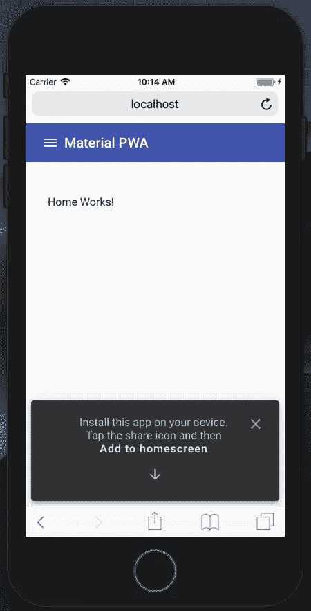

自定义 iOS 安装通知

此通知将仅在 iOS 设备上显示，并且仅在浏览器中运行时显示，例如非`standalone`模式/已安装。

## 在亚马逊 S3 和 CloudFront 上托管

[AWS Amplify CLI](https://github.com/aws-amplify/cli) 提供了一个可插拔的分类工具链，用于使用 AWS CloudFormation 管理您的 AWS 后端。它只需要一个 AWS 账户，该账户可以是[自由层账户](https://aws.amazon.com/free/)。您可以通过 NPM 安装 CLI(CLI 要求节点版本为 8.11 以上)。

> 如果您没有 AWS 帐户，请从这里开始使用[。](https://aws-amplify.github.io/media/get_started)

```
$ npm install -g @aws-amplify/cli
```

对于新的安装，首先运行`amplify configure`来设置您的 AWS IAM 用户和配置。如果您已经配置了您的帐户，您可以跳过 configure 命令。

一旦您的 AWS 帐户凭证和用户被配置，从您的根项目目录运行`amplify init`。

```
$ **amplify init** ? Enter a name for the project: **AngularPwaPostOne** 
? Enter a name for for the environment: **development**
? Choose your default editor: **<choose your preferred editor>**
? Choose the type of app that you're building **javascript** ? What javascript framework are you using (Use arrow keys): 
**❯ angular**? What javascript framework are you using **angular**
? Source Directory Path:  **src**
? Distribution Directory Path: **dist/AmplifyPwaPostOne**
? Build Command: **ng build --prod**
? Start Command: **npm start**Using default provider awscloudformationFor more information on AWS Profiles, see:
[https://docs.aws.amazon.com/cli/latest/userguide/cli-multiple-profiles.html](https://docs.aws.amazon.com/cli/latest/userguide/cli-multiple-profiles.html)? Do you want to use an AWS profile? **(choose if you have CLI profiles on your machine)**
? Please choose the profile you want to use <your-profile>
```

> 确保在 dist 目录中用您的项目名称更新**发行目录路径**选项。例如，如果您在本教程中将项目命名为“AngularPwaPostOne ”,该选项将被设置为`*dist/AngularPwaPostOne*`。您总是可以通过运行`*amplify configure project*`来重新配置您的项目。

项目环境配置完成后，下一步是为应用程序添加宿主。服务人员需要一个安全的来源。对于 HTTPs 服务，您有两种选择:

1.  使用 CloudFront 在 HTTPs 托管中启用 PROD 模式
2.  用 Route53 和 Amazon Certificate Manager 设置你自己的自定义域，并将其指向你的 S3 桶

在本教程中，我们将在主机中使用 PROD 模式，因此我们可以通过 Amplify CLI 和 Amazon CloudFront 获得 HTTPs。从项目的根目录运行:

```
$ **amplify add hosting**
? Select the environment setup: (Use arrow keys)
❯ DEV (S3 only with HTTP)
**❯ PROD (S3 with CloudFront using HTTPS)**? Select the environment setup: **PROD (S3 with CloudFront using HTTPS)**
? hosting bucket name **angularpwapostone**
? index doc for the website **index.html**
? error doc for the website **index.html**You can now publish your app using the following command:
Command: amplify publish$ **amplify publish**
```

由于这一步将使用 Amazon CloudFront 创建一个全球内容交付分发，因此需要一些时间来完成(有时长达 10 分钟)。一旦完成，您就可以在您的终端上显示的 CloudFront 发行版的 HTTPs 端点上访问您的 PWA。

```
✔ All resources are updated in the cloudHosting endpoint: **https://********.cloudfront.net**
```

当部署应用程序的另一个版本时，您可能希望使 CloudFront 缓存无效，以便立即显示新版本。为此，运行带有`-c`参数的公共命令。

```
$ amplify publish -c
```

这将使您的 CloudFront 缓存无效，并用来自源的最新数据填充它，在我们的例子中，源是亚马逊 S3 存储桶。部署时，您可能还想通过上述的`ngsw-confg.json`“version”属性更新您的服务人员的版本。这将通知系统有新版本的服务工作程序和静态文件可用。这将提示用户重新安装应用程序，下载/安装新的服务人员，并缓存新的静态文件。

您的应用程序现在托管在 CloudFront 上，通过全球 CDN 分发，并由服务人员在浏览器中本地缓存。web 应用程序清单和 HTML meta 标记将为 iOS 和 Android 提供图标和独立模式安装。请继续关注下一篇文章，我们将添加一个带有 Amazon Cognito 和 AWS Amplify Auth 类别的自定义多因素身份验证系统。