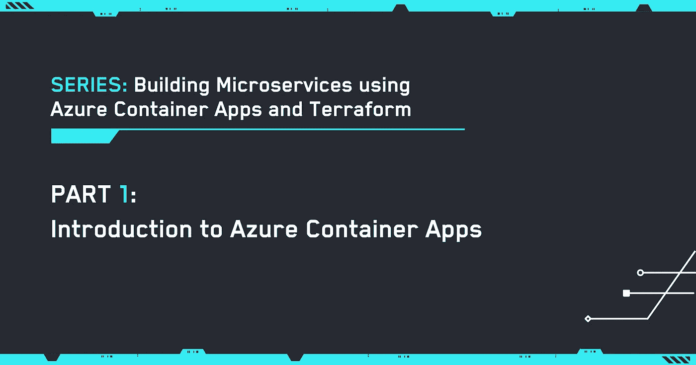
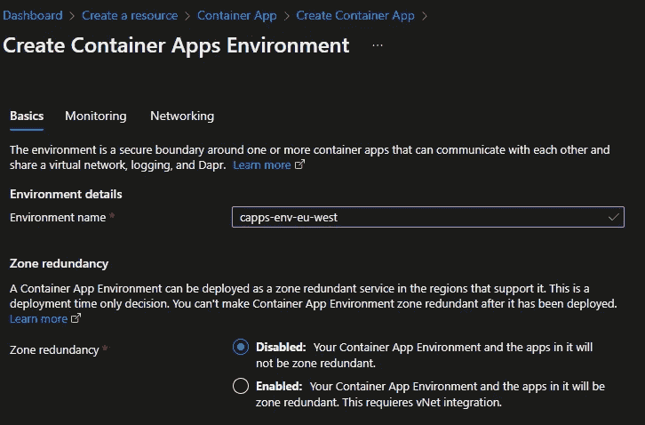
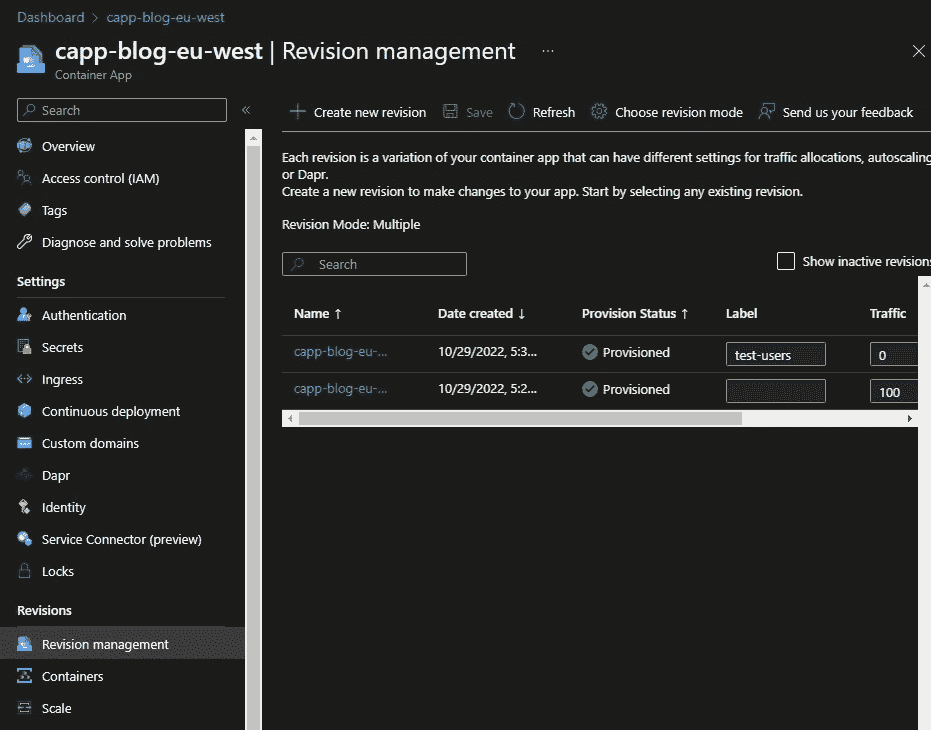

# 第 1 部分:Azure 容器应用简介

> 原文：<https://itnext.io/part-1-introduction-to-azure-container-apps-3e879343ae9b?source=collection_archive---------4----------------------->



## 系列:使用 Azure 容器应用和 Terraform 构建微服务

## **系列:**

*   [第 0 部分:给微服务和整体服务增加一些趣味](/part-0-adding-some-spicy-to-microservice-vs-monolith-4303c869684f)

# 介绍

正在为容器寻找 Azure 应用服务的替代品，但对 AKS 集群的成本不太感兴趣，或者正在寻找一个直接用于容器的非个人化托管平台？

这一点以及更多内容将在这个关于使用 Azure Container 应用程序和 Terraform 构建微服务的系列中讨论。

> 对于这些服务，我将使用 Dotnet、C#和 docker。但是如前所述，如果你的代码可以在容器中运行，那么不要害怕。在这篇简短的介绍中，我试图总结一下 MSDN 的文档，但是我建议你读一读: [Azure Container Apps 文档|微软学习](https://learn.microsoft.com/en-gb/azure/container-apps/?ocid=AID3042118)

# 什么是 Azure 容器应用？

它是一种无服务器的以应用程序为中心的托管服务，只要你的代码被打包在一个容器中，它就不会受到编程模型或语言的影响。容器应用程序建立在 Kubernetes 生态系统之上，但是您作为开发人员并不维护或学习 Kubernetes 的所有复杂性、其维护或所有底层的编排器和基础设施。

在底层，容器应用运行在 Azure Kubernetes Services (AKS)上，集成了分布式应用运行时(Dapr)、Envoy 和 Kubernetes 事件驱动自动缩放(KEDA)。

Gif: Noice

# 用例

如前所述，微服务是一个主要使用案例，但还有其他案例，例如:

*   一个应用程序，需要使用队列中的消息，并且需要通过根据消息数量增加/减少实例来随着数量的增加而扩展。
*   长期运行的后台进程。
*   HTTP 消息处理，可以基于实例之间的百分比进行拆分。即修订版 1 获得 80%的流量，而修订版 2 获得 20%的流量。
*   我甚至见过一些团队把他们的 Azure 功能移植到容器应用中。

# 特征

*   支持托管身份
*   自定义域
*   应用之间的加密流量
*   VNET 一体化
*   健康探针
*   AAD 和其他社交账户认证集成
*   环境秘密
*   基于缩放触发器的缩放
*   配置为在内部或外部公开服务
*   控制应用的 vCPUs 和 RAM 数量。

# 它是如何工作的？

Gif: Cogs

好的，那么你要做的第一件事就是运输容器，所以你自然需要某种容器注册，比如 Azure 容器注册。

当创建一个 Azure 容器应用程序时，你需要指定一个**容器应用程序环境**并把它放在一个区域中。这被用作一个或多个容器应用程序周围的安全边界，这些容器应用程序相互通信并且**共享**虚拟网络、Dapr 和日志。请注意，此环境中的应用程序将写入同一个日志分析工作区。在撰写本文时，您不能拥有跨多个地区或虚拟网络的环境，因此它是特定于 VNET 地区的。



插图:创建 Azure 容器应用程序环境

Azure 容器应用程序环境内部是你的容器应用程序所在的地方。每个容器应用程序由修订版、副本和容器组成。


插图:Azure 容器应用程序环境

## 修订本

是容器应用程序版本的不可变快照。第一个版本是在第一次部署时创建的。该应用程序可以在单个或多个版本模式下运行，最多可保留 100 个版本。有了修订版，就有可能在它们之间分割 HTTP 流量。修订是容器应用程序生命周期的核心

在**单版本**模式下，一次只有一个版本处于活动状态，当新版本可用时，它将取代当前版本。在**多版本**模式下，多个版本同时并行运行。

对容器应用程序的更改属于**应用程序/修订范围**更改。

*   **版本-范围**:变更仅影响特定版本，通过以下方式触发:
    —容器配置和图像变更
    —版本后缀
    —容器应用的比例规则
*   **应用范围**:应用于所有修订版**但**不创建新修订版的更改，通过以下方式触发:
    —秘密值更改(注意:您需要重新启动修订版才能识别更改)
    —修订版模式更改
    — Dapr 设置
    —私有容器注册凭证更改
    —入口更改，例如:打开/关闭|流量分流规则|标签

> 注意:当对**修订范围**进行更改时，会自动创建一个新的修订。您只能通过**应用范围**变更来影响修订，因为修订是不可变的，这些变更将被全局应用。

## 修订标签

使用容器应用程序，您可以在应用程序的多个版本之间分割%的入站 HTTP 流量，但是如果您想要创建一个版本，并为某些测试用户提供特定的 URL，会发生什么情况呢？这就是标签的用武之地，它们是将外部流量导向特定版本的手段。要使用标签在版本之间切换流量，您需要将版本模式设置为多版本，并根据目标版本更新标签。

这里的一个例子是一个修订模式设置为 multiple 的容器应用程序，其中 *revision-3* 有一个分配给*测试用户*的标签。带有标签的修订版的 URL 将是:



插图:使用标签的修订示例

```
[https://capp-blog-eu-west---test-users.greenplant-a864fe65.westeurope.azurecontainerapps.io/](https://capp-blog-eu-west---test-users.greenplant-a864fe65.westeurope.azurecontainerapps.io/)
```

这很有用，因为当您将标签移动到另一个版本时，URL 将保持不变。

> 注意:
> -你可以选择使用标签，流量分流，或者两者都用。
> -一个版本只能应用一个标签。
> -流量分割不需要使用标签

## 集装箱

Azure Container Apps 为我们管理 Kubernetes，并负责编排。如前所述，您可以在单个容器应用程序中以 sidecar 模式运行单个容器或多个容器。

可以使用任何公共或私有容器注册表中的容器以及任何基于 Linux 的 x86–64 容器映像。

配置容器应用程序时，您需要指定容器注册表、资源(vCPU/RAM)、任何卷挂载和容器映像名称，并且您可以指定健康探测器。

在本系列的稍后部分，我们将深入探讨健康探针，熟悉 Kubernetes 的人会认识到这 3:

*   活性
*   准备就绪
*   启动

容器应用支持托管身份，稍后我们将看到如何在 Azure Container Registry 和容器应用之间以及容器应用和 Azure 应用配置之间设置托管身份。

重要的是要注意，如果你的应用程序试图运行一个需要 root 的进程，那么在容器内部运行的应用程序将抛出一个运行时错误，并且只支持基于 Linux 的容器映像。

## 应用程序生命周期

容器应用程序有 4 种生命周期状态:部署、更新、停用和关闭。

*   第一次部署时，会自动*创建一个新版本*并设置为活动状态。
*   当一个容器应用程序被*更新*时，一个新的版本被创建。
*   您可以*取消激活*一个修订或选择自动取消激活旧修订
*   *关闭*发生在:应用扩展、被删除或被停用

# 定价

计费分为两种类型的费用:

*   **资源消耗** :
    —分配的 vCPU/RAM 按每秒计费
*   **HTTP 请求** :
    —您的应用程序收到的 HTTP 请求的数量。

在撰写本文时，您确实可以从每个月的订阅中获得一些免费内容:

*   第一个 180，000 vCPU 秒
*   最初的 360，000 千兆秒
*   前 200 万个 HTTP 请求

如果您的容器应用程序没有运行副本，则不会产生消费费用。但是，当您运行副本和修订版时，它们将按有效费率计费。微软确实指出，副本可以进入空闲状态，然后以较低的费率计费。

除了资源消耗之外，还将根据收到的 HTTP 请求向您收取请求费用。值得指出的是，在撰写本文时，每个日历月的前 200 万次订阅请求是免费的。

# 摘要

Kubernetes 有一个陡峭的学习曲线，Azure Container 应用程序使开发人员更容易利用这些功能，而不必预先投入成本和时间来开始使用 Kubernetes 或 AKS。这是托管您的微服务并让您的团队专注于更快交付客户价值的绝佳模式。

我们的调查将在下一节*terra form 简介*中继续

Gif:大侦探皮卡丘