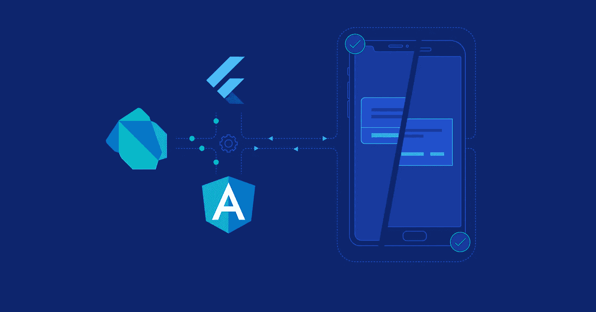
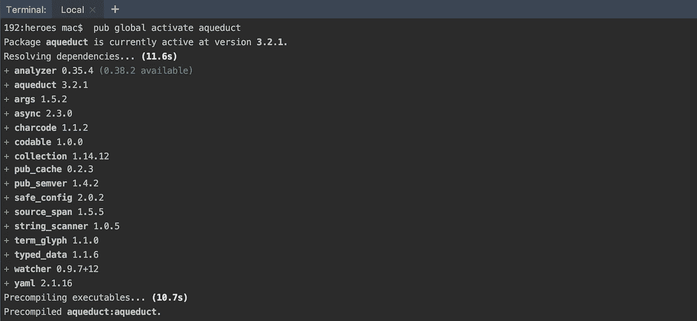
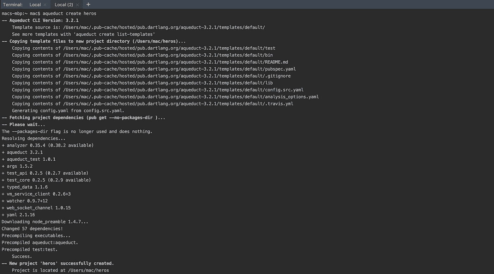
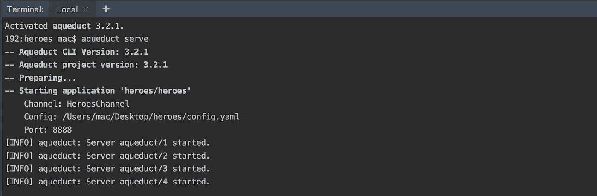

# 第 2 部分:使用 Aqueduct 构建 RESTful 应用程序的完整指南

> 原文：<https://itnext.io/part-2-a-complete-guide-for-building-restful-applications-using-aqueduct-c58688ab8b8e?source=collection_archive---------4----------------------->



来源:[https://bs-uploads . toptal . io](https://bs-uploads.toptal.io/blackfish-uploads/blog/article/content/cover_image_file/cover_image/14556/cover-code-sharing-angular-dart-flutter-bloc-fdde1ea49ed55f1ab00c61d9dabeb97c.png)

这篇文章是我第一篇关于 [**的文章的延续，这是一篇关于使用 Aqueduct**](https://medium.com/@zubairehman.work/part-1-a-complete-guide-for-building-restful-applications-using-aqueduct-668b07f62ad5) **构建 RESTful 应用程序的完整指南。**在上一篇文章中，我们了解了渡槽及其核心概念。在本文中，我们将学习如何使用*配置和构建我们的第一个应用程序。到本文结束时，您将已经创建了一个为虚构的英雄服务的 Aqueduct 应用程序。*

*在我们继续之前，如果您对 Aqueduct 不熟悉，我建议您阅读我的第一篇文章，在这篇文章中，我简要介绍了 Aqueduct 及其核心概念。*

# *介绍*

*Aqueduct 是一个现代的 Dart HTTP 服务器框架。该框架由用于处理和路由 HTTP 请求、对象关系映射(ORM)、身份验证和授权(OAuth 2.0 provider)以及文档(OpenAPI)的库组成。这些库用于构建运行在 Dart VM 上的可伸缩 REST APIs。*

# *入门指南*

*要开始使用，请确保您安装了以下软件:*

1.  *镖([安装说明](https://www.dartlang.org/install)*
2.  *IntelliJ IDEA 或任何其他 Jetbrains IDE，包括免费社区版([安装说明](https://www.jetbrains.com/idea/download/))*
3.  *IntelliJ IDEA Dart 插件([安装说明](https://www.dartlang.org/tools/jetbrains-plugin))*

## *激活导水管*

*在你的终端上运行`pub global activate aqueduct`，激活 ***水道*** 。这将下载并安装使用 Aqueduct **所需的所有依赖项。***

**

## *创建项目*

*在终端上运行 `aqueduct create heroes`创建一个新项目。这将在终端中指定的目录下创建一个`heroes`项目。您可以在 [IntelliJ IDE](https://www.jetbrains.com/idea/download/) 、 [Atom](https://atom.io/) 或 [Visual Studio Code](https://code.visualstudio.com/) 中打开项目目录。这三个 ide 都有可用的 Dart 插件。*

*在项目视图中，找到`lib`目录；这是您的项目的代码将去的地方。这个项目有两个源文件- `heroes.dart`和`channel.dart`。打开文件`heroes.dart`。点击编辑器右上角的`Enable Dart Support`。*

> *注意:项目名必须是 snake_case*

**

*还有其他模板包含使用 **Aqueduct 的** ORM 和 OAuth 2.0 实现的基础代码。这些模板可以列出:*

```
*aqueduct create list-templates*
```

*创建项目时，您可以提供模板的名称以使用该模板:*

```
*aqueduct create -t db [my_project_name]*
```

## *运行项目*

*现在我们已经成功地创建了一个项目，是时候通过简单地从我们的项目目录中运行`aqueduct serve`来运行我们的应用程序了。对于在 IDE 中运行，运行`bin/main.dart`。默认情况下，将使用名为`config.yaml`的配置文件。*

**

*在您的浏览器中输入以下 URL(我使用的是端口 8888。此端口可能与您的不同，并且在启动 aqueduct 服务器后在终端中可见)*

```
*[http://localhost:8888/example](http://localhost:8888/example)*
```

*您应该能够在浏览器中看到以下输出*

```
*{"key":"value"}*
```

*让我们在我们的`heroes`项目中添加更多的代码来获得一个英雄列表，并通过其标识符获得一个英雄。这些请求是:*

1.  *`GET /heroes`获取英雄列表*
2.  *`GET /heroes/:id`获得个人英雄*

*但是在我们深入实现之前，让我们快速看一下我们的请求是如何处理的。*

## *控制器对象处理请求*

*请求由*控制器对象*处理。控制器对象可以响应请求。它还可以采取其他行动，让另一个控制器作出响应。*

*我们的应用程序将连接两个控制器:*

*   *确保请求路径是`/heroes`或`/heroes/:id`的`Router`*
*   *用英雄对象响应的`HeroesControllers`*

*您的应用程序从一个名为`application channel`的通道对象开始。您将应用程序中的控制器链接到该通道。每个应用程序都有一个`ApplicationChannel`的子类，您可以覆盖其中的方法来设置您的控制器。这个类型已经在`lib/channel.dart`中声明了——打开这个文件，找到`ApplicationChannel.entryPoint`:*

```
*@override
  Controller get entryPoint {
    final router = Router();

    router
      .route('/example')
      .linkFunction((request) async {
        return Response.ok({'key': 'value'});
      });

    return router;
  }*
```

*当您的应用程序收到请求时，`entryPoint`控制器首先处理它。在我们的例子中，这是一个`Router`——一个`Controller`的子类。我们需要将路径`/heroes`路由到我们自己的控制器，这样我们就可以控制发生了什么。*

*让我们通过在`lib/controller/heroes_controller.dart`中创建一个新文件来创建一个`HeroesController`，并添加以下代码(您将需要创建子目录`lib/controller/`):*

```
*import 'package:aqueduct/aqueduct.dart';
import 'package:heroes/heroes.dart';

class HeroesController extends Controller {
  final _heroes = [
    {'id': 11, 'name': 'Captain America'},
    {'id': 12, 'name': 'Ironman'},
    {'id': 13, 'name': 'Wonder Woman'},
    {'id': 14, 'name': 'Hulk'},
    {'id': 15, 'name': 'Black Widow'},    
  ]; @override
  Future<RequestOrResponse> handle(Request request) async {
    return Response.ok(_heroes);
  }
}*
```

*注意，`HeroesController`是`Controller`的子类，它通过返回 200 OK 状态码和包含 JSON 编码的英雄列表`Response`对象的主体来覆盖`handle`方法。*

*现在，我们的`HeroesController`还没有连接到应用程序通道。我们需要把它连接到路由器上。首先，在`channel.dart`的顶部导入我们的新文件。*

```
*import 'controller/heroes_controller.dart';*
```

*然后将此`HeroesController`链接到路径`/heroes`的`Router`:*

```
*@override
Controller get entryPoint {
  final router = Router(); router
    .route('/heroes')
    .link(() => HeroesController()); router
    .route('/example')
    .linkFunction((request) async {
      return Response.ok({'key': 'value'});
    }); return router;
}*
```

*我们现在有一个应用程序将返回一个英雄列表。让我们使用`Ctrl+ c`停止我们的应用程序，并通过从命令行运行以下命令来重新启动:*

```
*aqueduct serve*
```

*在浏览器中输入以下 URL*

```
*[http://localhost:8888/heroes](http://localhost:8888/heroes)*
```

*您应该能够在浏览器中看到以下输出*

```
*[
  {"id":11,"name":"Captain America"},
  {"id":12,"name":"Ironman"},
  {"id":13,"name":"Wonder Woman"},
  {"id":14,"name":"Hulk"},
  {"id":15,"name":"Black Widow"}
]*
```

*恭喜你，你已经完成了第一部分的设置，这是得到一个`heroes`的列表。现在，让我们继续下一步，通过提供单个`hero`的`:id`来检索它。*

## *高级路由*

*现在，我们的应用程序处理`GET /heroes`请求。现在我们想发送一个请求来找回一个英雄。让我们修改`channel.dart`中的`/heroes`路线，并添加以下代码:*

```
*router
  .route('/heroes/[:id]')
  .link(() => HeroesController());*
```

*方括号内的任何内容都是可选的，在我们的例子中，它是我们路线的`:id`部分。让我们修改`heroes_controller.dart`来增加对处理单个英雄请求的支持。*

```
*@override
Future<RequestOrResponse> handle(Request request) async {
  if (request.path.variables.containsKey('id')) {
    final id = int.parse(request.path.variables['id']);
    final hero = _heroes.firstWhere((hero) => hero['id'] == id, orElse: () => null);
    if (hero == null) {
      return Response.notFound();
    } return Response.ok(hero);
  } return Response.ok(_heroes);
}*
```

*让我们重新启动我们的应用程序，并通过在浏览器中键入以下 URL 来发出单个英雄请求:*

```
*http://localhost:8888/heroes/11*
```

*输出将是这样的:*

```
*{"id":11,"name":"Captain America"}*
```

> *注意:也可以使用终端做请求，例如:curl-X GET[http://localhost:8888/heroes/11](http://localhost:8888/heroes/11)。你也可以通过获得一个不存在的英雄来触发 404 未找到响应。*

*我们的`HeroesController`现在还可以，但是很快就会遇到一个问题:当我们想要创造一个新英雄的时候会发生什么？或者更新一个现有英雄的名字？我们的`handle`方法将很快变得难以控制。*

*这就是`ResourceController`的用武之地。*

## *资源控制器和操作方法*

*一个`ResourceController`允许你为我们可以在英雄身上执行的每个操作创建一个独特的方法。*

*在`heroes_controller.dart`中，用以下内容替换`HeroesController`:*

```
*class HeroesController extends ResourceController {
  final _heroes = [
    {'id': 11, 'name': 'Captain America'},
    {'id': 12, 'name': 'Ironman'},
    {'id': 13, 'name': 'Wonder Woman'},
    {'id': 14, 'name': 'Hulk'},
    {'id': 15, 'name': 'Black Widow'},
  ]; @Operation.get()
  Future<Response> getAllHeroes() async {
    return Response.ok(_heroes);
  } @Operation.get('id')
  Future<Response> getHeroByID() async {
    final id = int.parse(request.path.variables['id']);
    final hero = _heroes.firstWhere((hero) => hero['id'] == id, orElse: () => null);
    if (hero == null) {
      return Response.notFound();
    } return Response.ok(hero);
  }
}*
```

*请注意，我们不必覆盖`ResourceController`中的`handle`。一个`ResourceController`实现这个方法来调用我们的一个*操作方法*。像`getAllHeroes`和`getHeroByID`这样的操作方法必须有一个`Operation`注释。命名构造函数`Operation.get`意味着当请求的方法是`GET`时，这些方法被调用。操作方法也必须返回一个`Future<Response>`。*

*`getHeroByID`的注释也有一个参数——我们的路径变量`:id`的名称。如果该路径变量存在于请求的路径中，将调用`getHeroByID`。如果不存在，就会调用`getAllHeroes`。*

## *请求绑定*

*一个操作方法可以声明参数并将它们绑定到请求的属性上。当我们的操作方法被调用时，请求中的值将作为参数传递给它。请求绑定自动将值解析为参数的类型(如果解析失败，则返回更好的错误响应)。改变方法`getHeroByID()`:*

```
*@Operation.get('id')
Future<Response> getHeroByID(@Bind.path('id') int id) async {
  final hero = _heroes.firstWhere((hero) => hero['id'] == id, orElse: () => null); if (hero == null) {
    return Response.notFound();
  } return Response.ok(hero);
}*
```

*恭喜，我们已经创建了一个为虚构英雄服务的沟渠应用程序。到目前为止，我们都是将数组硬编码到代码中。我们接下来要做的是将英雄存储到数据库中并执行 CRUD 操作。*

*感谢您的阅读！欢迎在 LinkedIn [@zubairehman](https://www.linkedin.com/in/zubairehman/) 或在下面的回复中打招呼或分享你的想法！*

# *下一篇文章*

*故事还没有结束，在下一篇文章中，我们将学习如何使用 PostgreSQL 配置和执行 CRUD 操作，敬请关注:)*

*这篇文章的其他部分:*

*   *[第 1 部分:使用 Aqueduct 构建 RESTful 应用程序的完整指南(核心概念)](https://medium.com/@zubairehman.work/part-1-a-complete-guide-for-building-restful-applications-using-aqueduct-668b07f62ad5)*
*   *第 2 部分:使用 Aqueduct 构建 RESTful 应用程序的完整指南(应用程序开发)*
*   *第 3 部分:使用 Aqueduct 构建 RESTful 应用程序的完整指南(DB 配置，即将推出)*

# *有用的资源*

*【http://aqueduct.io/docs/ *

****这篇文章到此为止，如果你喜欢这篇文章，别忘了拍手👏尽可能多的表达你的支持，留下你的评论并与你的朋友分享。****