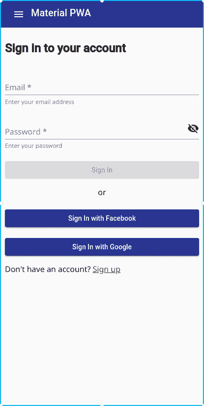
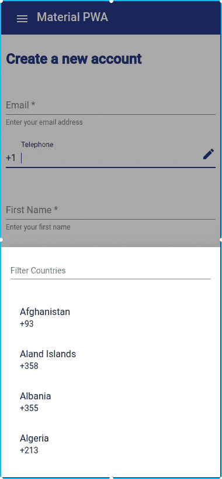
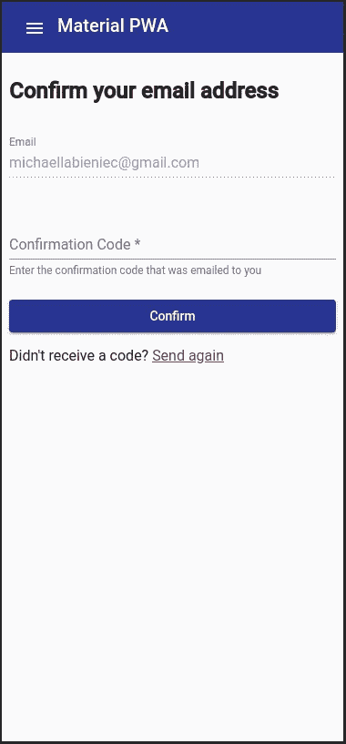

# 第 2 部分:为您的角材料添加认证& AWS Amplify powered PWA

> 原文：<https://itnext.io/part-2-adding-authentication-to-your-angular-material-aws-amplify-powered-pwa-2a9d0fbd305a?source=collection_archive---------1----------------------->


照片由[威廉·艾文](https://unsplash.com/photos/gcsNOsPEXfs?utm_source=unsplash&utm_medium=referral&utm_content=creditCopyText)在 [Unsplash](https://unsplash.com/search/photos/app-sign-up?utm_source=unsplash&utm_medium=referral&utm_content=creditCopyText) 拍摄

这是一个多章节系列的第二部分，概述了为移动和桌面构建一个全功能的多平台渐进式 Web 应用程序(PWA)。

*   [第 1 部分:使用角度/材料、web 应用程序清单、服务人员、图标进行构建，并添加到主屏幕功能。使用 AWS Amplify CLI 部署到 AWS。](/part-1-building-a-progressive-web-application-pwa-with-angular-material-and-aws-amplify-5c741c957259)
*   **第 2 部分(你在这里)** : **添加了与 Amazon Cognito、Social Federation 的认证，并支持个人用户资料存储。**

如果您尚未完成[第 1 部分](https://medium.com/p/5c741c957259)，您至少需要参考设置部分，以安装 Amplify CLI 和其他要求。为了开始向我们的 PWA 添加身份验证，我们将使用 Amplify CLI 来生成一个使用 Amazon Cognito 用户池的身份验证配置。我们还将增加亚马逊 S3 的存储空间，用于存储用户个人资料头像和带有自定义属性的个人资料信息。

本节涉及到相当多的样板代码，因为它涉及到从头创建一个定制的验证器组件。因此，我将介绍如何基于第 1 部分的代码在 Angular 中生成组件和服务，然后提供 Angular 中功能的细节。

**完整的应用代码可以在开源** [**Github 库**](https://github.com/mlabieniec/AngularMaterialPWA) **的** `[**partTwo**](https://github.com/mlabieniec/AngularMaterialPWA/tree/master/partTwo)` **中找到。**

**重要提示:**在开始之前，请务必通读 aws-amplify 文档中“[社交提供者设置](https://aws-amplify.github.io/docs/js/authentication#social-provider-setup)”部分的社交联盟部分，并检索 CLI 所需的社交配置项目。

从第一部分中完成的应用程序代码开始，从 Angular 应用程序的根开始:

> 如果你是从零开始，你需要先运行`amplify init`。关于初始化项目的步骤，参见第一部分的最后一节。

```
$ amplify add auth**❯ Apply default configuration with Social Provider (Federation)**What do you want to do? Apply default configuration with Social Provider (Federation)
 What domain name prefix you want us to create for you? 
  **materialpwa**
 Enter your redirect signin URI : 
  [**http://localhost:4200/auth/**](http://localhost:4200/oauth/)
? Do you want to add another redirect signin URI 
  **No**
 Enter your redirect signout URI: 
  [**http://localhost:4200/auth/**](http://localhost:4200/signout/)**signin**
? Do you want to add another redirect signout URI 
  **No**
 Select the identity providers you want to configure for your user pool: 
  **Facebook, Google**

 Enter your Facebook App ID for your OAuth flow:  
  **<facebook-app-id>**
 Enter your Facebook App Secret for your OAuth flow:  
  **<facebook-app-secret>**

 Enter your Google Web Client ID for your OAuth flow: 
  **<google-client-id>**
 Enter your Google Web Client Secret for your OAuth flow: 
  **<google-client-secret>**
Successfully updated resource cognitoXXXXXX locally
```

这将使用 AWS CloudFormation 引导您的 AWS 云环境，并使用 AWS Amplify 团队提供的一些预烤的最佳实践创建 Amazon Cognito 用户池和联合身份设置。默认设置包括:

*   注册时的电子邮件确认(您将通过电子邮件收到一个代码，您将在用户界面中输入该代码)。
*   它不包含多因素身份验证(MFA)。您可以随时通过运行`amplify auth update`并选择第二个选项来启用 MFA，或者通过 AWS 控制台启用它(这将导致您的 CloudFormation 设置漂移，如果您通过 CLI 更新 auth，它可能会被覆盖)。
*   Amazon Cognito 用户池的社会联盟将完全由 Amplify JS 库处理。

接下来，添加存储并选择`Content (Images, audio, video, etc.)`:

```
$ amplify add storage
? Please select from one of the below mentioned services (Use arrow keys)
**❯ Content (Images, audio, video, etc.)**
  NoSQL Database
? Please provide a friendly name for your resource that will be used to label thi
s category in the project: (...) **<press-enter>**
? Please provide bucket name: (...) **<press-enter>** ? Who should have access: (Use arrow keys)
**❯ Auth users only** 
  Auth and guest users
? What kind of access do you want for Authenticated users (Use arrow keys)
  read 
  write 
**❯ read/write**
```

现在将您的配置推送到云中。

```
$ amplify pushCurrent Environment: development| Category | Resource name   | Operation | Provider plugin   |
| -------- | --------------- | --------- | ----------------- |
| Auth     | cognitoXXXXXXX | Create    | awscloudformation |
| Storage  | sXXXXXXXX      | Create    | awscloudformation |
? Are you sure you want to continue? **Yes**...CloudFormation Logs...✔ All resources are updated in the cloud
```

一旦完成，就会生成一个文件:`src/aws-exports.js` ，该文件将用于访问我们的 Angular 应用程序中的 Auth 和 Storage APIs。接下来，从 Angular 应用程序的根目录安装 Amplify JavaScript 库:

```
$ npm install --save aws-amplify
```

即使我们正在安装整个库，我们也只会将 Auth 和 Storage 模块导入到我们的应用程序中。Amplify 提供了[模块化导入](https://hackernoon.com/modular-imports-with-aws-amplify-daeb387b6985)，这样你就可以保持你的应用程序较小，并且只访问你将从库中使用的功能。Amplify 库在幕后利用了 AWS JavaScript SDK。AWS JavaScript SDK 使用节点类型，因此您需要将它们添加到 typescript 配置文件中。

编辑`src/tsconfig.app.json`并将“节点”添加到编译器选项的`types`数组中:

```
{
  "extends": "../tsconfig.json",
  "compilerOptions": {
    "outDir": "../out-tsc/app",
    **"types": ["node"] // <-- add "node" here**
  },
"exclude": [
  "test.ts",
  "**/*.spec.ts"
  ]
}
```

我们还需要将 polyfill 添加到`src/polyfills.ts`文件中，因为 Angular(在 6+中)删除了框架中对`global`的引用，(*针对 Angular 8 进行了更新，也删除了 process 属性，这是另一个服务器端 JavaScript 属性)，它被 AWS SDK 组件引用，因为 AWS SDK for JavaScript 在 node.js 环境中也受支持，而 Angular 不受支持。

编辑`src/polyfills.ts` 并将以下行添加到文件顶部:

```
(window *as* any).global = window;
(window as any).process = {
    env: { DEBUG: undefined },
};
```

> 如果您有一个正在运行的 live development server，您将需要终止它并在此时重新启动它，以便在此时编译类型。

通过编辑`src/main.ts`文件，在我们的 Angular 应用程序中导入并配置 Amplify 框架:

```
*import* 'hammerjs';
*import* { enableProdMode } *from* '@angular/core';
*import* { platformBrowserDynamic } *from* '@angular/platform-browser-dynamic';
*import* { AppModule } *from* './app/app.module';
*import* { environment } *from* './environments/environment';// Amplify Configurationimport Auth from '@aws-amplify/auth';
import Storage from '@aws-amplify/storage';
import AWSConfig from './aws-exports';
Storage.configure(AWSConfig);
Auth.configure(AWSConfig);// End Amplify Configuration*if* (environment.production) {
  enableProdMode();
}platformBrowserDynamic().bootstrapModule(AppModule)
  .catch(err => console.error(err));
```

接下来，我们将使用 Angular CLI 生成一组视图组件，这些组件将用于创建自定义身份验证视图。我们将为用户提供仅使用电子邮件和密码通过 Cognito 用户池登录的能力，创建新帐户，并验证他们在创建新帐户时使用的电子邮件地址。我们将使用有角度的[路线守卫](https://angular.io/guide/router#guards)来锁定我们的认证视图，并且在登录时不显示我们的登录/注册视图。警卫将根据身份验证状态进行适当的重定向。我们还将直接对 Amplify 中的 Hub 模块使用 Auth API 来监听认证状态。

用户界面(UI)将利用[角度反应表单](https://angular.io/guide/reactive-forms)进行表单验证。表单组件和服务需要添加到 [app.modules.ts](https://github.com/mlabieniec/AngularMaterialPWA/blob/master/partTwo/src/app/app.module.ts#L9) 中。将`FormsModule`和`ReactiveFormsModule`复制到`imports`数组中。

```
imports: [
  ...
  **FormsModule**,    
  **ReactiveFormsModule,
  ...**],
```

现在，您将生成许多应用程序服务和组件。下面的每个链接/解释都将链接到要复制到您的应用程序中的源代码。

为将在应用程序内跨组件使用的共享服务创建一个目录。然后使用 Angular CLI 生成服务(从应用程序的根目录):

```
mkdir src/app/services
ng g service services/compressor
ng g service services/notification
```

通过每个服务的链接复制 GitHub 上的代码。[压缩器服务](https://raw.githubusercontent.com/mlabieniec/AngularMaterialPWA/master/partTwo/src/app/services/compressor.service.ts)用于在将图像上传到 S3 之前对其进行压缩。[通知服务](https://raw.githubusercontent.com/mlabieniec/AngularMaterialPWA/master/partTwo/src/app/services/notification.service.ts)被用作[Angular Material snack bar](https://material.angular.io/components/snack-bar)组件的包装器，以简化 API 的使用并在应用程序中显示临时通知。

接下来，为应用程序视图生成组件。

```
ng g component auth
ng g component loader --entryComponent
ng g service loader/loader 
ng g component auth/countryCodeSelect --entryComponent 
ng g class auth/country-code-select/countryCodes
ng g pipe auth/country-code-select/filter
ng g component auth/signIn
ng g component auth/signUp
ng g component auth/confirmCode
ng g component auth/profile
ng g component auth/profile/avatar
```

这些组件的源代码可以在 GitHub 资源库中找到，单击每个组件可以检索其源代码，并将其内容复制/粘贴到您的应用程序组件中。

*   [Auth](https://github.com/mlabieniec/AngularMaterialPWA/tree/master/partTwo/src/app/auth) :处理认证路由和视图的主要组件。auth 组件仅充当路由器出口。每个子组件都包含身份验证功能的视图，即登录、注册。
*   [加载器](https://github.com/mlabieniec/AngularMaterialPWA/tree/master/partTwo/src/app/loader):显示模态加载对话框的组件，带有材料进度指示器和显示/隐藏加载器的服务。该服务可以注入到任何组件中，并提供显示 UI 的视图切换功能。
*   角度环境将用于将确认信息(电子邮件/通行证)传递给确认代码组件。这允许您在确认后自动登录用户。更新[环境](https://github.com/mlabieniec/AngularMaterialPWA/tree/master/partTwo/src/environments) ts 文件以包含以下属性对象:

```
confirm: {
   email: '',
   password: ''
}
```

*   [confirmCode](https://github.com/mlabieniec/AngularMaterialPWA/tree/master/partTwo/src/app/auth/confirm-code) :注册后确认邮箱地址的界面。
*   [登录](https://github.com/mlabieniec/AngularMaterialPWA/tree/master/partTwo/src/app/auth/sign-in):新用户登录界面。**注意:**如果您在这些视图上提供您的应用程序，您将会看到一个错误，直到您实现下一节中的防护。
*   [注册](https://github.com/mlabieniec/AngularMaterialPWA/tree/master/partTwo/src/app/auth/sign-up):用户创建新账户的界面。
*   [countryCodeSelect](https://github.com/mlabieniec/AngularMaterialPWA/tree/master/partTwo/src/app/auth/country-code-select) :为电话号码选择国家代码的 UI 组件。该组件包含一个视图和一个[角度管道过滤器](https://angular.io/guide/pipes)以及一个国家代码数据的类。
*   [profile](https://github.com/mlabieniec/AngularMaterialPWA/tree/master/partTwo/src/app/auth/profile) :显示存储为 [Cognito 自定义属性](https://docs.aws.amazon.com/cognito/latest/developerguide/user-pool-settings-attributes.html)的用户资料信息的 UI。
*   [avatar](https://github.com/mlabieniec/AngularMaterialPWA/tree/master/partTwo/src/app/auth/profile/avatar) :用于通过文件输入和拖放界面显示和上传图片的 UI。该文件以每个用户为基础上传并存储在亚马逊 S3，以 [Cognito 身份 ID 作为前缀](https://aws-amplify.github.io/docs/js/storage#file-access-levels)。

现在，您的应用程序中应该有以下目录结构:

```
- src
  - app
    - auth
      - confirm-code
      - country-code-select
      - profile
        - avatar
      - sign-in
      - sign-up
    - home 
    - ios-install 
    - loader
    - material
```

我们将使用角度防护装置来锁定我们只希望对已登录用户可用的视图，并且在相反的情况下，只锁定对未登录用户可用的视图，即登录/注册视图。从`src/app/auth`目录运行以下命令:

```
ng generate service auth/auth --module=app.module
ng generate guard auth/auth 
? Which interfaces would you like to implement? 
**❯◉ CanActivate**
 ◯ CanActivateChild
 ◯ CanLoad
ng generate guard auth/unauth
? Which interfaces would you like to implement? 
**❯◉ CanActivate**
 ◯ CanActivateChild
 ◯ CanLoad
```

这些文件的源代码可以在 GitHub 资源库中找到。单击每个项目以检索其源代码，并将其内容复制/粘贴到您的应用程序组件中。

*   [AuthService](https://github.com/mlabieniec/AngularMaterialPWA/blob/master/partTwo/src/app/auth/auth.service.ts) :包装 Amplify SignIn 和 SignUp APIs 并公开与 Amplify Hub 事件分配器相关的 Angular Observable 的服务，提供身份验证状态更改事件。
*   [auth Guard](https://github.com/mlabieniec/AngularMaterialPWA/blob/master/partTwo/src/app/auth/auth.guard.ts):Angular Router Guard，用于在激活某些路由之前检查认证会话。在我们的应用程序中，只有根路由器`\`需要认证会话才能激活。
*   [un Guard](https://github.com/mlabieniec/AngularMaterialPWA/blob/master/partTwo/src/app/auth/unauth.guard.ts):Angular Router Guard，用于检查认证会话，并在未登录到应用程序时显示登录/注册视图。

要启用路由保护，请在 [app-routing.module.ts](https://github.com/mlabieniec/AngularMaterialPWA/blob/master/partTwo/src/app/app-routing.module.ts) 文件中引用它们:

```
const routes: Routes = [  
  { path: 'auth', component: AuthComponent, children: [    
     {      
        path: 'signin',      
        component: SignInComponent,      
        **canActivate: [UnauthGuard] **   
     },    
     {      
        path: 'signup',
        component: SignUpComponent,
        **canActivate: [UnauthGuard]**    
     },    
     {
        path: 'confirm',
        component: ConfirmCodeComponent,
        **canActivate: [UnauthGuard] **   
     },    
     {
        path: 'profile',
        component: ProfileComponent,
        **canActivate: [AuthGuard]**
     }  
  ]},  
  { path: '', component: HomeComponent, **canActivate: [AuthGuard]** }];
```

您的应用程序现在应该可以服务了。为了测试 PWA，在 UI 开发过程中运行`ng serve`更容易。因为服务人员将缓存这些视图，使得实时重新加载变得困难。立即使用以下工具测试您的应用:

```
ng serve
```

您的应用程序应该在端口 4200 上可用。在菜单中点击我的帐户(第 2 部分)，你应该有一个自定义材料设计的动态表单验证验证器。



登录社交提供商



带有国家代码选择器的电话

当您注册新帐户时，您将收到一个确认屏幕，要求您输入通过电子邮件发送给您的代码。



当您输入此代码时，我们使用存储在环境中的信息来让用户自动登录到，这样他们就不必返回到登录屏幕。一旦确认，你应该被直接送到首页查看。

当导航到诸如登录或注册之类的内容时。未授权将阻止视图加载，并自动将用户重新路由到纵断面图。profile 视图将显示注册时输入的值，并允许对它们进行编辑(Cognito 中的自定义资源)。它还将托管用于上传头像图像到 S3 的头像组件。avatar 组件支持使用文件输入，以及将图像拖放到图片画布上。

**感谢查看帖子！如果您遇到问题或 bug**[**请在 GitHub**](https://github.com/mlabieniec/AngularMaterialPWA/issues/new/choose) **中发帖，也欢迎拉请求。**