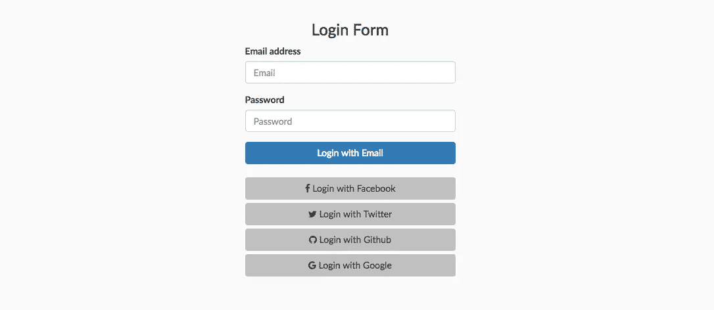
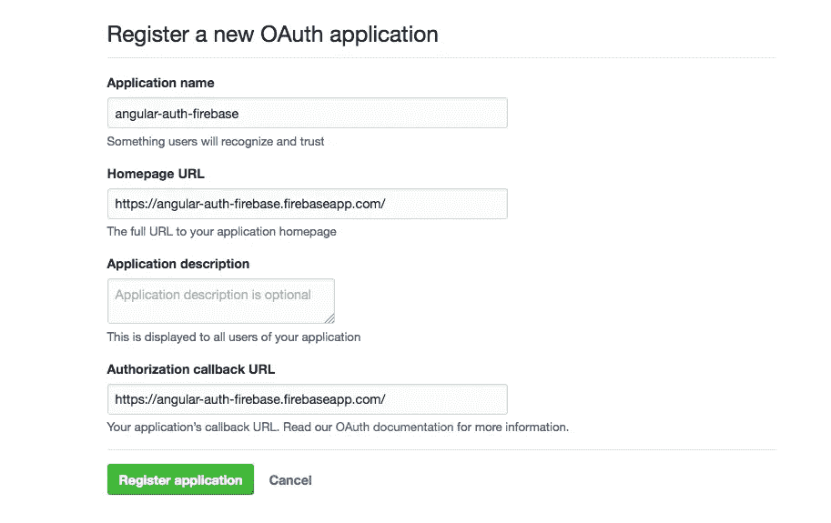
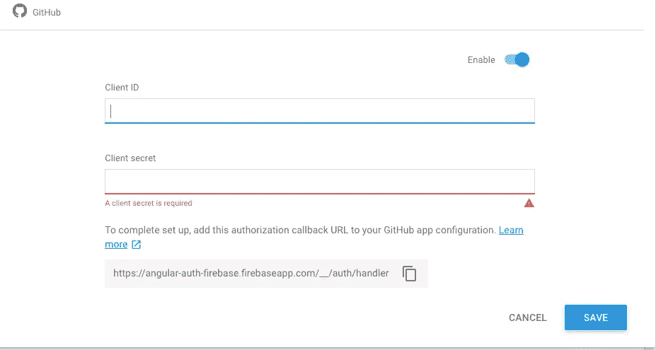

# 在 Angular 2 中完成逐步 Firebase 身份验证—第 2 部分

> 原文：<https://itnext.io/part-2-complete-step-by-step-firebase-authentication-in-angular-2-25d284102632?source=collection_archive---------0----------------------->



这是一篇后续文章。如果你还没有看完第一部分，可以在这里找到。第一部分包括:

*   添加启动角度(2)应用程序。
*   添加身份验证
*   Twitter 认证
*   脸书认证
*   Gmail 认证

第 2 部分将带您了解以下内容:

*   保护仪表板页面和其他受保护的页面
*   添加注销功能
*   使用 Github 帐户进行认证
*   常规注册/登录

*注意，你可以在*[*github*](https://github.com/hellotunmbi/angular2-authentication-firebase)*上找到完整的代码。*

[*点击这里在 LinkedIn 上分享这篇文章*](https://www.linkedin.com/cws/share?url=https%3A%2F%2Fitnext.io%2Fpart-2-complete-step-by-step-firebase-authentication-in-angular-2–25d284102632)

**让我们开始吧！**

## 添加注销功能

我们在`auth.service.ts`文件中实现了注销功能。让我们在导航中添加按钮，并添加触发 auth.service 中已有的注销功能的 click 事件:

```
// dashboard.component.html
...<div id="navbar" class="navbar-collapse collapse"> <ul class="nav navbar-nav"> <li class="active"><a>Home</a></li> <li><a>About</a></li> <li><a>Contact</a></li> </ul> **<ul class="nav navbar-nav navbar-right">** **<li><a href="" (click)="authService.logout()">Logout</a></li>** **</ul>**...
```

# 保护仪表板页面

仪表板页面只需要经过身份验证的用户访问。这里的步骤将指导您保护其他需要身份验证的页面。因为这只是演示，所以我们只有一个受保护的页面—仪表板。

保护页面中使用的角称为**导航路线保护装置**，共有 5 个。以下是它们以及它们的使用场景:

`CanActivate` —用于决定**路线**是否可以被**激活**

`CanActivateChild` —用于决定**路径子**是否可以被**激活**

`CanDeactivate` —用于决定**路径**是否可以**去激活**

`CanLoad`——决定孩子是否可以装。用于延迟加载

`Resolve`——在路线激活前执行路线数据检索*。*

关于这些路线防护装置的更多细节可在[角度文件](https://angular.io/guide/router#milestone-5-route-guards)中找到

为我们服务的路线守卫是`CanActivate`守卫，这就是我们将要使用的。

**向仪表板页面添加防护装置**

*   在终端中运行`ng generate service services/auth-guard`来生成 AuthGuard，并将其放在 services 文件夹中。
*   因为服务不是在 app 模块中提供的。我们需要将其导入并添加到 app.module.ts 文件中@NgModule decorator 下的提供者中
*   打开`app.routes.ts`并从'导入 AuthGuard。/services/auth-guard . service '；
*   将`canActivate: [AuthGuard]`添加到仪表板路径。

这是我们的 AuthGuard 类

```
// services/auth-guard.service.tsimport { AuthService } from './auth.service';
import { Injectable } from '@angular/core';
import { Router, CanActivate } from '@angular/router';@Injectable()
export class AuthGuard implements CanActivate { constructor(private router: Router, private authService: AuthService) { } canActivate() { if ( this.authService.isLoggedIn() ) { return true; } this.router.navigate(['/']); return false; }}
```

这里，我们通过导入 CanActivate 类、添加路由器(因为如果用户没有登录，我们需要它来重定向用户)、添加 AuthService 来检查身份验证，来创建 AuthGuard 功能。

如果没有登录就去`http://localhost:4200/dashboard`，会被踢出去，重定向到登录页面。

# 使用 Github 帐户验证

这和其他步骤一样简单。但是首先，[在 Github 上注册你的应用](https://github.com/settings/applications/new)成为开发者。您将获得 OAuth 客户端 ID 和客户端密码。

转到 Firebase 仪表板>开发>登录方法，然后单击 Github。单击“启用”允许您输入 id:



向 Github 注册您的应用程序



在 Firebase 仪表板中启用 GitHub 登录

## **在登录页面的“使用 Github 登录”按钮中添加点击事件。**

我们在 login/login.component.html 文件中编辑它，如下所示:

```
// login/login.component.html...<button type="button" class="btn btn-block (click)="signInWithGithub()">
   <i class="fa fa-github" aria-hidden="true"></i>Login with Github
</button>...
```

创建 Github 登录功能

在`login/login.component.ts`文件中，我们添加了处理点击事件的函数。这里:

```
// login/login.component.ts...
signInWithGithub() { this.authService.signInWithGithub()
         .then((res) => {
            this.router.navigate(['dashboard'])
         })
         .catch((err) => console.log(err));
    }
...
```

## 将 Github 登录添加到 AuthService

从上面的代码中，我们从 authService 调用了`signInWithGithub()`，所以我们需要创建那个函数:

```
// services/auth.service.ts...
signInWithGithub() {
    return this._firebaseAuth.auth.signInWithPopup(
        new firebase.auth.GithubAuthProvider()
    )
}...
```

答对了。我们已经结束了。我没告诉过你吗，这很简单？现在你可以用你的 Github 账户登录了。

# 使用电子邮件和密码定期登录

Firebase API 现在允许我们创建一个带有电子邮件/密码的用户，并在一个表单中登录。为了为此准备我们的应用程序，我们做了以下工作:

将 name、method 和 ngForm 属性标签添加到`login.component.ts`文件中的`<form>`标签，使其:

```
<form name="userform" method="post" #formCtrl="ngForm">
```

导入`FormsModule`并将其添加到`app.module.ts`中的导入。这将允许我们在我们的登录表单中使用`[(ngModel)]`。

```
// app.module.ts
...
import { FormsModule } from '@angular/forms';...imports: [
  BrowserModule,
  AppRoutes,
 **FormsModule,**
  AngularFireModule.initializeApp(environment.firebase, 'angular-auth-firebase'),
  AngularFireDatabaseModule,
  AngularFireAuthModule
],...
```

将`ngModel`添加到`login.component.html`中的用户名和密码输入字段

```
// login/login.component.html...
<div class="form-group">
  <label for="exampleInputEmail1">Email address</label>
  <input type="email" class="form-control" **[(ngModel)]="user.email"** placeholder="Email" **required**>
</div><div class="form-group">
  <label for="exampleInputPassword1">Password</label>
  <input type="password" class="form-control" **[(ngModel)]="user.password"** placeholder="Password" **required**>
</div>
...
```

当输入字段为空时禁用按钮。在*用电子邮件登录*按钮上执行此操作

```
// login/login.component.html
...
<div class="form-group">
   <button type="buton" class="btn btn-primary btn-block" style="margin-bottom: 20px" (click)="signInWithEmail()" [disabled]="formCtrl.form.invalid"> Login with Email

   </button>
</div>
...
```

在我们的`login.component.ts`中，我们将把用户输入绑定到用户对象，这样我们就可以把它传递给 EmailAuthProvider 函数。

我们加上这个，就在`export class LoginComponent implements OnInit {`下面

```
user = {
   email: '',
   password: ''
};
```

接下来，我们创建`signInWithEmail`函数。这个函数将从我们的 AuthService 调用`signInRegular`函数，传递电子邮件和密码作为参数。这里:

```
// login.component.ts...
signInWithEmail() {
   this.authService.signInRegular(this.user.email, this.user.password)
      .then((res) => {
         console.log(res);

         this.router.navigate(['dashboard']);
      })
      .catch((err) => console.log('error: ' + err));
}
...
```

现在，让我们在我们的`AuthService`类中创建`signInRegular`函数。

```
// auth.service.ts...
signInRegular(email, password) { const credential = firebase.auth.EmailAuthProvider.credential( email, password );return this._firebaseAuth.auth.signInWithEmailAndPassword(email, password)}
...
```

一切都好极了！

快速回顾一下

在这个第 2 部分([第 1 部分可以在这里找到](https://medium.com/@hellotunmbi/step-by-step-complete-firebase-authentication-in-angular-2-97ca73b8eb32))系列中，我们实现了以下内容:

*   保护仪表板页面
*   使用 Github 登录进行认证
*   使用常规电子邮件/密码进行身份验证
*   增加了注销功能

谢谢你一直坚持到这个阶段。如果你遇到任何挑战或有更好的方法来实现这一点，请随时发表评论。

你也可以在 [Twitter](https://twitter.com/hellotunmbi) 和 [Github](https://github.com/hellotunmbi) 上关注我

如果你觉得这篇文章很有帮助，并且想阅读更多，知道我什么时候发表相关文章，请[订阅我的简讯](https://tinyletter.com/hellotunmbi)。我保证不会给你发垃圾邮件。

[](https://www.buymeacoffee.com/hellotunmbi)