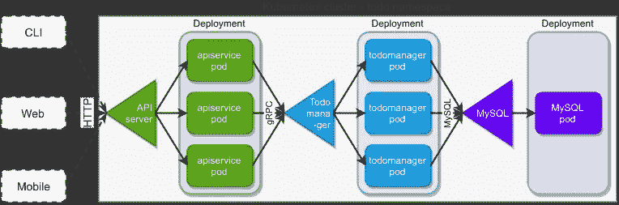

# 第 2 部分:使用云原生堆栈创建微服务应用程序

> 原文：<https://itnext.io/part-2-creating-the-microservice-application-with-the-cloud-native-stack-5a3f4ab412c9?source=collection_archive---------4----------------------->

*关于如何使用基于 Kubernetes 的平台轻松获得集中式日志记录、更好的安全性、性能指标和身份验证的深入系列。这是我们教程的第二部分。如果你还没看过，请查看第 1 部分，* [*云原生栈如何帮助编写最小微服务。*](https://www.giantswarm.io/blog/how-the-cloud-native-stack-helps-writing-minimal-microservices/)

# 介绍

在这一节中，我们将重点关注应用程序的创建。我们将从需求和架构开始，然后转向实际的代码。请注意，我们在[第 1 部分](https://www.giantswarm.io/blog/how-the-cloud-native-stack-helps-writing-minimal-microservices/)中准备的与云原生平台集成的代码几乎没有任何变化。

# 要求

为了展示我们基于 Kubernetes 的平台可以为应用程序开发人员提供什么，我们将在微服务架构中创建一个典型的“待办事项”应用程序。

让我们从我们对它的要求开始。

创建待办事项列表管理应用程序，该应用程序:

*   允许用户创建、删除和更新待办事项条目。
*   将所有待办事项条目保存在一个列表中。
*   应用程序的每个用户都有自己的列表，并且只能访问自己创建的条目。
*   组件需要是可伸缩的。
*   日志需要以 JSON 格式的结构化方式提供。
*   因为目标平台是 Kubernetes，所以我们需要支持[就绪探测](https://kubernetes.io/docs/tasks/configure-pod-container/configure-liveness-readiness-startup-probes/)。
*   为了便于配置，需要使用环境变量来配置组件。

# 体系结构

既然我们已经有了我们的需求，是时候将我们的焦点转移到应用程序的架构上了。我们将创建两个主要组件，并使用 MySQL 数据库作为它们的持久数据存储。

这个想法如下图所示:

我们的应用程序将提供一个基于 HTTP 的 REST 接口。向客户端公开 API 是绿色的“API 服务”层的任务。这一层将负责处理 HTTP 请求、验证它们、记录所有请求并提供身份验证。当我们从客户端抽象出来时，这个 API 可以被任何可以发送 HTTP 请求的东西使用，包括移动、web 甚至 CLI 应用程序。

为了限制这篇博客的范围，我们不会实现实际的客户端，我们将只使用`curl`命令来测试 API。我们还只在普通 HTTP 上公开 API，当然，这在生产中是不可接受的，但是我们还是要稍微限制一下范围。这也将使测试更容易，将我们从关心 HTTPS 证书中解放出来。

在上面的架构图中，API 服务是我们系统的网关。当一个请求通过这个网关时，在它的后面是不同微服务的土地，它们合作提供必要的服务。在我们的例子中，应用程序非常简单，整个业务逻辑由一个名为“todo manager”的服务提供。为了更好地展示 Kubernetes 平台如何允许您部署和管理多协议多语言解决方案，我们在这里将通信协议切换到 gRPC。因为我们希望我们的“todo 服务”是无状态的并且易于扩展，所以它不会保留任何持久数据。这项任务将委托给我们注入到解决方案中的 MySQL 数据库。

# 履行

如果您对实现细节不感兴趣，只想构建并运行应用程序，那么代码已经在存储库中了，所以请跳到构建应用程序。

我们需要实现两个服务，一个是 HTTP 服务器，一个是 gRPC。我们将两者都使用 Golang，因为它非常适合我们基于 Kubernetes 的环境，并且我们可以使用一些现有的工具和库以非常有效的方式创建我们的代码。这里我不会涉及每一行代码，只指出一些比较重要的部分。

让我们从一些基本的东西开始:我们两个服务的通信契约。

我们需要为我们的两个微服务定义一个通信接口。首先，让我们定义 REST API 网关将服务于客户端的 JSON 请求和响应。我们唯一的资源叫做 todo:

每当我们的客户端处理一个待办事项或待办事项列表时，都会发送该对象。请注意两件事。ID 由服务填充，客户端从不设置 ID。其次，我们这里没有任何业主信息。现在，我们跳过 REST 层中的身份验证。尽管如此，我们还是希望在我们的应用程序中包含所有者信息处理，如需求中所述。将来，当 REST 层中添加了身份验证时，我们将从 HTTP 请求上下文中获得真实的用户名信息。现在，我们将在代码中以[常量用户名的形式使用一个简单的占位符:](https://github.com/giantswarm/giantswarm-todo-app/blob/4a78dbc3c544b6a3ee7081b19d5600c4eba5aae4/api-server/pkg/todo/routes.go#L19)

我们的 API 端点使用典型的 REST 方法，我们给它们都加上前缀“v1/todo ”,然后公开:

*   POST 到“/”—创建新请求(接受 todo 结构并返回 ToDo 结构)
*   转到“/”—列出单个用户的所有待办事项(待办事项列表)(不接受任何参数并返回待办事项的 JSON 列表)
*   GET to "/{ todo ID } "-获取具有给定 ID 的单个 ToDo(不接受参数并返回 ToDo)
*   PUT to“/{ todo ID }”—更新具有给定 ID 的单个 todo(接受 todo 并返回 todo)
*   DELETE to“/{ todoID }”—删除具有给定 ID 的单个 todo(不接受任何参数，并返回一个简单的 JSON 响应，其中包含一个名为“success”的布尔字段)。

这个 REST API 的详细信息在“[API-server/pkg/todo/routes . go](https://github.com/giantswarm/giantswarm-todo-app/blob/blog_v1/api-server/pkg/todo/routes.go)”和“[API-server/pkg/todo/model . go](https://github.com/giantswarm/giantswarm-todo-app/blob/blog_v1/api-server/pkg/todo/model.go)”中。

我们的第二个接口是在 api-server 和 todo-manager 服务之间。这个是基于 gRPC 的，所以整个接口是用 [protobuf 语法](https://developers.google.com/protocol-buffers/docs/proto3)描述的:

正如您在这里所看到的(todo-manager/pkg/proto/todo . proto)，我们将 REST 接口直接映射到 gRPC 调用，只需记住将“所有者”信息添加到每个请求中，这样 ToDo-manager 就可以按所有权过滤 ToDo 条目。

我们的 API 服务器非常简单。它的主要目的是充当 REST 端点和 gRPC 微服务之间的网关。通常，这种网关还集成了认证和授权、速率限制、API 密钥等。目前，我们的网关将保持非常简单，只将请求传递给微服务。在讨论接口时，我们已经讨论了 api-server/pkg/todo/model.go”文件。“[todo-manager/pkg/proto/todo . Pb . go](https://github.com/giantswarm/giantswarm-todo-app/blob/blog_v1/todo-manager/pkg/proto/todo.pb.go)”有很多代码，但都是自动生成的。这就是 protobuf 和 gRPC 的工作方式:它们使用“[todo-manager/pkg/proto/todo . proto](https://github.com/giantswarm/giantswarm-todo-app/blob/blog_v1/todo-manager/pkg/proto/todo.proto)”文件为您生成服务器和客户端存根。这里，我们使用生成的客户端将 REST API 调用传递给 gRPC。gRPC 客户端在“[API-server/pkg/todo/routes . go:L30](https://github.com/giantswarm/giantswarm-todo-app/blob/4a78dbc3c544b6a3ee7081b19d5600c4eba5aae4/api-server/pkg/todo/routes.go#L30)”中连接到 gRPC 服务器，REST API 映射到[第 42 行](https://github.com/giantswarm/giantswarm-todo-app/blob/4a78dbc3c544b6a3ee7081b19d5600c4eba5aae4/api-server/pkg/todo/routes.go#L42)中的 gRPC。请注意，我们禁用了 gRPC TLS 安全性([第 28 行](https://github.com/giantswarm/giantswarm-todo-app/blob/4a78dbc3c544b6a3ee7081b19d5600c4eba5aae4/api-server/pkg/todo/routes.go#L28))。我们将依靠我们的链接器来提供加密。

# 待办事项管理器

这个微服务的目的很简单:从 gRPC 调用中获取数据，检查所有权，并从数据库中获取数据。为了使最后一部分尽可能简短，我们在这里使用了 [gorm.io](http://gorm.io/docs/) 映射器。我们用来将数据映射到数据库的对象位于“[todo-manager/pkg/server/model . go](https://github.com/giantswarm/giantswarm-todo-app/blob/blog_v1/todo-manager/pkg/server/model.go)”中。我们只需要知道数据库在哪里——这是"[todo-manager/pkg/server/Config . go](https://github.com/giantswarm/giantswarm-todo-app/blob/blog_v1/todo-manager/pkg/server/config.go)"中 Config 结构的作用。它从环境变量中加载我们的配置并存储它们。实际的请求服务逻辑在"[todo-manager/pkg/server/server . go "中，从 L46](https://github.com/giantswarm/giantswarm-todo-app/blob/4a78dbc3c544b6a3ee7081b19d5600c4eba5aae4/todo-manager/pkg/server/server.go#L46) 开始。有一点可能很奇怪，那就是我们如何发送对“ [ListTodos()](https://github.com/giantswarm/giantswarm-todo-app/blob/4a78dbc3c544b6a3ee7081b19d5600c4eba5aae4/todo-manager/pkg/server/server.go#L61) ”调用的响应。这就是所谓的 gRPC 流响应。利用这一点，服务器可以在对象集合变得可用时就开始发送它们，而不必等待整个列表都可用(在我们的代码中并非如此)。此外，使用流响应，gRPC 客户机可以在第一个元素可用时立即开始处理列表中的元素。

# 构建应用程序

对于我们的两个 go 项目，我们都提供了 Makefile，这使得构建项目更加容易。它还在编译成二进制文件之前在 Go 代码中注入版本、提交和构建日期，因此我们可以更好地识别我们正在部署的软件的版本。因此，要构建我们的 go 二进制文件，我们只需在“api-server”和“todo-manager”目录中运行`make`。

下一步是构建 docker 图像，我们将在我们的 Kubernetes 平台上运行这些图像。问题是我们需要在以后让这些图像对我们的 minikube 集群可用。通常，这是通过使用图像注册表来完成的:我们构建图像，将它们推送到注册表，然后 Kubernetes 集群中的容器运行时在启动应用程序时从注册表中提取它们。这里，我们将使用一个不需要外部注册表的更简单的解决方案。使用 minikube，我们的整个集群只有一个 docker 实例作为容器运行时，运行在 minikube 创建的虚拟机中。这个 docker 可以通过网络获得，所以我们可以从本地系统内 docker 安装中远程使用它。为此，我们只需要让我们的本地 docker 客户机与一个远程(minikube) docker 服务器而不是本地服务器进行对话。为了进行配置，我们需要一些环境变量来指向 minikube 的 docker。

幸运的是，minikube 为此提供了一个现成的命令:

现在我们可以建立 docker 图像并直接保存在 minikube 的 Docker 中。同样，在“api-server”和“todo-manager”目录中运行`make docker-build`。完成后，我们的图像就准备好了，并呈现在 Kubernetes 集群中。通过运行`docker images`进行验证。现在是时候部署我们的应用程序了。

在本系列的第 3 部分，我们将关注[如何使用 Helm 部署应用程序。](https://www.giantswarm.io/blog/part-3-deploying-the-application-with-helm)

# 关于巨型蜂群

当在生产环境中运行 Kubernetes 集群时，您会意识到您将需要更多，有时甚至更多，而不仅仅是一个集群。您不仅需要关心部署，还需要关心升级、安全问题和监控。

这就是 Giant Swarm 可以提供帮助的地方——我们提供托管的 Kubernetes 集群，因此您不必担心自己管理它们。我们还提供托管应用，即众所周知的云原生项目，我们可以在您的 Kubernetes 集群上为您运行这些项目，从而创建一个完全托管的云原生平台。

由[尤卡兹·piątkowski](https://twitter.com/piontec):**kubernetes 平台架构师@ [巨型蜂群](https://twitter.com/giantswarm)撰写**