# 第 2 部分:NextJS + API Routes + MongoDB

> 原文：<https://itnext.io/part-2-nextjs-api-routes-mongodb-b6895232c27?source=collection_archive---------1----------------------->

将 MongoDB 数据库添加到我们在本博客系列的第一部分中构建的 SaaS MVP 应用程序中。


我们使用 NextJS、TypeScript、MaterialUI、Storybook、Jest 和 SWR 为 SaaS MVP 建立的初始代码库描述如下:

[](/nextjs-storybookjs-material-ui-jest-swr-fe2ff5cb9af8) [## next js+storybook js+Material-UI+Jest+SWR

### 这是我最喜欢的新应用程序设置，我想你也会喜欢的。

itnext.io](/nextjs-storybookjs-material-ui-jest-swr-fe2ff5cb9af8) 

在这篇文章中，我们将把我们的应用程序连接到一个 MongoDB 数据库。

我们使用 NextJS API Routes(【https://nextjs.org/docs/api-routes/introduction】T4)让 HTTP API 后端驻留在相同的代码基上，当然是使用 TypeScript。

# 首先，创建一个 MongoDB 数据库

有几个基于云的 MongoDB 解决方案，其中之一(如果不是最好的)是 MongoDB Atlas([https://www.mongodb.com/cloud/atlas](https://www.mongodb.com/cloud/atlas))。MongoDB Atlas 有一个 500Mb 的免费层。

在 Atlas 上创建一个 MongoDB 数据库。第一步，创建一个**项目**:

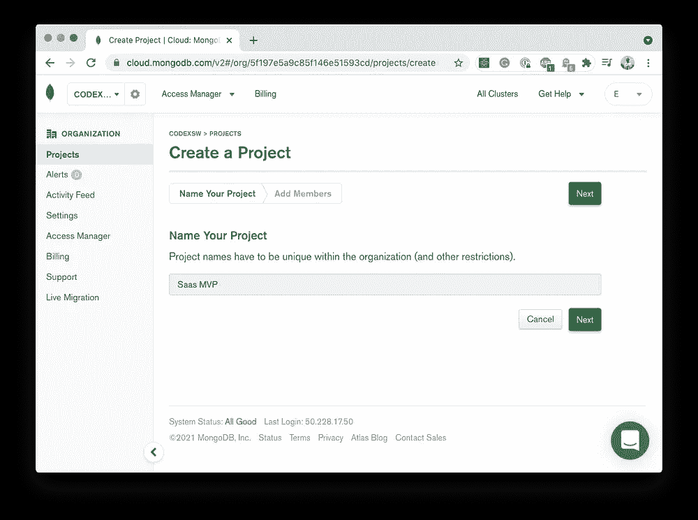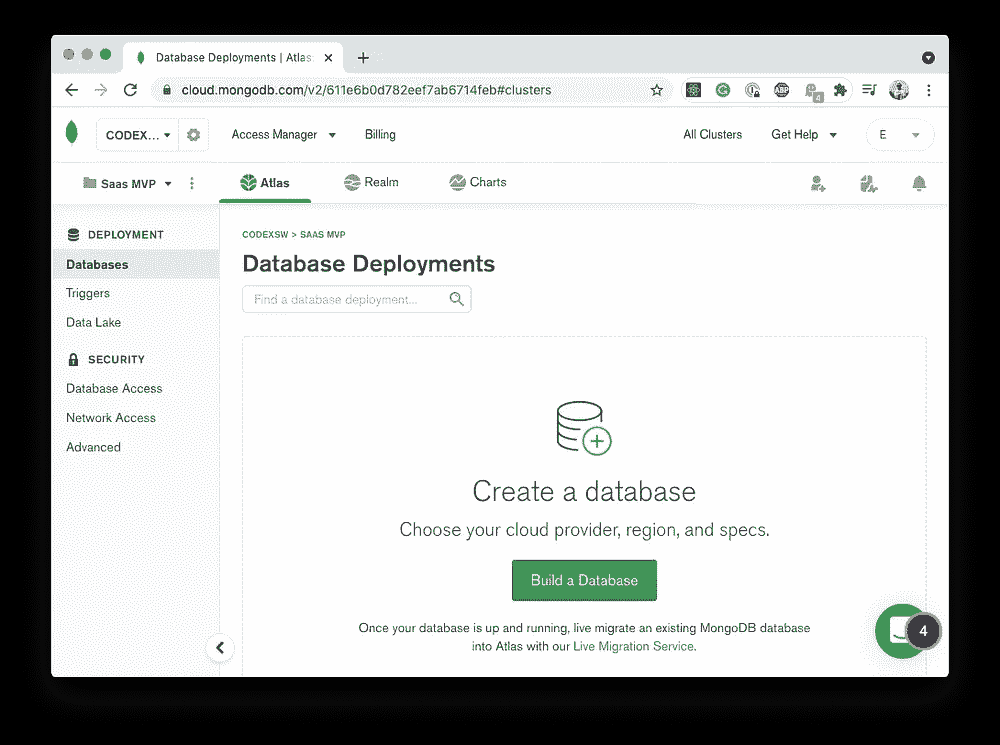

创建项目

第二步，通过选择计划(自由)和主机(云)创建数据库集群:

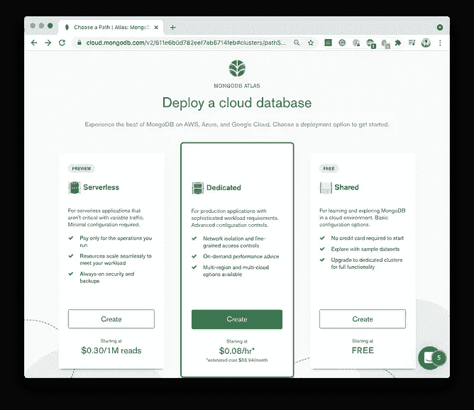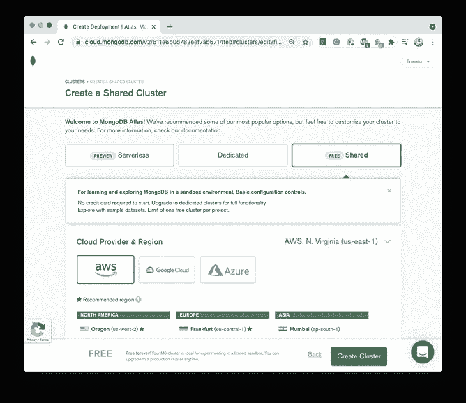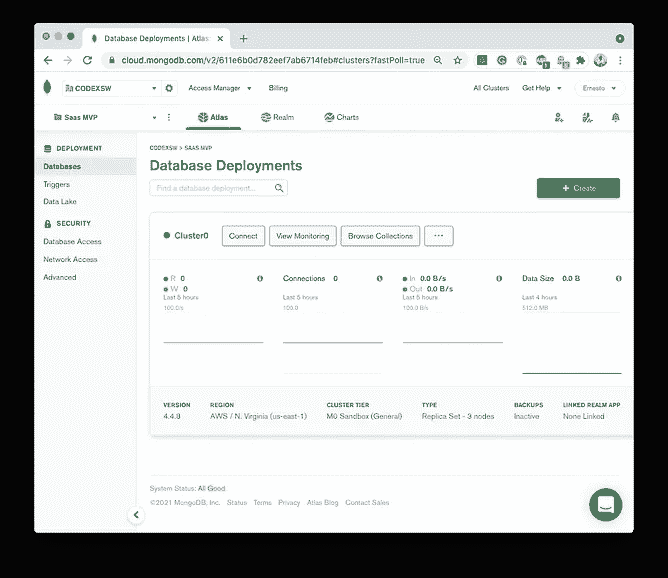

创建数据库集群

第三步，创建数据库集群用户:

*注意:在某个地方写下用户密码，我们将在后面的步骤中需要它。*

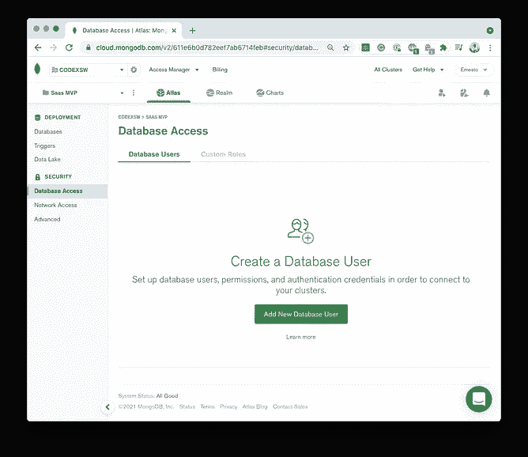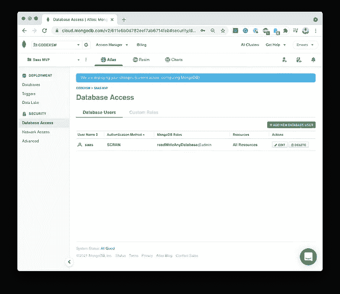

创建数据库用户

一旦创建了数据库集群用户，我们就可以使用连接功能创建一个数据库。

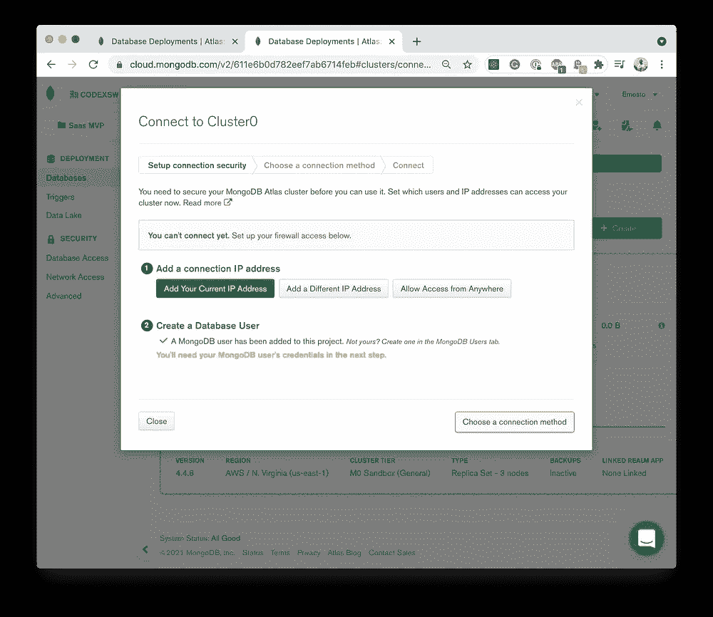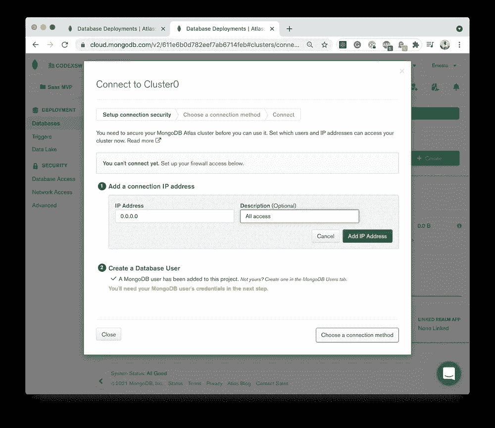

连接到数据库集群(IP 访问)

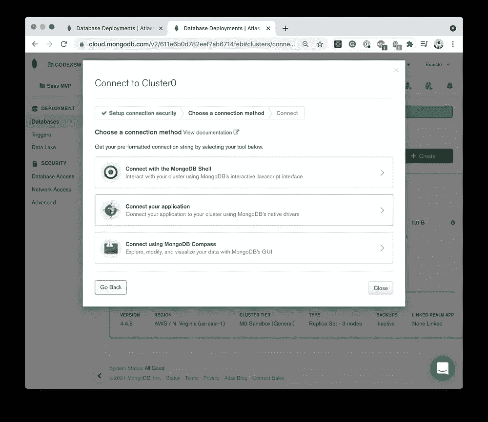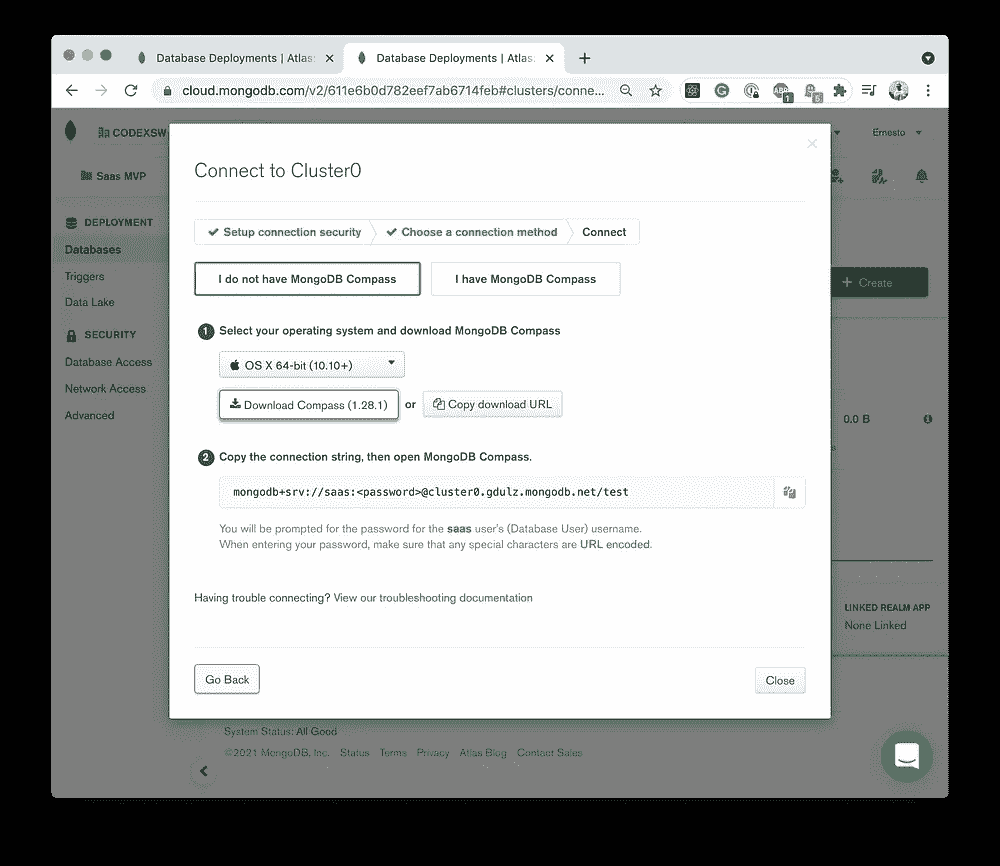

连接到数据库集群(MongoDB Compass)

MongoDB Compass([https://www.mongodb.com/products/compass](https://www.mongodb.com/products/compass))是一个桌面 MongoDB 客户端。下载并安装在您的本地机器上。我们将使用它在集群上创建数据库，并在其上创建集合和查询数据。

我们的数据库名称将是:`saas-db`和第一个集合`registrations`

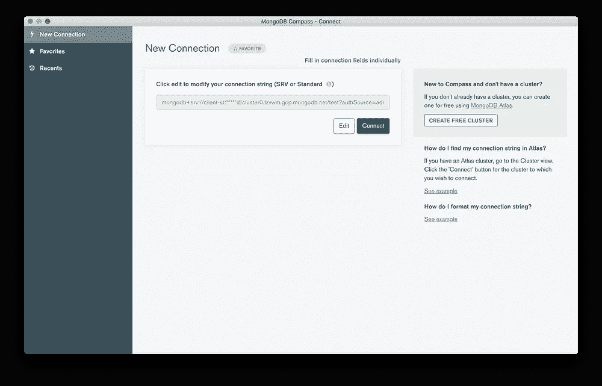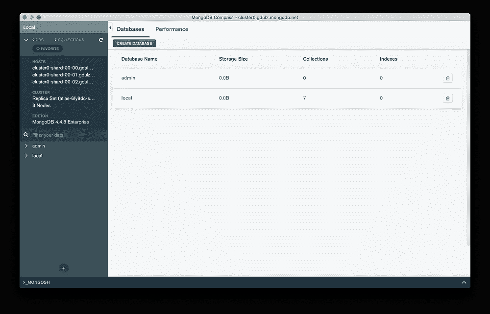

MongoDB Compass 正在连接到数据库集群

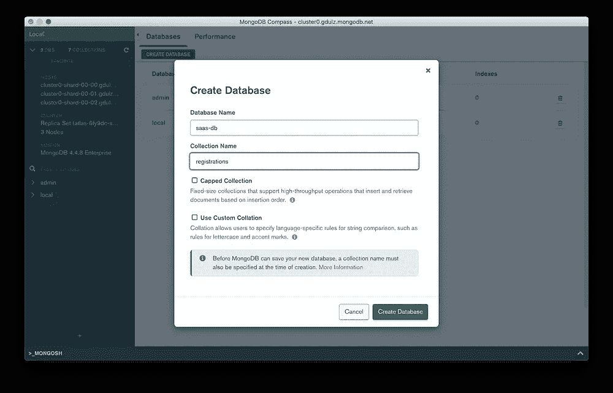

MongoDB Compass 创建一个数据库和集合

# 从 NextJS API 路由使用 MongoDB

从我们在第 1 部分中创建的 repo 开始，让我们修改它，这样我们就可以在数据库中存储和查询注册用户。

在这个回购中，我们使用了一个内存变量来存储来自页面的电子邮件注册。我们将修改端点，改为使用 MongoDB 集合`registrations`。

## 安装依赖项

`mongodb`是我们唯一需要的依赖

```
$ yarn add mongodb
yarn add v1.22.11
[1/4] 🔍  Resolving packages...
[2/4] 🚚  Fetching packages...
[3/4] 🔗  Linking dependencies...
[4/4] 🔨  Building fresh packages...success Saved lockfile.
success Saved 9 new dependencies.
info Direct dependencies
└─ mongodb@4.1.0
info All dependencies
├─ [@types/webidl-conversions](http://twitter.com/types/webidl-conversions)@6.1.1
├─ [@types/whatwg-url](http://twitter.com/types/whatwg-url)@8.2.1
├─ bson@4.5.0
├─ denque@1.5.1
├─ memory-pager@1.5.0
├─ mongodb-connection-string-url@1.1.2
├─ mongodb@4.1.0
├─ saslprep@1.0.3
└─ sparse-bitfield@3.0.3
✨  Done in 7.90s.
```

正在连接到 MongoDB

为了连接到 MongoDB，我们重用了 NextJS repo examples 文件夹中的“连接函数”([https://github . com/vercel/next . js/tree/canary/examples/with-MongoDB](https://github.com/vercel/next.js/tree/canary/examples/with-mongodb))并用一个直接提供数据库访问的通用函数来包装它，这样我们就不必担心每次需要查询时都要连接到数据库。

src/lib/mongo.ts

`withMongo`异步函数是通用的`<T>`，允许返回一个类型值`T`。例如:

```
const registrations = await withMongo(async (db: Db) => {
  const collection = db.collection<User>('registrations')
  return await collection.find().toArray()
})
```

在这个例子中,`registrations`变量的类型是`User[]`

另一个重要的细节是设置环境运行时变量:

*   `MONGO_DB_URL` : MongoDB 连接 URL 地址(这与我们使用 Compass 连接到 MongoDB 数据库集群的地址相同)
*   `MONGO_DB_NAME` : MongoDB 名称(我们将其设置为`saas-db`)

在项目的根目录下创建一个`.env`(或`.env.local`)文件。

```
MONGO_DB_URL=mongodb+srv://<user>:<pass>@<server-url>
MONGO_DB_NAME=saas-db
```

修改`src/pages/api/subscriptions.ts`文件:

src/pages/api/subscriptions.ts

运行您的应用程序。它现在有一个 MongoDB 后端。

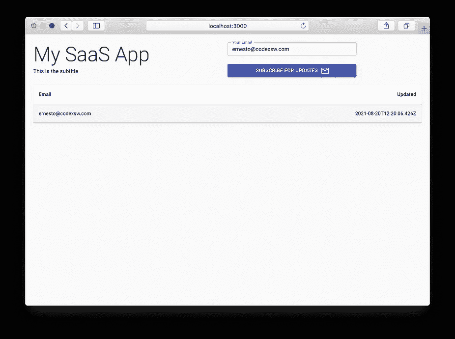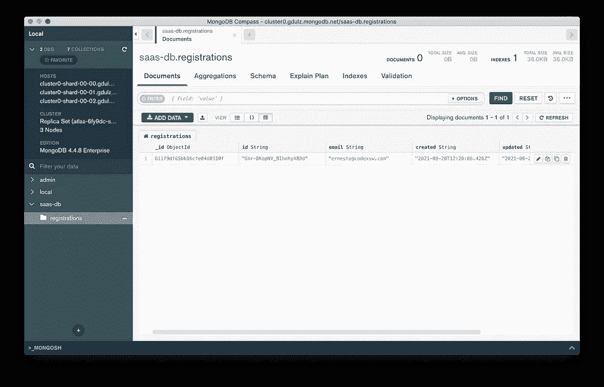

向注册集合中的注册->电子邮件添加电子邮件。

# 结论

*   为 SaaS MVP 建立一个数据库应该不会花费太多的时间和金钱。存在免费层，因此您可以引导您的应用程序。如果您的应用程序增长，您可以使用无服务器计划([https://www.mongodb.com/pricing](https://www.mongodb.com/pricing))按需购买更多空间
*   MongoDB Atlas 免费层为您提供 500Mb 的数据库空间。只要确保使用强密码保护其访问，如果可能的话，允许 IPs 列表、对等([https://docs.atlas.mongodb.com/security-vpc-peering/](https://docs.atlas.mongodb.com/security-vpc-peering/))或私有端点([https://docs.atlas.mongodb.com/security-private-endpoint/](https://docs.atlas.mongodb.com/security-private-endpoint/))
*   TypeScript 类型使一切变得简单多了。`mongodb`包全打。使用它。
*   完整的代码可以在[https://github.com/outsrc/next-mui/tree/efg/with-mongodb](https://github.com/outsrc/next-mui/tree/efg/with-mongodb)找到
*   运行演示在:[https://next-mui-r3ranh7al-outsrc.vercel.app/](https://next-mui-r3ranh7al-outsrc.vercel.app/)(*)由于没有删除按钮，电子邮件显示在页面上可见，我们每隔几个小时删除所有数据。*)

快乐编码…