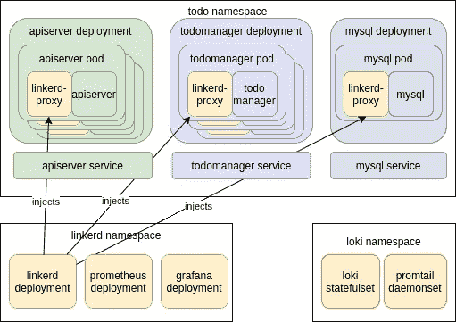

# 第 3 部分:用 Helm 部署应用程序

> 原文：<https://itnext.io/part-3-deploying-the-application-with-helm-giant-swarm-5994b6044f18?source=collection_archive---------5----------------------->

[](https://www.giantswarm.io/)

*关于如何使用基于 Kubernetes 的平台轻松获得集中式日志记录、更好的安全性、性能指标和身份验证的深入系列。*

# 介绍

这是我们的教程的第三部分，介绍如何使用云原生堆栈创建和部署应用程序。第 1 部分讨论了如何[建立开发环境](https://www.giantswarm.io/blog/how-the-cloud-native-stack-helps-writing-minimal-microservices/)，而第 2 部分讨论了[构建实际的应用程序。](https://www.giantswarm.io/blog/a-few-dozen-lines-of-code-part-2-creating-the-application)

在这个条目中，我们想要解决部署问题:如何打包和准备我们的应用程序，以便在我们的平台上进行部署。

# TL；灾难恢复版本

在这一部分，我们将为我们的应用程序准备一个舵图。我们可以只用 Kubernetes 清单和“kubectl”命令做同样的事情，但是这样我们就可以用一个 Helm 命令部署应用程序的所有组件。我们也可以把舵图放到网上，这样其他人更容易找到并安装它。如果您对部署设置细节不感兴趣，并且不想一步一步地部署应用程序，不要担心；码头图片和舵图都是公开的。

顺便说一句，如果你还没有按照[第 1 部分](https://www.giantswarm.io/blog/how-the-cloud-native-stack-helps-writing-minimal-microservices/)操作，请确保通过运行以下命令来配置你的头盔库:

```
$ helm repo add giantswarm https://giantswarm.github.io/giantswarm-catalog $ helm repo add giantswarm-playground https://giantswarm.github.io/giantswarm-playground-catalog $ helm repo update
```

要安装就绪舵图，只需运行:

```
helm install --name gs-todo --namespace todo --version 0.2.7 giantswarm-playground/giantswarm-todo-app
```

然后，你可以继续[关于运营和收益的部分。](https://docs.google.com/document/d/19HTvYdJGYPIlIObBkdysu8xlt8NSWmTaIJuMSQUSpaM/edit?ts=5e68cd44#heading=h.m3toh7l0pqxw)

# 长版本

在为我们的应用程序准备部署清单时，我们将使用在[第 1 部分:Kubernetes 平台](https://www.giantswarm.io/blog/how-the-cloud-native-stack-helps-writing-minimal-microservices/)中介绍的标准 Kubernetes 组件。为了简单起见，我们将它们打包成一个舵图，并在这个过程中添加 MySQL 作为依赖项。

如果您还没有签出我们教程的存储库，请执行以下步骤:

```
git clone https://github.com/giantswarm/giantswarm-todo-app.git cd giantswarm-todo-app git checkout blog_v1'
```

# 部署概述

让我们看看我们想要创建的内容:



Helm chart 只是一组 Kubernetes 资源，所以我们需要从 Kubernetes 基本构件开始。上图显示了我们必须在“todo”名称空间中创建的主要组件。基本上，它们包括我们的微服务应用程序的“apiserver”和“todomanager”组件的“部署”,以及每个组件的“服务”,作为访问 pod 的负载平衡器。

MySQL 部分将由组成舵图表提供。创建掌舵图时，您可以指向其他掌舵图，作为您正在创建的图表的要求。为此，我们将使用[公共 MySQL 图表](https://github.com/helm/charts/tree/master/stable/mysql)，避免自己编写这一部分。

上图还显示了部署到“loki”和“linkerd”名称空间的一些软件。当我们在教程的第 1 部分的[中部署洛基和带头盔的林克德时，这些已经为我们创建好了。不过，这里是一个好地方，可以让我们再看一看那里部署了什么。](https://www.giantswarm.io/blog/how-the-cloud-native-stack-helps-writing-minimal-microservices/)

洛基图表部署了两件事:

*   "洛基状态集"
*   “Promtail daemonset”

这将运行实际的 Loki 服务器，该服务器存储日志并响应日志查询。“ [Statefulset](https://kubernetes.io/docs/concepts/workloads/controllers/statefulset/) ”是一个类似于部署的 Kubernetes 工具，但旨在运行有状态的工作负载。

这将运行 Promtail 工具，该工具在 Kubernetes 集群的每个主机上启动(这就是 [DaemonSet](https://kubernetes.io/docs/concepts/workloads/controllers/daemonset/) 所做的)。该工具跟踪特定集群节点上运行的 pods 所写的所有日志，并将它们转发到 Loki 服务器进行存储。

Linkerd 图表部署了多种 Linkerd 服务，让我们仅列出对我们最重要的服务:

*   "链接器部署"
*   《普罗米修斯》
*   “格拉法纳”

这实际上是一整个系列的部署，但重要的是“linkerd-proxy-injector”(图中没有直接显示)。可以想象，为了使 Linkerd 能够跟踪指向我们服务的每个请求，它需要在运行我们应用程序的容器前面使用一个代理。它通过将一个名为“linkerd-proxy”的新容器动态注入到为我们的应用程序部署的每个 pods 中来实现这一点。由于 Pod 是一组一起运行的容器，这非常适合 Kubernetes 的部署单元。在 pod 内部，“linkerd-proxy”充当 Pod 的其他容器的所有传入和传出流量的代理，并将流量信息转发给名称空间中运行的其他 linkerd 服务。

这就是我们故事中隐藏的英雄。Prometheus 是 metrics server，它现在是在 Kubernetes 集群中收集和分析指标数据的事实标准。Linkerd 使用它来获取和存储所有的监控指标。普罗米修斯现在隐藏在我们的教程中，但我们稍后会回来，给它更多的关注。

我们已经看到 Grafana 是我们的 web UI，用于查看来自两个来源的数据:用于度量的 Prometheus 服务器和用于日志的 Loki。

[](https://www.giantswarm.io/guide-cloud-native-stack?utm_campaign=Blog%20CTA%20Conversion&utm_source=Cloud%20native%20stack%20guide_Blog&utm_medium=Blog%20CTA&utm_term=cloud%20native%20stack%20guide)

# 创建“待办事项”图表

该图表的全部源代码可在“ [helm/giantswarm-todo-app](https://github.com/giantswarm/giantswarm-todo-app/tree/blog_v1/helm/giantswarm-todo-app) ”目录下获得。“ [Chart.yaml](https://github.com/giantswarm/giantswarm-todo-app/blob/blog_v1/helm/giantswarm-todo-app/Chart.yaml) ”描述的是掌舵图本身。“ [requirements.yaml](https://github.com/giantswarm/giantswarm-todo-app/blob/blog_v1/helm/giantswarm-todo-app/requirements.yaml) ”列出了我们想要使用的附加子图表。在我们的例子中，它是“mysql”，一个我们下载并放在“ [charts/](https://github.com/giantswarm/giantswarm-todo-app/tree/blog_v1/helm/giantswarm-todo-app/charts/mysql) ”目录中的[外部公共图表](https://github.com/helm/charts/tree/master/stable/mysql)，这意味着子图表。

最后一个顶层文件是“ [values.yaml](https://github.com/giantswarm/giantswarm-todo-app/blob/blog_v1/helm/giantswarm-todo-app/values.yaml) ”，其中包含了 Helm 用户可以更改的模板变量。我们的实际部署清单放在“ [templates/](https://github.com/giantswarm/giantswarm-todo-app/tree/blog_v1/helm/giantswarm-todo-app/templates) ”目录中。我不会写其中的每一个细节，但让我指出一些有趣的片段。

“templates/”目录中的一些文件更具有全局特性。剩下的要么是关于“apiserver”的，要么是关于“todomanager”的。全球性的有:

*   [Hook-pre-install-annotate-namespace . YAML](https://github.com/giantswarm/giantswarm-todo-app/blob/blog_v1/helm/giantswarm-todo-app/templates/hook-pre-install-annotate-namespace.yaml)用于将“linkerd.io/inject=enabled”注释添加到我们部署应用程序的名称空间中。当命名空间以这种方式注释时，linkerd 将自动处理命名空间中的所有 pod，并注入 Linkerd 工作所需的“linkerd-proxy”容器。
*   [Mysql_networkpolicy.yaml](https://github.com/giantswarm/giantswarm-todo-app/blob/blog_v1/helm/giantswarm-todo-app/templates/mysql_networkpolicy.yaml) 提供了一个网络策略，允许“todomanager”与“Mysql”建立连接。由于我们正在为所有组件创建网络策略，我们必须记住 mysql 是作为子图表包含在内的，否则我们的 pods 将根本无法连接到“MySQL”。
*   [Psp.yaml](https://github.com/giantswarm/giantswarm-todo-app/blob/blog_v1/helm/giantswarm-todo-app/templates/psp.yaml) 定义了我们的 pod 安全策略。这使得我们的应用程序与提供严格安全性和强制 PSP 存在的集群兼容(giantswarm 集群就是这么做的)。我们的策略拒绝使用特权容器或与主机共享名称空间，但是因为我们使用 Linkerd，所以我们必须允许一些许可选项。这是因为 Linkerd 实际上向我们的 pod 注入了额外的容器，所以我们的 pod 需要能够完成 Linkerd 要求的事情。这就是为什么我们在[第 15–17 行](https://github.com/giantswarm/giantswarm-todo-app/blob/4a78dbc3c544b6a3ee7081b19d5600c4eba5aae4/helm/giantswarm-todo-app/templates/psp.yaml#L15)中启用了一些“NET_*”功能，以及为什么我们允许容器中的进程以 root 身份运行，但前提是启用了 Linkerd([L36–40](https://github.com/giantswarm/giantswarm-todo-app/blob/4a78dbc3c544b6a3ee7081b19d5600c4eba5aae4/helm/giantswarm-todo-app/templates/psp.yaml#L37))。
*   [Rbac.yaml](https://github.com/giantswarm/giantswarm-todo-app/blob/blog_v1/helm/giantswarm-todo-app/templates/rbac.yaml) 配置我们的 pods 访问 Kubernetes API 所需的权限。在我们的应用程序中没有任何这样的需求，但是我们仍然需要允许我们的 pods 使用我们在 psp.yaml 中创建的 PSP ( [L14](https://github.com/giantswarm/giantswarm-todo-app/blob/4a78dbc3c544b6a3ee7081b19d5600c4eba5aae4/helm/giantswarm-todo-app/templates/rbac.yaml#L14) )。

现在，“apiserver”和“todomanager”非常相似，它们的基本构建块是一个部署和服务，它们放在各自的文件中，带有“apiserver_”或“todomanager_”前缀。让我们以“apiserver”为例指出一些事情:

*   在"[API server _ deployment . YAML](https://github.com/giantswarm/giantswarm-todo-app/blob/blog_v1/helm/giantswarm-todo-app/templates/apiserver_deployment.yaml)"中，我们记得设置了一些重要的东西:
*   [“API server _ network policy . YAML](https://github.com/giantswarm/giantswarm-todo-app/blob/blog_v1/helm/giantswarm-todo-app/templates/apiserver_networkpolicy.yaml)”定义了我们的应用防火墙。默认策略是“拒绝”，但是通过 apiserver，我们允许任何传入流量到达端口 8080([L15–21](https://github.com/giantswarm/giantswarm-todo-app/blob/4a78dbc3c544b6a3ee7081b19d5600c4eba5aae4/helm/giantswarm-todo-app/templates/apiserver_networkpolicy.yaml#L15))，以及传出流量到达“todo manager”([L24–31](https://github.com/giantswarm/giantswarm-todo-app/blob/4a78dbc3c544b6a3ee7081b19d5600c4eba5aae4/helm/giantswarm-todo-app/templates/apiserver_networkpolicy.yaml#L24))。此外，我们允许与集群的 DNS ( [L33](https://github.com/giantswarm/giantswarm-todo-app/blob/4a78dbc3c544b6a3ee7081b19d5600c4eba5aae4/helm/giantswarm-todo-app/templates/apiserver_networkpolicy.yaml#L33) )和 Linkerd 的服务( [L23](https://github.com/giantswarm/giantswarm-todo-app/blob/4a78dbc3c544b6a3ee7081b19d5600c4eba5aae4/helm/giantswarm-todo-app/templates/apiserver_networkpolicy.yaml#L23) 和 [L35](https://github.com/giantswarm/giantswarm-todo-app/blob/4a78dbc3c544b6a3ee7081b19d5600c4eba5aae4/helm/giantswarm-todo-app/templates/apiserver_networkpolicy.yaml#L35) )进行对话。“Todomanager”更受限制，只允许从“apiserver”接收流量，向“mysql”发送流量。
*   [“API server _ pod disruption budget . YAML](https://github.com/giantswarm/giantswarm-todo-app/blob/blog_v1/helm/giantswarm-todo-app/templates/apiserver_poddisruptionbudget.yaml)”提供了我们的 [pod 中断预算](https://kubernetes.io/docs/tasks/run-application/configure-pdb/)——关于我们预计有多少 pod 在运行的集群信息，即使集群中正在进行一些维护工作，如节点更换。在我们的例子中，我们要求至少有 2 个 pod 一直运行( [L10](https://github.com/giantswarm/giantswarm-todo-app/blob/4a78dbc3c544b6a3ee7081b19d5600c4eba5aae4/helm/giantswarm-todo-app/templates/apiserver_poddisruptionbudget.yaml#L10) )。

现在所有的部分都准备好了，我们几乎可以将我们的应用程序部署到 Kubernetes 集群了。不幸的是，我们不得不保留我们的默认图表文件，以便它们可以被我们的 CI/CD 管道使用，该管道发布公共图像和图表，如[简短版本](https://app.hubspot.com/compose/430224/blog-post/909977#h.2lmwh5fp2bhd)中所述。这使得它们不能被头盔直接使用。因此，为了让它与 github 存储库中默认的代码一起工作，我们需要编辑两个文件。为了使它变得更容易，存储库包含有必要更改的文件，您只需要替换它们就可以在您的本地 minikube 集群上使用我们的 helm chart。

副本:

*   " helm/local_chart/Chart.yaml "到" helm/giants warm-todo-app/chart . YAML "
*   “helm/local_chart/values.yaml”到“helm/giants warm-todo-app/values . YAML”。

最后，我们的舵图准备好了，我们可以部署它:

```
helm install --name gs-todo --namespace todo ./helm/giantswarm-todo-app
```

让我们首先列出我们的头盔版本:

```
helm list
```

现在，让我们检查一下是否一切正常:

```
kubectl -n todo get pods
```

几分钟后，您应该会在“Ready”列中看到所有 pod“Running”和“2/2”。您可能还记得，我们在每个 pod 中只有一个容器，但是 Linkerd 注入了另一个容器“linkerd-proxy”，所以我们在每个 Pod 中得到两个容器和“2/2”Pod 状态。

在第 4 部分中，我们将看到我们的应用程序和云原生栈的运行！敬请关注。

# 关于巨型蜂群

当在生产环境中运行 Kubernetes 集群时，您会意识到您将需要更多，有时甚至更多，而不仅仅是一个集群。您不仅需要关心部署，还需要关心升级、安全问题和监控。

这就是 Giant Swarm 可以提供帮助的地方——我们提供托管的 Kubernetes 集群，因此您不必担心自己管理它们。我们还提供托管应用，即众所周知的云原生项目，我们可以在您的 Kubernetes 集群上为您运行这些项目，从而创建一个完全托管的云原生平台。

由[尤卡兹·piątkowski](https://twitter.com/piontec):**kubernetes 平台架构师@ [巨型蜂群](https://twitter.com/giantswarm)撰写**