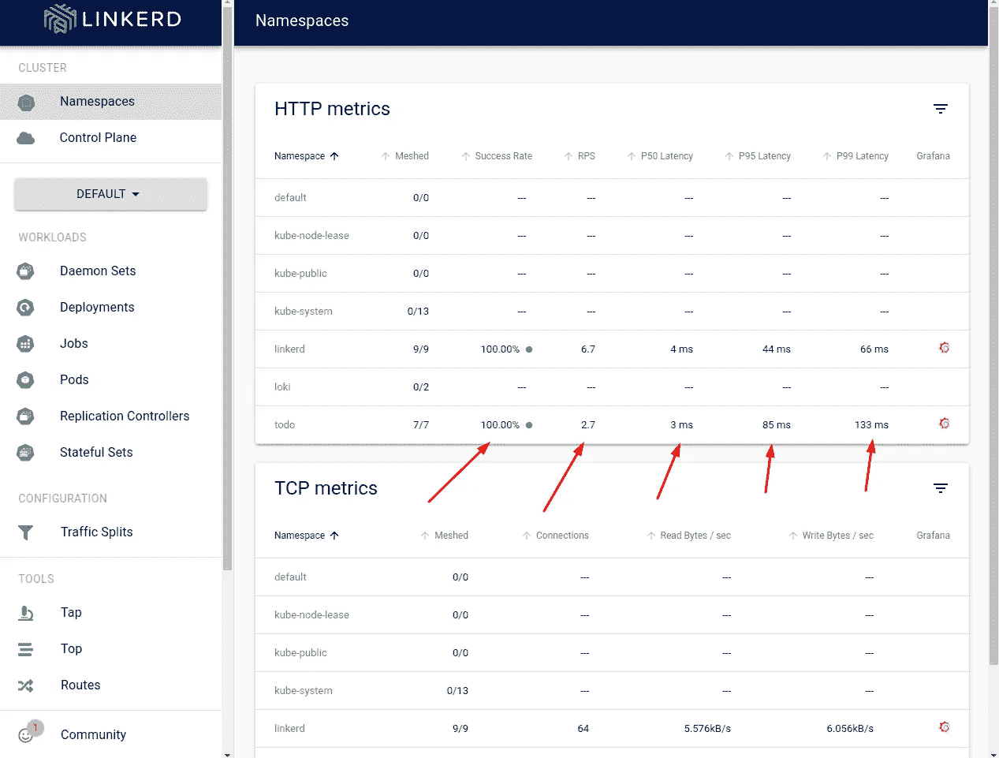
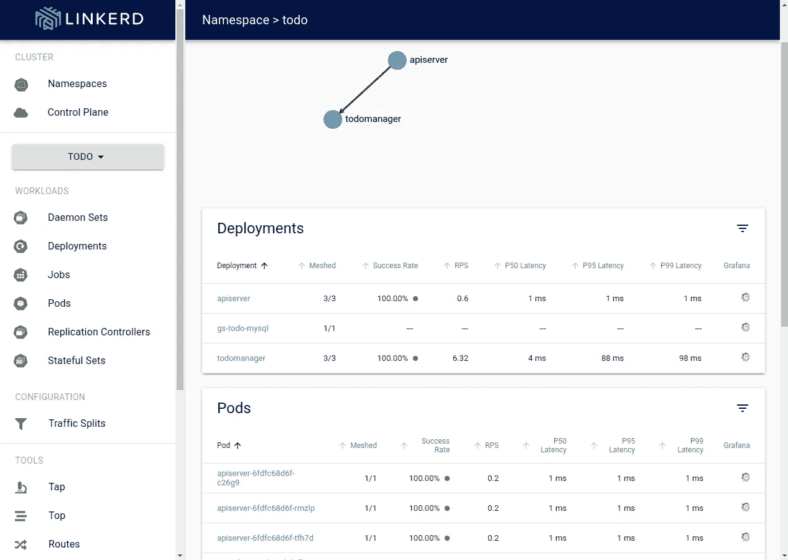
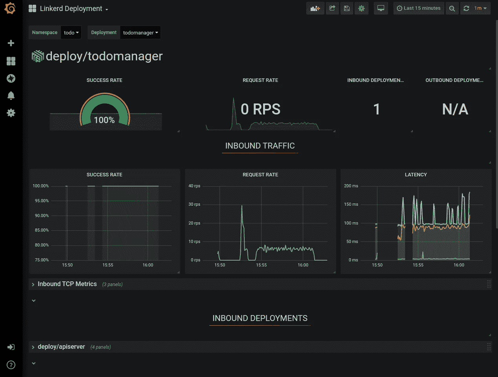
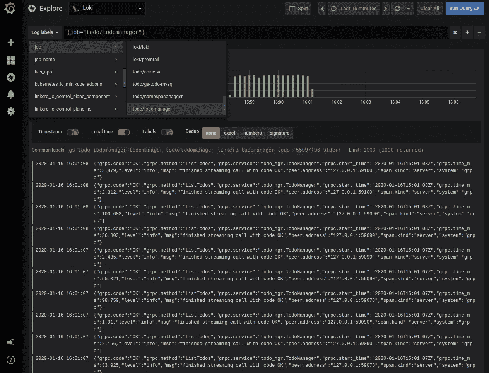
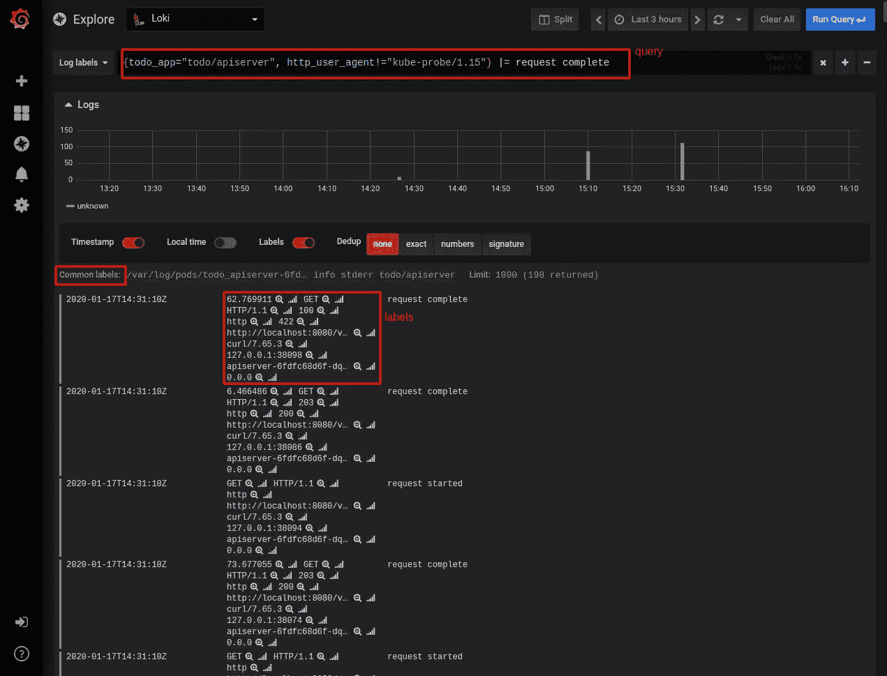

# 第 4 部分:运行中的操作和云原生栈

> 原文：<https://itnext.io/part-4-operations-and-the-cloud-native-stack-in-action-bb17d9f0ff5?source=collection_archive---------7----------------------->

*关于如何使用基于 Kubernetes 的平台轻松获得集中式日志记录、更好的安全性、性能指标和身份验证的深入系列。*

[](http://www.giantswarm.io)

# 介绍

在这个由四部分组成的博客系列中，我们将向您介绍如何从头开始创建面向微服务的应用程序，以及如何使用云原生堆栈来部署和运行它。在[第一部分](https://www.giantswarm.io/blog/how-the-cloud-native-stack-helps-writing-minimal-microservices/)中，我们谈到了建立开发环境。在第二部分中，我们用 Golang 实现了我们的应用程序。在[第三部分中，](https://www.giantswarm.io/blog/part-3-deploying-the-application-with-helm)我们解释了如何使用舵和舵图来部署应用程序。

现在，是时候看看我们的云原生平台如何提供我们承诺的所有优秀功能了。

# 快速验证

上次我们部署了我们的应用程序。现在，让我们试着测试一下，看看它是否如我们预期的那样工作。由于我们没有 ToDo 应用程序的专用客户机，我们将使用`curl`命令与 HTTP API 端点对话。但是首先，我们需要启动到 apiserver 服务的端口转发:

```
kubectl -n todo port-forward service/apiserver 8080
```

现在让我们运行:

```
$ curl http://localhost:8080/v1/todo null
```

我们没有得到任何响应，但这是意料之中的:我们还没有创建任何 ToDo 条目。让我们创建一些:

```
$ curl -H "Content-Type: application/json" -X POST \ -d '{"Text":"Check grafana"}' \ http://localhost:8080/v1/todo {"id":"1","text":"Check grafana","done":false} $ curl -H "Content-Type: application/json" -X POST \ -d '{"Text":"Check loki"}' \ http://localhost:8080/v1/todo< {"id":"2","text":"Check loki","done":false}
```

现在，让我们再次获取所有 ToDos:

```
$ curl http://localhost:8080/v1/todo [{"id":"1","text":"Check grafana","done":false},{"id":"2","text":"Check loki","done":false}]
```

有用！🎉现在，让我们看看我们安装的云原生堆栈提供的工具如何使我们的应用程序管理更加轻松。

我们从林克德开始。如果您已经终止了 Linkerd 的端口转发，请再次启动它:

```
kubectl -n linkerd port-forward service/linkerd-web 8084
```

为了看到我们的工具在运行，我们需要一些实时流量来访问我们的 ToDo 服务。您可以像上面重复几次的 GET 请求那样手动触发它们，或者启动一个简单的 bash 循环，每隔 100 毫秒发送一次 GET 请求:

```
while true; do curl http://localhost:8080/v1/todo; sleep 0.1; done
```

接下来，前往[http://localhost:8084/namespaces](http://localhost:8084/namespaces)。在名称空间仪表板中，我们应该立即得到在我们的名称空间中执行的请求总数(HTTP 和 gRPC)的统计信息:



我们可以看到有多少请求是成功的，我们每秒处理多少请求(RPS ),以及延迟分布的第 50、95 和 99 百分位数是多少。让我们单击名称空间名称来获取更具体的数据。



在这里，我们可以看到相同的统计数据，但是是在每个部署和每个单元级别上提供的。此外，服务发现导致在屏幕顶部可以看到自动提供的请求路由拓扑。

上面的仪表板显示了关于我们应用程序的“实时”数据。但是我们也能看到历史数据吗？当然，只需点击你感兴趣的条目最右栏中的 Grafana 标志。

例如，对于“todomanager”部署，它看起来像这样:



这样，您就可以看到关于应用程序的成功率、请求率和延迟分布的历史数据。最棒的是，我们不需要编写任何代码就能让它工作，这一切都是由 Linkerd 注入的代理完成的。你可以留在 Grafana 用户界面，探索我们的应用程序更多，但我们仍然没有看到任何日志。

在 Grafana 的左侧菜单中，转到我们在[设置](https://www.giantswarm.io/blog/how-the-cloud-native-stack-helps-writing-minimal-microservices/)时已经访问过的“探索”菜单。



如上图所示，选择一个过滤器，只显示“todomanager”服务生成的日志。我们可以看到来自所有“todomanager”窗格的日志，我们可以在其中运行文本搜索。尽管如此，Loki 期望做的是让我们基于与日志条目相关联的标签来应用不同的搜索标准、索引和操作符。这有效地允许我们使用 Loki 的查询语言 [LogQL](https://github.com/grafana/loki/blob/master/docs/logql.md) 来搜索我们的日志。但是 Loki 不知道如何将我们的 JSON 格式的日志条目转换成标签和主日志消息。应用程序负责配置 Loki 来解析应用程序的特定日志格式。让我们现在做那件事。

**配置 Loki**

我们的应用程序提供了结构化的 JSON 日志。Loki 可以将这种结构转换成带有一组相关标签的消息，然后在这些标签上建立索引，并允许我们使用它们进行过滤。因此，我们必须告诉 Loki 如何将我们的日志消息解析成标签。配置相当长而且复杂，所以我们提供了一个现成的[配置文件](https://github.com/giantswarm/giantswarm-todo-app/blob/blog_v1/config/promtail.yaml)，但是如果你想深入研究，参考文档可以在 [Loki 的主页](https://github.com/grafana/loki/blob/master/docs/clients/promtail/configuration.md#timestamp_stage)上找到。

让我们通过获取当前 Loki 的配置来应用准备好的配置，附加特定于我们的应用程序的更改，然后更新配置映射并重新启动必要的 pod:

```
$ kubectl -n loki get cm loki-promtail -o jsonpath="{..promtail\.yaml}" > promtail.yaml $ cat ./config/promtail.yaml >> ./promtail.yaml $ kubectl -n loki delete cm loki-promtail; kubectl -n loki create configmap loki-promtail --from-file promtail.yaml; kubectl -n loki delete po -l app=promtail
```

它改变了什么？让我们看看:



如您所见，现在我们可以使用一个名为“todo_app”的新标签来创建一个过滤器，它允许我们轻松地选择应用程序的不同组件。在上面的查询中，我们使用这个标签来选择仅来自“apiserver”并且由不同于“kube-probe”的 HTTP 代理请求的日志(这是准备情况检查代理，它正在轮询我们为 apiserver 部署定义的端点)。

此外，我们正在寻找消息部分包含文本“请求完成”的条目。在上图所示的日志列表中，您可以看到每个日志条目具有不同的标签值。对于所有选定的条目，存在但具有相同值的标签以灰色显示在图表和日志列表之间。因此，我们的日志查询功能现在好得多了！

使用 Grafana，我们可以将我们的度量和日志数据源结合起来，并在单个 UI 中研究它们。这已经使我们的应用程序更容易观察和调试——我们没有在应用程序中编写任何与该功能相关的东西就获得了所有这些！

# 摘要

我们的项目完成了吗？嗯，我们还有很多可以改进的地方，但是让我们在这里停下来，试着总结一下我们到目前为止所做的事情。

我们在微服务架构中创建了一个简单的 ToDo 应用程序。它由一个公开 REST 接口的 API 服务器组成，然后由一个具有业务逻辑的实际服务组成，该业务逻辑可通过 gRPC 访问。该服务反过来将数据存储在 MySQL 数据库中。

然后，我们使用一些云原生工具来为我们的应用程序提供可观察性。重要的事实是，应用程序本身并不真正包含任何负责与云原生堆栈交互的工具代码。

我们的可观察性由两个组件提供:Loki 和 Linkerd。Loki 负责从我们的容器中获取日志，存储并索引它们，当然，还要使它们可搜索。Linkerd 完成更多的任务:我们使用它来获得请求度量和服务发现，以及所有相关服务之间的自动 mTLS 加密。在 Loki 和 Linkerd 之上，我们使用 Grafana——一个数据表示工具。

我们还使用许多 Kubernetes 特性来使我们的应用程序可用且健壮。这包括:

能够轻松扩展和推出新版本的应用程序。

确保容器中的实际进程工作(而不仅仅是容器被启动)。我们使用反关联性提示来确保 Kubernetes 调度程序将我们的 pod 分布在实例和可用性区域中，从而限制单个实例或区域故障的影响。

定义我们的应用防火墙并明确列出允许的流量。

这在集群中的维护工作期间额外保护了我们的应用程序，防止任何会使我们的 pod 数量低于特定数量的管理操作。

这就限制了我们自己的 pod 可以使用的扩展权限，迫使我们提供更安全的部署。

我们使用它将所有内容打包到一个包含应用程序所有元素的部署包中。

您可能已经听说过，在可观测性领域有三个主要的数据来源。到目前为止，我们已经讨论了度量和日志，但是我们缺少跟踪功能。这就是本系列下一部分的目标！

在此期间，如果您有任何评论或问题，我们来连线:Twitter 上的 [lukasz@giantswarm.io](mailto:lukasz@giantswarm.io) 和 [@piontec](https://twitter.com/piontec) 。

# 关于巨型蜂群

当在生产环境中运行 Kubernetes 集群时，您会意识到您将需要更多，有时甚至更多，而不仅仅是一个集群。您不仅需要关心部署，还需要关心升级、安全问题和监控。这就是 [Giant Swarm](https://www.giantswarm.io/why-giant-swarm) 可以提供帮助的地方——我们提供托管 Kubernetes 集群，因此您不必担心自己管理它们。我们还提供托管应用，即众所周知的云原生项目，我们可以在您的 Kubernetes 集群上为您运行这些项目，从而创建一个完全托管的云原生平台。

由[乌卡斯兹·piątkowski](https://twitter.com/piontec):**kubernetes 平台架构师@ [巨型蜂群](https://twitter.com/giantswarm)撰写**