# (第十部分)让 Unity 游戏看起来更好

> 原文：<https://itnext.io/part-x-making-the-unity-game-look-good-4bf93d444c5e?source=collection_archive---------1----------------------->

在这个游戏开发系列的最后一部分，我们将使场景看起来更好。我们将增加更好的模型，营造氛围，调整整体游戏感觉。

本质上，我将创建这个:

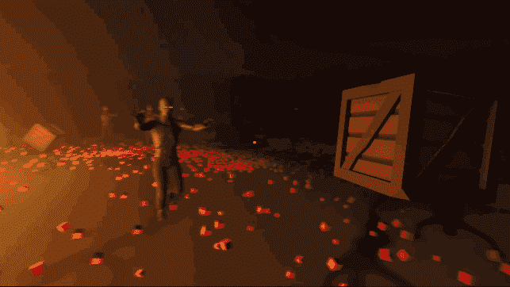

决胜比赛

..由此可知:

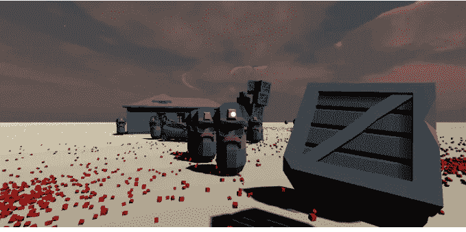

首先在编辑|项目设置中将色彩空间设置为线性。它会使颜色看起来更自然。

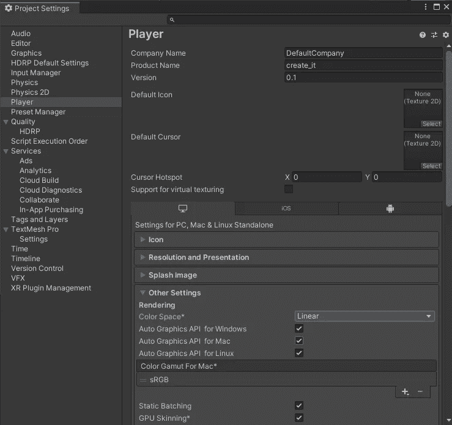

删除平面对象并添加一个地形。

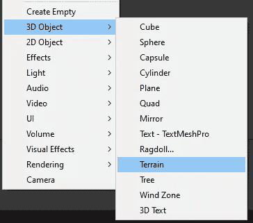

接下来的部分将会花费相当长的时间，并且会有大量的相机移动，所以我们最好使用一些快捷方式和相机操作技术来更容易的操作 3D 世界。

# 摄像机移动

你可以按住鼠标右键或使用 WASD 键来穿越场景(不要忘记将相机速度设置为足够高的值，这样你就可以明显地移动)

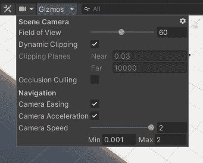

此外，如果您选择了相机对象并使用*与视图对齐(Ctrl+Shift+F)，*您的相机将继承您当前的场景视图。

# 地形绘画

选择地形对象，然后选择*绘制地形*选项。将它设置为*绘制纹理。*

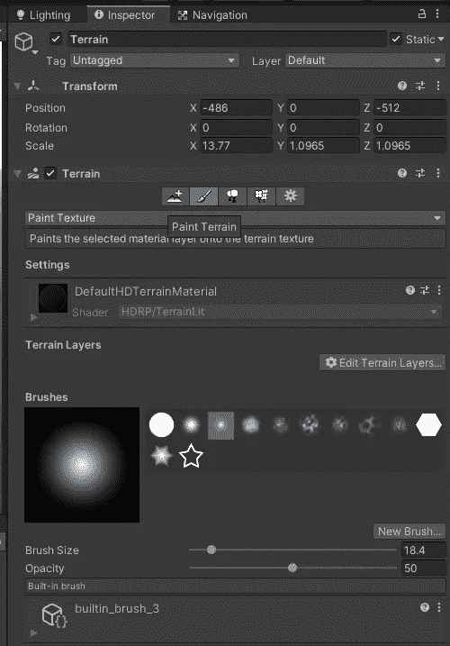

创建新层:

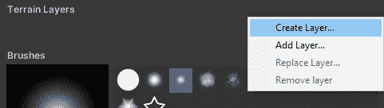

对于地面纹理，从资产商店下载一些(你可以找到免费的):

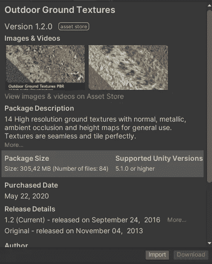

然后，在*创建层中，*选择一个你导入的材质:

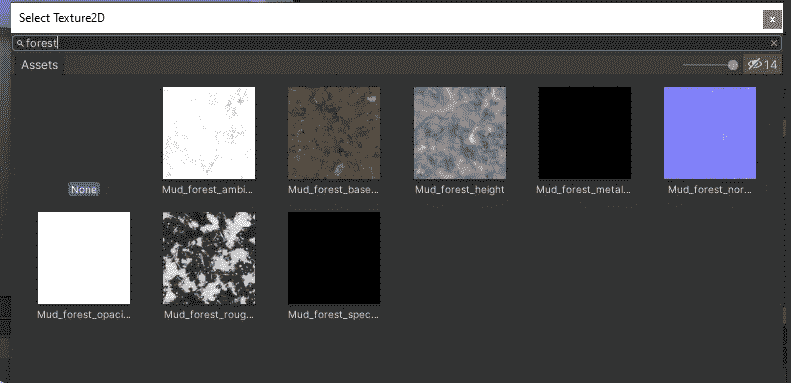

然后点击新图层，添加一个法线贴图:

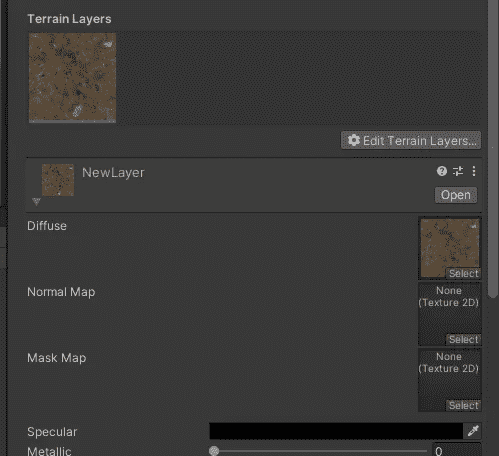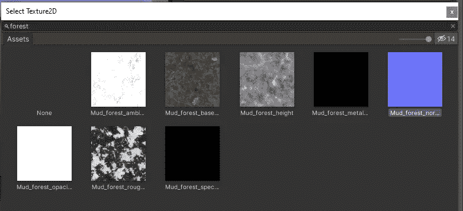

如果你使用 HDRP，更换金属漆以匹配颜色。那你应该能看清地形了:

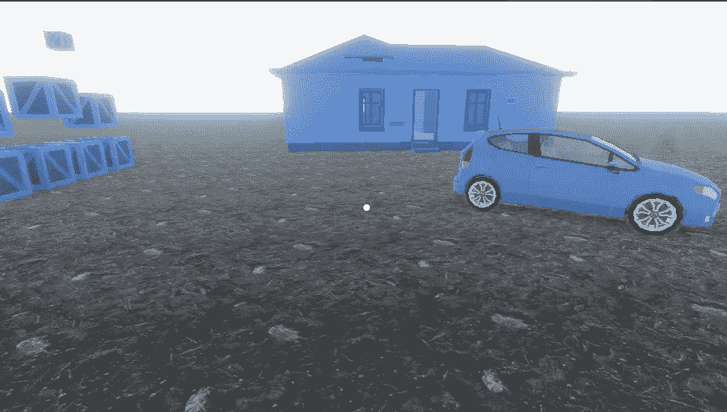

# 新型号

到目前为止，我一直在使用 Synty 多边形包中的占位符模型。是时候改变这种状况了。我将进口一些适当的付费模式。你可以选择任何你想要的模型，我会随机选择我认为适合我想要创建的场景(雾，黑暗，恐怖，僵尸塔防御)的模型。

我要用多边形冒险包。

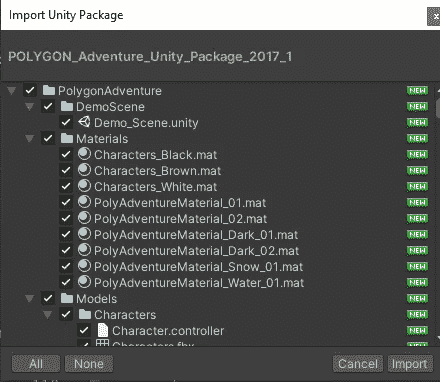

我替换了大部分占位模型，包括敌人的预制体，并为敌人下载了新的僵尸模型。

# 大气

如果你按照教程的前几部分，你应该已经准备好 HDRP 了。所以，现在你可以导入一个*天空和雾的体积。*

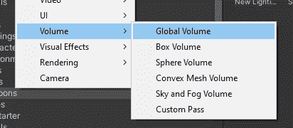

它立即改变了场景的外观。调整设置，直到您对外观满意为止:

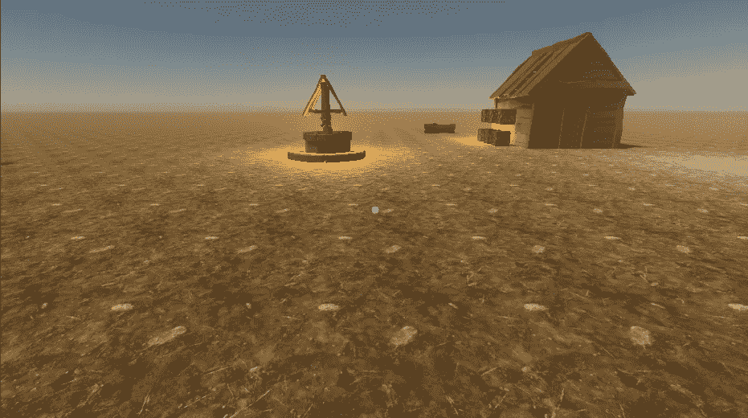

有关基于物理的天空的文档，请访问:

 [## 基于物理的天空

### 基于物理的天空模拟了一个具有两部分大气的球形行星，它具有指数递减的…

docs.unity3d.com](https://docs.unity3d.com/Packages/com.unity.render-pipelines.high-definition@7.1/manual/Override-Physically-Based-Sky.html) 

对于夜间场景，将场景中的*平行光的强度设置为 0.07:*

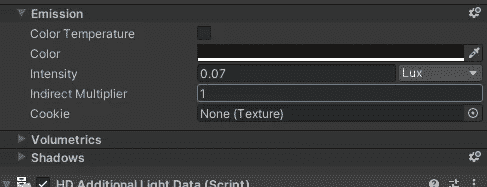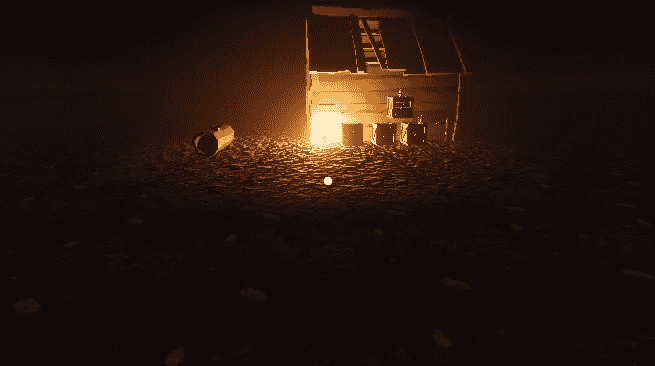

我将添加一些树木，然后设置雾来完成气氛。但首先是树，这样我可以更好地融合视觉效果。

# 更多的地形、草地和树木

我们现在要画一些草。

下载花草包:

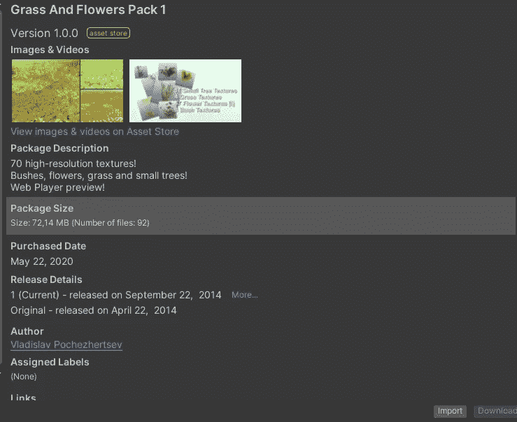

在*地形*中，选择*绘制细节。*

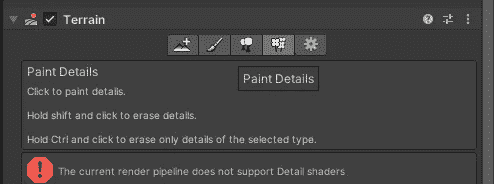

哦等等。那是什么？

错误:**“当前渲染管道不支持细节着色器”。**

原来 HDRP 还不支持细节着色器。在网上挖了一点东西并四处打听后，我发现《死亡之书》里的草应该有用。

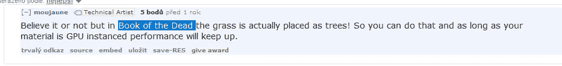

我将下载演示项目:

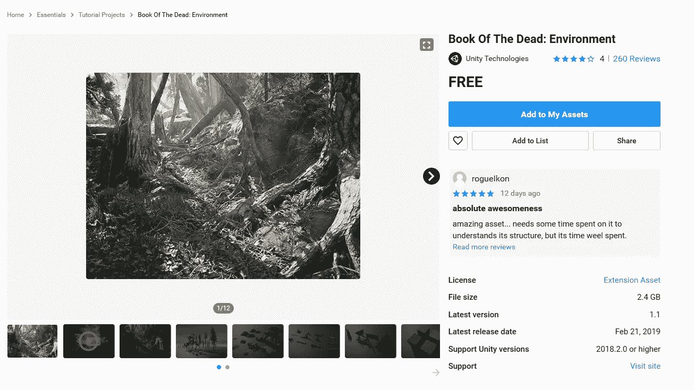

只导入艺术文件夹(真的只导入艺术文件夹，该项目是 2018 年的，如果你全部导入，它会搞乱你的整个项目。我不得不退回到之前的 git 提交，以摆脱它所造成的混乱)。

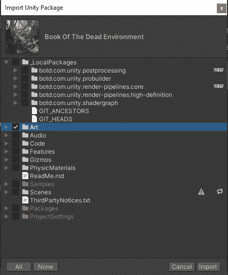

选择*绘制树木，*因为我们将使用该工具绘制草地(细节绘制在 HDRP 尚不支持)。

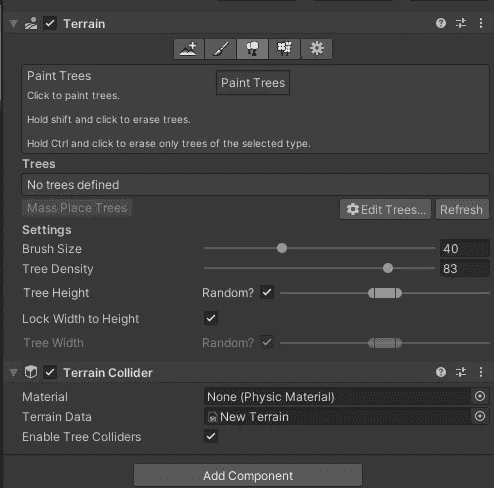

选择你喜欢的草类型(*编辑树木|选择预设*

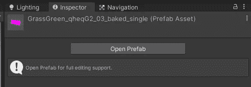

画草，就像你是鲍勃·罗斯！

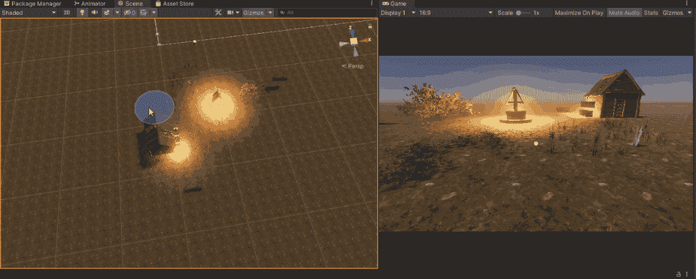

使用同样的方法来画树，因为这个工具主要是用来画树的。

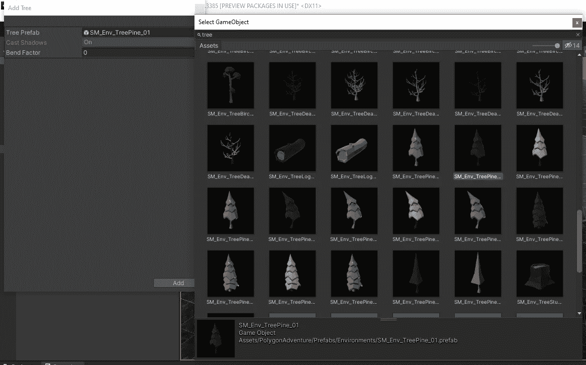

只画树！

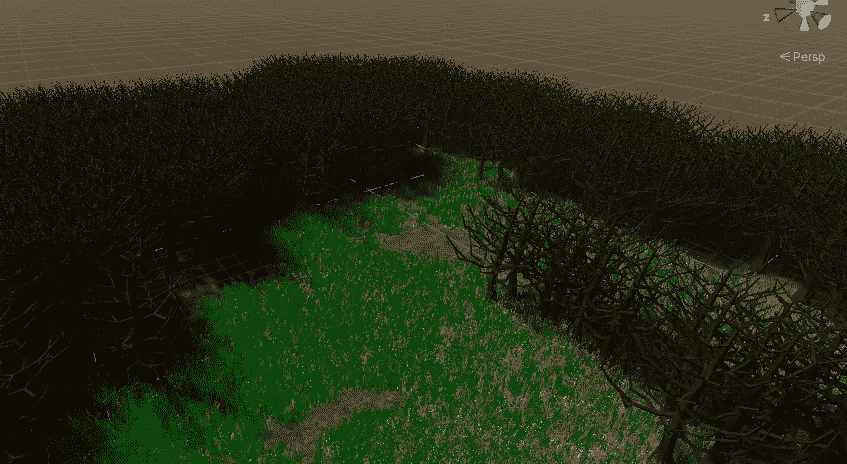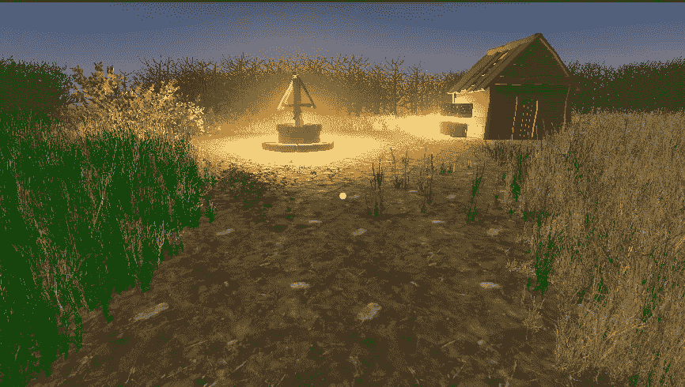

现在我把灯关了，因为这是一个恐怖的夜晚场景。只有两盏灯笼在发光。

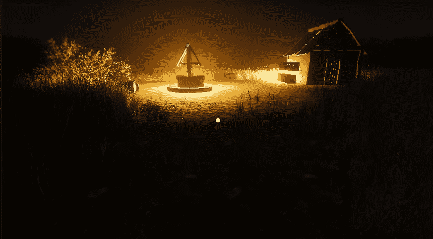

当我播放这个场景时，它是这样的:

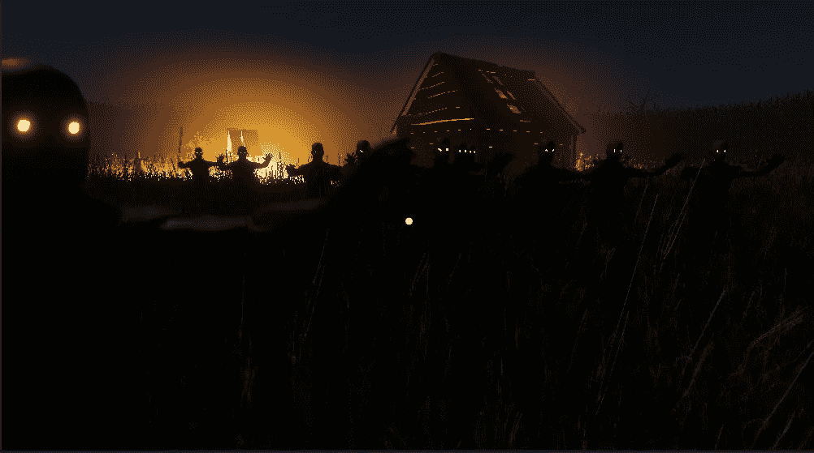

就是这样！

万事俱备，游戏搞定，这个教程系列也是。我希望你喜欢它。我以后会继续做游戏开发的文章，所以当我创建一个新的游戏时，请关注我！

决胜比赛

也请关注我的 twitter，了解更多类似内容:

 [## 扬·吉勒切克

### Jan Jilecek 的最新推文(@janjilecek)。INTP，独立游戏开发者，导演，作家，系统管理员，摄影师。我…

twitter.com](https://twitter.com/janjilecek) 

如果你刚刚开始学习如何开发游戏，你可以关注我的 udemy 初学者 Unity 开发课程:

 [## 完整指南:Unity 2020 中的动作恐怖 3D 游戏

### 大家好，我叫 Jan Jileč ek，是一名拥有计算机科学硕士学位的专业游戏开发人员，我…

www.udemy.com](https://www.udemy.com/course/make-a-3d-game-in-unity-2020-from-scratch-with-free-assets/?referralCode=8B96F6C67527AEEA39D9)