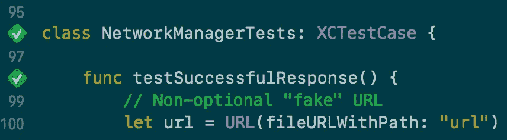

# 《急速后退》中的部分嘲讽

> 原文：<https://itnext.io/partial-mocking-in-swift-backwards-e5036cf32a1b?source=collection_archive---------4----------------------->

**简短免责声明:**本帖面向刚开始学习单元测试的 iOS 开发者。或者对于在之前[没有写过测试的有经验的 iOS 开发者来说。](https://blog.hubstaff.com/why-you-should-write-unit-tests/)

在 [Ray Wenderlich](https://www.raywenderlich.com/) 上有一个精彩的[视频教程系列](https://videos.raywenderlich.com/courses/105-testing-in-ios/lessons/1)(第一个视频是免费的，但你需要订阅才能观看其余部分)。到目前为止，我的体验是这样的:

我对教程的典型体验

复杂性迅速增加，所有足够重要的主题都是如此。我看到了约翰·桑德尔写的一篇很棒的文章，标题是《在迅捷中嘲弄》。我强烈建议首先阅读那篇文章，并从单元测试的 RW 系列开始，以便从后面的内容中获得最大收益。

那么，接下来是什么呢？我将逐步介绍我使用 John Sundell 的策略和代码创建部分模拟测试的方法。

# 创建测试

首先，假设您有某种异步获取数据的网络类。其次，让我们假设您知道如何为您的单元测试创建一个`XCTestCase`子类。当然，如果我们可以测试我们的网络类，那就太好了。那么我们如何着手做这件事呢？让我们先来看看我们的网络课程:

网络课。创建数据任务并返回结果。

网络结果枚举

上面我们有一个`loadData`函数，它接受一个 URL 和一个带有`NetworkResult`输入的转义闭包。我们使用共享的`URLSession`实例创建一个数据任务，该实例返回一个包含`data`和`error`对象的闭包。然后我们设置我们的枚举，并把它扔进完成处理器。

我们可能想测试很多东西！网络调用是否返回正确的数据？我们能正确地连接到我们传递的 URL 吗？正如 Sundell 所写的，我们可以编写一个测试，用一个有效的 URL 简单地调用`loadData`函数——但是这种技术有几个缺陷。

首先，互联网可能会中断，因此我们的数据任务将会失败。我们也可能从我们的 URL 中得到一些垃圾数据。但是我们应该首先测试一个简单得多的特性——如果有真正的错误，我们的代码会返回一个`failure`案例吗？如果返回一些数据，我们会得到一个`success`案例吗？正如 Sundell 所建议的，我们可以按照下面的方式开始编写我们的单元测试:

在上面的测试中，我们创建了一个 URL 以及网络类的实例。然后，我们在实例上调用`loadData`，并将结果存储在一个局部变量中。最后，我们测试我们从网络调用中得到的结果是否等于用一些数据变量(还没有定义)初始化的成功案例。

为了让我们的断言工作，我们需要数据！为此，我们需要一个有效的 URL，一个互联网连接，和时间(让函数异步加载)。这就是嘲讽的用武之地——与其用真实的 URL 获取真实的数据，为什么不用假的 URL 获取假的数据呢？

# 部分嘲笑

首先，我们必须理解在我们的 assert 案例中发生了什么。我们正在比较`result`(T4)和`.success(data)`。如果它们都包含相同的数据对象，则该测试将通过。创建一个我们指定并填充自己的`NetworkResult`枚举的伪`Data`对象的实例非常容易。然而，我们如何确保我们的`loadData`函数返回相同的假数据呢？

要解决这个问题，请看上面的`loadData`代码。数据对象从一个用我们的 URL 创建的`dataTask`返回，并使用一个共享的`URLSession`。为了欺骗我们的测试，我们必须以某种方式重写那个函数，使它返回我们的假数据。一种方法是创建一个`URLSession`的子类，并覆盖 dataTask 函数，让它做我们想要的事情。这个`URLSession`子类必须在`NetworkManager`中使用。

我们如何确保我们的网络类默认使用`URLSession.shared`，但是仍然在我们的测试用例中定制它来使用我们的定制`URLSession`子类？这就是[依赖注入](http://www.jamesshore.com/Blog/Dependency-Injection-Demystified.html)发挥作用的地方。这允许我们用我们创建的`URLSession`实例化一个`NetworkManager`对象。我们也不能忘记让`URLSession`知道我们在测试案例中创建的虚假数据。

让我们总结一下。首先，我们创建一个假的 URL。然后我们创造假数据。然后我们实例化我们的`URLSession`子类，并向它发送我们创建的假数据。然后我们创建一个`NetworkManager`实例并用我们的`URLSession`子类初始化它。这在测试用例中看起来如何？也许是这样的:

现在我们沿着树往上爬。第一站是`NetworkManager`，这里我们需要添加一些代码，允许我们在初始化时给它一个`URLSession`(见上面的第 15 行)，但也保留默认使用`URLSession.shared`的原始功能。要做到这一点，我们知道我们需要一个类型为`URLSession`的属性来存储要使用的会话，我们还需要创建自己的初始化器，它将允许我们编写类似于`NetworkManager(session: session)`的代码，但也保留一个默认值。幸运的是，Swift 为我们提供了默认参数值的功能:

> 您可以为函数中的任何参数定义一个*默认值*，方法是在该参数的类型之后为该参数赋值。如果定义了默认值，则在调用函数时可以省略该参数。

让我们来看看我们新的网络管理器代码:

与前面的代码相比，你可以看到只有如上所述的微小修改。我们现在不使用`URLSession.shared`而是使用私有`session`属性。

太好了！我们有我们的测试代码，我们的网络代码。剩下的工作就是创建我们的`URLSession`子类。

在`NetworkManager`代码中，我们可以看到我们的子类必须有一个数据属性(因为我们设置了`session.data`)，我们知道它必须覆盖`dataTask`函数。稍微提前考虑一下，我们也可以假设它必须有一个错误属性，因为我们希望最终测试一个错误状态。查看我们的`loadData`函数，我们也知道`dataTask`必须接受一个`@escaping`完成，因为有一个回调。该完成必须返回一个`URLSessionDataTask`对象，因为它应该存储在`NetworkManager`的`task`变量中。到目前为止的代码:

那么，我们在我们的`dataTask`函数中放什么呢？嗯，我们必须返回一个包含数据的`DataTask`对象。由于我们必须定制`DataTask`，听起来我们需要另一个子类。在我们的`URLSessionMock`子类中，我们必须实例化一个模拟的`DataTask`对象并返回它。这个`DataTask`对象应该具有这样的属性:在调用它的`resume()`函数时，闭包最终被调用。它可能如下所示:

咻。快好了。现在我们得到一个错误，我们的`NetworkResult`是不等价的，然而我们试图在我们的`XCTAssert`中使它等价。这是有道理的——所以这里有一个大致等同的版本`NetworkResult`。不是说它很完美，但它确实有效(参见此处以供参考):

我们只是比较底层的`Data`和`Error`对象。

完成处理程序链如下所示:在我们的测试函数中，我们将第一个完成`{ result = $0 }`发送给`loadData`函数。`loadData`函数需要转义`(NetworkResult) -> Void`完成，因此`$0`将代表`NetworkResult`。这个完成通过`URLSessionMock`并最终通过`URLSessionDataTaskMock`工作，直到在`resume()`函数中被调用。

我们运行测试，它是绿色的！(或者至少，应该是)。

一次成功的假网络测试

咻！对于一个测试来说，代码太多了。

上面的策略被称为*部分模仿*——通过部分修改对象来改变它们的行为。

以这种方式逆向工作类似于[红绿重构](https://blog.cleancoder.com/uncle-bob/2014/12/17/TheCyclesOfTDD.html)，失败的测试先写*然后写产品代码。在我们的例子中，我们甚至在这一步之前就开始编写一个测试，直到我们创建了必要的测试类，这个测试才被编译。*

约翰·桑德尔继续解释完全的嘲笑以及何时应该避免嘲笑。上面的策略对于完全模仿和部分模仿一样有效！

感谢阅读！如果你有评论、更正或问题，请在下面留下，我会尽力回答——或者，你可以在 [Twitter-@eduardlev](https://twitter.com/eduardlev) 上给我发消息