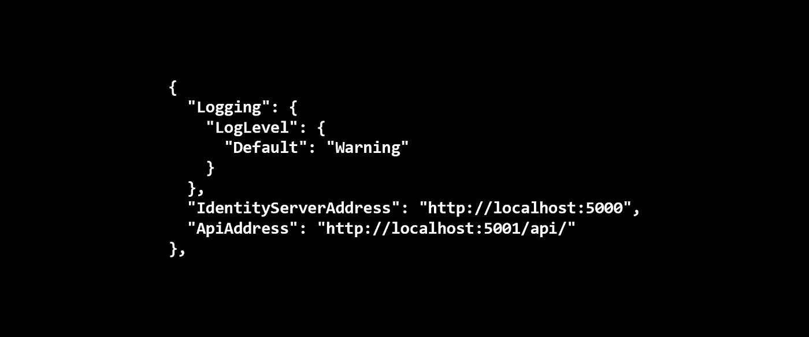

# 通过 API 调用将 ASP.NET 核心 Appsettings 值传递给 Angular

> 原文：<https://itnext.io/pass-asp-net-core-appsettings-values-to-angular-via-an-api-call-59127a1085e8?source=collection_archive---------3----------------------->



在我展示 Angular、Identity Server 4 和 ASP.NET 核心的 [repo](https://github.com/elanderson/Angular-Core-IdentityServer) 中，出现了一些与 Angular 新版本不兼容的问题。为了解决这个问题，我们计划使用微软的新 Angular 模板重新创建客户端应用程序，据我所知，这应该可以解决这个问题。

任何修改之前的代码都可以在[这里](https://github.com/elanderson/Angular-Core-IdentityServer/tree/62c05b775cde7091de06f0728ccf7a705b77cce4)找到，但是在这种情况下，整个客户端应用程序都被重新创建了，所以起点可能不是很有帮助。

## 问题是

在很大程度上，这工作得很好，但当我需要在新的 Angular 应用程序中使用 ASP.NET 核心的一些配置值时，问题就来了。以前版本的模板使用服务器端呈现，我利用它来传递配置值。默认情况下，新模板不使用服务器端渲染，我想找到一种不需要服务器端渲染的方法来解决这个问题。

另一个问题是，我希望能够在 Azure 中运行这个应用程序，并将配置值设置为环境变量。虽然 Angular 似乎支持环境文件，但是找到一个使用系统环境变量的解决方案并不容易。

## 配置 API 端点

因为我需要获取客户端应用程序的配置值是保密的，所以我决定通过 API 调用将它们拉回到托管 Angular 应用程序的同一个 ASP.NET 核心应用程序，这是示例解决方案中的客户端应用程序项目。

我在控制器目录中添加了一个 ConfigurationController.cs 类，内容如下。

```
[Produces("application/json")]
[Route("api/Configuration")]
public class ConfigurationController : Controller
{
    private readonly IConfiguration _configuration;

    public ConfigurationController(IConfiguration configuration)
    {
        _configuration = configuration;
    }

    [HttpGet("[action]")]
    public IActionResult ConfigurationData()
    {
        return Ok(new Dictionary<string, string>
        {
            { "IdentityServerAddress", _configuration["IdentityServerAddress"] },
            { "ApiAddress", _configuration["ApiAddress"] }
        });
    }
}
```

这个控制器通过引用应用程序的配置来构造，然后用我的 Angular 应用程序需要的值来填充字典。为了完整起见，下面是应用程序的 appsettings.json 文件的内容。

```
{
  "Logging": {
    "LogLevel": {
      "Default": "Warning"
    }
  },
  "IdentityServerAddress": "http://localhost:5000",
  "ApiAddress": "http://localhost:5001/api/"
}
```

## 角度变化

这是我努力想做好的部分。我需要来自上述 API 的配置值尽快可用。谢天谢地，我看到了[这篇](https://juristr.com/blog/2018/01/ng-app-runtime-config/#runtime-configuration)由[朱里·斯特鲁普弗洛纳](https://twitter.com/juristr)撰写的博客文章，其中介绍了 Angular 的 APP_INITIALIZER 的使用。

我需要做的第一件事是在 Angular 中创建一个类，从 API 中获取配置值，并为它们提供 Angular 应用程序的其余部分。为此，我将 configuration.service.ts 添加到新的 client app/src/app/configuration 目录中。接下来是整个班级。

```
import { Injectable } from '@angular/core';
import { HttpClient } from '@angular/common/http';

@Injectable()
export class ConfigurationService {

  private configuration: IServerConfiguration;

  constructor(private http: HttpClient) { }

  loadConfig() {
    return this.http.get<IServerConfiguration>('/api/Configuration/ConfigurationData')
      .toPromise()
      .then(result => {
        this.configuration = <IServerConfiguration>(result);
      }, error => console.error(error));
  }

  get apiAddress() {
    return this.configuration.ApiAddress;
  }

  get identityServerAddress() {
    return this.configuration.IdentityServerAddress;
  }

}

export interface IServerConfiguration {
  ApiAddress: string;
  IdentityServerAddress: string;
}
```

这个类调用 API 来获取 loadConfig 函数中的配置值，并将其映射到一个类级别的字段。它还提供了获取各个配置值的属性。

正如我上面提到的，让应用程序及时获得这些配置值是我很难做到的事情。使用 Angular 的 APP_INITIALIZER 解决这个问题的第一步是更改从@angular/core 的导入，以包含 APP_INITIALIZER 并导入 ConfigurationService。所有这些更改都是在 app.module.ts 文件中进行的。

```
import { NgModule, APP_INITIALIZER } from '@angular/core';
import { ConfigurationService } from "./configuration/configuration.service";
```

接下来，我们需要定义一个调用 configuration service . load config 函数的函数。

```
const appInitializerFn = (appConfig: ConfigurationService) => {
  return () => {
    return appConfig.loadConfig();
  };
};
```

最后，在 providers 数组中为 APP_INITIALIZER 和 ConfigurationService 添加一个元素。

```
providers: [
  ConfigurationService,
  {
    provide: APP_INITIALIZER,
    useFactory: appInitializerFn,
    multi: true,
    deps: [ConfigurationService]
  }]
```

## 包扎

这是比我想象的要复杂的事情之一。谢天谢地，有了上面的改变，我能够让它正常工作了。我希望这能为大家节省一些时间。所有修改的代码可以在[这里](https://github.com/elanderson/Angular-Core-IdentityServer/tree/21477db53da290fae815c6d80aeb27569ffcac6f)找到。

*原载于* [*安德森*](https://elanderson.net/2018/05/pass-asp-net-core-appsettings-values-to-angular-via-an-api-call/) *。*