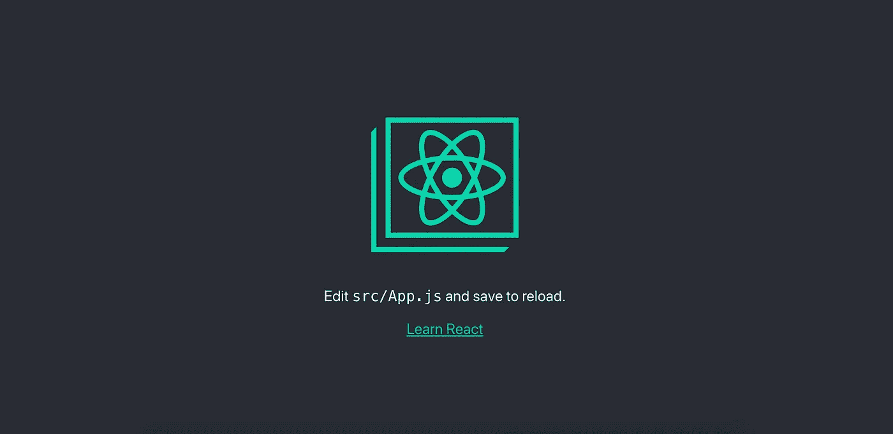
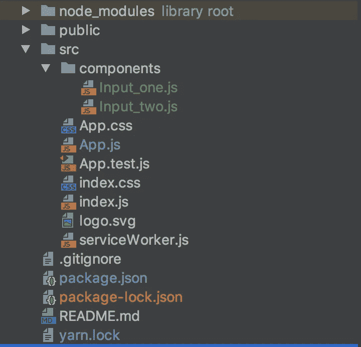
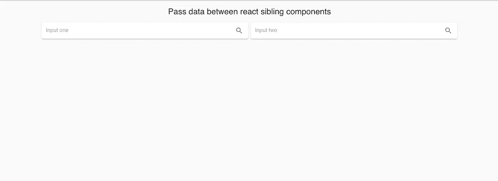
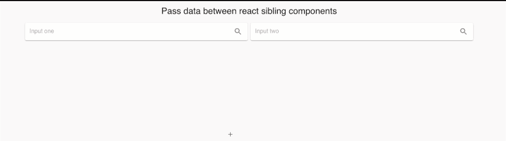
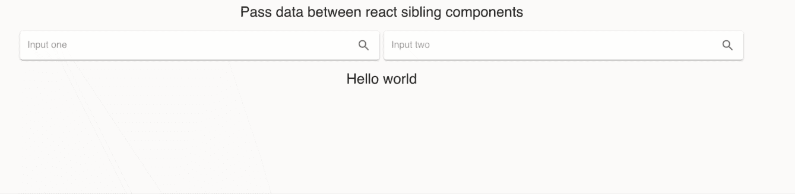
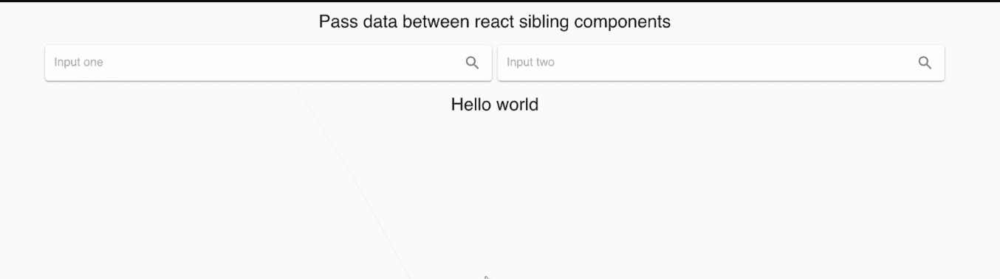

# 使用上下文 API 和 React 挂钩在 React 中的兄弟组件之间传递数据

> 原文：<https://itnext.io/passing-data-between-sibling-components-in-react-using-context-api-and-react-hooks-fce60f12629a?source=collection_archive---------0----------------------->

我将构建一个带有 2 个输入的简单 react 应用程序，其中它们的值将完全同步。在本文中，我将解释使用最新的 react 特性在 react 兄弟组件之间发送数据是多么容易。


# 设置 React 环境

要在 react 中启动新的应用程序，您不需要担心所有的设置和配置。我将使用`Create React App`环境，它非常简单并且有很好的文档记录。关于这个工具链的所有文档可以在这里找到。

创建 react 项目

```
npx create-react-app sync_inputs
```

之后，你需要导航到文件夹`sync_inputs`并启动应用程序

```
cd sync_inputs
npm start
```

***注意:*** 运行这个本地服务器可能会有一些问题。如果你有类似*`Attempting to bind to HOST environment variable: **x86_64-apple-darwin13.4.0**`**的错误信息，那么[这篇](https://medium.com/@choy/fixing-create-react-app-when-npm-fails-to-start-because-your-host-environment-variable-is-being-4c8a9fa0b461)文章可能对你有帮助。当我试着运行我的服务器时，我遇到了一个错误`TypeError: fsevents is not a constructor.`我在这里找到了很多如何处理它的建议[，但是个人帮我移除了所有的节点包并重新运行`npm install`。之后我运行`npm start`，一切正常。此外，使用 npm 不是必要的。喜欢的话可以用纱。](https://github.com/facebook/create-react-app/issues/6891)***

***如果一切都已安装，并且您的本地服务器正在运行，您需要导航`http://localhost:3000`，您应该会在深色背景上看到 react 徽标。大概是这样的:***

******

***现在，在您的终端中按下`ctrl + c`来停止本地服务器，并安装更多的依赖项。***

***安装[材质 UI](https://material-ui.com/) 核心库和它们的图标库来制作漂亮的 UI***

```
***npm install @material-ui/core
npm install @material-ui/icons***
```

***现在你的 *package.json* 文件应该是这样的:***

```
***{
  "name": "sync_inputs",
  "version": "0.1.0",
  "private": **true**,
  "dependencies": {
    "@material-ui/core": "^4.5.0",
    "@material-ui/icons": "^4.4.3",
    "react": "^16.10.2",
    "react-dom": "^16.10.2",
    "react-scripts": "3.2.0"
  },
  "scripts": {
    "start": "react-scripts start",
    "build": "react-scripts build",
    "test": "react-scripts test",
    "eject": "react-scripts eject"
  },
  "eslintConfig": {
    "extends": "react-app"
  },
  "browserslist": {
    "production": [
      ">0.2%",
      "not dead",
      "not op_mini all"
    ],
    "development": [
      "last 1 chrome version",
      "last 1 firefox version",
      "last 1 safari version"
    ]
  }
}***
```

***所以，现在我们有了我们需要的包含所有库的工作环境。现在是时候开始构建我们的应用程序了。***

# *****创建 React 组件*****

> ***在这一部分，我将建立我们的项目结构，并将创建所有的用户界面。***

***首先，在我们项目的`./src`目录中创建新文件夹`components`。之后在`./src/components`中创建两个新组件( *Input_one.js* ， *Input_two.js* )。完成所有这些步骤后，您的项目结构应该如下所示:***

******

***在接下来的步骤中，我将修改我们的组件来创建一个漂亮的用户界面。***

***修改`./src/components/Input_one.js`创建一个输入。***

```
*****import** React **from** 'react';
**import** {makeStyles} **from** "@material-ui/core/styles/index";

//Material UI components
**import** Grid **from** '@material-ui/core/Grid';
**import** Paper **from** '@material-ui/core/Paper';
**import** InputBase **from** '@material-ui/core/InputBase';

//Material UI Icons
**import** IconButton **from** '@material-ui/core/IconButton';
**import** SearchIcon **from** '@material-ui/icons/Search';

**const** useStyles = makeStyles({
    root: {
        padding: '2px 4px',
        display: 'flex',
        alignItems: 'center',
        width: '100%',
    },
    input: {
        marginLeft: '8px',
        flex: 1,
    },
    iconButton: {
        padding: 10,
    }
});

**export default function** Input_one() {
    **const** classes = useStyles();

    **return**(
        <React.Fragment>
            <Grid item xs={12} md={6}>
                <Paper className={classes.root}>
                    <InputBase
                        className={classes.input}
                        placeholder="Input one"
                    />
                    <IconButton className={classes.iconButton} aria-label="search">
                        <SearchIcon />
                    </IconButton>
                </Paper>
            </Grid>
        </React.Fragment>
    )
}***
```

***修改`./src/components/Input_two.js`创建一个输入二。***

```
*****import** React **from** 'react';
**import** {makeStyles} **from** "@material-ui/core/styles/index";

//Material UI components
**import** Grid **from** '@material-ui/core/Grid';
**import** Paper **from** '@material-ui/core/Paper';
**import** InputBase **from** '@material-ui/core/InputBase';

//Material UI Icons
**import** IconButton **from** '@material-ui/core/IconButton';
**import** SearchIcon **from** '@material-ui/icons/Search';

**const** useStyles = makeStyles({
    root: {
        padding: '2px 4px',
        display: 'flex',
        alignItems: 'center',
        width: '100%',
    },
    input: {
        marginLeft: '8px',
        flex: 1,
    },
    iconButton: {
        padding: 10,
    }
});

**export default function** Input_two() {
    **const** classes = useStyles();

    **return**(
        <React.Fragment>
            <Grid item xs={12} md={6}>
                <Paper className={classes.root}>
                    <InputBase
                        className={classes.input}
                        placeholder="Input two"
                    />
                    <IconButton className={classes.iconButton} aria-label="search">
                        <SearchIcon />
                    </IconButton>
                </Paper>
            </Grid>
        </React.Fragment>
    )
}***
```

******注:*** *Input_one* 和 *Input_two* 组件几乎相同。现在主要区别在`export default function Input_one()`和`export default function Input_two()`***

***现在修改`./src/App.js`文件。在这个文件中，我将创建*容器*，其中将存储我们应用程序的所有内容，添加标题并导入我们的*<【Input _ one/>*和 *< Input_two/ >* 组件。***

```
*****import** React **from** 'react';
**import** { makeStyles } **from** '@material-ui/core/styles';

//Material UI components
**import** Container **from** '@material-ui/core/Container';
**import** Typography **from** '@material-ui/core/Typography';
**import** Grid **from** '@material-ui/core/Grid';
**import** CssBaseline **from** '@material-ui/core/CssBaseline';
**import** Toolbar **from** '@material-ui/core/Toolbar';

//Import our Inputs
**import** Input_one **from** './components/Input_one';
**import** Input_two **from** './components/Input_two';

//Styles
**const** useStyles = makeStyles({
    toolbarTitle: {
        flex: 1,
    },
});

**function** App() {

  **const** classes = useStyles();

  **return** (
      <Container maxWidth="lg">
          <CssBaseline />

          {/*Title*/}
          <Toolbar>
              <Typography
                  component="h2"
                  variant="h5"
                  color="inherit"
                  align="center"
                  noWrap
                  className={classes.toolbarTitle}
              >
                  Pass data between react sibling components
              </Typography>
          </Toolbar>

          {/*Inputs*/}
          <Grid container spacing={1}>
              <Input_one/>
              <Input_two/>
          </Grid>

      </Container>
  );
}

**export default** App;***
```

***完成所有这些步骤后，导航至`http://localhost:3000`。我们的项目应该是这样的:***

******

# ***创建在组件之间传递数据的功能***

***根据 React [文档](https://reactjs.org/docs/context.html)***

> ***当不同嵌套层次的许多组件需要访问某些数据时，主要使用上下文。***

***在`./src/App.js`中创建一个上下文对象***

```
***// Create context object
**export const** AppContext = React.createContext();***
```

***然后设置初始状态对象，在那里我们存储我们的日期，这应该可以从两个输入访问。***

```
***// Set up Initial State
**const** initialState = {

    inputText: '',

};***
```

***现在创建函数`reducer`，当任何输入的值改变时，它将每次更新我们的初始状态。我们将通过`useReducer`使用该功能***

```
*****function** reducer(state, action) {
    **switch** (action.type) {
        **case** 'UPDATE_INPUT':
            **return** {
                inputText: action.data
            };

        **default**:
            **return** initialState;
    }
}***
```

***根据 react [文档](https://reactjs.org/docs/hooks-reference.html#usereducer)***

> ***`useReducer`允许您优化触发深度更新的组件的性能，因为您可以向下传递`dispatch`而不是回调。***

***首先我们需要从 react 导入`useReducer`。所以现在`./src/App.js`的第一行应该是这样的***

```
*****import** React, { useReducer } **from** 'react';***
```

***现在我们需要初始化`useReducer`状态。最简单的方法是将初始状态作为第二个参数传递。我们可以通过添加以下内容来做到这一点:***

```
*****const** [state, dispatch] = useReducer(reducer, initialState);***
```

***`./src/App.js`中的最后一部分是将组件 *< Input_one/ >* 和 *< Input_two/ >* 包装在`AppContext.Provider.`中，每个上下文对象都附带一个提供者 React 组件，允许消费组件订阅上下文更改。可以嵌套提供程序以覆盖树中更深层次的值。***

***现在的`./src/App.js`应该是那个样子:***

```
*****import** React, { useReducer } **from** 'react';
**import** { makeStyles } **from** '@material-ui/core/styles';

//Material UI components
**import** Container **from** '@material-ui/core/Container';
**import** Typography **from** '@material-ui/core/Typography';
**import** Grid **from** '@material-ui/core/Grid';
**import** CssBaseline **from** '@material-ui/core/CssBaseline';
**import** Toolbar **from** '@material-ui/core/Toolbar';

//Import our Inputs
**import** Input_one **from** './components/Input_one';
**import** Input_two **from** './components/Input_two';

//Styles
**const** useStyles = makeStyles({
    toolbarTitle: {
        flex: 1,
    },
});

// Create context object
**export const** AppContext = React.createContext();

// Set up Initial State
**const** initialState = {

    inputText: '',

};

**function** reducer(state, action) {
    **switch** (action.type) {
        **case** 'UPDATE_INPUT':
            **return** {
                inputText: action.data
            };

        **default**:
            **return** initialState;
    }
}

**function** App() {

  **const** classes = useStyles();

  **const** [state, dispatch] = useReducer(reducer, initialState);

  **return** (
      <Container maxWidth="lg">
          <CssBaseline />

          {/*Title*/}
          <Toolbar>
              <Typography
                  component="h2"
                  variant="h5"
                  color="inherit"
                  align="center"
                  noWrap
                  className={classes.toolbarTitle}
              >
                  Pass data between react sibling components
              </Typography>
          </Toolbar>

          {/*Inputs*/}
          <Grid container spacing={1}>
              <AppContext.Provider value={{ state, dispatch }}>
                  <Input_one/>
                  <Input_two/>
              </AppContext.Provider>
          </Grid>

      </Container>
  );
}

**export default** App;***
```

***现在我们需要修改我们的 *<输入 _ 一/ >* 和 *<输入 _ 二/ >* 组件。***

***对于两个输入组件，所有接下来的更改将完全相同。首先我们需要从 react 导入`useContext`。***

```
*****import** React, { useContext } **from** 'react';***
```

***现在我们需要从应用程序组件导入 AppContext***

```
*****import** { AppContext } **from** '../App'***
```

***为了在组件中使用我们的状态值，我们需要添加***

```
*****const** {state, dispatch} = useContext(AppContext);***
```

***下一个 add 函数，它将使用`dispatch.`更新状态`inputText`值。每次我们在任何输入中键入内容时，都会调用这个函数。***

```
*****const** changeInputValue = (newValue) => {

    dispatch({ type: 'UPDATE_INPUT', data: newValue,});
};***
```

***现在我们需要将*值*设置为*状态，inputText* 和 *onChange* 事件应该调用函数`changeInputValue`。***

***现在`./src/components/Input_one.js`应该是这样的:***

```
*****import** React, { useContext } **from** 'react';
**import** {makeStyles} **from** "@material-ui/core/styles/index";

//Material UI components
**import** Grid **from** '@material-ui/core/Grid';
**import** Paper **from** '@material-ui/core/Paper';
**import** InputBase **from** '@material-ui/core/InputBase';

//Material UI Icons
**import** IconButton **from** '@material-ui/core/IconButton';
**import** SearchIcon **from** '@material-ui/icons/Search';

// Import Context
**import** { AppContext } **from** '../App'

**const** useStyles = makeStyles({
    root: {
        padding: '2px 4px',
        display: 'flex',
        alignItems: 'center',
        width: '100%',
    },
    input: {
        marginLeft: '8px',
        flex: 1,
    },
    iconButton: {
        padding: 10,
    }
});

**export default function** Input_one() {

    **const** classes = useStyles();

    **const** {state, dispatch} = useContext(AppContext);

    **const** changeInputValue = (newValue) => {

        dispatch({ type: 'UPDATE_INPUT', data: newValue,});
    };

    **return**(
        <React.Fragment>
            <Grid item xs={12} md={6}>
                <Paper className={classes.root}>
                    <InputBase
                        className={classes.input}
                        placeholder="Input one"
                        value={state.inputText}
                        onChange={e => changeInputValue(e.target.value)}
                    />
                    <IconButton className={classes.iconButton} aria-label="search">
                        <SearchIcon />
                    </IconButton>
                </Paper>
            </Grid>
        </React.Fragment>
    )
}***
```

***而`./src/components/Input_two.js`应该长得像:***

```
*****import** React, { useContext } **from** 'react';
**import** {makeStyles} **from** "@material-ui/core/styles/index";

//Material UI components
**import** Grid **from** '@material-ui/core/Grid';
**import** Paper **from** '@material-ui/core/Paper';
**import** InputBase **from** '@material-ui/core/InputBase';

//Material UI Icons
**import** IconButton **from** '@material-ui/core/IconButton';
**import** SearchIcon **from** '@material-ui/icons/Search';

//Import Context
**import** { AppContext } **from** '../App'

**const** useStyles = makeStyles({
    root: {
        padding: '2px 4px',
        display: 'flex',
        alignItems: 'center',
        width: '100%',
    },
    input: {
        marginLeft: '8px',
        flex: 1,
    },
    iconButton: {
        padding: 10,
    }
});

**export default function** Input_two() {

    **const** classes = useStyles();

    **const** {state, dispatch} = useContext(AppContext);

    **const** changeInputValue = (newValue) => {

        dispatch({ type: 'UPDATE_INPUT', data: newValue,});
    };

    **return**(
        <React.Fragment>
            <Grid item xs={12} md={6}>
                <Paper className={classes.root}>
                    <InputBase
                        className={classes.input}
                        placeholder="Input two"
                        value={state.inputText}
                        onChange={e => changeInputValue(e.target.value)}
                    />
                    <IconButton className={classes.iconButton} aria-label="search">
                        <SearchIcon />
                    </IconButton>
                </Paper>
            </Grid>
        </React.Fragment>
    )
}***
```

***现在，在任何输入字段中输入一些内容，您将看到两个输入都将被更新，并且包含相同的值。***

******

# ***添加不变性助手***

***所以现在我们的应用程序按照我们预期的方式工作。但是让我们在`./src/App.js`中更新我们的初始状态，再增加一个值并显示在页面上。所以现在我们的 initialState 对象应该是这样的:***

```
***// Set up Initial State
**const** initialState = {

    inputText: '',
    testText: 'Hello world'

};***
```

***现在让我们在页面上显示`testText`。我们的`./src/App.js`文件应该是这样的:***

```
*****import** React, { useReducer } **from** 'react';
**import** { makeStyles } **from** '@material-ui/core/styles';

//Material UI components
**import** Container **from** '@material-ui/core/Container';
**import** Typography **from** '@material-ui/core/Typography';
**import** Grid **from** '@material-ui/core/Grid';
**import** CssBaseline **from** '@material-ui/core/CssBaseline';
**import** Toolbar **from** '@material-ui/core/Toolbar';

//Import our Inputs
**import** Input_one **from** './components/Input_one';
**import** Input_two **from** './components/Input_two';

//Styles
**const** useStyles = makeStyles({
    toolbarTitle: {
        flex: 1,
    },
});

// Create context object
**export const** AppContext = React.createContext();

// Set up Initial State
**const** initialState = {

    inputText: '',
    testText: 'Hello world'

};

**function** reducer(state, action) {
    **switch** (action.type) {
        **case** 'UPDATE_INPUT':
            **return** {
                inputText: action.data
            };

        **default**:
            **return** initialState;
    }
}

**function** App() {

  **const** classes = useStyles();

  **const** [state, dispatch] = useReducer(reducer, initialState);

  **return** (
      <Container maxWidth="lg">
          <CssBaseline />

          {/*Title*/}
          <Toolbar>
              <Typography
                  component="h2"
                  variant="h5"
                  color="inherit"
                  align="center"
                  noWrap
                  className={classes.toolbarTitle}
              >
                  Pass data between react sibling components
              </Typography>
          </Toolbar>

          {/*Inputs*/}
          <Grid container spacing={1}>
              <AppContext.Provider value={{ state, dispatch }}>
                  <Input_one/>
                  <Input_two/>
              </AppContext.Provider>
          </Grid>

          {/*display testText value*/}
          <Toolbar>
              <Typography
                  component="h2"
                  variant="h5"
                  color="inherit"
                  align="center"
                  noWrap
                  className={classes.toolbarTitle}
              >
                  {state.testText}
              </Typography>
          </Toolbar>
      </Container>
  );
}

**export default** App;***
```

***如果一切都是正确的，你现在应该看到我们输入的“Hello world”文本。开始在任何输入中输入一些东西。你可以看到发生了什么。我们的“Hello word”文本消失了。***

******

***这之所以发生，是因为现在每次你在任何输入中输入东西，你都用新的状态完全替换了我们的 initialState 对象。但是有一个解决方案可以解决这个问题。我们不需要每次都替换我们的 initialState 对象，只需要更新`inputText`值，不接触任何其他状态。为了实现这一点，我们可以使用[不变性助手](https://github.com/kolodny/immutability-helper)库，这个库有很好的文档记录。通过在终端中键入命令来安装这个库***

```
***npm install immutability-helper --save***
```

***现在我们只需要将这个库导入到我们的`./src/App.js`文件中，并根据不变性助手文档更新`reducer`函数。所以我们的`./src/App.js`文件应该是这样的:***

```
*****import** React, { useReducer } **from** 'react';
**import** { makeStyles } **from** '@material-ui/core/styles';

//Import immutability-helper
**import** update **from** 'immutability-helper';

//Material UI components
**import** Container **from** '@material-ui/core/Container';
**import** Typography **from** '@material-ui/core/Typography';
**import** Grid **from** '@material-ui/core/Grid';
**import** CssBaseline **from** '@material-ui/core/CssBaseline';
**import** Toolbar **from** '@material-ui/core/Toolbar';

//Import our Inputs
**import** Input_one **from** './components/Input_one';
**import** Input_two **from** './components/Input_two';

//Styles
**const** useStyles = makeStyles({
    toolbarTitle: {
        flex: 1,
    },
});

// Create context object
**export const** AppContext = React.createContext();

// Set up Initial State
**const** initialState = {

    inputText: '',
    testText: 'Hello world'

};

**function** reducer(state, action) {
    **switch** (action.type) {
        **case** 'UPDATE_INPUT':
            **return** update(state, { inputText: {$set: action.data}});

        **default**:
            **return** initialState;
    }
}

**function** App() {

  **const** classes = useStyles();

  **const** [state, dispatch] = useReducer(reducer, initialState);

  **return** (
      <Container maxWidth="lg">
          <CssBaseline />

          {/*Title*/}
          <Toolbar>
              <Typography
                  component="h2"
                  variant="h5"
                  color="inherit"
                  align="center"
                  noWrap
                  className={classes.toolbarTitle}
              >
                  Pass data between react sibling components
              </Typography>
          </Toolbar>

          {/*Inputs*/}
          <Grid container spacing={1}>
              <AppContext.Provider value={{ state, dispatch }}>
                  <Input_one/>
                  <Input_two/>
              </AppContext.Provider>
          </Grid>

          {/*display testText value*/}
          <Toolbar>
              <Typography
                  component="h2"
                  variant="h5"
                  color="inherit"
                  align="center"
                  noWrap
                  className={classes.toolbarTitle}
              >
                  {state.testText}
              </Typography>
          </Toolbar>
      </Container>
  );
}

**export default** App;***
```

***当你做这些改变时，你的应用程序必须按预期工作。如果你在任何输入中输入一些东西，“Hello world”的标题应该还在页面上。现在我们只更新我们正在处理的值，而不是替换所有的对象。***

******

# ***摘要***

***你可以在我的 [GitHub repo](https://github.com/bilousov94/sync_inputs) 上找到这个应用程序的所有最终代码。如你所见，在 React 兄弟组件之间传递数据现在变得简单了。如果你熟悉 Redux，你可能会看到很多熟悉的东西。Context Api 允许我们共享数据，这些数据可以被认为是 React 组件树“全局”数据。这个解决方案对优化我们的 React 应用程序很有帮助，但是对于具有多个嵌套层次的更复杂的项目，我更喜欢使用 [Redux](https://redux.js.org/) 。如果你处理了我展示给你所有过程，那么你也会很容易理解 Redux。***

***希望这篇文章对你有很大帮助。我也很想知道其他有趣的方法。请在下面的评论中告诉我你的想法。***

***🎉快乐编码🎉***