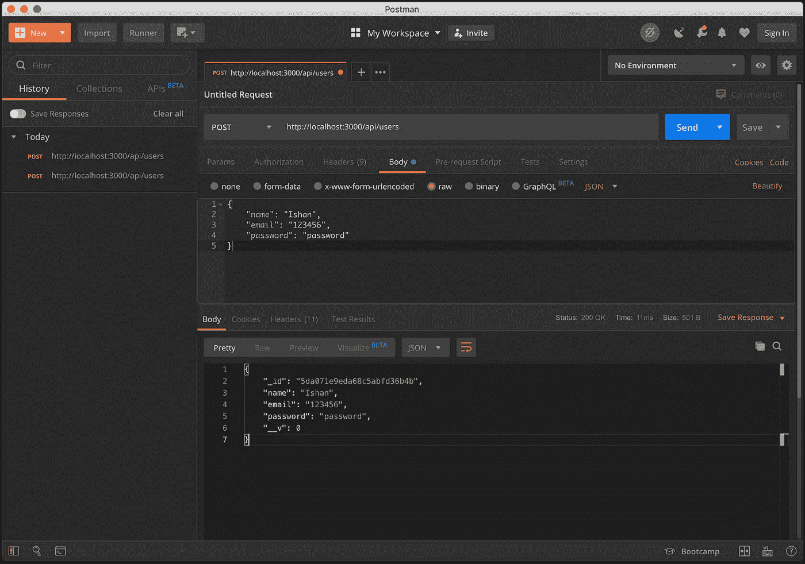
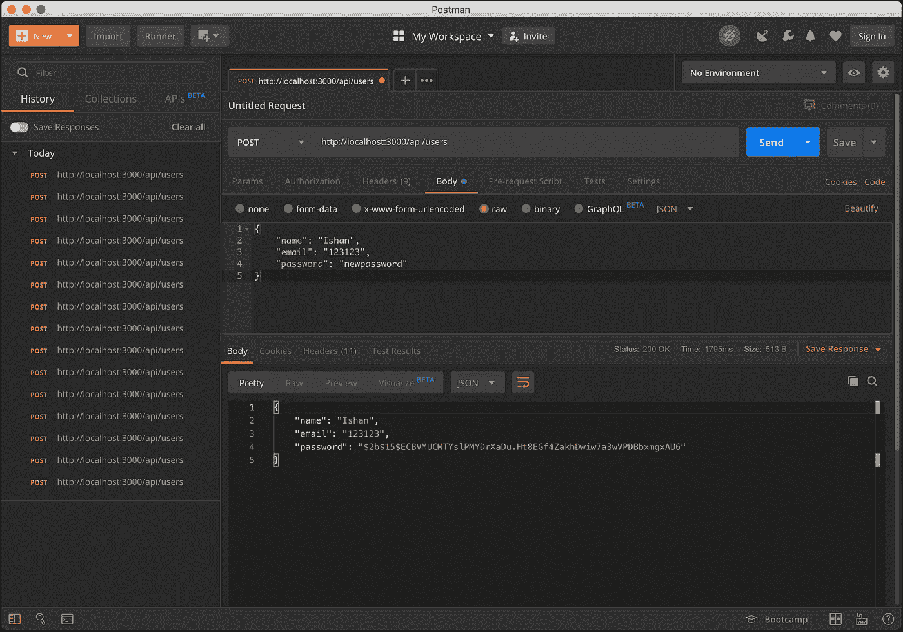

# 密码加密—节点应用中的哈希算法

> 原文：<https://itnext.io/password-encryption-hashing-in-node-application-311a6f61cd65?source=collection_archive---------1----------------------->


无论应用程序是大还是小，我们都需要在应用程序中加入一些登录功能。在当今的数字世界里 ***保护密码*** 对用户来说是必须的。保护数据和信息的安全仍然是我们开发人员的重要职责。

在开始使用存储在我们数据库中的散列密码构建端点之前。让我们弄清楚在 web 中用于散列纯文本的类似术语。

**什么是加密？**

以只有拥有相应密钥的人才能读取的方式对信息进行加密的做法。它涉及双向功能。当我们加密某个东西时，你这样做是为了以后解密它。

**什么是哈希？**

使用算法将任意大小的数据映射到固定长度的实践。结果是散列值/散列码/散列和。反向散列在技术上是可行的，但所需的计算能力使其不可行。

哈希是一种方式，但加密有两种方式。加密是为了保护传输中的数据，哈希是为了验证文件或数据未被更改，即它是真实的。换句话说，它是一种校验和。

**什么是腌制？**

Salting 是一个通常与密码哈希相关的概念。本质上，它是一个唯一的值，可以添加到密码的末尾来创建不同的哈希值。这为散列过程增加了一层安全性，特别是针对暴力攻击。腌制时，附加值被称为“盐”

通过在密码末尾添加一个盐，然后对其进行哈希运算，我们实际上增加了识别密码的复杂性，并使我们的安全位更容易被破解。

## 注册新用户


[来源:auth0](https://auth0.com)

我们将看看如何使我们的端点可以存储新用户到我们的数据库中的字段

> *姓名、电子邮件和密码。*

对于这个演示，我们将为我们的[节点](https://nodejs.org/en/)应用程序使用 E [xpress](https://expressjs.com/) 框架，同时使用 [MongoDB](https://www.mongodb.com/) 作为我们的数据库。在用流行库 [bcrypt](https://yarnpkg.com/en/package/bcrypt) 将新用户存储到我们的数据库之后。在这里，我们将散列密码，以便在我们的应用程序中添加位层安全性。

首先，我将在我们的 [express](https://expressjs.com/) 应用程序 *user.js* 中创建一个新的**模型**

[https://gist . github . com/ishan-me/d32b 21918 ce 0 D5 ee 8 a 6330 f 90 a 4 f 7 C2 e](https://gist.github.com/ishan-me/d32b21918ce0d5ee8a6330f90a4f7c2e)

我们将在 express 应用程序中添加额外的路线。我们创建新的 **route** 文件，并命名为 *user.js*

[https://gist . github . com/ishan-me/17a 06 a1 f 704 fdf 70 F3 b 23 be 832 ad 53 e 5](https://gist.github.com/ishan-me/17a06a1f704fdf70f3b23be832ad53e5)

除了这些变化之外，我们还将在我们的 **main** index.js 中添加这条额外的路线

[https://gist . github . com/ishan-me/8 ceaa 27393 b 8 E8 df E0 bde 2e 7d 635 ab](https://gist.github.com/ishan-me/8ceaa27393b8e8dfe0bdbde2e7d635ab)

准备好上面的代码后，我们将使用 [postman](https://www.getpostman.com/) 测试我们的端点，我们会得到以下结果:



一个新名称的电子邮件，这是设置为唯一的用户和密码被创建到我们的本地数据库。我们将进一步探讨如何用 bcrypt 将加密的密码存储到我们的数据库中。

## 哈希密码


[来源:auth0](https://auth0.com)

bcrypt 是由 Niels Provos 和 David Mazières 基于 Blowfish 密码设计的密码散列函数，于 1999 年在 USENIX 提出。我们将在我们的文件夹中添加以下命令，以使用有助于散列我们的密码的库。

```
yarn add bcrypt
```

要破解我们的密码，我们需要一把盐。“salt”将一个很长的字节串添加到密码中。因此，即使恶意黑客可能获得单向散列密码的访问权限，他们也应该无法猜出“salt”字符串。可以为每个用户添加一个随机字符串，该字符串是在生成用户帐户时创建的。这将显著增加加密，因为恶意黑客将不得不试图一次找到单个用户的密码。

现在让我们进入我们的代码，并添加哈希到我们的密码。我们将在 routes users.js 中添加额外的代码行

[https://gist . github . com/ishan-me/fd67c 6723027 a68c 8242227 de 99730 ee](https://gist.github.com/ishan-me/fd67c6723027a68c8242227de99730ee)

上面的代码准备好了，我们将再次用 [postman](https://www.getpostman.com/) 测试我们的端点，我们得到下面的结果。我们已经返回了包括密码在内的响应，但是在实际应用中，我们更愿意发送一个令牌和授权头。



如果我们有您需要保护的敏感数据或信息，确保其安全是非常重要的。通过上面的过程，我们现在可以成功地将散列密码存储到我们的数据库中，增加了一点安全性。