# 使用 Nodemailer 简化 React 应用程序中的密码重置电子邮件

> 原文：<https://itnext.io/password-reset-emails-in-your-react-app-made-easy-with-nodemailer-bb27968310d7?source=collection_archive---------0----------------------->

# 在 JavaScript 应用程序中重置密码并不复杂

## **MERN 应用程序中的密码重置**

B 在我真正尝试为我的 MERN 应用程序内置一个基于电子邮件的密码重置功能之前，我认为这会更难做到。根据我之前听到的一切，在 JavaScript 应用程序中发送电子邮件是痛苦的，但我仍然想尝试一下。

几个月来，为了磨练我的全部 JavaScript 技能，我一直在慢慢构建并添加一个用户注册服务[。](https://github.com/paigen11/mysql-registration-passport)

首先，我用 React 前端、Express / Node.js 后端和 Docker 支持的 MySQL 数据库构建了它。我使用了一个`docker-compose.yml`来用一个命令启动整个应用程序(如果你想了解更多关于我使用 Docker 进行开发的信息，你可以看看这篇[博文](https://medium.com/@paigen11/using-docker-docker-compose-to-improve-your-full-stack-application-development-1e41280748f4))。

在我完成这项工作后，我使用 Passport.js 和 JSON Web token(jwt)向应用程序添加了授权。如果你好奇的话，你可以在这里读到那个[的乐趣(痛苦)。这花了我一段时间——我遇到了一堆路障和障碍，多次让我止步不前。但是，一旦问题在我的大脑中扎根，我的勇气和我无法放弃它的能力占了上风，我找到了它并继续前进。](/implementing-json-web-tokens-passport-js-in-a-javascript-application-with-react-b86b1f313436)

当我决定通过电子邮件发送密码重置链接时(就像真实的网站一样，包括我在内的用户不可避免地会忘记他们的密码)，我想我会更加痛苦。这太简单了，尽管几乎每个网站都有这个功能。但我错了。我很高兴我是。

## node mailer——神奇的子弹

当我开始在谷歌上寻找我的密码重置功能的解决方案时，我看到了一些推荐 [Nodemailer](https://nodemailer.com/about/) 的文章。

当我访问该网站时，我读到的第一行是:

> Nodemailer 是 Node.js 应用程序的一个模块，可以轻松发送电子邮件。该项目始于 2010 年，当时没有发送电子邮件的合理选项，今天它是大多数 Node.js 用户默认采用的解决方案。—节点邮件程序

你知道吗？这不是开玩笑。易如反掌不会错太多。

当然，在我开始之前，我做了更多的调查，以确保我对一项像样的技术抱有信心，我在 [NPM](https://www.npmjs.com/package/nodemailer) 和 [Github](https://github.com/nodemailer/nodemailer) 上看到的东西让我放心。

节点邮件程序具有:

*   来自 NPM 的每周下载超过 615，000 次，
*   Github 上超过 10，000 颗星星，
*   迄今为止发行了 206 次，
*   超过 2500 个依赖包，
*   自 2010 年以来，它一直以某种形式或时尚存在。

好吧，这似乎足够让我在自己的项目中尝试一下。

## 在我的代码中实现 Nodemailer(前端和后端)

我的密码重置不需要任何花哨的东西，只需要:

*   一种向用户地址发送电子邮件的方式，
*   该电子邮件将包含一个链接，将他们重定向到我的网站上的一个受保护的页面，他们可以在那里重置密码，
*   然后他们可以使用新密码登录。
*   我还希望密码重置链接在一段时间后过期，以获得更好的安全性。

我是这样做的。

## 前端代码(客户端文件夹)—发送重置电子邮件

我将首先从 React 代码开始，因为我必须有一个页面，用户可以在其中输入他们的电子邮件地址并发送带有重置链接的电子邮件。

`**ForgotPassword.js**`

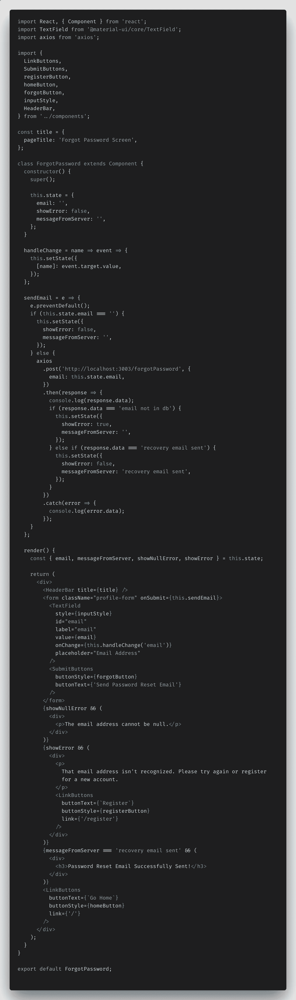

好吧，我知道这是一个很大的截图，但我会分解它(我在 VS 代码中使用了 [Polacode](https://github.com/octref/polacode) 扩展来制作这个漂亮的截图，仅供参考)。如果你想复制/粘贴实际代码，你可以在这里看到整个回购。

这里你真正应该关注的是组件的`sendEmail`函数和`render`方法。剩下的只是设置初始状态和变量，以及按钮和元素的样式。

**渲染方法**

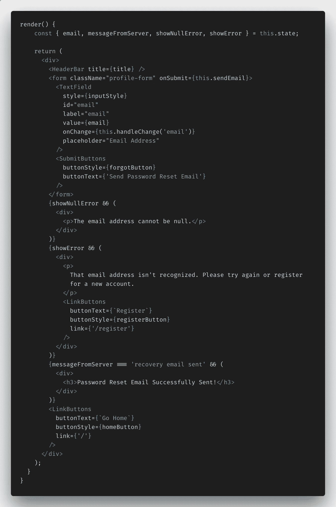

注意在`render`方法中，我有一个简单的输入框供用户输入他/她的电子邮件地址，还有一个提交按钮，当点击时会触发`this.sendEmail()`功能。除此之外，我还内置了一点错误和成功处理功能，它基于用户是否没有输入电子邮件，服务器是否回复电子邮件已成功发送，或者它不是一个可识别的地址。

**发送邮件功能**

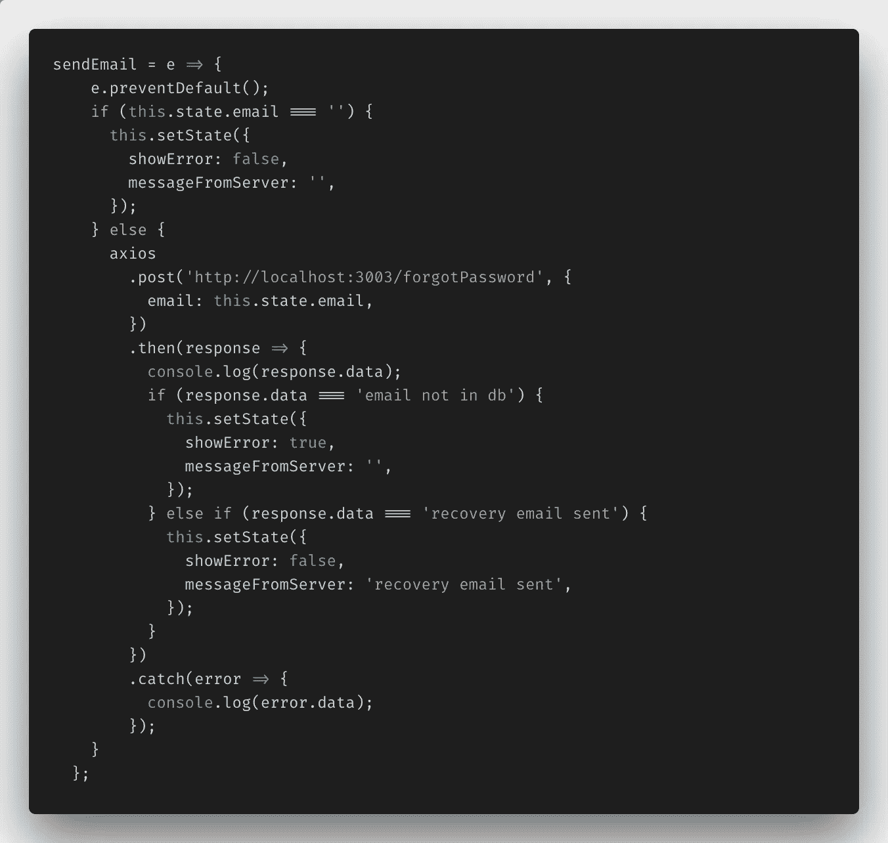

对于我所有的 HTTP 请求，我使用的是 [Axios](https://www.npmjs.com/package/axios) 库，这使得 AJAX 调用服务器变得非常容易，在我看来，甚至比内置的`fetch()` web API 更容易。

当用户输入他们的电子邮件时，我向服务器发出 POST 请求，并等待响应。如果找不到电子邮件地址，我可以告诉用户他们输入错误，或者如果他们是新用户，他们可以进入注册页面并创建一个帐户，如果该地址与我的数据库中的地址匹配，他们将返回一条成功消息，说明密码重置链接已发送到他们的电子邮件地址。

现在让我们转到后端代码。

## 后端代码(API 文件夹)—发送重置电子邮件

`**forgotPassword.js**`

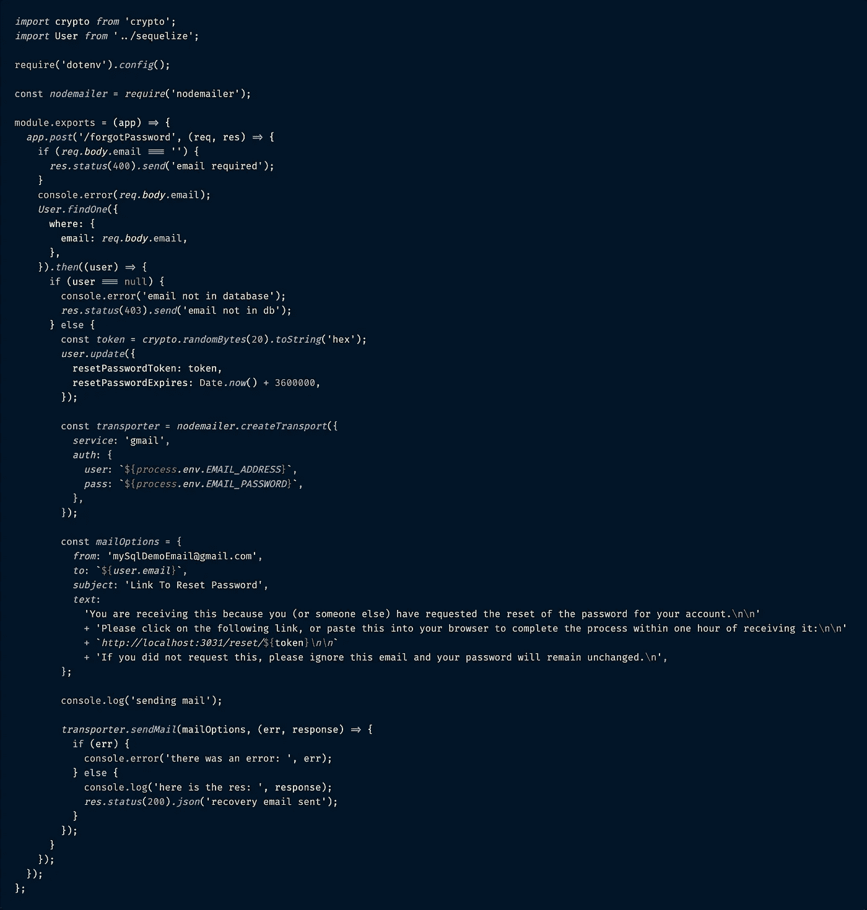

后端代码稍微复杂一些。这就是 Nodemailer 发挥作用的地方。

当用户使用他们输入的电子邮件地址点击后端的`forgotPassword`路线时，Sequelize 做的第一件事就是检查我的数据库中是否存在该电子邮件。如果它不存在，用户会得到通知，他们可能输入错误，如果它确实存在，那么一系列其他事件就会开始。

接下来的步骤没有一个是非常困难的，只是一开始把它们连接在一起有点棘手。

**步骤 1:生成令牌**

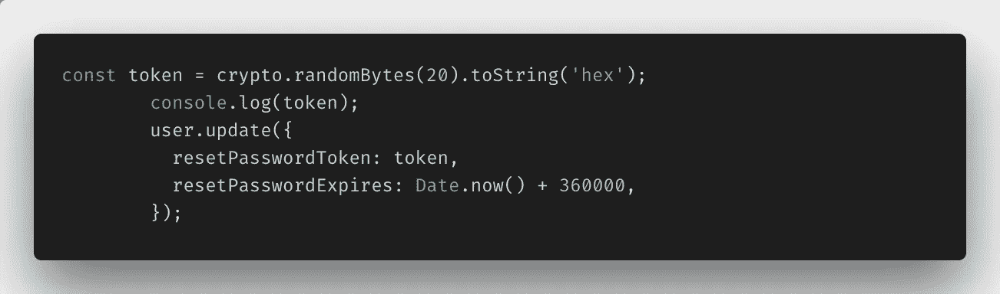

确认电子邮件附加到数据库中的用户后，第一步是生成一个可以附加到用户帐户的令牌，并设置该令牌的有效时间限制。

Node.js 有一个名为 [Crypto](https://nodejs.org/api/crypto.html#crypto_crypto) 的内置模块，它提供加密功能，这是一种奇特的说法，我可以使用命令`crypto.randomBytes(20).toString('hex');`轻松生成唯一的哈希令牌。然后，我将新令牌保存到数据库中我的用户的概要文件中，列名为`resetPasswordToken`。我还为令牌的有效期设置了时间戳。我把我的设为发送链接后一小时内有效— `Date.now() + 3600000`。

**步骤 2:创建节点邮件传输**

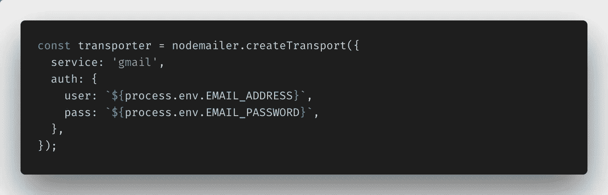

接下来，我创建了`transporter`，它实际上是发送密码重置电子邮件链接的帐户。

我选择使用 Gmail，因为我个人使用 Gmail，我创建了一个新的虚拟帐户来发送电子邮件。因为我不想把这个账户的凭证给任何人，所以我把凭证放在一个包含在我的`.gitignore`中的`.env`文件中，这样它就不会被提交给 Github 或其他任何地方。

NPM 包`[dotenv](https://www.npmjs.com/package/dotenv)`用于读取文件内容，并插入电子邮件地址和密码，供 Nodemailer 的`createTransport`函数读取。

**第三步:创建邮件选项**

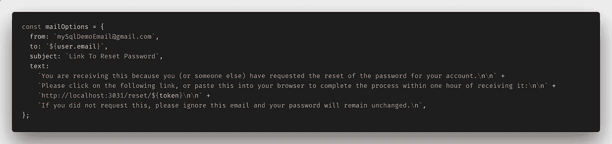

第三步是创建用户将会看到的电子邮件模板(Nodemailer 称之为`mailOptions`)(这也是他们从前端输入传递的经过验证的电子邮件地址被使用的地方)。

有很多第三方库可以用来制作好看的电子邮件来搭配 Nodemailer 模块，但是我只想要一个基本的电子邮件，所以我自己做了这个。

它包含`from`电子邮件地址(mySqlDemoEmail@gmail.com，对我来说)，用户的电子邮件放在`to`框中，`subject`行是重置密码链接，而`text`是一个简单的字符串，包含一些信息和网站的 URL 重置路径，包括我之前创建的令牌，附加在末尾。这将允许我验证用户是谁，他们说，当他们点击链接，并前往该网站重置他们的密码。

**第四步:发送邮件**

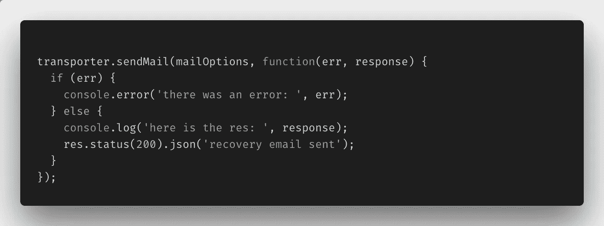

这个文件的最后一步实际上是把我创建的片段放在一起:即`transporter`、`mailOptions`、`token`并使用 Nodemailer 的`sendMail()`函数。如果成功，我将得到一个 200 响应，然后用它来触发对客户端的成功调用，如果失败，我将记录错误以查看哪里出错了。

## 启用 Gmail 发送重置电子邮件

至少在使用 Gmail 时，在设置发送所有电子邮件的传送器电子邮件时，需要注意一个额外的问题。

为了能够从一个帐户发送电子邮件，必须禁用两步验证，并且必须将标题为“允许不太安全的应用程序”的设置切换到打开。见下面截图。要做到这一点，我去我的设置[这里](https://myaccount.google.com/lesssecureapps)，并打开它。

现在，我可以毫无问题地发送重置电子邮件。如果您遇到问题，请查看 Nodemailer 的常见问题以获得更多帮助。

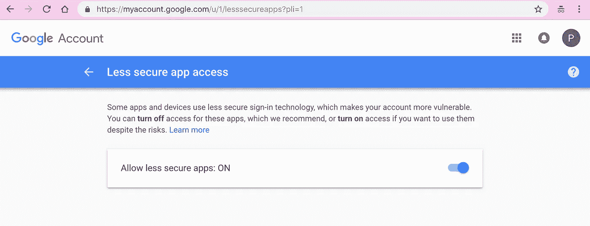

这是您应该看到的屏幕，您可以在这里打开不太安全的应用程序。又多了一个使用虚拟邮箱账户而不是真正的 Gmail 账户的理由。

## 前端代码—更新密码屏幕

很好，现在用户应该会在他们的收件箱里收到类似这样的重置邮件。

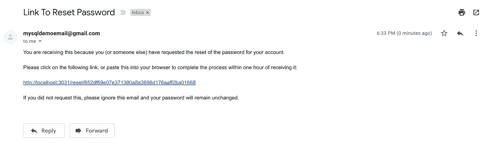

这是一封简单的电子邮件，但它做了我需要它做的事情。

如果你注意到，第三行是一个到我的网站(在本地端口 3031 上运行)的链接，到另一个名为“Reset”的页面，后面是我在步骤 1 中用 Node.js `crypto`模块生成的散列令牌。

当用户点击这个链接时，他们会被定向到应用程序中一个名为“密码重置屏幕”的新页面，只有使用有效的令牌才能访问该页面。如果令牌已过期或无效，用户将看到一个错误屏幕，其中包含返回主页或尝试发送新密码重置电子邮件的链接。

这是重置屏幕的反应代码。

`**ResetPassword.js**`

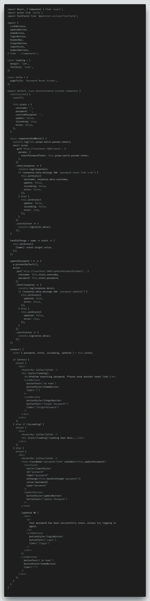

这是这个组件的三个主要部分，它们起着举足轻重的作用。

**初始组件安装生命周期方法**

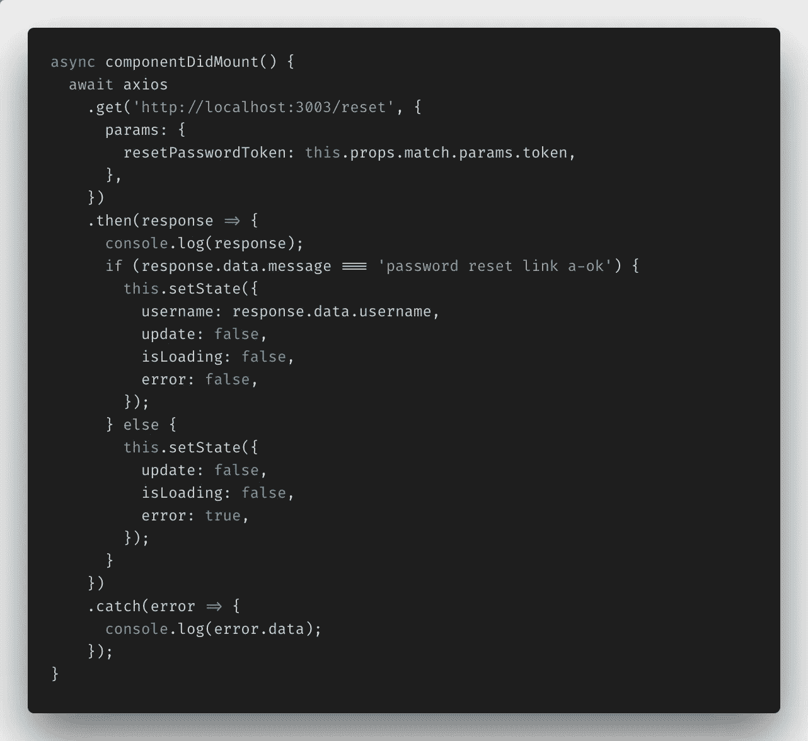

该方法在到达页面时立即触发。它从 URL 查询参数中提取令牌，并将其传递回服务器的`reset`路由，以验证令牌是否合法。

然后，服务器要么回答“a-ok”，这个令牌是有效的并且与用户相关联，要么回答“no”，这个令牌由于某种原因不再有用。

**更新密码功能**

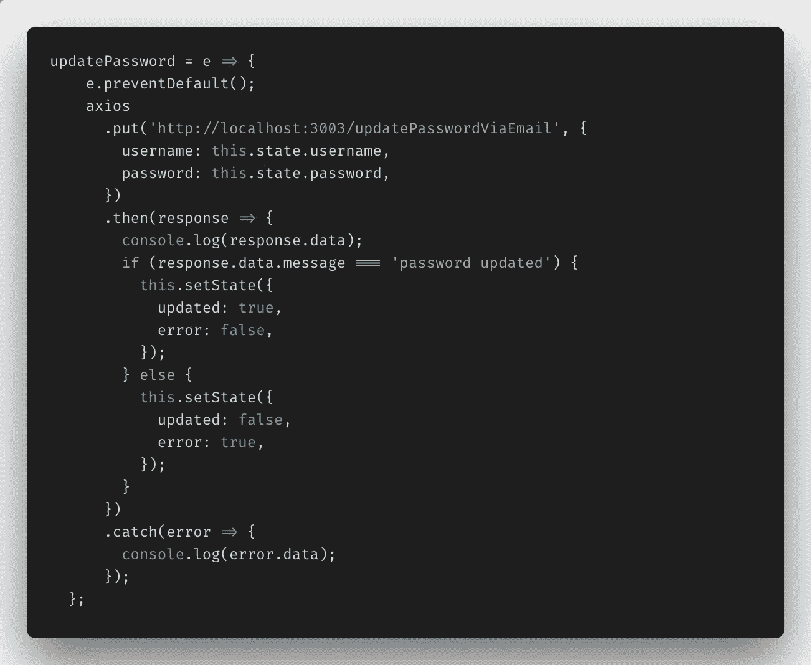

这是当用户通过身份验证并被允许重置密码时将触发的函数。它还访问服务器上一个名为`updatePasswordViaEmail`的特定路径(我这样做是因为我为用户提供了一个单独的路径来在登录应用程序时更新他们的密码)，一旦更新的密码被保存到数据库，一个成功消息响应将被发送回客户端。

**渲染方法**

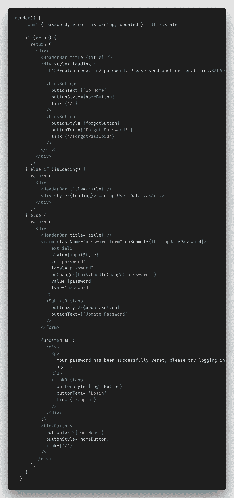

这个组件的最后一块，就是`render`法。最初，在验证令牌的有效性时，会显示`loading`消息。

如果链接以某种方式无效，屏幕上会显示`error`消息，其中包含返回主屏幕或忘记密码页面的链接。

如果用户被授权重置他们的密码，他们将获得附加了`updatePassword()`功能的新密码输入，一旦服务器成功更新密码，boolean`updated`将被设置为 true，同时显示`Your password has been successfully reset...`消息和登录按钮。

## 后端代码—重置密码和更新密码

好的，我现在在最后冲刺阶段。这里是您需要的服务器端的最后两条路线。这些对应于我刚刚在客户端 React `ResetPassword.js`组件中走过的两个方法。

`**resetPassword.js**`

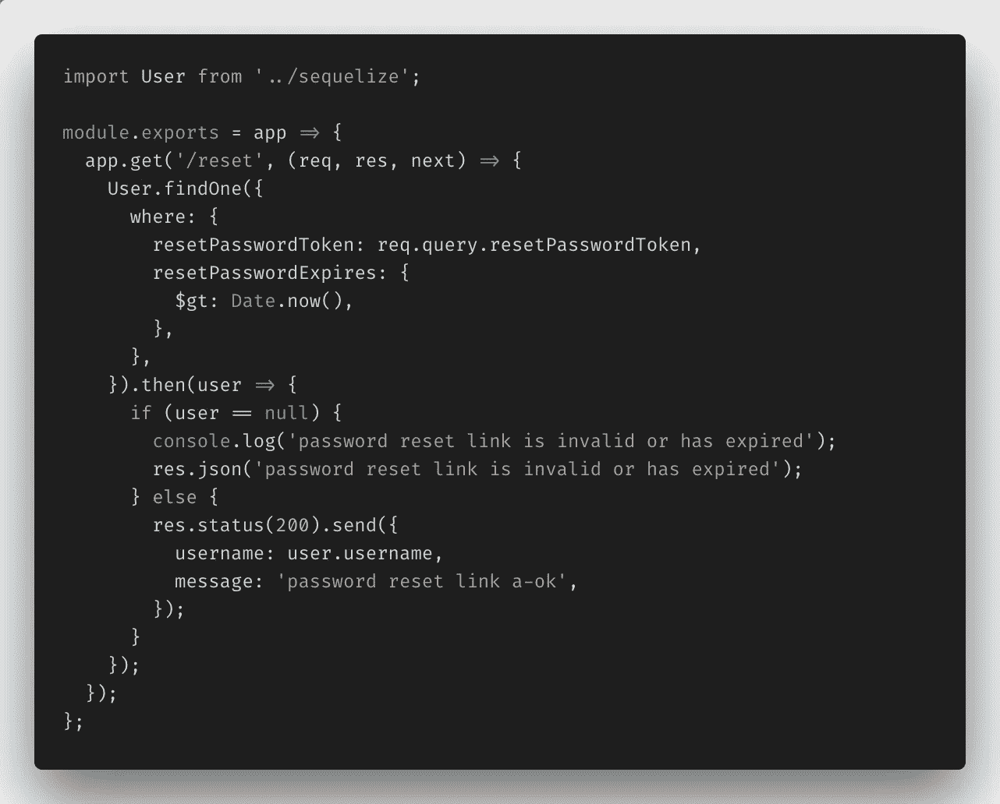

这是在客户端的`componentDidMount`生命周期方法中调用的路线。它检查从链接的查询参数和日期时间戳传递的`resetPasswordToken`,以确保一切正常。

你会注意到`resetPasswordExpires`参数有一个奇怪的`$gt: Date.now()`参数。这是一个[操作符别名比较器](http://docs.sequelizejs.com/manual/tutorial/querying.html#operators-aliases)，这个[序列器](http://docs.sequelizejs.com/)允许我使用，所有的`$gt:`代表“大于”它所比较的任何东西。在这种情况下，它将当前时间与发送重置密码电子邮件时保存到数据库中的过期时间戳进行比较，以确保在电子邮件发送后不到一小时就重置了密码。

只要这两个参数对该用户都有效，就会向客户端发送一个成功的响应，用户就可以继续重置密码。

`**updatePasswordViaEmail.js**`

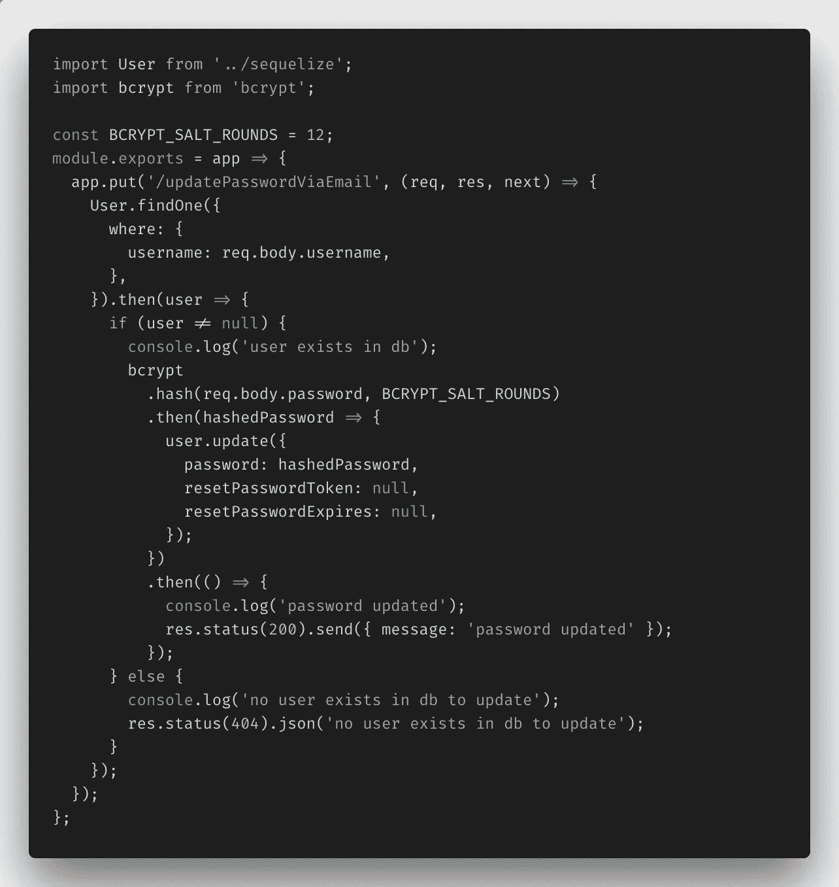

这是当用户提交他/她的密码进行更新时调用的第二个途径。

我再次在数据库中找到用户(`username`从上面的`reset`路径传递回客户端，并保持在应用程序的状态，直到更新函数被调用)，我使用我的`bcrypt`模块散列新密码(就像我的 Passport.js 中间件在新用户最初被写入数据库时所做的那样)，用新散列更新数据库中该用户的`password`,并将`resetPasswordToken`和`resetPasswordExpires`列都设置回 null，因此同一个链接不能被使用多次。

一旦完成，服务器就向客户机发回一个带有成功消息的 200 响应，`Password updated`。

您已经通过电子邮件成功重置了用户密码。不太难。

## 结论

乍一看，通过电子邮件链接重置用户密码似乎有点令人生畏。但是 Nodemailer 有助于简化一个主要因素(电子邮件)。完成后，只需在服务器端发送几条路由，在客户端输入内容，就可以为用户更新密码。

过几周再来看看，我会写关于使用 Puppeteer 和 headless Chrome 进行端到端测试或其他与 web 开发相关的东西，所以请关注我，这样你就不会错过了。

如果你想确保你不会错过我写的一篇文章，在这里注册我的时事通讯:[https://paigeniedringhaus.substack.com](https://paigeniedringhaus.substack.com/)

感谢您的阅读，我希望这能让您了解如何使用 Nodemailer 为 MERN 应用程序发送密码重置电子邮件。非常感谢鼓掌和分享！

**如果你喜欢读这篇文章，你可能也会喜欢我的其他一些博客:**

*   [调试 Node.js 最简单的方法——用 VS 代码](/the-absolute-easiest-way-to-debug-node-js-with-vscode-2e02ef5b1bad)
*   [用 React](/implementing-json-web-tokens-passport-js-in-a-javascript-application-with-react-b86b1f313436) 在 JavaScript 应用程序中实现 JSON Web 令牌& Passport.js
*   [Sequelize:类似于 Mongoose，但不是 SQL](https://medium.com/@paigen11/sequelize-the-orm-for-sql-databases-with-nodejs-daa7c6d5aca3)

**参考资料和更多资源:**

*   node mailer:[https://nodemailer.com/about/](https://nodemailer.com/about/)
*   Nodemailer，Github:[https://github.com/nodemailer/nodemailer](https://github.com/nodemailer/nodemailer)
*   https://www.npmjs.com/package/nodemailer，NPM:
*   带有节点邮件程序回购的 MERN 应用:[https://github.com/paigen11/mysql-registration-passport](https://github.com/paigen11/mysql-registration-passport)