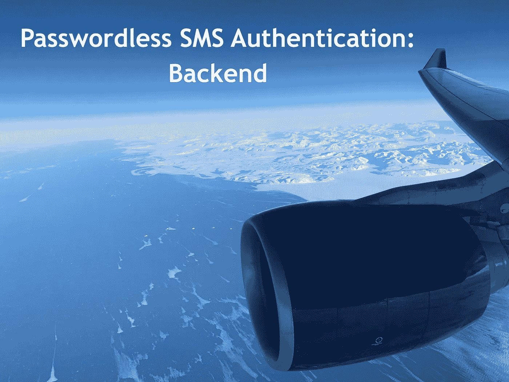
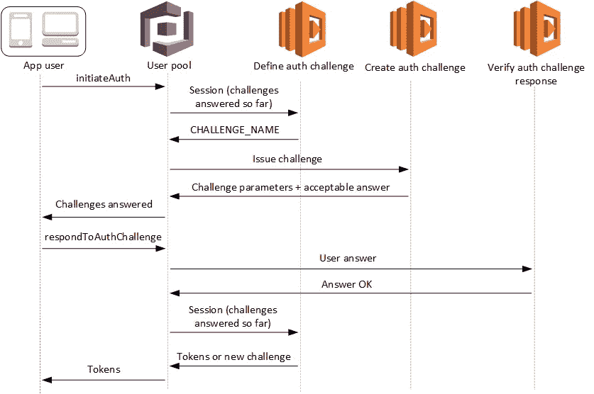
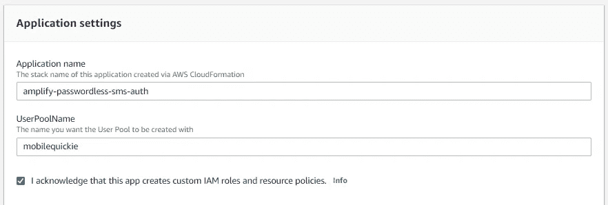
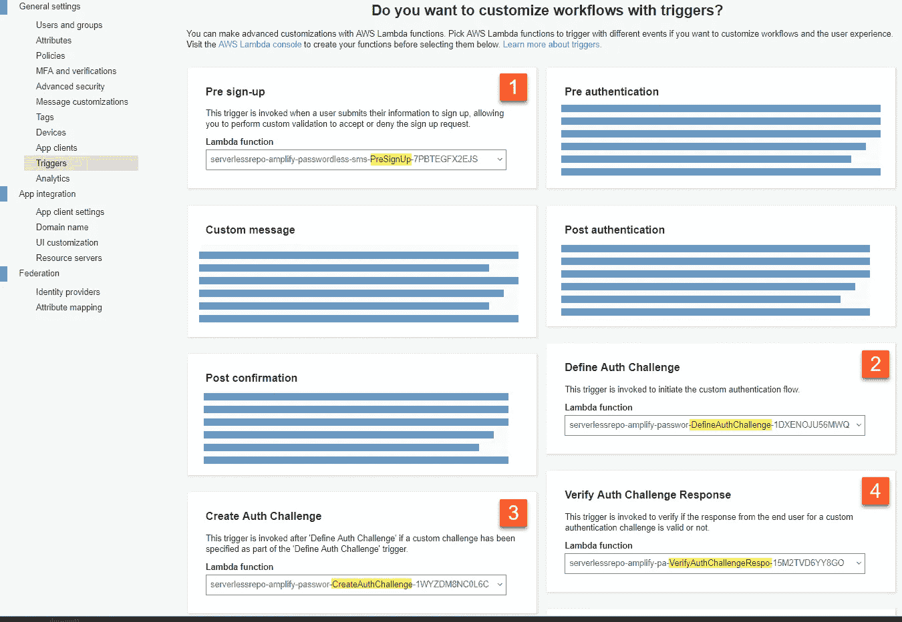
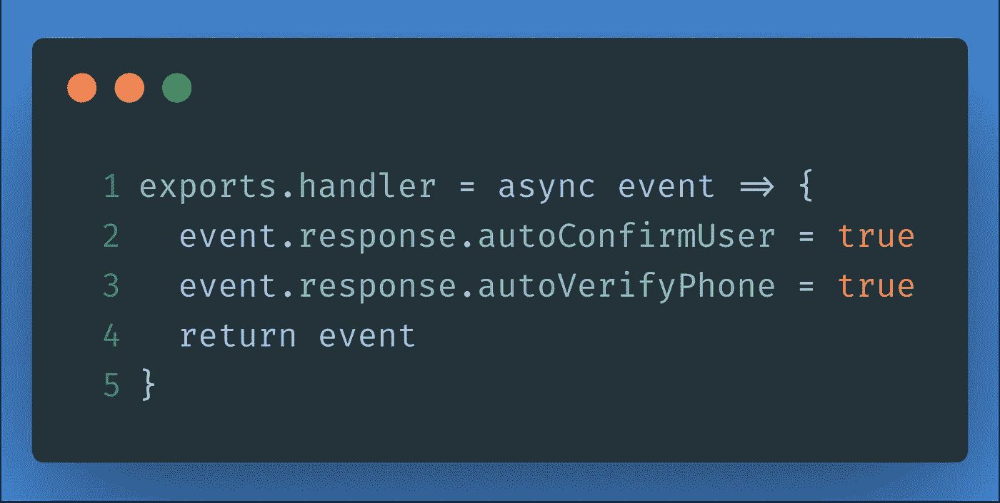
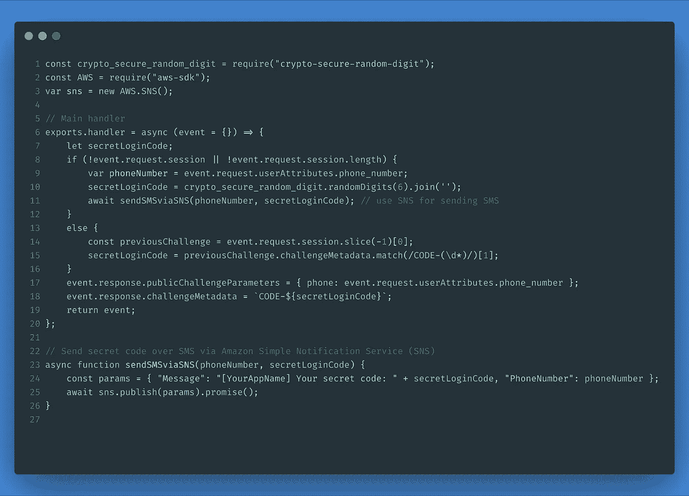
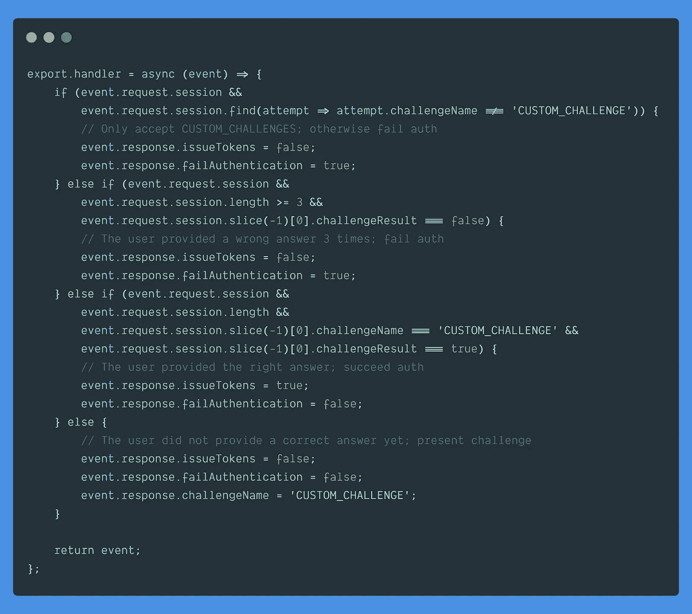
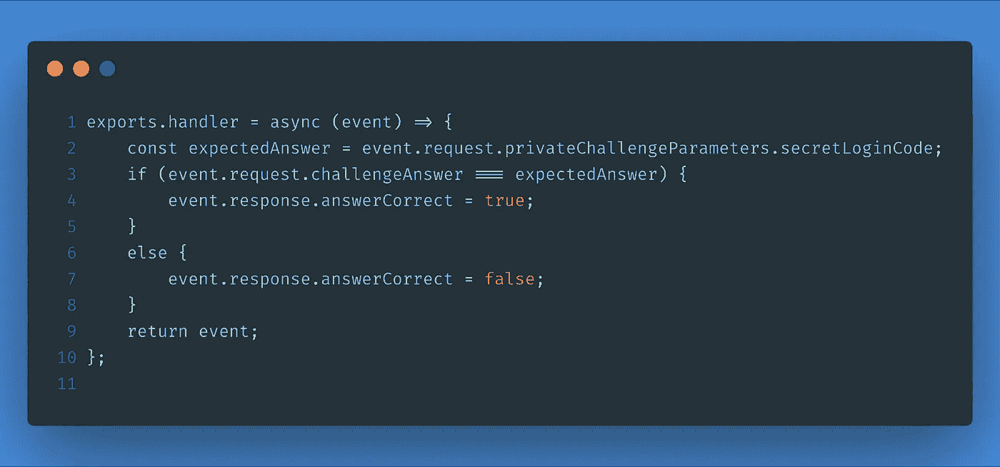

# 无密码短信认证:后端

> 原文：<https://itnext.io/passwordless-sms-authentication-backend-9932391c49dc?source=collection_archive---------3----------------------->

格陵兰上空的某处

在我的上一篇文章[无密码短信认证:基础知识](/passwordless-sms-authentication-the-basics-fdf9dbecab04)中，我谈到了认证的三个因素和使用你拥有的东西，比如一部无需密码就能接收短信进行认证的手机。提供无密码短信认证仍然是最简单的方法之一。在本文中，我们将通过**使用 Amazon Cognito** 实现自定义无密码短信认证流程的后端解决方案。

# 解决办法

这个解决方案包括使用**三个 Lambda 函数触发器**(加上一个自动确认用户电话号码为用户名的函数)建立一个带有自定义身份验证质询流的 Cognito 用户池。至少可以说，由于创建这个自定义身份验证流的过程有许多移动部分，所以我构建了一个单击式解决方案，这样您就可以通过 **AWS 无服务器应用程序库**部署整个后端。利用部署该解决方案节省的时间，我将向您介绍每个功能以及每个功能在登录流程中扮演的角色。

# 解决方案概述

*顺便说一句——根据文档，这是通过 Amazon Cognito 用户池使用* [*自定义身份验证质询 Lambda 触发器*](https://docs.aws.amazon.com/cognito/latest/developerguide/user-pool-lambda-challenge.html) *实现无密码短信(或电子邮件)的最佳实践。*

该解决方案遵循上述文档中概述的流程。我们将使用 Amazon Cognito 用户池和一组 AWS Lambda 函数作为触发器来完成一个[定制认证流程](https://docs.aws.amazon.com/cognito/latest/developerguide/user-pool-lambda-challenge.html)。我们将使用亚马逊社交网络通过短信向用户发送一次性密码。下面是显示每个 Lambda 函数的自定义身份验证流程图。我们将在下一篇文章中构建“应用程序用户”客户端解决方案。

该图描述了移动/web 用户完成授权流程所经历的以下步骤。

1.用户在自定义注册/登录页面上输入他们的电话号码，然后发送到您的 Amazon Cognito 用户池。

2.用户池调用“*定义授权挑战*”Lambda 函数。这个 Lambda 函数确定需要创建哪个自定义质询。

3.用户池调用“*Create Auth Challenge*Lambda 函数。这个 Lambda 函数生成一个秘密登录代码，并使用 Amazon SNS 作为传输服务，通过 SMS 将这个代码发送到用户的移动设备。

4.用户在他们的手机上检索秘密登录代码，并将其输入到自定义登录页面，然后该代码被发送回来，您的用户池调用“*验证身份验证质询响应*”Lambda 函数来验证用户的响应。

5.用户池再次调用“*定义身份验证质询*”Lambda 函数来验证质询已被成功回答，并且不需要进一步的质询。该函数在其对用户池的响应中包含“issueTokens: true”。用户池现在认为用户已经过身份验证，并在对用户的最终响应中发送有效的 JSON Web 令牌(jwt)。

注意:对于使用原生 AWS SDK 的原生 iOS 和 Android 开发人员，您不需要担心处理 JWT 令牌，因为 AWSMobileClient 会通过将令牌传递给 Cognito Identity Pool 来交换 AWS 凭证，从而为您管理所有这一切。在下一篇文章中，我将实现一个 iOS 原生应用程序，从头到尾都遵循这个流程，并使用 mobile SDK for iOS 来检索 AWS 凭据，以交换使用 Amazon Cognito 身份池接收的 JWT 令牌。

# 开始—后端

## 通过 [AWS 无服务器应用程序库](https://aws.amazon.com/serverless/serverlessrepo/)部署后端

1.  启动[无服务器应用程序库](https://console.aws.amazon.com/lambda/home?region=us-east-1#/create/app?applicationId=arn:aws:serverlessrepo:us-east-1:552623489034:applications/amplify-passwordless-sms-auth)

2.提供一个**应用名称**和**用户池名称**并勾选“*我确认…* ”

3.**选择部署**。

以下是上述三个步骤的截屏:

[https://youtu.be/WYaES9vJYuU](https://youtu.be/WYaES9vJYuU)

通过 AWS 无服务器应用程序存储库进行部署会在您的帐户上触发 Amazon CloudFormation 堆栈创建，并开始在当前区域创建资源。这些资源包括一个 Cognito 用户池、四个 Lambda 函数和与这些资源交互的权限。您总是可以在 CloudFormation 控制台中看到已部署的 CloudFormation 堆栈中的模板代码。

# 试验

通过无服务器存储库部署您的解决方案后，您可以使用本[Amplify password SMS Auth repo](https://github.com/mobilequickie/amplify-passwordless-sms-auth/)中提供的自定义注册和登录 web 客户端进行测试。只需克隆回购，并按照客户的指示。

# AWS Lambda 函数(触发器)

下面是部署为 Node.js v8.10 运行时函数的四个触发器，Cognito 用户池使用它们来完成自定义的身份验证质询流，从而允许您的用户通过他们的电话号码进行身份验证。一旦这个解决方案已经通过 AWS 无服务器应用程序存储库部署，您就可以在**认知用户池** > **设置** > **触发器**下查看这些链接的 Lambda 函数。

## 预注册

该功能自动确认新用户，在注册时使用他们提供的电话号码作为他们的 Cognito 用户池用户名。

## 创建身份验证质询

该功能生成一个秘密的 6 位数字代码(又名 OTP，一次性密码)并通过短信发送给用户。用户有三次机会输入正确的密码，然后密码被重置并发送新的密码。

## 定义身份验证质询

该功能管理认证流。在提供给这个 Lambda 函数( *event.request.session* )的会话数组中，呈现了认证流的整个状态。

如果会话详细信息为空，则自定义身份验证流程刚刚开始。如果它有项目，自定义身份验证流程正在进行中，这意味着向用户提出了一个挑战，用户提供了一个答案，并且它(答案)被验证为正确或错误。在这两种情况下，这个函数决定接下来会发生什么。

## 验证身份验证质询响应

该功能的工作是验证用户的答案是否与发送给用户的秘密登录代码相匹配。

# 摘要

无密码短信和电子邮件身份验证是一种简单的方式，让移动用户能够快速轻松地进行身份验证。有了这个解决方案，您可以在几分钟内将它部署到 AWS 云中，并且生产就绪，您可以立即开始测试。

请注意，短信和电子邮件无密码身份验证可能是对您的移动用户进行身份验证的安全选项，但是，总有更多安全选项，如 MFA，或使用物理硬件密钥，如 Yubikey。此外，您应该为那些没有提供手机号码或不愿意提供手机号码的用户提供发送 OTP 的替代选择，如传统的电子邮件/密码。请让我知道这是否有帮助，因为这是一段时间以来移动开发者经常要求的功能，所以我很高兴最终提供了一个很好的替代认证解决方案，我也将在我自己的应用程序中实现。

# 资源

用亚马逊 Cognito 实现**无密码邮件**认证:[https://AWS . Amazon . com/blogs/mobile/implementing-password-email-authentic ation-with-Amazon-cogn ITO/](https://aws.amazon.com/blogs/mobile/implementing-passwordless-email-authentication-with-amazon-cognito/)