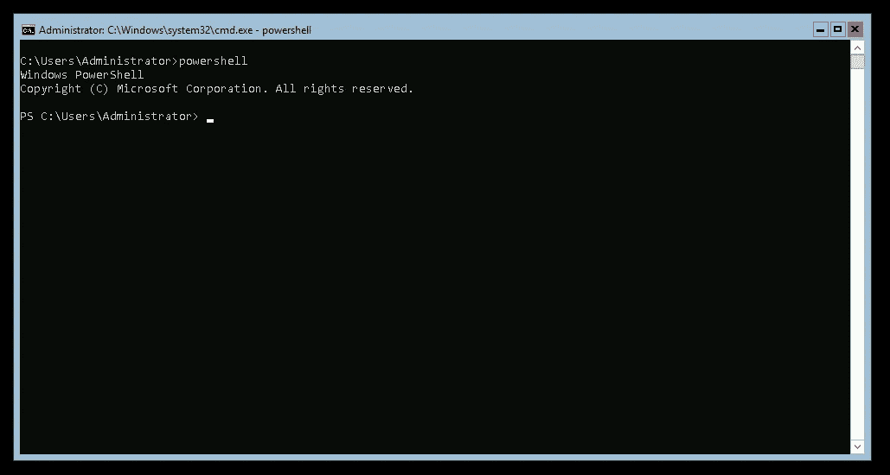

# 寻路:Kubernetes 窗口节点

> 原文：<https://itnext.io/pathfinding-kubernetes-windows-nodes-dca316a479eb?source=collection_archive---------4----------------------->

## 向 Kubernetes 注入微软以及为什么不应该这么做的指南。


是的，我们会试着说服这个操作系统执行我们的命令。

我们都经历过。您的团队有一个运行在云中的良好的 Kubernetes 集群；当其他团队正在无缝地部署他们的服务和应用程序时，有人过来问了一个可怕的问题:

> 嘿，我们能在我们的 Kubernetes 集群中部署一个 Windows 程序吗？

你的大脑会立即形成太多的问题和尖刻的回答，无法有效地选择一个，所以你唯一能脱口而出的是:

> 为什么？

…但那是另一个故事的主题。您在这里是因为您对如何在 Kubernetes 集群中运行 Windows worker 节点感兴趣。所以让我们开始吧。

注意:这是大量研究、实验和猜测的结果。这只不过是我的团队采取的方法的概述，在我们认为它是“生产就绪”之前，这个设置的几个方面需要改进。

## 环境

这个“指南”不会涵盖 Kubernetes 集群的 Windows worker 节点的一般设置，因为它只会涵盖我的团队通过 [kops](https://github.com/kubernetes/kops) 在 AWS 上使用 Windows 和 Kubernetes 的经验。

## 目标

这个项目的基本目标是为我们的 Windows worker 节点定义一个 AWS 自动伸缩组，这样我们就可以将节点视为牲口，让 AWS 自动为我们提供新节点。

最终，我们希望通过 kops 的 InstanceGroup 资源类型来管理我们的 Windows 节点，这样我们就可以相对容易地执行滚动更新和升级。

# 第一步:单个 Windows 节点

## 启动 Windows EC2 实例

在让自动扩展组运行之前，我们需要首先让单个节点工作，作为概念验证。我们将使用[这个来自微软的关于将 Windows 节点加入 Kubernetes 集群的指南](https://docs.microsoft.com/en-us/virtualization/windowscontainers/kubernetes/joining-windows-workers)作为基线。

请注意，根据该指南，我们有第一个警告:*我们只能将 Windows 节点加入到一个使用法兰绒作为容器网络插件的集群中。*

所以第一步，如果你还没有一个，是在 AWS 中创建一个基本的沙盒 Kubernetes 集群，使用法兰绒作为网络解决方案。对于这个探索性的目的，集群的其他属性并不太重要。作为参考，我们有一个由一个主节点和一个工作节点组成的集群，这两个节点都使用 CoreOS AMIs。

有了沙盒集群后，您需要在同一个 VPC 中启动一个 Windows EC2 实例，其配置与单个工作节点相同。最初，我们只是通过 AWS 网络界面来做这件事，但我们最终创建了一个小的平台配置，因为我们必须重复这个过程很多很多次。作为参考，要设置的关键配置值有:

1.  我们使用的 EC2 AMI 是基于**Windows _ Server-1809-English-Core-containers latest-2019 . 02 . 13**(`ami-0fe3fb8879ef6147c`代表我们集群所在的`eu-west-3`)。我们选择此图像的原因是因为 Windows 版本与微软指南中使用的版本相匹配。
2.  EC2 实例要驻留的 VPC 和子网，只需确保它们与其他工作节点的配置相匹配。
3.  自动分配公共 IP 地址，设置为启用，除非您想要将 VPC 连接到您的 VPN。
4.  我的角色，因为我们试图创建一个工作者节点，我们只需将它设置为与我们的集群的工作者节点相同，`nodes.${cluster_name}`。
5.  安全组，推理同上，只是将其设置为用于集群节点的安全组，`nodes.${cluster_name}`。
6.  密钥对，选择一个已经存储在本地计算机上的密钥对，或者创建一个新的密钥对并下载它。

现在您可以启动您的 Windows EC2 实例了！不幸的是，现在您必须通过 RDP 与它交互，而不是任何类型的远程 shell，为此，您必须等待几分钟，然后才能使用前面提到的密钥对从 AWS 解密管理员密码。准备就绪后，您将能够使用您首选的 RDP 客户端登录并启动 Powershell 会话。



啊，窗户的乐趣。🙄

## 准备好你的系统

进入实例后的第一步是准备一些基本目录并设置一些环境变量。《微软指南》涵盖了这一点，因此我们只向您介绍这一点。

我们在本指南中创建的唯一附加目录是`C:/k/downloads`,在将各种 Kubernetes 资源的下载文件提取并安装到系统之前，我们会将它们存储在这里。

## 安装 Kubernetes 资源

现在您可以与机器交互了，是时候开始遵循微软的指示了，从安装用于 Kubernetes 基础设施的`windows/nanoserver`映像开始。请记住，提取与您的主机 Windows 操作系统版本相同的映像！

幸运的是，您可以跳过 Docker 的设置，因为所选的 AMI 已经安装了 Docker 并准备好了。

```
docker pull mcr.microsoft.com/windows/nanoserver:1809
docker tag mcr.microsoft.com/windows/nanoserver:1809 microsoft/nanoserver:latest
```

一旦完成，下一步将是设置目录，该目录将包含 Kubernetes 所需的所有配置和服务。微软选择了`C:/k`，事实证明，**坚持这个糟糕的命名决定**很重要。是的，我们试着变得更好，我们试着把它改为`C:/kubernetes`，但是我们后来使用的许多脚本完全依赖于`C:/k`作为所有资源的基本目录。

此时，您的下一步是获得一个 kube 配置文件的副本，它将允许您的实例与集群进行对话。如果你跟随微软指南，你会注意到官方的解决方案*是将 kubeconfig 文件* ***从一个主节点复制到我们的新实例*** 。


你是个大师哈利！

这就出现了一个问题，因为您需要这自动发生。您的节点甚至无法连接到主节点，因为如果不先联系集群，它就不知道如何连接。

我们使用的解决方法是将 kops 下载到您的节点上，并使用它来导出 kubeconfig 文件。您的节点只需要知道 kops 状态存储的位置和集群的名称。幸运的是这是已知的，您可以使用`wget`在 Powershell 中下载文件！

```
wget [https://github.com/kubernetes/kops/releases/download/1.11.0/kops-windows-amd64](https://github.com/kubernetes/kops/releases/download/1.11.0/kops-windows-amd64) -OutFile c:/k/kops.exe
```

一旦你有了 kops 可执行文件，运行`kops export kubecfg --state=s3://${kops_state_store_location} ${cluster_name}`就简单了！除了您的 EC2 实例角色没有给予您足够的权限来读取`export`命令所需的所有内容。将 EC2 角色实例从`nodes.${cluster_name}`更改为`master.${cluster_name}`是一个快速但肮脏的修复方法，它将允许您导出一个正常工作的 kubeconfig 文件。

下一步是下载 Kubernetes 节点二进制文件，其中将包含用于验证 kubeconfig 文件的`kubectl`。当您在 shell 上下载资源时，您也可以开始下载法兰绒资源。

```
wget [https://dl.k8s.io/v1.12.5/kubernetes-node-windows-amd64.tar.gz](https://dl.k8s.io/v1.12.5/kubernetes-node-windows-amd64.tar.gz) -OutFile c:/k/downloads/knode.tar.gz
wget [https://github.com/Microsoft/SDN/archive/master.zip](https://github.com/Microsoft/SDN/archive/master.zip) -OutFile c:/k/downloads/flannel.zip
```

**有趣的事实:** *如果您将下载调用打包到后台作业中，它在 Powershell 中下载文件的速度会明显加快。*

我不知道为什么上面的事实是真的，但它减少了实例花费在下载上的时间大约 80%。我有一些假设，但我不会在这里深入探讨。要知道，对于这些“下载和安装/设置”作业，您可以用`Start-Job -ScriptBlock {code here}`包装它们，然后用`Get-Job | Wait-Job`等待它们全部完成。这将帮助您显著减少实例启动时间。

一旦 Kubernetes 二进制文件下载完成，我们只需要将它们移到我们的路径中。

```
tar -xzvf c:/k/downloads/knode.tar.gz -C c:/k/downloads
mv c:/k/downloads/kubernetes/node/bin/*.exe c:/k/
```

最后，你只需要安装法兰绒。

```
Expand-Archive c:/k/downloads/flannel.zip -DestinationPath c:/k/downloads/flannel
mv c:/k/downloads/flannel/SDN-master/Kubernetes/flannel/l2bridge/* c:/k/
```

## 配置 Kubernetes 资源

现在您已经拥有了您需要的一切，您只需要收集由法兰绒提供的启动脚本的所有必要信息。您需要四条网络信息，您的实例的私有 IP 地址、Kubernetes 集群 CIDR 范围、Kubernetes 服务 CIDR 范围和 Kubernetes DNS 服务地址。我们的解决方案相当简单(回复:愚蠢，但工作),可能有一个更好的方法来收集信息，但在这里。

```
# Gather the node's IP address.
$env:HostIP = (
  Get-NetIPConfiguration |
  Where-Object {
    $_.IPv4DefaultGateway -ne $null -and
    $_.NetAdapter.Status -ne "Disconnected"
  }
).IPv4Address.IPAddress# Gather Kubernetes cluster and service CIDRs.
$env:KubeClusterCIDR = (
  kubectl cluster-info dump |
  Select-String -Pattern ("--cluster-cidr=\d{1,3}\.\d{1,3}\.\d{1,3}\.\d{1,3}/\d{1,2}") -AllMatches |
  % { $_.Matches } | % { $_.Value } |
  Select-String -Pattern("\d.*") -AllMatches |
  % { $_.Matches } | % { $_.Value } |
  Select-Object -Last 1
)$env:KubeServiceCIDR = (
  kubectl cluster-info dump |
  Select-String -Pattern ("--service-cluster-ip-range=\d{1,3}\.\d{1,3}\.\d{1,3}\.\d{1,3}/\d{1,2}") -AllMatches |
  % { $_.Matches } | % { $_.Value } |
  Select-String -Pattern("\d.*") -AllMatches |
  % { $_.Matches } | % { $_.Value } |
  Select-Object -Last 1
)# Gather Kuberenetes cluster DNS service cluster IP address.
$env:KubeDNSServiceIP = (
  kubectl describe svc -n kube-system kube-dns |
  Select-String -Pattern ("IP:.*\d{1,3}\.\d{1,3}\.\d{1,3}\.\d{1,3}") -AllMatches |
  % { $_.Matches } | % { $_.Value } |
  Select-String -Pattern("\d.*") -AllMatches |
  % { $_.Matches } | % { $_.Value } |
  Select-Object -Last 1
)
```

有了这些值，在尝试加入集群之前，您只需要再改变一个棋子。有一个`net-conf.json`文件，你需要把你的 kube 的集群 CIDR 范围，取代默认的`10.244.0.0/16`。我们只是简单地调用了`replace`。

```
cp c:/k/net-conf.json c:/k/net-conf-template.json
(Get-Content c:/k/net-conf-template.json).replace("10.244.0.0/16", $env:KubeClusterCIDR) | Set-Content c:/k/net-conf.json
```

…这样，所有的配置都准备就绪了！是时候尝试加入您的集群了！


要是我在这个项目中也这么开心就好了。

## 加入集群

现在您已经准备好加入您的集群了，您只需要运行包含在法兰绒下载中的`start.ps1`脚本，将网络配置作为参数，够简单了吧？

**没有**。

为了不让这个故事变成一场该死的冒险，我们将直接切入正题。这个`start.ps1`脚本有一些缺陷。我们没有使用提供的脚本，而是将我们自己的版本构建到我们正在整合的用户数据中。也许在将来微软会有一个版本来修复我们遇到的问题，但是现在我们会把它们列在这里。

1.  作为 userdata 脚本的一部分运行时，位于此处[的`Start-BitsTransfer`调用一直失败。我们不确定原因，但简单地使用`wget`作为替代品就解决了这个问题。](https://github.com/Microsoft/SDN/blob/aca9b0c05ace7630605fce907703e0ae589ce054/Kubernetes/flannel/l2bridge/start.ps1#L64)
2.  位于的[处的`StartFlanneld`调用经常会失败并挂在“等待网络创建”处。这是微软的一个已知问题，这里用](https://github.com/Microsoft/SDN/blob/aca9b0c05ace7630605fce907703e0ae589ce054/Kubernetes/flannel/l2bridge/start.ps1#L91)[表示](https://docs.microsoft.com/en-us/virtualization/windowscontainers/kubernetes/common-problems#after-launching-startps1-flanneld-is-stuck-in-waiting-for-the-network-to-be-created)，他们的解决方案是“哈哈，再试一次”。我们的解决方案是，在我们看到`cbr0`网络之前，将它包裹在一个重试循环中，并且将 kubelet 注册行移动到我们尝试启动法兰绒之前，如果它没有完成，则在大约 15 秒后终止 StartFlanneld 作业。

```
...
$hasCbr0Network = $false
while(-not $hasCbr0Network) {
  powershell $BaseDir/start-kubelet.ps1 -RegisterOnly
  Start-Sleep (Get-Random -Minimum 0 -Maximum 5)
  $job = Start-Job -ScriptBlock {
    ipmo c:/k/helper.psm1
    StartFlanneld -ipaddress $env:HostIP -NetworkName $NetworkName
  }
  $job | Wait-Job -Timeout 15
  $job | Where-Object {$_.State -ne "Completed"} | Stop-Job
  Start-Sleep 1
  $hasCbr0Network = (Get-HnsNetwork | ? Name -eq "cbr0")
}
...
```

一旦这些更改到位，我们就能够一致地将新节点引入集群！重要的是要注意，节点可能会在集群中来回切换，因为它可能需要几次尝试才能满足法兰绒的要求。如果你想知道随机等待时间，它可能会被删除。这主要是一个实验，因为对于任何恒定的等待时间，我们都会得到不一致的结果。

万岁。现在您应该有一个单独的 Windows 节点连接到您的 Kubernetes 集群了！现在是时候将其打包成一个更易于管理的解决方案了。

# 下一步是什么？Kops 实例组

现在您已经有了 userdata 脚本，是时候为您的 Windows 节点创建一个 kops 管理的 InstanceGroup 资源了。不幸的是，kops 没有覆盖它为 InstanceGroup 生成的用户数据，但是它有能力添加额外的用户数据。这适用于我们的情况，因为生成的用户数据都是基于 shell 的，无论如何都会被 Powershell 忽略。

所以我们只需要将我们的用户数据脚本复制粘贴到我们的规范中，并用`<powershell>${userdata}</powershell>`标签包装它，简单吗？

**没有**。不幸的是，由于实例启动时我们有太多的事情要做，所以我们的用户数据实际上太长了！现在，我们可能已经能够缩小用户数据以使其低于限制，但是因为我们已经达到了限制，所以可以说，如果我们以后需要添加更多数据，我们可以很容易地再次达到限制。

那么我们做了什么作为变通办法呢？我们最终将 userdata 脚本上传到 S3，然后用两行代码替换了 InstanceGroup 中的额外 userdata，一行用于下拉 S3 对象，另一行用于运行它。*不要忘记向实例策略添加适当的权限，以允许节点提取 userdata 脚本！*

一旦所有这些都完成了，您应该能够部署您的 InstanceGroup，几分钟后，您会看到 Windows 节点连接到您的集群！

*最后*。


所有这些微软诡计的最终结果。

# 警告和未来工作

因此，在所有这些结束时，在它真正“生产就绪”之前，仍有相当多的工作要做。

1.  **未完全测试**。推出一些节点后，我对系统进行了一些基本测试，添加了基于 Windows 的容器的部署和守护进程集。事情运行顺利，尽管提取容器图像本身似乎很慢。
2.  **只有半管理的**。如果您更改了 Kubernetes 版本之类的变量，您还需要更新 S3 的 userdata Powershell 脚本。如果有办法在 kops 中将变量注入到 userdata 模板中就好了。
3.  **滚动更新**。kops 不会检测到用户数据脚本的变化，您需要在 Windows 节点实例组上强制任何滚动更新。
4.  **节点权限。**由于我们必须为 Windows 节点提供额外的权限，以便它们可以使用 kops 导出 kube 配置文件，因此它们拥有的权限比实际需要的多。
5.  **能见度**。根据我的经验，这是 Windows 平台的一个主要问题。不仅当你试图获取 Windows 机器上的日志时感觉像拔牙，而且我们还有被锁定在 kops 管理的 Windows 节点之外的问题。kops 似乎创建了自己的密钥对，因为我们在创建沙盒集群时没有指定密钥对，这是有问题的，因为我们没有解密 Windows 密码的密钥。😬

# 最后的想法

经过这一切，我认为你应该只依赖 Windows 节点*,如果你的软件绝对需要它，并且所有打破这一要求的尝试都得到了公平的审判。然而，这也不全是坏事，至少下次有人问你:*

> 嘿，我们能在我们的 Kubernetes 集群中部署一个 Windows 程序吗？

您可以回答:

> 是的，但是为什么呢？