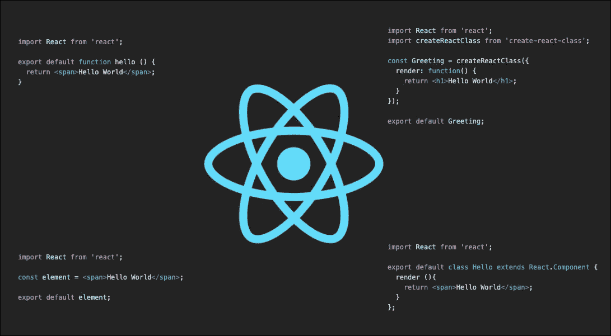

# 可测试 React 组件的模式

> 原文：<https://itnext.io/patterns-for-testable-react-components-26705a17810d?source=collection_archive---------3----------------------->

想象一下当`prop`中的`name`的值为`James`时，`HelloName`下面呈现 Hello James 的组件。因为`name`值不归`HelloName`所有，所以它被称为`WithName`的装饰器高阶组件传递给它。这在使用还没有使用 React 的上下文 API 的库时很常见。

而名字装饰者是这样的。

上面的`HelloName`和`WithName`的关系很常见，因为在 Reactjs 中用来实现很多事情。如果您使用过 Redux，这是很熟悉的，因为您将总是使用这种关系将组件绑定到全局状态。

为了测试上面的`HelloName`，测试看起来就像只是渲染它。

`Now the problem is:` -测试的目标是给组件随机的可能状态和道具，并检查组件是否工作。假设您不拥有`WithName`组件(这很常见)。这意味着您不容易访问`name`变量来操作它来测试不同的场景。当在`HelloName`中使用该值进行一些计算以产生结果而不仅仅是呈现 Hello {name}时，这甚至变得更加必要。例如，我们需要测试它是否可以在另一个场景中说你好詹姆斯和你好迈克。

`The solution:` -这个问题的解决方案非常简单。让我们看看。首先要做的就是导出未修饰的`HelloName`组件，并将修饰后的版本作为默认版本。

在测试中，测试修饰过的版本，然后根据需要测试未修饰的版本。

当我负责测试一个与 [Redux](https://redux.js.org/) 和 [Redux Form](https://redux-form.com/8.2.2/) 高度集成的 react 应用程序时，这种模式帮我省了不少事。

# 测试组件动作

另一种模式是测试组件内发生的动作。考虑一个组件`Form`，它呈现一个 HTML 表单，表单中有一个值`name`的输入绑定到一个状态变量`name`。该表单有一个按钮，该按钮有一个绑定到被执行函数的`onClick`事件。

现在我们需要测试在渲染时，当一些文本被输入到输入域中，然后点击按钮，函数`handleSubmit`被调用一次。

`The problem:` - handleSubmit 在表单组件中定义，因此不可访问。为了使其可测试，从 props 组件中移除 handleSubmit 函数。

为了测试这个组件，我们现在只需用一个模拟代替道具中的`handleSubmit`。看见...

这是一种将外部动作从组件移除到 props 的方式，提供了操纵组件以更好地测试用户在与组件交互时将触发的动作的能力。

# 具有复杂状态版本的组件。

假设您有以下组件。依赖于`localStorage`中变量`user_id`的轮廓组件因此具有这些状态。

*   `localStorage`中没有`user_id`时显示登录页面。
*   仅在用户登录时显示
*   如果`localStorage`中的`user_id`不是`profile`中的`user_id`，则显示跟随按钮
*   如果`localStorage`中的`user_id`与`profile`中的`user_id`相同，则显示编辑按钮

注意，这只是一个例子。不要使用 localStorage 来表示登录或未登录。我通常不认为这是最好的方法，尽管它很有效而且超级简单。

现在，为了测试上面的组件，我们首先必须确保用于呈现组件的数据从组件中很好地抽象出来，以便操作组件变得容易。

首先，有一个数据所有者组件，一个除了使数据可用之外副作用最小的组件。可能根本不渲染。在 Redux 中，这将是一个 reducer 和一个带有一些 HOC 的 provider，或者它们在 MobX 或 Flux 中被称为什么。

在我的示例解决方案中，我使用了 React 上下文向组件提供数据。我有 ProfileDataContext/Provider。

组件现在看起来像这样。

现在，在我的测试中，我可以使用原始组件，并把我自己的数据和 boom 提供给它！我现在可以测试尽可能多的场景，不管概要文件数据有多复杂，渲染有多复杂，甚至是`Profile`组件中的子组件。请看我如何测试代表组件版本的四种不同状态。

这些方法使得测试组件变得非常容易。这里的要点是:

*   尽可能制造纯组件。
*   组件的副作用越少，就越容易精确测试。
*   将组件动作抽象为你可以轻易模仿的纯父动作。
*   尽可能抽象数据。

希望这对你有所帮助！如果是这样的话，只要在 GitHub 和 T2 推特上关注我，那将会有很大的帮助。全部代码也在 [GitHub](https://github.com/zemuldo/reactjs-testing-patterns) 上😄

干杯！