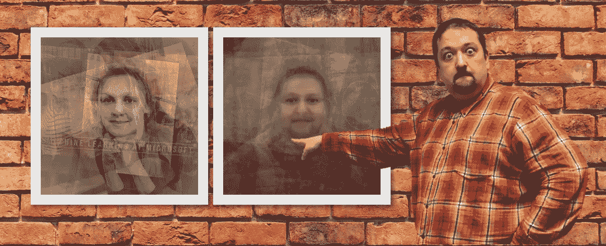
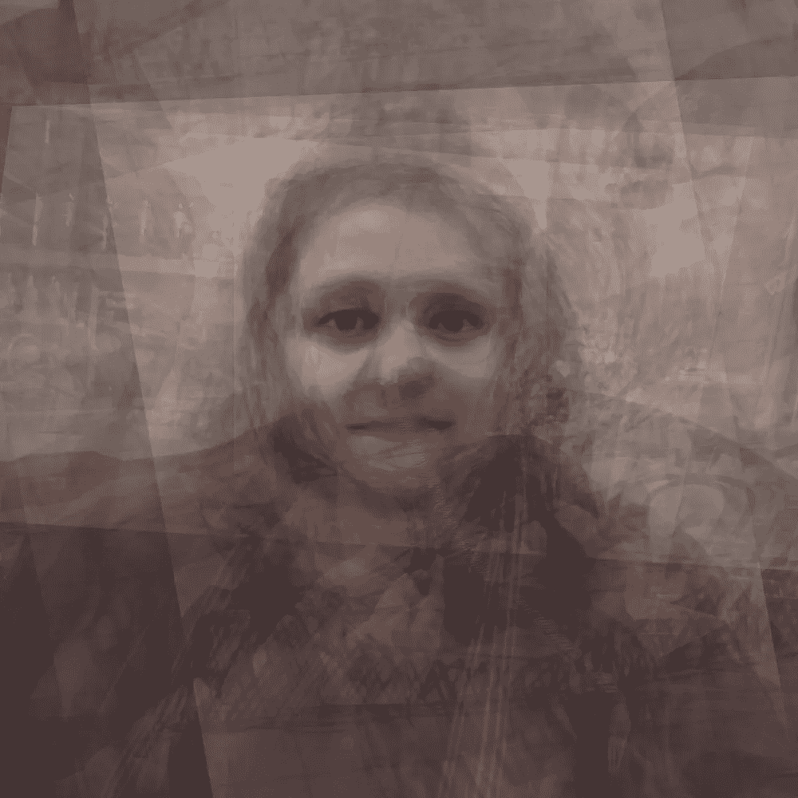
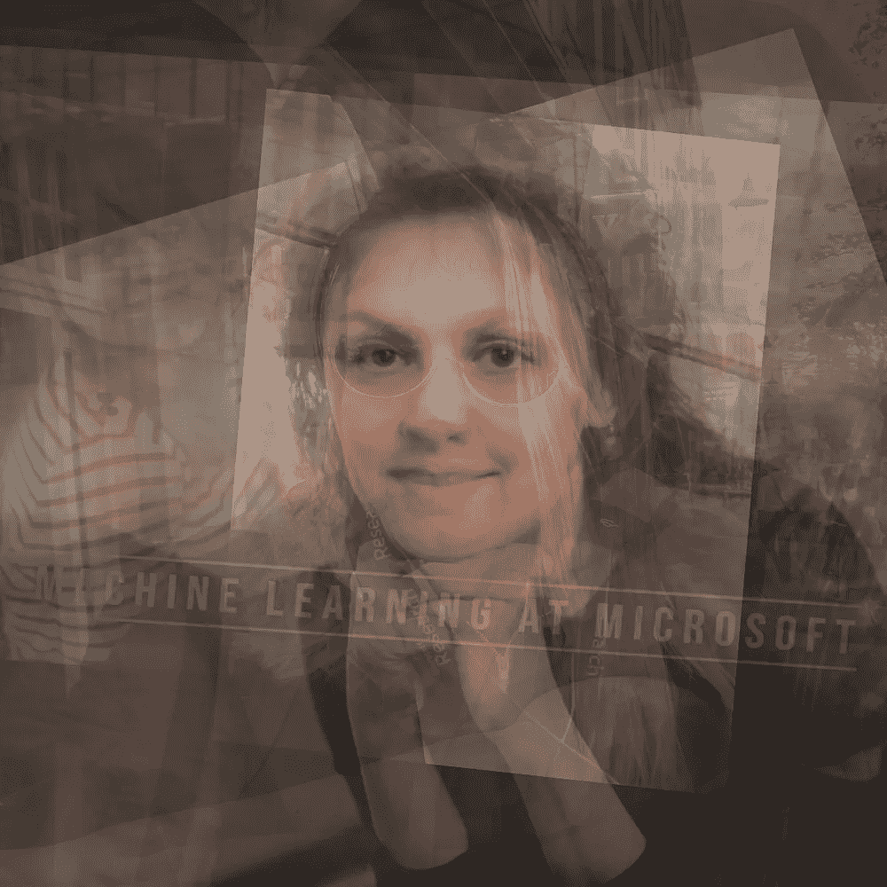
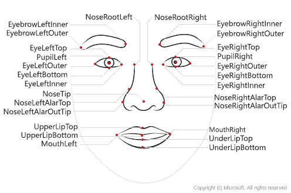
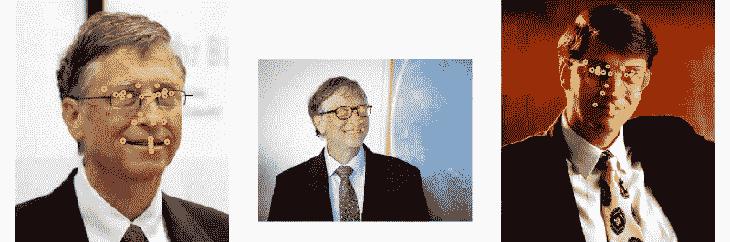
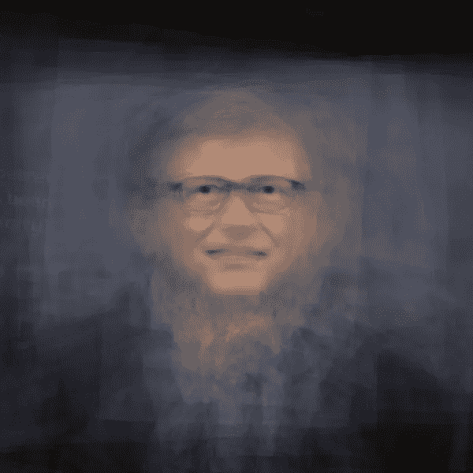

# 人类融合:使用认知服务和一点创造力的科学艺术

> 原文：<https://itnext.io/peopleblending-science-art-using-cognitive-services-and-a-bit-of-creativity-5393300dbe00?source=collection_archive---------8----------------------->

我非常相信跨学科的东西，不同领域的知识可以融合在一起，创造出独特的东西。因为我女儿喜欢艺术，而我喜欢技术——我经常研究这两个领域的交集，或者所谓的科学艺术。



人群融合

这一次，我想和大家分享一个艺术实验的结果，我称之为 [**认知人交融**](http://bit.do/peopleblending) :



Vickie Rotator(左)，玻璃女孩(右)— 2019， [PeopleBlending](http://bit.do/peopleblending)

这些照片的创作方式是根据他们的眼睛排列几幅肖像，从而创造出看起来像混合脸的东西。虽然你当然可以在 PhotoShop 中手动完成，但这会很耗时，而且你快速实验的能力会受到严重限制。我将向你展示如何使用[微软认知服务](http://aka.ms/cognitive_serv)和一点创意来轻松创建这样的图片。您可以使用这里的代码[来遵循我在下面描述的过程。如果您使用代码创建自己的图像，请参考**认知人融合**技术和链接:](http://github.com/CloudAdvocacy/CreepyFaces)[http://bit.do/peopleblending](http://bit.do/peopleblending)。

# 主要思想

这个过程从一些肖像开始——它们可以是同一个人的照片，也可以是我们想要融合在一起的不同人的照片。你有越多的图片，你会得到越有趣的结果。从 10 张图片开始，你就可以创作出一些有趣的东西。

为了找出眼睛在每张照片上的位置，我们将使用[面部 API](https://azure.microsoft.com/services/cognitive-services/face/?WT.mc_id=personal-blog-dmitryso) —它可以提取面部关键点的坐标，即所谓的*面部标志*。然后我们会用一个聪明的东西叫做*仿射变换*和 OpenCV 库来根据关键点旋转图像。最后，我们需要使用简单的平均将图像混合在一起。

# 提取面部标志

让我们从学习如何从图片中提取面部标志开始。[微软 Face API](https://azure.microsoft.com/services/cognitive-services/face/?WT.mc_id=personal-blog-dmitryso) 提供了一个简单的 REST API，可以从人脸图像中提取很多有用的信息，包括那些地标:



通过 REST 直接调用 Face API 相当容易，但使用现有的 SDK 更好，它作为 [Azure SDK 库](https://docs.microsoft.com/ru-ru/azure/cognitive-services/face/quickstarts/python-sdk/?WT.mc_id=personal-blog-dmitryso)的一部分可用于 Python。你可以[访问微软文档](https://docs.microsoft.com/ru-ru/azure/cognitive-services/face/index/?wt.mc_id=personal-blog-dmitryso)获取更多关于 Face API 的详细信息，以及在 Python 之外的语言中使用它。

我们使用以下命令安装 SDK(以及我们将需要的 OpenCV 库):

```
pip install azure-cognitiveservices-vision-face opencv-python
```

要使用 Face API，我们需要提供一个**键**和**端点 URL** (因为在不同地区可用，URL 可以不同)。有许多方法可以获得 Face API 密钥:

*   如果你有 Azure 订阅，最好的选择是 [**创建认知服务资源**](https://docs.microsoft.com/en-us/azure/cognitive-services/cognitive-services-apis-create-account/?WT.mc_id=personal-blog-dmitryso) ，并从那里获取密钥/url
*   你可以随时 [**创建免费试用订阅**](https://azure.microsoft.com/free/?WT.mc_id=personal-blog-dmitryso) (你需要一张信用卡)
*   如果你没有 Azure 订阅，你可以免费试用 Face API 在这里 申请你的试用密钥 [**。**](https://azure.microsoft.com/try/cognitive-services/my-apis/?api=face-api&WT.mc_id=personal-blog-dmitryso)

**重要提示:**如果您使用试用密钥，您的 Face API 在您可以处理的图像数量和 API 调用频率方面会有一些限制(每分钟不超过 20 次调用)。为了让 20 张以上的图片也能工作，你需要在通话之间插入一些停顿。

获得密钥和端点后，我们会将它们放入代码中:

```
key **=** ‘ — INSERT YOUR KEY HERE — ‘ 
endpoint **=** ‘https://westus2.api.cognitive.microsoft.com'
```

Face API 的大部分调用都是通过静态模块`cognitive_face`完成的，为了简便起见，我们称之为`cf`:

```
**import** azure.cognitiveservices.vision.face **as** cf 
**from** msrest.authentication **import** CognitiveServicesCredentials 
cli **=** cf**.**FaceClient(endpoint,CognitiveServicesCredentials(key))
```

面部检测的主要功能称为`face.detect_with_url`或`face.detect_with_stream`。根据您指定的参数，它可以从面部提取许多有用的信息——在我们的例子中，我们需要面部标志:

```
im_url**='**https://site.com/path/to/image.jpg' 
res **=** cli**.**face**.**detect_with_url(im_url,return_face_landmarks**=**True) **print**(res[0])
```

在这段代码中，`res`将是一个数组，其中的每个元素对应于图片中的一张脸。我们将总是假设我们正在处理包含一个且只有一个面部的肖像，因此使用`res[0]`将给出该面部的信息:

```
{‘face_rectangle’: <azure.cognitiveservices.vision.face.models._models_py3.FaceRectangle object at 0x7f72f23570b8>, ‘additional_properties’: {}, ‘face_attributes’: None, ‘face_id’: ‘59dc97ef-b5e2–4c83–99c0–75cdb69048fa’, ‘face_landmarks’: <azure.cognitiveservices.vision.face.models._models_py3.FaceLandmarks object at 0x7f72f2357080>, ‘recognition_model’: None}
```

为了得到面部标志的字典，我们将使用`res[0].facial_landmarks.as_dict()`:

```
{'nose_left_alar_top': {'y': 147.4, 'x': 131.9}, 'eyebrow_right_inner': {'y': 106.3, 'x': 157.2}, 
'pupil_right': {'y': 118.9, 'x': 170.9}, 
'eye_right_outer': {'y': 118.5, 'x': 181.5}, 
...}
```

# 处理图像

此时，我们需要一组图像。我建议你从 15-20 张自己的照片开始。不过如果你跃跃欲试又懒得收集照片，可以下载一些从[必应图片搜索](https://docs.microsoft.com/azure/cognitive-services/bing-image-search/index/?WT.mc_id=personal-blog-dmitryso)获得的比尔盖茨的图片。我们将它们放入`images`目录:

```
mkdir images wget https://github.com/shwars/NeuroWorkshopData   
                         /raw/master/Data/Gates50.zip 
unzip -q Gates50.zip -d images rm Gates50.zip
```

如果你使用 Azure Notebook 并且想要你自己的照片——在你的项目中创建`images`目录，然后[手动上传你的照片到那里](https://docs.microsoft.com/azure/notebooks/work-with-project-data-files/?WT.mc_id=personal-blog-dmitryso)。

现在，是玩得开心的时候了！我们将加载所有图像并调用 Face API 来获取面部标志:

```
import glob 
filenames **=** [] 
images **=** [] 
imagepoints **=** [] 
**for** fn **in** glob**.**glob(“images/*”): 
 **print**(“Processing {}”**.**format(fn)) 
 **with** open(fn,’rb’) **as** f: 
  res**=**cli**.**face**.**detect_with_stream(f,return_face_landmarks**=**True)    
 **if** len(res)**>**0: 
  filenames**.**append(fn) 
  images**.**append(cv2**.**cvtColor(cv2**.**imread(fn),cv2**.**COLOR_BGR2RGB))     
  imagepoints**.**append(res[0]**.**face_landmarks**.**as_dict())
```

为了查看结果，让我们在图像上绘制地标:

```
**def** **decorate**(i): 
   img **=** images[i]**.**copy() 
   **for** k,v **in** imagepoints[i]**.**items(): 
     cv2**.**circle(img,(int(v[‘x’]),int(v[‘y’])),7,(255,255,0),5)     
   **return** img display_images([decorate(i) **for** i **in** range(1,5)])
```

在这段代码中，函数`display_images`用于绘制一系列图像，这里我将省略这段代码，您可以在资源库中找到它[。](http://github.com/CloudAdvocacy/CreepyFaces)



在实际图像上绘制的面部标志

# 仿射变换

现在我们有了这些点，我们需要对齐图像，这样眼睛就可以移动到所有图像的完全相同的位置。要做到这一点，我们需要缩放图像，旋转它，可能还需要做一些倾斜。在数学上，图像的这种变换叫做 [**仿射变换**](https://en.wikipedia.org/wiki/Affine_transformation) 。众所周知，仿射变换由三个点的变换唯一定义。

在我们的例子中，我们知道眼睛的位置，并且我们知道我们想要将它们移动到位置(130，120)和(170，120)，如果我们的目标图像尺寸是 300x300，这听起来是一个不错的位置。然而，除了眼睛之外，我们还需要一点来完整地定义转换。

虽然我们可以选择任何一个点，但选择嘴的中部是很方便的——因为它在某种程度上与眼睛相对，而三角形的眼睛——嘴的中部覆盖了脸的很大一部分。我们没有中嘴的面部标志，但是我们可以取`mouth_left`和`mouth_right`之间的平均值来代替。

使用矩阵在 2D 空间中定义仿射变换。OpenCV 包含一个函数`getAffineTransform`，它可以计算这样一个矩阵，给定变换前后的 3 个点的坐标，正如我们上面所描述的。然后，我们使用`warpAffine`对原始图像进行变换——它还剪切掉图像的剩余部分，使其适合指定大小的矩形。

```
target_triangle **=** np**.**float32(
                      [[130.0,120.0],[170.0,120.0],[150.0,160.0]]) 
size **=** 300 
**def** affine_transform(img,attrs): 
  mc_x**=**(attrs['mouth_left']['x']**+**attrs['mouth_right']['x'])**/**2.0    
  mc_y**=**(attrs['mouth_left']['y']**+**attrs['mouth_right']['y'])**/**2.0
  tr **=** cv2**.**getAffineTransform(np**.**float32([
   (attrs['pupil_left']['x'],attrs['pupil_left']['y']),   
   (attrs['pupil_right']['x'],attrs['pupil_right']['y']), 
      (mc_x,mc_y)]), target_triangle) 
  **return** cv2**.**warpAffine(img,tr,(size,size))
```

一旦我们定义了这个函数，我们就可以变换我们所有的图像:

```
img_aligned **=** [affine_transform(i,a) 
                             **for** i,a **in** zip(images,imagepoints)] 
display_images(img_aligned[:5])
```


应用仿射变换后的图像

# 然后…瞧！

为了得到最终的结果，我们基本上需要将图像融合在一起。为此，我们只需要对相应的`numpy`数组求平均值，这可以通过一个简单的操作来完成:

```
imgs **=** np**.**array(img_aligned,dtype**=**np**.**float32)**/**255\. plt**.**imshow(np**.**average(imgs,axis**=**0))
```

这里的一个技巧是，我们需要将图像数据从整数矩阵转换为浮点(在 0..1)为了获得正确的平均。一旦我们做到了——这就是结果:



# 现在是人们融合的时候了！

现在你知道了创建你自己的人所需的一切！你这里有示例代码[这里有](http://github.com/CloudAdvocacy/CreepyFaces)，你甚至不需要安装 Python，因为你可以使用 [Azure 笔记本](http://bit.do/whyaznb)。所以你没有借口不自己尝试！

为了给你多一个尝试的理由(除了*好奇心*和*创意*，我要宣布一个小小的**圣诞竞赛**！请在 1 月 1 日之前在评论中留下您的结果(例如，作为社交媒体帖子的链接)或[将它们发送给我](http://t.me/shwars) **，我将在本博客中发布最佳图片，并给获胜者一本[我的 F#书](http://bit.do/fsharpbook)(这现在很少见，因为它已经相当过时了)。**

快乐的人融合！

*原载于 2019 年 11 月 21 日*[*【https://soshnikov.com】*](https://soshnikov.com/scienceart/peopleblending/)*。*