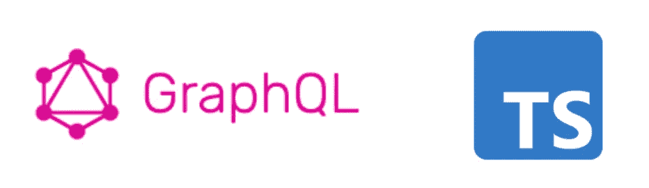
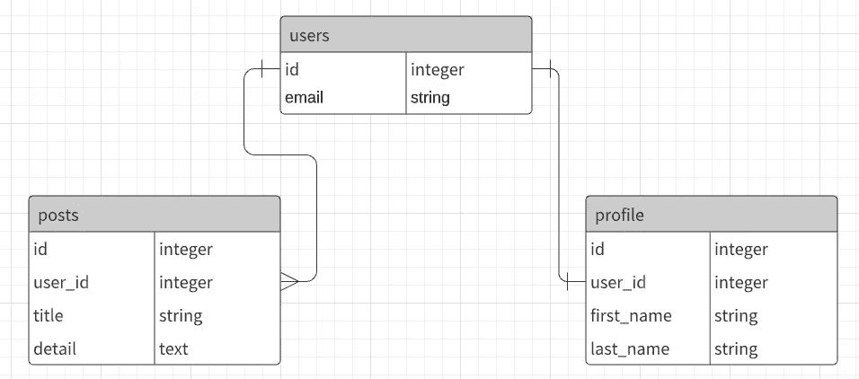
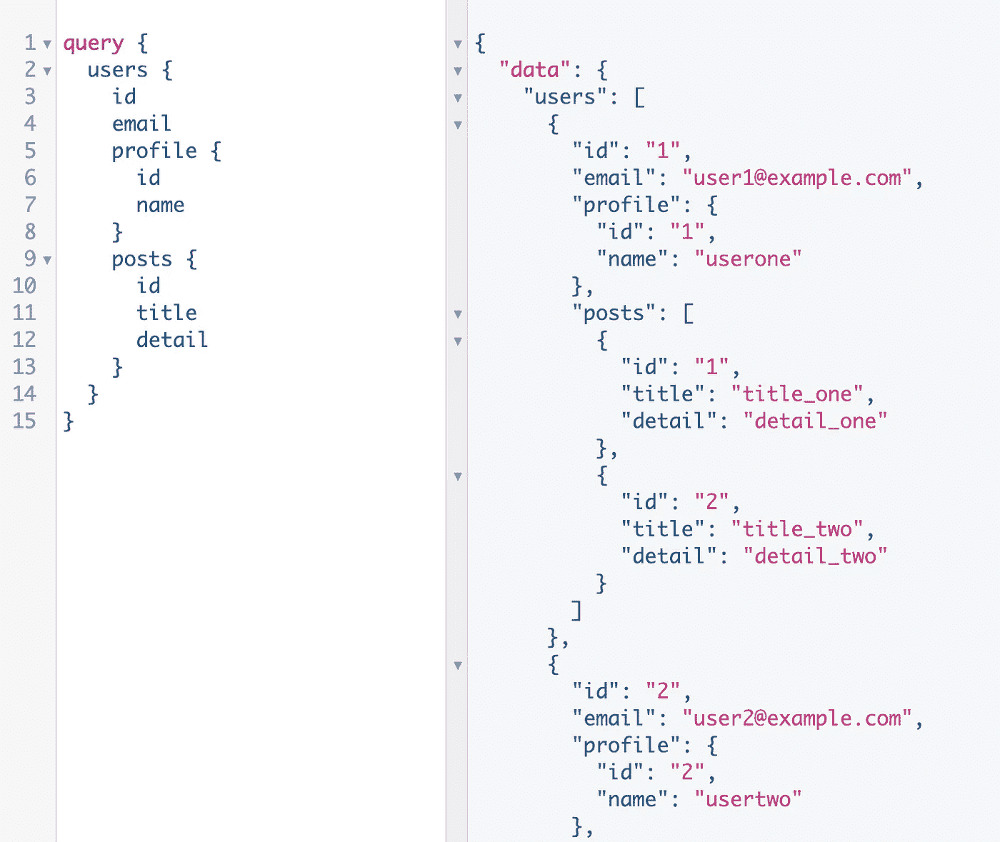
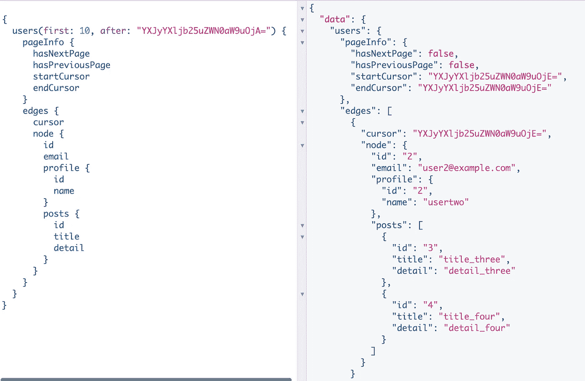
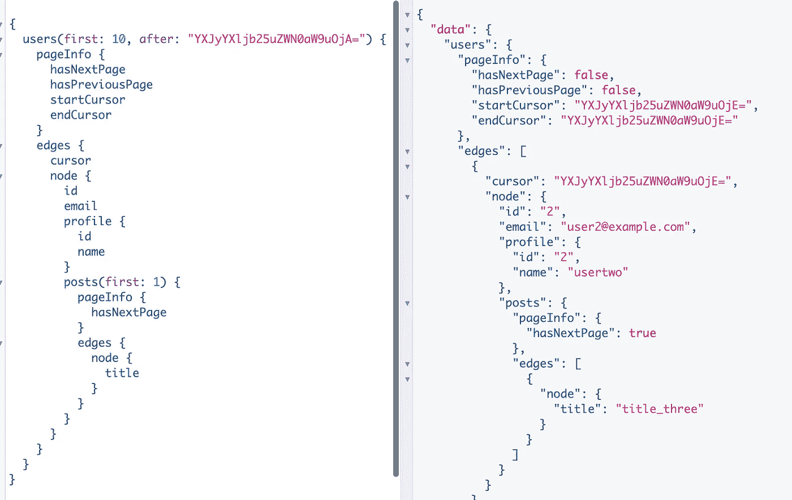
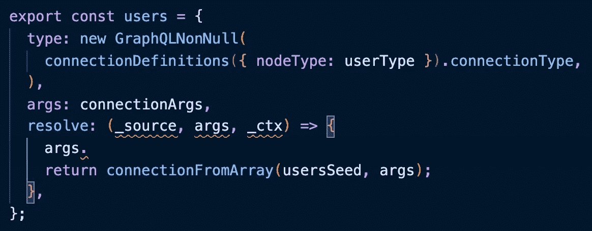
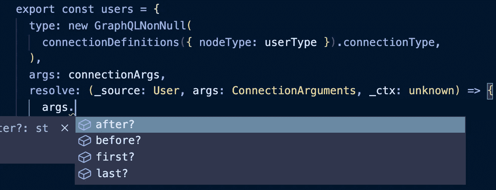
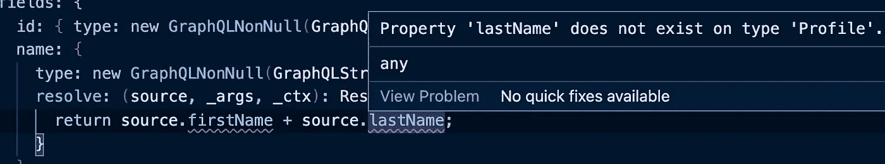

# 使用 GraphQL.js 和 TypeScript 的代码优先 GraphQL 服务器的完美指南

> 原文：<https://itnext.io/perfect-guide-of-code-first-graphql-server-with-graphql-js-and-typescript-8cfe09df97ef?source=collection_archive---------3----------------------->



[GraphQL.js](https://github.com/graphql/graphql-js) 是 GraphQL 的 JavaScript 参考实现。这是最好的 GraphQL 库之一，由 [GraphQL Nexus](https://nexusjs.org/) 和 [TypeGraphQL](https://typegraphql.com/) 使用。

虽然 GraphQL.js 有很好的文档，但是关于代码优先实现和 TypeScript 的信息并不多。所以本文解释了如何用 GraphQL.js 和 TypeScript 实现 code first GraphQL server。

本文由以下 3 个主题组成。

1.  如何用代码优先的方法实现 GraphQL 模式
2.  中继样式分页
3.  如何用 GraphQL 代码生成器高效打字

# 故事

假设您创建了一个博客应用程序，并为其实现了 GraphQL 后端。简单的数据模型如下所示。



*   用户有一个配置文件
*   用户有许多帖子

并且您希望创建包含配置文件和帖子的用户查询。

# 设置 GraphQL 服务器

最小 GraphQL 服务器是用 GraphQL.js、express 和 express-graphql 在[这个库](https://github.com/egurinko/code-first-graphql-example)中实现的。如果你想检查完成的代码，请检查`done`分支。

存储库的结构如下。

```
- repo_root
 - package.json
 - seed.ts    // user data is here
 - src/
  - index.ts  // server implementation is here
  - graphql/  // GraphQL implementation comes here
   - schema.ts
```

GraphQL 实现将出现在`src/graphql`目录中。随着应用程序的增长，它会变得如下所示。

```
- src/
  - schema.ts
  - context.ts
  - query.ts          // import implementations
  - mutation.ts
  - subscription.ts
  - queries/          // query implementations
  - mutations/        // mutation implementations
  - subscriptions/    // subscription implementations
  - types/
```

# 代码优先查询实现

让我们按照代码优先方法的 [GraphQL.js 文档](https://graphql.org/graphql-js/constructing-types/)创建一个用户查询！首先实现 GraphQL 类型的用户，配置文件和帖子。

```
// src/graphql/types/postType.ts
import { 
  GraphQLObjectType, 
  GraphQLInt, 
  GraphQLString,
  GraphQLNonNull
} from "graphql";export const postType = new GraphQLObjectType({
  name: "Post",
  fields: {
    id: { type: new GraphQLNonNull(GraphQLInt) },
    title: { type: new GraphQLNonNull(GraphQLString) },
    detail: { type: new GraphQLNonNull(GraphQLString) },
  }
});// src/graphql/types/profileType.ts
export const profileType = new GraphQLObjectType({
  name: "Profile",
  fields: {
    id: { type: new GraphQLNonNull(GraphQLInt) },
    name: {
      type: new GraphQLNonNull(GraphQLString),
      resolve: (source, _args, _ctx) => {
        return source.firstName + source.lastName;
      }
    },
  }
});// src/graphql/types/userType.ts
import { profileType } from "./profileType";
import { postType } from "./postType";export const userType = new GraphQLObjectType({
  name: "User",
  fields: {
    id: { type: new GraphQLNonNull(GraphQLInt) },
    email: { type: new GraphQLNonNull(GraphQLString) },
    profile: { type: new GraphQLNonNull(profileType) },
    posts: {
      type: new GraphQLNonNull(new GraphQLList(postType))
    },
  }
});// src/graphql/types/index.ts
export * from "./postType";
export * from "./profileType";
export * from "./userType";
```

几乎所有代码都很简单，除了 profileType。在种子数据中，profile 数据有三个属性`id`、`firstName`、`lastName`。但是在 profileType.ts 中，`firstName`和`lastName`使用解析器连接到`name`。这种数据转换通常是因为各种原因发生，如前端 DX，隐藏一些数据。

现在准备用类型实现查询本身。

```
// src/graphql/queries/users.ts
import { GraphQLNonNull, GraphQLList } from "graphql";
import { userType } from "../types";
import { usersSeed } from "../../../seed";export const users = {
  type: new GraphQLNonNull(
    new GraphQLList(new GraphQLNonNull(userType))
  ),
  resolve: (_source: any, _args: any, _ctx: any) => {
    return usersSeed;
  },
};// src/graphql/queries/index.ts
export * from "./users";
```

至此，graphql 类型和查询实现已经完成。您唯一要做的就是将查询集成到模式中！

```
// src/graphql/query.ts
import { GraphQLObjectType } from "graphql";
import * as queries from "./queries";export const queryType = new GraphQLObjectType({
  name: "Query",
  fields: queries,
});// src/graphql/schema.ts
import { GraphQLSchema } from 'graphql';
import { queryType } from "./query";export const schema = new GraphQLSchema({
  query: queryType, // add this line !
});
```

让我们检查实现是否正确！只需启动服务器并检查图形。

```
$ yarn dev // and go to [http://localhost:4000/graphql](http://localhost:4000/graphql) in browser
```



用户查询

第一次查询🎉
总之，您需要做三件事来创建查询。

1.  定义返回类型
2.  创建查询解析器(实际上与类型实现相同)
3.  向模式添加查询

也许你注意到还没有 TypeScript 类型注释。但是不用担心。在处理 TypeScript 之前，让我解释一下如何实现中继样式分页。

# 中继样式分页

随着数据的增长，应用程序需要分页以获得 UX 和服务器性能。在 GraphQL 世界中，最著名的分页特定是[中继](https://relay.dev/)样式分页。



中继样式分页

正如您在上面看到的，它是基于光标的分页。`users`查询接受两个输入`first`和`after`。意思是“请从用户 YXJy…之后抽取 10 个用户”。

返回值有`pageInfo`和`edges`。`node`表示数据本身，处理每个节点的关系`edge`。如果你想知道细节，请阅读阿波罗博客关于连接。

[https://www . apollographql . com/blog/graph QL/explaining-graph QL-connections/](https://www.apollographql.com/blog/graphql/explaining-graphql-connections/)

好像超级难？😫幸运的是，GraphQL.js 团队开发了 [graphql-relay](https://github.com/graphql/graphql-relay-js) 使我们能够轻松实现分页。

```
$ yarn add graphql-relay
```

所以让我们使用 graphql-relay 对用户和帖子进行分页。是的，当然你可以在多个字段中使用分页。

```
// src/graphql/queries/users.ts
import { GraphQLNonNull } from "graphql";
import { 
  connectionDefinitions,
  connectionArgs,
  connectionFromArray
} from "graphql-relay";
import { userType } from "../types";
import { usersSeed } from "../../../seed";export const users = {
  type: new GraphQLNonNull(
    connectionDefinitions({ nodeType: userType }).connectionType,
  ),
  args: connectionArgs,
  resolve: (_source: any, args: any, _ctx: any) => {
    return connectionFromArray(usersSeed, args);
  },
};
```

首先，`type`应该被更改，以向模式添加`edges`和`pageInfo`层。但是你只需要用`connectionDefinitions`改变`type`就可以了。

第二，应该添加`args`来接受类似`after`、`first`的输入。

第三，使用`connectionFromArray`作为解析器。如果向它传递数组和参数，它会计算并格式化数据。

厉害！这很简单！接下来，让我们像我上面做的那样给文章分页。

```
// src/graphql/types/userType.ts
import { 
  GraphQLObjectType,
  GraphQLInt,
  GraphQLString,
  GraphQLNonNull
} from "graphql";
import {
  connectionDefinitions,
  connectionArgs,
  connectionFromArray
} from "graphql-relay";
import { profileType } from "./profileType";
import { postType } from "./postType";export const userType = new GraphQLObjectType({
  name: "User",
  fields: {
    id: { type: new GraphQLNonNull(GraphQLInt) },
    email: { type: new GraphQLNonNull(GraphQLString) },
    profile: { type: new GraphQLNonNull(profileType) },
    posts: {
      // CHANGE HERE
      type: new GraphQLNonNull(
        connectionDefinitions({ 
          nodeType: postType 
        }).connectionType,
      ),
      args: connectionArgs,
      resolve: (source, args, _ctx) => {
        return connectionFromArray(source.posts, args)
      }
    },
  }
});
```

所以运行服务器，在 graphiql 上检查一下！



对用户和帖子进行分页

GraphQL 和 REST 的一个很大的区别是，您可以用 GraphQL 为每个字段设置参数。当创建解析器时，每个解析器可以关注传递给它的参数。

# 带有 GraphQL 代码生成器的 TypeScript 类型

到目前为止，GraphQL 查询是通过代码优先的方法构建的。如果您自己编写代码，您会注意到即使是用 TypeScript 编写的，也没有 TypeScript 的优点。

例如，即使您的一个字段有参数，您的编辑器也不会像下面这样显示类型断言。



没有带参数的断言

使用 [GraphQL Nexus](https://nexusjs.org/) ，您可以在定义`args`之后获得类型断言，因为它会观察文件变化并动态创建类型脚本类型。但由于 GraphQL Nexus 还不成熟，存在一些 bug，还很难用于生产。

另一方面，GraphQL.js 本身不会自动生成 TypeScript 类型。一种简单的方法是分别定义 TypeScript 类型和实现 GrahphQL 模式。但是这不是一个聪明的方法，因为 GraphQL 实现本身也包含类型定义。你的代码不是干的。



分别定义 schema 和 TypeScript 类型。

在这种情况下， [GraphQL 代码生成器](https://www.graphql-code-generator.com/)解决了这个问题，从 GraphQL 实现中自动生成 TypeScript 类型。让我们看看。

```
$ yarn add -D [@graphql](http://twitter.com/graphql)-codegen/cli  [@graphql](http://twitter.com/graphql)-codegen/typescript [@graphql](http://twitter.com/graphql)-codegen/typescript-resolvers
```

首先，您需要创建一个 codegen 的配置文件。

```
// codegen.yml
schema: [http://localhost:4000/graphql](http://localhost:4000/graphql)
generates:
  ./src/graphql/generatedTypes.ts:
    plugins:
      - typescript
      - typescript-resolvers
```

您应该将 GraphQL 模式指定给`schema`选项。`schema`选项也像`.graphql`一样接受 GraphQL 模式文件。和`typescript`插件从你的模式生成 TypeScript 类型。`typescript-resolvers`生成 GraphQL 服务器类型，如 resovers 类型，它基于`typescript`插件生成的类型。

```
// package.json
{
  "scripts":{
    "generate": "graphql-codegen"
  }
}$ yarn generate
```

运行 GraphQL 代码生成器后，在`src/graphql/generatedTypes.ts`中发现了一个新文件。这有点复杂，但你应该知道有一些类型的类型。

```
// src/graphql/generatedTypes.ts// Response type purely based on GraphQL schema
export type User = {
  __typename?: 'User';
  email: Scalars['String'];
  id: Scalars['ID'];
  posts: PostConnection;
  profile: Profile;
};// Query Arguments type
export type QueryUsersArgs = {
  after?: Maybe<Scalars['String']>;
  before?: Maybe<Scalars['String']>;
  first?: Maybe<Scalars['Int']>;
  last?: Maybe<Scalars['Int']>;
};// Resolver type
export type ResolversTypes = {
  Boolean: ResolverTypeWrapper<Scalars['Boolean']>;
  ID: ResolverTypeWrapper<Scalars['ID']>;
  Int: ResolverTypeWrapper<Scalars['Int']>;
  PageInfo: ResolverTypeWrapper<PageInfo>;
  Post: ResolverTypeWrapper<Post>;
  PostConnection: ResolverTypeWrapper<PostConnection>;
  PostEdge: ResolverTypeWrapper<PostEdge>;
  Profile: ResolverTypeWrapper<Profile>;
  Query: ResolverTypeWrapper<{}>;
  String: ResolverTypeWrapper<Scalars['String']>;
  User: ResolverTypeWrapper<User>;
  UserConnection: ResolverTypeWrapper<UserConnection>;
  UserEdge: ResolverTypeWrapper<UserEdge>;
};// Resolver parent type
export type ResolversParentTypes = {
  Boolean: Scalars['Boolean'];
  ID: Scalars['ID'];
  Int: Scalars['Int'];
  PageInfo: PageInfo;
  Post: Post;
  PostConnection: PostConnection;
  PostEdge: PostEdge;
  Profile: Profile;
  Query: {};
  String: Scalars['String'];
  User: User;
  UserConnection: UserConnection;
  UserEdge: UserEdge;
};
```

现在，您可以使用这个自动生成的类型进行注释。让我们从 graphql 类型开始注释。在构建 graphql 类型时，主要使用`GraphQLObjectType`。如果你检查一下`GraphQLObjectType`的类型定义，就很容易理解如何注释 graphql 类型。

[](https://github.com/graphql/graphql-js/blob/8261922bafb8c2b5c5041093ce271bdfcdf133c3/src/type/definition.ts#L754) [## graph QL-js/definition . ts at 8261922 ba FB 8 C2 b5 c 5041093 ce 271 BDF CDF 133 c 3 graph QL/graph QL-js

### JavaScript-GraphQL-js/definition . ts 的 graph QL 参考实现位于…

github.com](https://github.com/graphql/graphql-js/blob/8261922bafb8c2b5c5041093ce271bdfcdf133c3/src/type/definition.ts#L754) 

从`GraphqlQLLObjectType`定义来看，它接受两个泛型`TSource`和`TContext`。`TSource`是特定字段父级解析器的返回值类型。已经可以批注了！所以从简单的开始。

```
// src/graphql/types/postTypes.ts
import { 
  GraphQLObjectType,
  GraphQLInt,
  GraphQLString,
  GraphQLNonNull
} from "graphql";
import { ResolversParentTypes } from "../generatedTypes";
import { Context } from "../context";export const postType: GraphQLObjectType<ResolversParentTypes["Post"], Context> = 
new GraphQLObjectType({
  name: "Post",
  fields: {
    id: { type: new GraphQLNonNull(GraphQLInt) },
    title: { type: new GraphQLNonNull(GraphQLString) },
    detail: { type: new GraphQLNonNull(GraphQLString) },
  }
});
```

对于每个源对象，GraphQL 代码生成器生成`ResolverParentTypes`。因为它具有所有源对象类型，所以您可以将其用于所有源类型。

虽然对于没有自定义解析器的 graphql 类型来说，TypeScript 类型注释似乎没有意义，但还是为以后的自定义解析器进行注释比较好。和下面的其他 graphql 类型。接下来，`profileType`。

```
// src/graphql/types/profileType.ts
import { 
  ResolversParentTypes, 
  ResolversTypes
} from "../generatedTypes";
import { Context } from "../context";export const profileType: GraphQLObjectType<ResolversParentTypes["Profile"], Context> = new GraphQLObjectType({
  name: "Profile",
  fields: {
    id: { type: new GraphQLNonNull(GraphQLInt) },
    name: {
      type: new GraphQLNonNull(GraphQLString),
      resolve: (source, _args): ResolversTypes["String"] => {
        return source.firstName + source.lastName;
      }
    },
  }
});
```

如果您的一个字段有一个自定义解析器，您可以使用`ResolversTypes`作为返回类型注释。但是如果你尝试一下，可能会发现如下的类型错误。



什么？？`source`没有`firstName`和`lastName`？但是 source 确实拥有这两者，因为它来自种子数据。如果您检查 GraphQL 代码生成器生成的`Profile`类型和种子数据，您就能理解它。

```
// generated Profile type in generatedTypes.ts
export type Profile = {
  __typename?: 'Profile';
  id: Scalars['Int'];
  name: Scalars['String'];
};// seed data ProfileModel type
export type ProfileModel = {
  id: number;
  firstName: string;
  lastName: string;
}
```

GraphQL 代码生成器从架构生成 TypeScript 类型。这就是为什么生成的概要文件类型只有`name`属性。另外，生成的轮廓类型用于`ResolversParentType`、`ResolversTypes`等。这就是为什么带注释的源代码似乎没有`firstName`和`lastName`属性。

这种模式和应用程序类型之间的不匹配通常发生在创建自定义解析器时。为了避免这种情况，您可以使用 GraphQL 代码生成器的 mapper config。

```
// codegen.yml
schema: [http://localhost:4000/graphql](http://localhost:4000/graphql)
generates:
  ./src/graphql/generatedTypes.ts:
    plugins:
      - typescript
      - typescript-resolvers
    config:
      mappers:
        Profile: ../../seed#ProfileModel
        User: ../../seed#UserModel
```

因为配置文件和 post 连接不同，所以它们都映射到应用程序类型。如果你想知道更多关于 mappers 配置的信息，请参考 GraphQL 代码生成器文档。

 [## 类型脚本解析器| GraphQL 代码生成器

### 这个插件为 GraphQL API 的解析函数生成类型脚本签名。你可以使用这个插件来…

www.graphql-code-generator.com](https://www.graphql-code-generator.com/docs/plugins/typescript-resolvers) 

如果您再次运行`yarn generate`，您将看不到任何错误！所以我们去看一下`userType`。

```
// src/graphql/types/userTypes.ts
import { 
  ResolversParentTypes,
  ResolversTypes,
  UserPostsArgs
} from "../generatedTypes";
import { Context } from "../context";export const userType: GraphQLObjectType<ResolversParentTypes["User"], Context> = new GraphQLObjectType({
  name: "User",
  fields: {
    id: { type: new GraphQLNonNull(GraphQLInt) },
    email: { type: new GraphQLNonNull(GraphQLString) },
    profile: { type: new GraphQLNonNull(profileType) },
    posts: {
      type: new GraphQLNonNull(
        connectionDefinitions({ 
          nodeType: postType 
        }).connectionType,
      ),
      args: connectionArgs,
      resolve: (source, args: UserPostsArgs, _ctx): ResolversTypes["PostConnection"] => {
        return connectionFromArray(source.posts, args)
      }
    },
  }
});
```

因为 posts 字段有自定义解析器，并且定义了 args，所以需要使用`ResolverTypes`和`UserPostsArgs`进行注释。每个参数类型都是完美生成的。这样打字就完成了！

最后一个是用户查询。当你检查`src/graphql/query.ts`时，你可以知道`users`查询只是 GraphQL 的一个字段配置。所以让我们先检查 GraphQL.js 的字段配置定义。

[https://github . com/graph QL/graph QL-js/blob/c 589 C3 d 285 CB 1 EC 44 b 09 BF 0 b 50 EC 041 EC 083760 c/src/type/definition . ts # L992](https://github.com/graphql/graphql-js/blob/c589c3d285cb1ec44b09bf0b50ec041ec083760c/src/type/definition.ts#L992)

正如您所检查的，`GraphQLFieldConfig`接受 3 个泛型`TSource`、`TContext`、`TArgs`。我希望你已经了解了每一种类型。

```
// src/graphql/queries/users.ts
import { GraphQLNonNull, GraphQLFieldConfig } from "graphql";
import { 
  connectionDefinitions,
  connectionArgs,
  connectionFromArray
} from "graphql-relay";
import { userType } from "../types";
import { 
  QueryUsersArgs,
  ResolversParentTypes,
  ResolversTypes }
from "../generatedTypes";
import { Context } from "../context";
import { usersSeed } from "../../../seed";export const users: GraphQLFieldConfig<ResolversParentTypes["Query"], Context, QueryUsersArgs> = {
  type: new GraphQLNonNull(
    connectionDefinitions({ nodeType: userType }).connectionType,
  ),
  args: connectionArgs,
  resolve: (_source, args, _ctx): ResolversTypes["UserConnection"] => {
    return connectionFromArray(usersSeed, args);
  },
};
```

嘣！完美！

在本文中，GraphQL 实现和代码生成步骤是完全分开的。但是，因为 GraphQL 代码生成器可以在监视模式下运行，所以可以用 TypeScript 类型实现 GraphQL 服务器。

本文解释了如何用 GraphQL.js 和 TypeScript 实现 code first GraphQL server。而且题目分的像下面这样。

1.  如何用代码优先的方法实现 GraphQL 模式
2.  中继样式分页
3.  如何用 GraphQL 代码生成器高效打字

完成的代码在这个库的`[done](https://github.com/egurinko/code-first-graphql-example/tree/done)`分支[上。如果你有问题，随时问我。谢谢大家！](https://github.com/egurinko/code-first-graphql-example/tree/done)

# 参考

*   [GraphQL.js](https://graphql.org/graphql-js/)
*   [GraphQL Nexus](https://nexusjs.org/)
*   [类型图 QL](https://typegraphql.com/)
*   [GraphQL 代码生成器](https://www.graphql-code-generator.com/)
*   [范例知识库](https://github.com/egurinko/code-first-graphql-example)