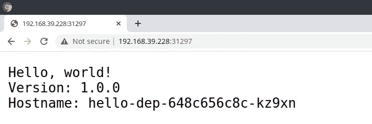
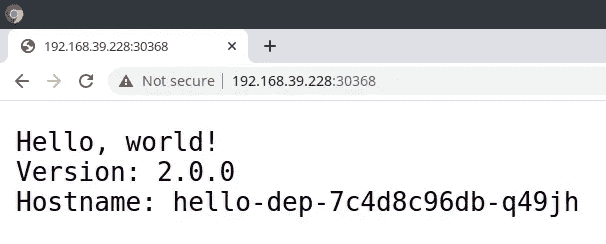

# 在 Java 中执行 Kubernetes 部署滚动更新

> 原文：<https://itnext.io/perform-kubernetes-deployment-rolling-updates-in-java-2a133dbe6e7e?source=collection_archive---------1----------------------->


[Fabric8 Kubernetes 客户端](https://github.com/fabric8io/kubernetes-client)

我最近在 StackOverflow 上看到一个问题，是关于如何使用 Fabric8 Kubernetes 客户端在 Java 中以编程方式进行滚动更新/回滚:

[](https://stackoverflow.com/questions/61929260/does-fabric8io-k8s-java-client-support-patch-or-rollingupdate-using-yaml-sni/67709155#67709155) [## Fabric8io K8s java 客户端支持使用 YAML 片段的 patch()或 rollingupdate()吗？

### 我正试图通过将部署片段作为输入，对 k8s 应用程序的补丁/滚动升级进行编程。我使用 patch()…

stackoverflow.com](https://stackoverflow.com/questions/61929260/does-fabric8io-k8s-java-client-support-patch-or-rollingupdate-using-yaml-sni/67709155#67709155) 

我在那里看到一个已经过时的答案。根据最新的 API 改进，我给出了一个新的[答案](https://stackoverflow.com/a/67709155/2830116),但我认为把它转换成一篇博客文章会更好，因为它可能对正在寻找类似内容的人有所帮助。因此，今天我们将了解如何使用 Fabric8 Kubernetes Client 以 Java 编程方式对您的 Kubernetes 资源进行滚动更新(我们以`Deployment`为例)。

# 获取客户端:

如果您没有将 Fabric8 Kubernetes 客户端添加到您的项目中，您可能希望将其作为依赖项添加到您的项目配置中。如果你正在使用 maven，你可以从 [maven central](https://maven-badges.herokuapp.com/maven-central/io.fabric8/kubernetes-client) 获得最新版本，你可以像这样把它下载到你的`pom.xml`:

```
**<dependency>
  <groupId>**io.fabric8**</groupId>
  <artifactId>**kubernetes-client**</artifactId>
  <version>**5.4.0**</version>
</dependency>**
```

# 设置 Kubernetes 环境:

如果您已经可以访问 Kubernetes 集群，那么您需要登录到您的集群。我使用的是 [minikube](https://github.com/kubernetes/minikube) ，它建立了一个本地 Kubernetes 集群，这是一个单节点集群。为了开始使用它，我只需运行这个简单的命令:

```
**~ : $** minikube start
  minikube v1.19.0 on Fedora 34 
  minikube 1.20.0 is available! Download it: https://github.com/kubernetes/minikube/releases/tag/v1.20.0 
  To disable this notice, run: 'minikube config set WantUpdateNotification false' 
✨  Using the kvm2 driver based on existing profile 
  Starting control plane node minikube in cluster minikube 
  Restarting existing kvm2 VM for "minikube" ... 
  Preparing Kubernetes v1.20.2 on Docker 20.10.4 ... 
  Verifying Kubernetes components... 
    ▪ Using image gcr.io/k8s-minikube/storage-provisioner:v5 
  Enabled addons: storage-provisioner, default-storageclass 
  Done! kubectl is now configured to use "minikube" cluster and "default" namespace by default
```

# 创建示例部署+服务:

为了进行滚动更新，我们需要创建一个控制器资源，它可以是下列资源之一:

*   部署
*   状态集
*   达蒙塞特

我们将选择`Deployment`，因为它是被广泛使用的库伯内特资源。让我们创建一个简单的`Deployment`和一个`Service`来公开这个部署:

使用 Fabric8 Kubernetes 客户端创建部署和服务

请注意，在`Deployment`生成器中，我已经将`spec.strategy.type`设置为`RollingUpdate`，并设置了以下字段:

*   **maxSurge:** 在更新过程中可以创建的超过所需数量的 pod 的数量
*   **maxUnavailable:** 在更新过程中不可用的单元数量

通过 IDE 或构建工具(在我的例子中是 maven)运行这段代码:

```
**~ : $** mvn exec:java  -Dexec.mainClass="io.fabric8.DeploymentAndServiceCreate"
```

运行此示例后，您将能够看到正在创建的窗格:

```
**~ : $** kubectl get deploy 
NAME        READY   UP-TO-DATE   AVAILABLE   AGE 
hello-dep   2/2     2            2           7m34s 
**~ : $** kubectl get pods 
NAME                         READY   STATUS    RESTARTS   AGE 
hello-dep-648c656c8c-kz9xn   1/1     Running   0          7m36s 
hello-dep-648c656c8c-nx5hk   1/1     Running   0          7m36s
```

当您的 pod 处于`Running`状态时，您应该能够使用创建的`Service`来访问它:

```
**~ : $** MINIKUBE_IP=`minikube ip` 
**~ : $** HELLO_DEP_PORT=`kubectl get svc hello-dep -ojsonpath='{.spec.ports[0].nodePort}'` **~ : $** curl $MINIKUBE_IP:$HELLO_DEP_PORT/ 
Hello, world! 
Version: 1.0.0 
Hostname: hello-dep-648c656c8c-nx5hk
```

或者您可以在浏览器中打开此 URL:



在 Chrome 中打开的应用程序 URL

如您所见，我们的第一个应用程序版本已经部署完毕。现在，我们可以看到滚动更新的不同方式。

# 使用补丁 API 和 JSON 补丁进行滚动更新:

现在我想用一个新的镜像版本更新应用程序，假设新的镜像版本是`gcr.io/google-samples/hello-app:2.0`。我可以使用`patch()`方法用 JSON 或 YAML 代码片段修补`Deployment`中的图像，就像这样:

使用补丁调用滚动更新

该呼叫将创建两个额外的单元，当它们准备就绪时，另外两个单元将被终止:

```
**~ : $** kubectl get pods 
NAME                       READY   STATUS            RESTARTS    AGE 
hello-dep-648c656c8c-n874w 1/1     Running             0         52s 
hello-dep-648c656c8c-p2jsr 1/1     Running             0         52s 
hello-dep-7c4d8c96db-bzn4h 0/1     ContainerCreating   0          3s 
hello-dep-7c4d8c96db-q49jh 0/1     ContainerCreating   0          3s **~ : $** kubectl get pods  
NAME                         READY   STATUS        RESTARTS   AGE 
hello-dep-648c656c8c-n874w   1/1     Running       0          55s 
hello-dep-648c656c8c-p2jsr   0/1     Terminating   0          55s 
hello-dep-7c4d8c96db-bzn4h   1/1     Running       0          6s 
hello-dep-7c4d8c96db-q49jh   1/1     Running       0          6s **~ : $** kubectl get pods  
NAME                         READY   STATUS        RESTARTS   AGE 
hello-dep-648c656c8c-n874w   0/1     Terminating   0          56s 
hello-dep-648c656c8c-p2jsr   0/1     Terminating   0          56s 
hello-dep-7c4d8c96db-bzn4h   1/1     Running       0          7s 
hello-dep-7c4d8c96db-q49jh   1/1     Running       0          7s**~ : $** kubectl get pods  
NAME                         READY   STATUS    RESTARTS   AGE 
hello-dep-7c4d8c96db-bzn4h   1/1     Running   0          2m40s 
hello-dep-7c4d8c96db-q49jh   1/1     Running   0          2m40s
```

您应该能够访问更新服务并更改应用程序的根端点响应:



滚动更新后应用程序的响应

# 使用`rolling()` API 更新图像的滚动更新:

Fabric8 Kubernetes 客户端也提供了类似于`kubectl rollout`的`rolling()` DSL 方法。在我看来，与上面的补丁例子相比，它的语法要清晰得多。下面是上面使用`rolling().updateImage()`调用更新图像操作的样子:

使用“Rolling()滚动更新。updateImage()`方法

当您运行这段代码时，您会看到它会显示与我们的补丁调用类似的行为。正如你所看到的，与之前的选择相比，它更干净。如果您的部署碰巧有多个容器，并且您想要更新这些容器的映像；你可以用`updateImage(Map<String, String>)`的方法:

使用 rolling()更新多个容器的图像。updateImage()

# 使用 Rolling()重新启动滚动更新。重新启动():

如果你想简单地重启已部署的吊舱。您可以执行首次展示重启，这将为您的应用程序创建新的窗格:

Rollout 使用 rolling()重新启动部署。重新启动()

# 使用 rolling()回滚部署。撤消():

您还可以使用`rolling().undo()`方法回滚到部署的前一个部署版本，就像您对`kubectl rollout undo`所做的那样。比方说，你已经用 v1 部署了应用程序的第一个版本。您将它的图像更新到第二个版本，现在您会得到以下响应:


应用程序已通过滚动更新重新部署

现在，您希望回滚到此部署的先前版本。你可以这样用`rolling().undo()`调用:

使用 Fabric8 Kubernetes 客户端回滚

运行这段代码后，您应该能够看到正在部署的应用程序的第一个版本:


使用 Fabric8 Kubernetes 客户端回滚部署

# 暂停和恢复滚动更新:

您还可以使用`rolling().pause()` / `rolling().resume()`方法暂停/恢复正在进行的滚动更新。这里是它的用法的例子。我在一个窗口中开始部署，然后运行这个示例:

部署滚动更新暂停/恢复

当我运行这个程序时，有一分钟时间，所有使用 rollout step 创建的附加单元都与已经部署的单元一起存在。休眠 1 分钟后，程序以`rollout().resume()`终止，之后吊舱开始终止，只有 2 个吊舱处于活动状态。

```
**~ : $** kubectl get pods 
NAME                         READY   STATUS    RESTARTS   AGE 
hello-dep-648c656c8c-kgqtv   1/1     Running   0          9m27s 
hello-dep-6f44dbbdd6-25zcj   1/1     Running   0          43s 
hello-dep-6f44dbbdd6-2qq7k   1/1     Running   0          37s 
hello-dep-6f44dbbdd6-4t9q6   1/1     Running   0          37s 
hello-dep-6f44dbbdd6-54cbp   1/1     Running   0          43s 
hello-dep-6f44dbbdd6-bts9r   1/1     Running   0          37s 
**~ : $** kubectl get pods 
NAME                         READY   STATUS    RESTARTS   AGE 
hello-dep-648c656c8c-kgqtv   1/1     Running   0          9m44s 
hello-dep-6f44dbbdd6-25zcj   1/1     Running   0          60s 
hello-dep-6f44dbbdd6-2qq7k   1/1     Running   0          54s 
hello-dep-6f44dbbdd6-4t9q6   1/1     Running   0          54s 
hello-dep-6f44dbbdd6-54cbp   1/1     Running   0          60s 
hello-dep-6f44dbbdd6-bts9r   1/1     Running   0          54s 
**~ : $** kubectl get pods 
NAME                         READY   STATUS        RESTARTS   AGE 
hello-dep-648c656c8c-kgqtv   0/1     Terminating   0          9m56s 
hello-dep-6f44dbbdd6-25zcj   1/1     Running       0          72s 
hello-dep-6f44dbbdd6-2qq7k   0/1     Terminating   0          66s 
hello-dep-6f44dbbdd6-4t9q6   0/1     Terminating   0          66s 
hello-dep-6f44dbbdd6-54cbp   1/1     Running       0          72s 
hello-dep-6f44dbbdd6-bts9r   0/1     Terminating   0          66s 
stackoverflow-code : $ kubectl get pods 
NAME                         READY   STATUS    RESTARTS   AGE 
hello-dep-6f44dbbdd6-25zcj   1/1     Running   0          3m37s 
hello-dep-6f44dbbdd6-54cbp   1/1     Running   0          3m37s
```

# 结论:

在今天的博客中，您学习了如何使用 Fabric8 Kubernetes 客户端在 Java 中对控制器资源进行滚动更新。您可以在这个资源库中找到与本博客相关的所有代码:

[](https://github.com/rohanKanojia/kubernetes-client-demo) [## rohanKanojia/kubernetes-客户端-演示

### 该项目包含 Fabric8 Kubernetes 客户端不同用法的各种示例。我通常在我的…

github.com](https://github.com/rohanKanojia/kubernetes-client-demo) 

感谢阅读！