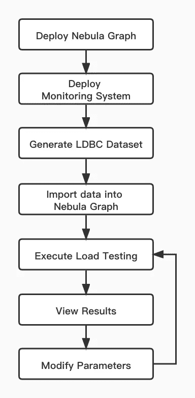
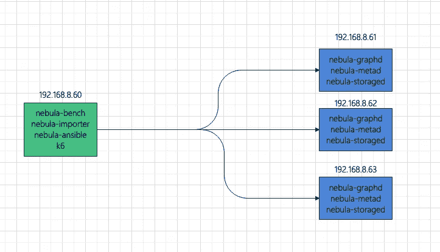
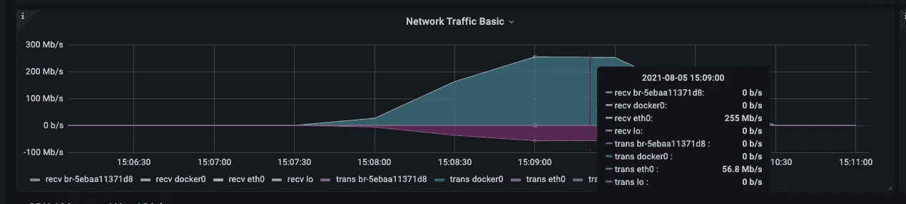
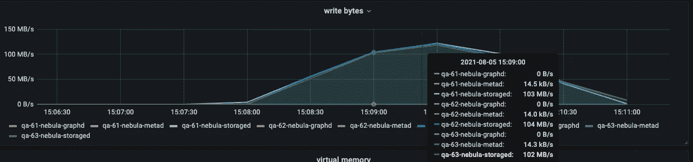

# 使用 K6 对图形数据库执行负载测试

> 原文：<https://itnext.io/perform-load-testing-against-graph-databases-with-k6-dacd6add0792?source=collection_archive---------0----------------------->


# 为什么负载测试在图形数据库中很重要？

通常需要对数据库进行负载测试，以便在不同场景下监控对系统的影响，如查询语言规则优化、存储引擎参数调整等。

本文中的操作系统是 x86 CentOS 7.8。

部署数据库的主机配置了 4C 16G 内存、SSD 磁盘和 10G 网络。

# 负载测试所需的工具

*   nebula-ansible 部署 NebulaGraph 服务。
*   [星云导入器](https://github.com/vesoft-inc/nebula-importer)将数据导入星云星团。
*   [**k6-plugin**](https://github.com/vesoft-inc/k6-plugin) **是一个 k6 扩展，用于对 NebulaGraph 集群进行负载测试。该扩展与 nebula-go 客户端集成，在测试期间发送请求。**
*   [nebula-bench](https://github.com/vesoft-inc/nebula-bench) 生成 LDBC 数据集，然后将其导入 NebulaGraph。
*   [ldbc _ snb _ data gen _ Hadoop](https://github.com/ldbc/ldbc_snb_datagen_hadoop)是一个 ldbc 数据生成器。

# 负载测试过程概述

本文中进行的负载测试使用了由 [ldbc_snb_datagen](https://github.com/ldbc/ldbc_snb_datagen_hadoop) 生成的 LDBC 数据集。测试过程如下。



要部署拓扑，使用一台主机作为负载测试运行程序，并使用三台主机组成一个 NebulaGraph 集群。



为了使监控更容易，负载测试运行器还部署了:

*   普罗米修斯
*   Influxdb
*   格拉夫纳
*   节点导出器

安装了 NebulaGraph 的主机也会部署:

*   节点导出器
*   加工出口商

# 负载测试步骤

# 使用 nebula-ansible 部署 NebulaGraph 数据库

1.  设置无密码 SSH 登录 a .分别登录 192.168.8.60、192.168.8.61、192.168.8.62、192.168.8.63。创建一个 vesoft 用户，用 NOPASSWD 加入 sudoer。b .登录 192.168.8.60 设置 SSH。

```
ssh-keygenssh-copy-id vesoft@192.168.8.61
ssh-copy-id vesoft@192.168.8.62
ssh-copy-id vesoft@192.168.8.63
```

2.下载 nebula-ansible，安装 ansible，修改 Ansible 配置。

```
sudo yum install ansible -y
git clone [https://github.com/vesoft-inc/nebula-ansible](https://github.com/vesoft-inc/nebula-ansible)
cd nebula-ansible/
```

下面是 inventory.ini 的一个例子。

```
[all:vars]
# GA or nightly
install_source_type = GA
nebula_version = 2.0.1
os_version = el7
arc = x86_64
pkg = rpmpackages_dir = {{ playbook_dir }}/packages
deploy_dir = /home/vesoft/nebula
data_dir = {{ deploy_dir }}/data# ssh user
ansible_ssh_user = vesoftforce_download = False[metad]
192.168.8.[61:63][graphd]
192.168.8.[61:63][storaged]
192.168.8.[61:63]
```

3.安装和部署 NebulaGraph。

```
ansible-playbook install.yml
ansible-playbook start.yml
```

# 监控主机

使用 docker-compose 部署监控系统非常方便。需要首先在主机上安装 Docker 和 Docker-Compose。

登录 192.168.8.60

```
git clone [https://github.com/vesoft-inc/nebula-bench.gitcd](https://github.com/vesoft-inc/nebula-bench.gitcd) nebula-bench
cp -r third/promethues ~/.
cp -r third/exporter ~/.cd ~/exporter/ && docker-compose up -dcd ~/promethues
# Modify the exporter address of monitoring nodes
# vi prometheus.yml
docker-compose up -d# Copy exporter to 192.168.8.61, 192.168.8.62, and 192.168.8.63, and then start docker-compose
```

配置 Grafana 数据源和仪表板。详见[https://github . com/vesoft-Inc/nebula-bench/tree/master/third](https://github.com/vesoft-inc/nebula-bench/tree/master/third)。

# 生成 LDBC 数据集

```
cd nebula-benchsudo yum install -y git \
                    make \
                    file \
                    libev \
                    libev-devel \
                    gcc \
                    wget \
                    python3 \
                    python3-devel \
                    java-1.8.0-openjdk \
                    mavenpip3 install --user -r requirements.txt# Using `snb.interactive.1` parameter in ldbc_snb_datagen_hadoop, for more infor [https://github.com/ldbc/ldbc_snb_datagen_hadoop/wiki/Configurationpython3](https://github.com/ldbc/ldbc_snb_datagen_hadoop/wiki/Configurationpython3) run.py data# Date generated by mvmv target/data/test_data/ ./sf1
```

# 输入数据

```
cd nebula-bench
# Modify .evn
cp env .env
vi .env
```

以下是的示例。包封/包围（动词 envelop 的简写）

```
DATA_FOLDER=sf1
NEBULA_SPACE=sf1
NEBULA_USER=root
NEBULA_PASSWORD=nebula
NEBULA_ADDRESS=192.168.8.61:9669,192.168.8.62:9669,192.168.8.63:9669
#NEBULA_MAX_CONNECTION=100
INFLUXDB_URL=http://192.168.8.60:8086/k6# Compile nebula-importer and K6
./scripts/setup.sh# Import data
python3 run.py nebula importer
```

在导入过程中，您可以关注以下网络带宽和磁盘 IO 写入。



# 执行负载测试

```
python3 run.py stress run
```

根据文件`scenarios`中的代码源，自动渲染 js 文件，使用 K6 测试所有场景。

执行结束后，js 文件和结果将保存在输出文件夹中。

其中，`latency`是服务器返回的延迟时间，`responseTime`是客户端发起`execute`到`response`的时间。测量单位为`μs`。

```
[vesoft@qa-60 nebula-bench]$ more output/result_Go1Step.json
{
    "metrics": {
        "data_sent": {
            "count": 0,
            "rate": 0
        },
        "checks": {
            "passes": 1667632,
            "fails": 0,
            "value": 1
        },
        "data_received": {
            "count": 0,
            "rate": 0
        },
        "iteration_duration": {
            "min": 0.610039,
            "avg": 3.589942336582023,
            "med": 2.9560145,
            "max": 1004.232905,
            "p(90)": 6.351617299999998,
            "p(95)": 7.997563949999995,
            "p(99)": 12.121579809999997
        },
        "latency": {
            "min": 308,
            "avg": 2266.528722763775,
            "med": 1867,
            "p(90)": 3980,
            "p(95)": 5060,
            "p(99)": 7999
        },
        "responseTime": {
            "max": 94030,
            "p(90)": 6177,
            "p(95)": 7778,
            "p(99)": 11616,
            "min": 502,
            "avg": 3437.376111156418,
            "med": 2831
        },
        "iterations": {
            "count": 1667632,
            "rate": 27331.94978169588
        },
        "vus": {
            "max": 100,
            "value": 100,
            "min": 0[vesoft@qa-60 nebula-bench]$ head -300 output/output_Go1Step.csv | grep -v USE
timestamp,nGQL,latency,responseTime,isSucceed,rows,errorMsg
1628147822,GO 1 STEP FROM 4398046516514 OVER KNOWS,1217,1536,true,1,
1628147822,GO 1 STEP FROM 2199023262994 OVER KNOWS,1388,1829,true,94,
1628147822,GO 1 STEP FROM 1129 OVER KNOWS,1488,2875,true,14,
1628147822,GO 1 STEP FROM 6597069771578 OVER KNOWS,1139,1647,true,30,
1628147822,GO 1 STEP FROM 2199023261211 OVER KNOWS,1399,2096,true,6,
1628147822,GO 1 STEP FROM 2199023256684 OVER KNOWS,1377,2202,true,4,
1628147822,GO 1 STEP FROM 4398046515995 OVER KNOWS,1487,2017,true,39,
1628147822,GO 1 STEP FROM 10995116278700 OVER KNOWS,837,1381,true,3,
1628147822,GO 1 STEP FROM 933 OVER KNOWS,1130,3422,true,5,
1628147822,GO 1 STEP FROM 6597069771971 OVER KNOWS,1022,2292,true,60,
1628147822,GO 1 STEP FROM 10995116279952 OVER KNOWS,1221,1758,true,3,
1628147822,GO 1 STEP FROM 8796093031179 OVER KNOWS,1252,1811,true,13,
1628147822,GO 1 STEP FROM 10995116279792 OVER KNOWS,1115,1858,true,6,
1628147822,GO 1 STEP FROM 6597069777326 OVER KNOWS,1223,2016,true,4,
1628147822,GO 1 STEP FROM 8796093028089 OVER KNOWS,1361,2054,true,13,
1628147822,GO 1 STEP FROM 6597069777454 OVER KNOWS,1219,2116,true,2,
1628147822,GO 1 STEP FROM 13194139536109 OVER KNOWS,1027,1604,true,2,
1628147822,GO 1 STEP FROM 10027 OVER KNOWS,2212,3016,true,83,
1628147822,GO 1 STEP FROM 13194139544176 OVER KNOWS,855,1478,true,29,
1628147822,GO 1 STEP FROM 10995116280047 OVER KNOWS,1874,2211,true,12,
1628147822,GO 1 STEP FROM 15393162797860 OVER KNOWS,714,1684,true,5,
1628147822,GO 1 STEP FROM 6597069770517 OVER KNOWS,2295,3056,true,7,
1628147822,GO 1 STEP FROM 17592186050570 OVER KNOWS,768,1630,true,26,
1628147822,GO 1 STEP FROM 8853 OVER KNOWS,2773,3509,true,14,
1628147822,GO 1 STEP FROM 19791209307908 OVER KNOWS,1022,1556,true,6,
1628147822,GO 1 STEP FROM 13194139544258 OVER KNOWS,1542,2309,true,91,
1628147822,GO 1 STEP FROM 10995116285325 OVER KNOWS,1901,2556,true,0,
1628147822,GO 1 STEP FROM 6597069774931 OVER KNOWS,2040,3291,true,152,
1628147822,GO 1 STEP FROM 8796093025056 OVER KNOWS,2007,2728,true,29,
1628147822,GO 1 STEP FROM 21990232560726 OVER KNOWS,1639,2364,true,9,
1628147822,GO 1 STEP FROM 8796093030318 OVER KNOWS,2145,2851,true,6,
1628147822,GO 1 STEP FROM 21990232556027 OVER KNOWS,1784,2554,true,5,
1628147822,GO 1 STEP FROM 15393162796879 OVER KNOWS,2621,3184,true,71,
1628147822,GO 1 STEP FROM 17592186051113 OVER KNOWS,2052,2990,true,5,
```

也可以在一个场景中执行负载测试，并不断调整配置参数进行比较。

# 同时阅读

```
# Run Go2Step with 50 virtual users and 300 seconds of duration
python3 run.py stress run -scenario go.Go2Step -vu 50 -d 300INFO[0302] 2021/08/06 03:55:27 [INFO] finish init the pool     ✓ IsSucceed     █ setup     █ teardown     checks...............: 100.00% ✓ 1559930     ✗ 0
     data_received........: 0 B     0 B/s
     data_sent............: 0 B     0 B/s
     iteration_duration...: min=687.47µs avg=9.6ms       med=8.04ms max=1.03s  p(90)=18.41ms p(95)=22.58ms p(99)=31.87ms
     iterations...........: 1559930 5181.432199/s
     latency..............: min=398      avg=6847.850345 med=5736   max=222542 p(90)=13046   p(95)=16217   p(99)=23448
     responseTime.........: min=603      avg=9460.857877 med=7904   max=226992 p(90)=18262   p(95)=22429   p(99)=31726.71
     vus..................: 50      min=0         max=50
     vus_max..............: 50      min=50        max=50
```

可以同时监控每个指标。


`checks`是验证请求是否执行成功。如果执行失败，失败消息将保存在 CSV 文件中。

```
awk -F ',' '{print $NF}' output/output_Go2Step.csv|sort |uniq -c# Execute Go2Step with 200 virtual users and 300 seconds of duration
python3 run.py stress run -scenario go.Go2Step -vu 200 -d 300INFO[0302] 2021/08/06 04:02:34 [INFO] finish init the pool     ✓ IsSucceed     █ setup     █ teardown     checks...............: 100.00% ✓ 1866850    ✗ 0
     data_received........: 0 B     0 B/s
     data_sent............: 0 B     0 B/s
     iteration_duration...: min=724.77µs avg=32.12ms      med=25.56ms max=1.03s  p(90)=63.07ms p(95)=84.52ms  p(99)=123.92ms
     iterations...........: 1866850 6200.23481/s
     latency..............: min=395      avg=25280.893558 med=20411   max=312781 p(90)=48673   p(95)=64758    p(99)=97993.53
     responseTime.........: min=627      avg=31970.234329 med=25400   max=340299 p(90)=62907   p(95)=84361.55 p(99)=123750
     vus..................: 200     min=0        max=200
     vus_max..............: 200     min=200      max=200
```

K6 指标由 Grafana 监控


# 并行写作

```
# Execute insert with 200 virtual users and 300 seconds of duration. By default, batchSize is 100.python3 run.py stress run -scenario go.Go2Step -vu 200 -d 300
```

可以手动修改 js 文件来调整批处理大小

```
sed -i 's/batchSize = 100/batchSize = 300/g' output/InsertPersonScenario.js# Run K6 manuallyscripts/k6 run output/InsertPersonScenario.js -u 400 -d 30s --summary-trend-stats "min,avg,med,max,p(90),p(95),p(99)" --summary-export output/result_InsertPersonScenario.json --out influxdb=http://192.168.8.60:8086/k6
```

如果 batchSize 是 300，有 400 个虚拟用户，将返回一个错误。

```
INFO[0032] 2021/08/06 04:03:49 [INFO] finish init the pool     ✗ IsSucceed
      ↳  96% — ✓ 31257 / ✗ 1103     █ setup     █ teardown     checks...............: 96.59% ✓ 31257       ✗ 1103
     data_received........: 0 B    0 B/s
     data_sent............: 0 B    0 B/s
     iteration_duration...: min=12.56ms avg=360.11ms      med=319.12ms max=2.07s   p(90)=590.31ms p(95)=696.69ms p(99)=958.32ms
     iterations...........: 32360  1028.339207/s
     latency..............: min=4642    avg=206931.543016 med=206162   max=915671  p(90)=320397.4 p(95)=355798.7 p(99)=459521.39
     responseTime.........: min=6272    avg=250383.122188 med=239297.5 max=1497159 p(90)=384190.5 p(95)=443439.6 p(99)=631460.92
     vus..................: 400    min=0         max=400
     vus_max..............: 400    min=400       max=400awk -F ',' '{print $NF}' output/output_InsertPersonScenario.csv|sort |uniq -c31660
   1103  error: E_CONSENSUS_ERROR(-16)."
      1 errorMsg
```

如果`E_CONSENSUS_ERROR`发生，应该是 raft 的追加日志缓冲区在并发较大时溢出，可以通过调整相关参数来解决。

# 摘要

*   负载测试使用 LDBC 数据集标准来确保数据一致性。即使生成了更大的数据量，比如十亿个顶点，图形模式也是一样的。
*   K6 比 Jmeter 更方便进行负载测试。更多详情请参考[https://k6.io/docs/](https://k6.io/docs/)。
*   通过使用上述工具模拟各种场景或调整 NebulaGraph 中的参数，您可以轻松找到系统资源的瓶颈。