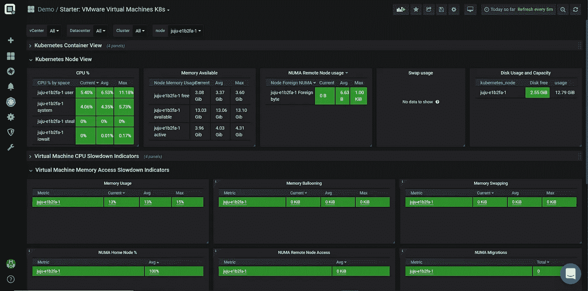
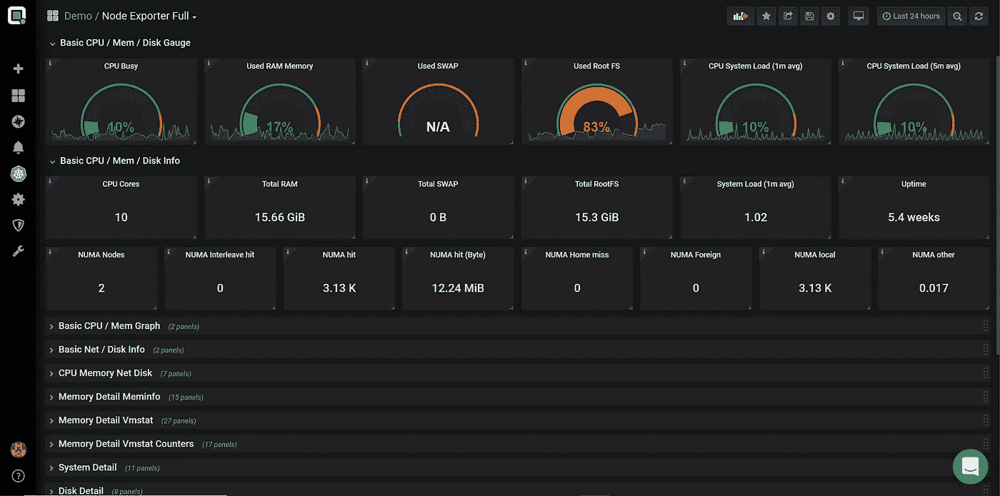
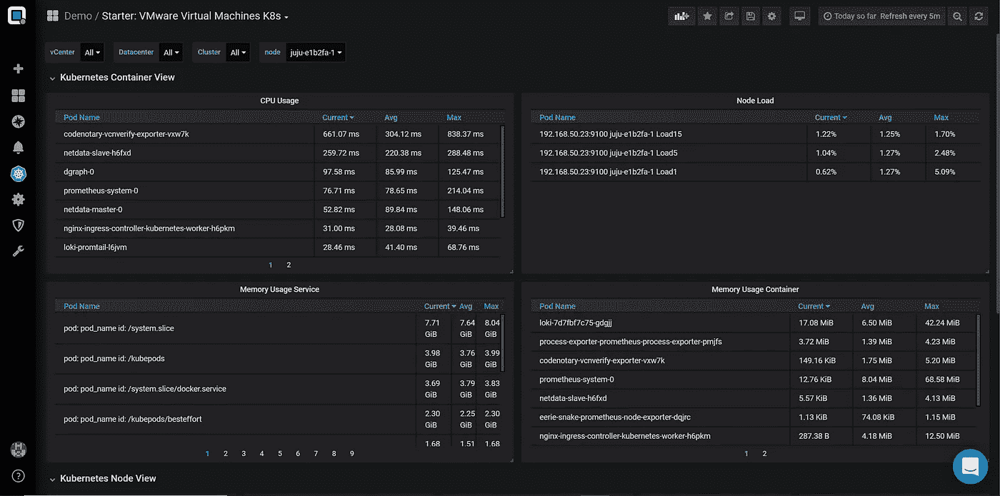
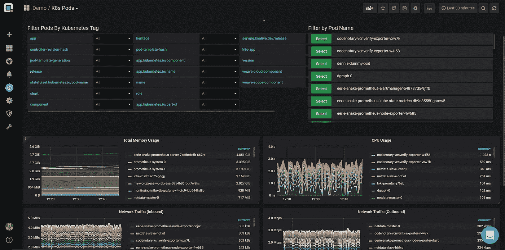
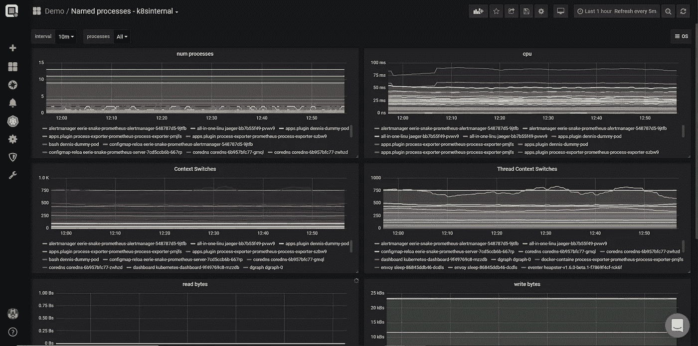

# vSphere 上 Kubernetes 的性能分析器

> 原文：<https://itnext.io/performance-analyzer-for-kubernetes-on-vsphere-ce85ddbe05ee?source=collection_archive---------5----------------------->

您可能已经注意到，我们 Opvizor 一直在改进 Performance Analyzer 的容器支持。无论你是在 [Docker](https://www.docker.com) 主机上运行 docker container，还是使用 [Kubernetes](https://www.kubernetes.io) 。由于我们已经拥有业界最详细、最完整的 VMware 监控体系之一，尤其是 Kubernetes 监控部分对许多客户来说非常方便。原因很简单，他们在 vSphere 上运行 Kubernetes，因此 Kubernetes 主机是在 VMware vSphere 上运行的虚拟机。

Performance Analyzer 在全堆栈监控和性能分析方面处于领先地位，从 VMkernel (NUMA 不平衡、内核存储队列等)开始，进入虚拟机性能指标(内存膨胀、cpu 就绪 aso。)、到来宾(Kubernetes 节点导出器— cpu、内存、numa、磁盘利用率)和到 Kubernetes Pod(容器上下文切换、数据包丢失……)。

如果您在生产环境中或以严肃的方式在 vSphere 上运行 **Kubernetes，您应该导入 Performance Analyzer，并获取完整的图片，而不是拼图。**

**让我们进入一些细节**

将 Performance Analyzer 连接到您的 VMware vCenter 服务器以及 Kubernetes 环境后，您可以在很短的时间内在结构良好的控制面板中找到性能指标。

**Kubernetes 节点**和运行这些节点的虚拟机之间的匹配是自动发生的。一个典型的控制面板是 Starter:**VMware Virtual Machines K8s**，它在一个位置显示所有重要指标。如果您想在 vSphere integration 上测试 Kubernetes，请联系我们。

通用性能指标旁边的一些亮点是 NUMA 主节点和 NUMA 远程节点利用率图表。NUMA 度量收集需要在现有的节点导出器中进行简单的更改，或者部署 Opvizor 节点导出器。该控制面板是一个很好的起点，因为它显示了整个堆栈。

**节点导出器**

无论 Kubernetes 节点是在 VMware vSphere 上运行还是在硬件上运行，Node exporter Full 控制面板都提供了详细的可视化效果。可以检查所有重要的资源指标并发出警报— CPU、内存、磁盘、网络。

还提供了详细的 NUMA 利用率指标或文件系统信息。

**Pod 概述**

回到 Starter dashboard，因为它还显示了容器信息，包括顶级消费者或麻烦制造者。数据是随着时间的推移收集的，因此您可以很容易地在过去几分钟或过去几周甚至几个月发生的事情之间进行更改。请注意，更多的数据意味着更多的 IOps，因此，如果您运行具有数百或数千个 pod 的环境，在我们的支持下仔细检查开箱即用的配置非常重要。

此外，仪表板显示当前负载、所选时间范围内的平均负载和峰值。

**Pod 详细信息**

当然，我们还提供了几个 Pod 细节仪表板。您可以检查容器的所有 KPI，甚至可以通过任何可用的 Kubernetes 标签(app、service 等)进行过滤，而不仅仅是 pod 名称。

许多可用的监控工具要么在这里停止，要么在这里启动，并且不提供 VMware vSphere 详细信息或详细的容器详细信息，如 Pod 流程详细信息。我们为我们的客户提供了一个[掌舵](https://helm.sh/)图表，该图表部署了一个 daemonset 来运行 Kubernetes 节点上的 pod 流程导出器。

**Pod 集装箱工艺视图**

这样，我们不仅可以收集外部性能指标，还可以收集内部指标。进程数量、内存利用率、上下文切换或写入的字节只是您可以为容器中的所有进程或所选进程收集的一些信息(可以配置进程选择)。

现在，您已经全面了解了在运行 Kubernetes 和 VMware vSphere 时可以收集、可视化和用于警报的信息量。在那篇文章中，我们忽略了进行实时故障排除以及将容器日志文件与容器性能数据相关联的能力。我们会在后续的博客文章中深入探讨这一点。

*原载于 2019 年 5 月 16 日*[*https://www.opvizor.com*](https://www.opvizor.com/performance-analyzer-for-kubernetes-on-vsphere)*。*