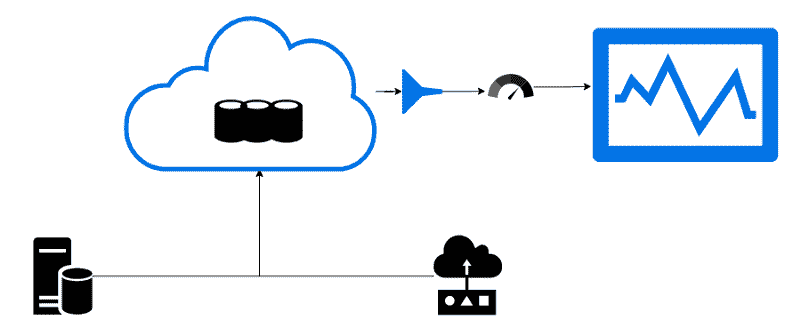
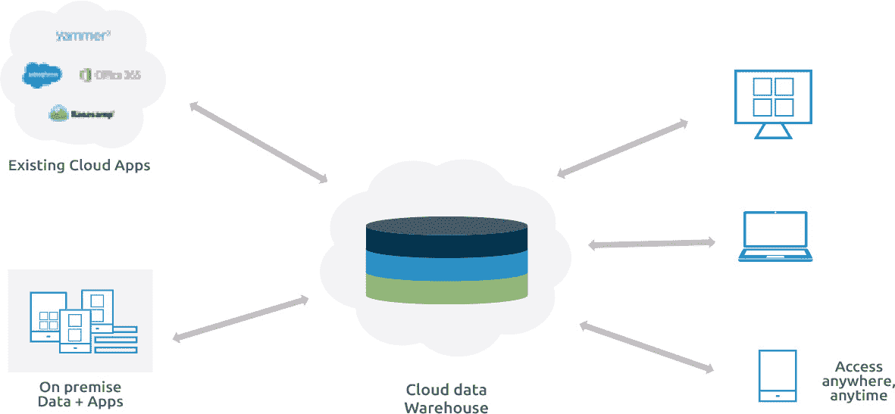
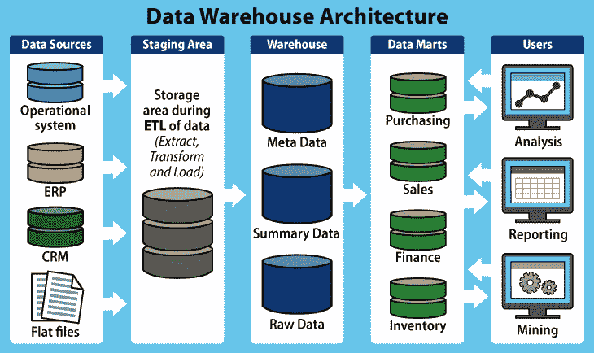

# 云数据仓库的性能能力

> 原文：<https://itnext.io/performance-capabilities-for-cloud-data-warehouses-4138241a6c95?source=collection_archive---------1----------------------->

易于使用且好得令人难以置信的服务

**照片由** [**艾莉娜·格鲁布尼亚**](https://unsplash.com/@alinnnaaaa?utm_source=unsplash&utm_medium=referral&utm_content=creditCopyText) **上** [**Unsplash**](https://unsplash.com/s/photos/data?utm_source=unsplash&utm_medium=referral&utm_content=creditCopyText)

“如果你少了一件要担心的事情，有了更多的灵活性来专注于你的业务逻辑和增长，这总是好的。”

云上的数据存储是当今最大限度减少基础设施和数据库维护工作的标准。

收集数据并将其存储在数据库中很容易，但对于获得更好的业务洞察力来说却没有回报。如今，企业需要以符合业务需求的方式简化其数据，以便随时随地使用。毕竟，商业情报和运筹学是复杂的，昂贵的，但却是值得的。

抛开内部数据仓库带来的好处不谈，它也有很多缺点。内部数据仓库需要大量的工作来实现、监控和维护。如果您的业务快速增长，基础架构和数据存储成本可能会飙升。但是，如果系统太复杂，恢复可能会很复杂。你需要一个单独的团队来维护和监控。

这个问题有没有更好的解决方法？

是啊！一个[云数据仓库](https://www.firebolt.io/blog/cloud-data-warehouse)。

云数据仓库只不过是作为托管服务托管在公共云上的数据库，旨在以相对较低的价格实现易用性和可扩展性。云数据仓库是托管已经转换并分类到不同类别的数据的可行选择。

[来源](https://accur8software.com/cloud-data-warehouse-an-smbs-perfect-launch-point-for-cloud-transformation/)

Denodo 最近的一项研究发现，56%的组织部署了云数据仓库。

# 什么使得云数据仓库非常适合

# 1.简单的即插即用集成和管理

如今，企业的成功取决于很多因素。其中一个因素是摄取大量的大数据和流数据。根据业务需求，这些数据可能不是来自单一来源。相反，您必须从多个来源收集数据，并将其导入数据仓库/数据库。

借助云数据仓库，您可以轻松集成来自数百个数据源的结构化、半结构化和非结构化数据，用于分析查询和 [ETL/ELT](https://www.firebolt.io/blog/etl-vs-elt-know-the-differences) 流程。

# 2.通过设计可扩展

适应性是成功的关键。适应新的市场和需求会让您比想象中更频繁地扩展基础架构。

云服务的设计考虑了可扩展性。它们足够灵活，可以根据需求进行伸缩。

借助云数据仓库，您可以随时通过添加/减少资源进行扩展。

[来源](https://www.datamation.com/big-data/top-15-data-warehouse-tools/)

3.持续安全性

如果没有防火墙和服务，内部数据仓库更容易受到网络攻击和安全威胁。这些服务同样需要额外的费用。

云提供商将安全性作为首要目标来配备他们的服务。在安全性方面，领先的云提供商值得信赖。

# 4.即时恢复和备份

失败在任何事情上都显而易见。失败可能源于几乎所有东西:数据库、业务逻辑、基础设施等。故障不应导致数据丢失和服务中断，这对于企业至关重要。拥有处理故障和从故障中恢复的机制可以增加服务的正常运行时间。

对于内部数据仓库，如果没有适当的机制来处理，就无法保证正常运行时间和备份。

由于云数据仓库托管在多个位置，并且数据是克隆的，因此它们可以提供高达 99.99%的正常运行时间和数据备份保证。

# 5.性能和速度

大多数时候，我们最终会运行查询并对数 TB 和数 Pb 的数据执行分析，而在服务于多个地理区域时，区域限制会影响性能。缓慢的产出/成果也不例外。

性能和速度对于快速获得业务洞察力以及赢得客户忠诚度和信任至关重要。

对于内部数据仓库，处理速度或容量很有可能有时会耗尽，或者事情可能会停滞不前，从而导致高延迟响应。

云数据仓库在快速处理海量数据和满足业务预期方面表现出色。

# 6.可调性

云数据提供商提供多种服务。所有这些服务都附带了通过调整配置来改善总体结果的选项。

您可以根据您的业务期望配置自动数据备份、自动基础架构配置和许多其他功能。

# 7.低成本多收益

随着业务的增长增加硬件和资源的成本会很高。此外，硬件可能会因为数十种原因而损坏或变得过时或无用。

借助云提供商，我们可以选择按需付费选项，并且只为我们使用的资源付费。这需要我们更少的投资。此外，我们不必担心处理潜在的故障。

# 结论

当价格和性能是您关注的焦点时，云数据仓库是一个极好的选择。他们使用标准的性能技巧，如基于成本的查询规划、[列存储](https://docs.aws.amazon.com/redshift/latest/dg/c_columnar_storage_disk_mem_mgmnt.html)、流水线执行和即时编译。因此，可扩展性和节约性可能很高，优化和集成可能很容易，安全性和恢复可能值得信赖。