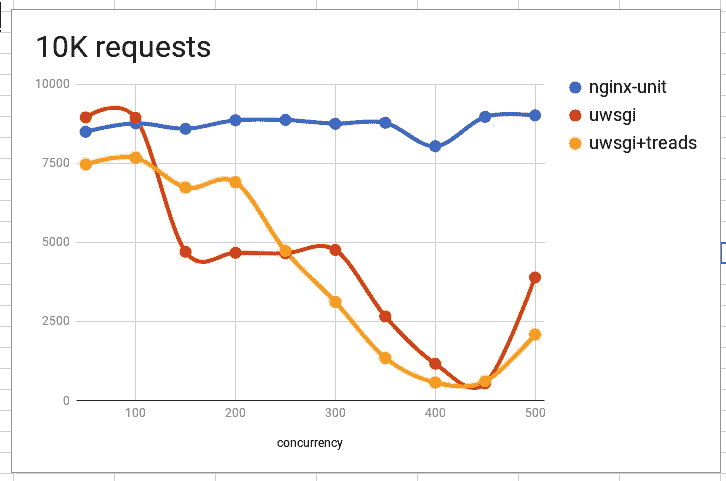
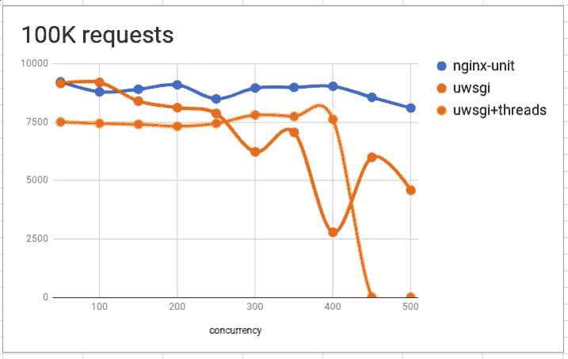
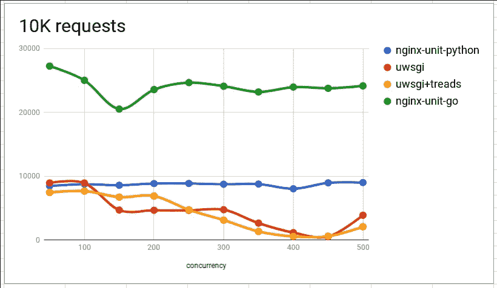
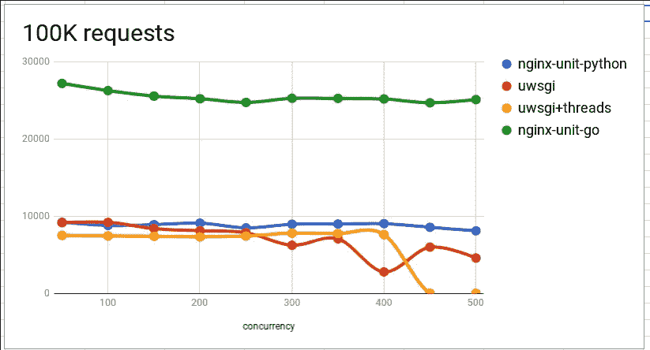

# NGINX-unit 和 uWSGI (python3)的并发性比较

> 原文：<https://itnext.io/performance-comparison-between-nginx-unit-and-uwsgi-python3-4511fc172a4c?source=collection_archive---------0----------------------->

[*点击这里在 LinkedIn* 上分享这篇文章](https://www.linkedin.com/cws/share?url=https%3A%2F%2Fitnext.io%2Fperformance-comparison-between-nginx-unit-and-uwsgi-python3–4511fc172a4c)

本文将展示两个 web 应用服务器 **nginx-unit** (一个新的现代应用 web 服务器)和 **uWSGI** (最佳应用服务器)的性能

[**nginx-unit**](https://unit.nginx.org)—nginx 公司推出的新型应用服务器。它还在*测试版*中**没有用于生产**使用。

[**uWSGI**](http://uwsgi-docs.readthedocs.io/en/latest) —我所知道的最好的 python 应用服务器之一。这是一个用 C/C++写的老项目，性能很好，里面有很多配置参数。这台服务器**准备生产**使用。

uWSGI 和 nginx-因为测试系统有 4 个内核，所以配置了 4 个工作人员。

# Python 测试应用的源代码，uWSGI.ini 和 unit.json

*   简单的 WSGI [烧瓶](http://flask.pocoo.org)应用程序。只需返回 Hello World

*   nginx-单元配置 json 文件

*   uWSGI 配置文件

# 测试准备

*   将 nginx-unit 配置应用到守护进程(unitd 应该在之前启动)

```
curl -v -X PUT -d @unit.json --unix-socket ./control.unit.sock [http://localhost](http://localhost)
```

*   启动 uwsgi 守护程序

```
uwsgi --ini uwsgi.ini
```

**ab** 将用于负载测试。示例:

```
ab -n 10000 -c 500 [http://127.0.0.1:8400/](http://127.0.0.1:8400/)
```

# 测试案例

*   10K 请求总数
*   总共 100K 个请求
*   将并发设置为 50 到 500

***结果*** —显示并发数与每秒请求数之比的图表。

# 测试结果



# 结论

nginx-unit 仍处于测试阶段，但比 uWSGI 性能更好。它仍然不适合生产使用，但它适合个人用途和内部使用。对于同时开发多个应用程序的 web 开发人员来说，这是一个很好的解决方案。适合测试。nginx-unit 允许在同一时间混合后端，并把它放到不同的端口。让我们等待 RC 并开始在生产环境中测试它。

# 奖金

并发比较 **python** 和**通过**nginx-unit



尽情享受吧！