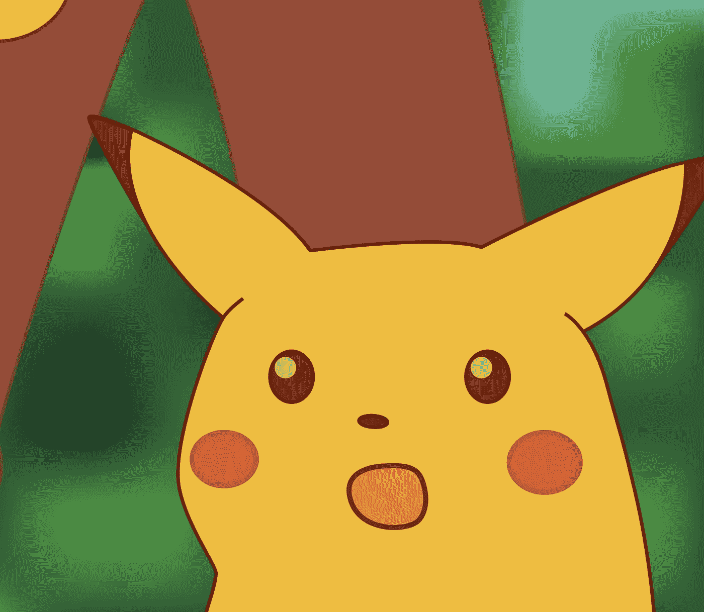

# 性能咨询—慢速批处理作业

> 原文：<https://itnext.io/performance-consultancy-slow-batch-job-ec530baed843?source=collection_archive---------6----------------------->

塞巴斯蒂安·赫尔曼在 [Unsplash](https://unsplash.com/?utm_source=unsplash&utm_medium=referral&utm_content=creditCopyText) 上的照片

在我职业生涯的早期，我曾在 2013 年担任绩效顾问。这是我在一个关键运营团队的最后一个咨询案例的故事。该客户是服装零售行业的，他们必须在月底运行一个批处理过程，但该过程阻止其他用户使用后台应用程序长达 4 小时，想象一下有数百人在那里无法工作？那是多少钱？很多。

因此，我们的目标是停止阻止用户，并潜在地提高作业的性能。该作业是作为 Visual Fox Pro 针对 SQL Server 运行的。

## 最初的简报

我仍然记得和几个人坐在一个会议室里，我的老板，我公司的 CEO 和来自客户的 5 个以上的资源。DBA 向我们展示了一个 SQL profiler，其中包含该作业的所有查询。

DBA 向我们展示了批处理期间应用程序的 SQL 分析，我注意到了一个模式，在 20，000 个查询中，70–80%的查询是相同的 select。周围的东西:

如果您在这个批处理中运行相同的查询 14，000 次，这个查询最好进行优化。导致问题的另一个迹象是，该查询消耗了 SQL 中相当多的 CPU，并且每次执行时间都超过 100 毫秒。

您能看出这个查询的问题吗？

SQL Server 是一个非常优化的数据库，它有索引的概念，所以数据更容易找到。通常情况下，您的目标是进行索引查找，在这种情况下，SQL Server 只需找到行，而不必扫描索引的所有行，但是当您对 where 子句中的列应用函数时，会发生什么情况呢？

SQL 现在必须对每一行应用函数，并评估这些行是否符合标准。这里的区别是索引寻道和索引扫描。一个优化不佳的查询，运行 14000 次，是我们首先要解决的最明显的事情。

我在会议中与数据库管理员进行了这样的对话:

我:“你知道这个 ISNULL 在这个查询中会很重，对吗？”

DBA:“是的，我知道，但是应用程序允许这一列为空。”

我:“我们可以对应用程序进行验证吗？”

DBA:“是的，但是数据库将包含来自先前插入行的空值”

我:“是的，但是我们可以将旧的空值更新为零”

惊讶的 DBA:“我没想过这个选项”。

惊讶的皮卡丘迷因

他知道这个问题令人不快，但是他还没有找到一个简单的解决方案。这是一个很好的专业，可能对我来说更容易，因为我从一个新的角度看问题，然后我的视野没有被以前的尝试或时间压力模糊。

**第一次修复**

通过从查询中删除 ISNULL 并对软件进行验证，我们将执行时间从 4 小时减少到了 15 分钟。这在处理性能问题时很常见，因为它们通常是瓶颈，消除瓶颈可以获得巨大的改进。

在处理性能改进时这是通常的情况，我喜欢用帕累托原则来思考:

> 用 20%的努力你得到了 80%的结果，然后你必须用剩下的 80%的努力去得到剩下的 20%的结果。

改进之后，不用说客户已经很高兴了，但我们仍然知道我们可以做得更好，因为我们有更多的建议，需要更多的工作。比如清理表格、更改应用程序以批处理这些查询等。这正是帕累托原则，剩下的 20%改进是 80%的工作。

开发人员在 Visual Fox Pro 中进行了更改，以批量处理这些查询，对应用程序进行了一些改进，对数据库进行了调整，我们将时间缩短到了 5 分钟。

然后，我向雇佣我们的公司的副总裁展示了报告和幻灯片，以及我们务实的改进过程，以及我们如何从 4 小时的批量执行缩短到 5 分钟。我是我们公司唯一一个实际参与这个项目的顾问，19 岁，只有 3 年的经验。当客户副总裁说我们做得非常出色时，这是我职业生涯中最美好的时刻之一。

这个咨询案例是咨询公司为这个客户做的第一份工作，它为更多的客户打开了大门，这仍然让我脸上挂着微笑，7 年后，它仍然是咨询公司最大的客户之一。

作为最后的建议:

> 当你被一个问题困扰了几个小时或几天时，把你的思维移开，去喝杯咖啡或在公园里散散步，然后带着一个新鲜的思维回来。

我已经记不清有多少次我在伦敦骑车时解决了技术问题，然后想，我以前怎么没想到这一点？

快乐的性能优化。