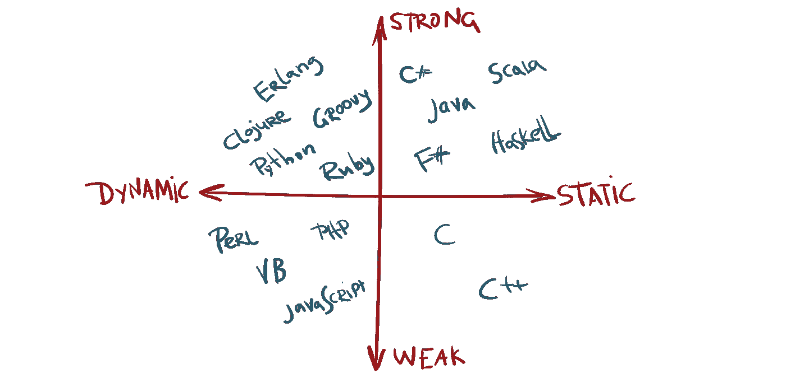
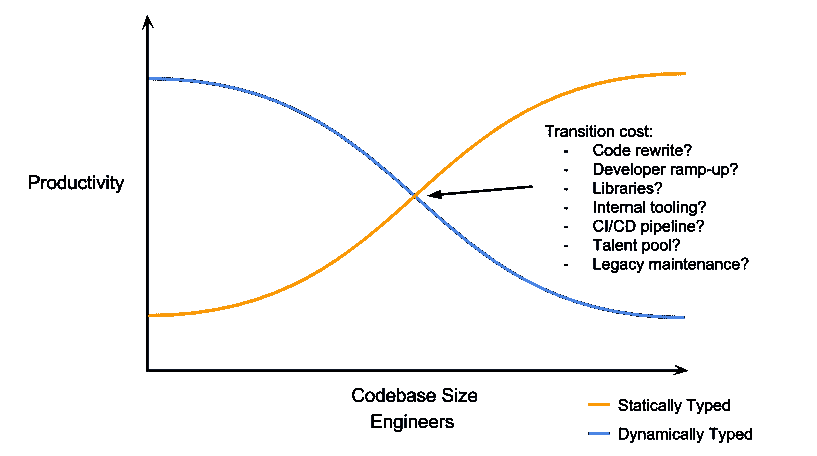
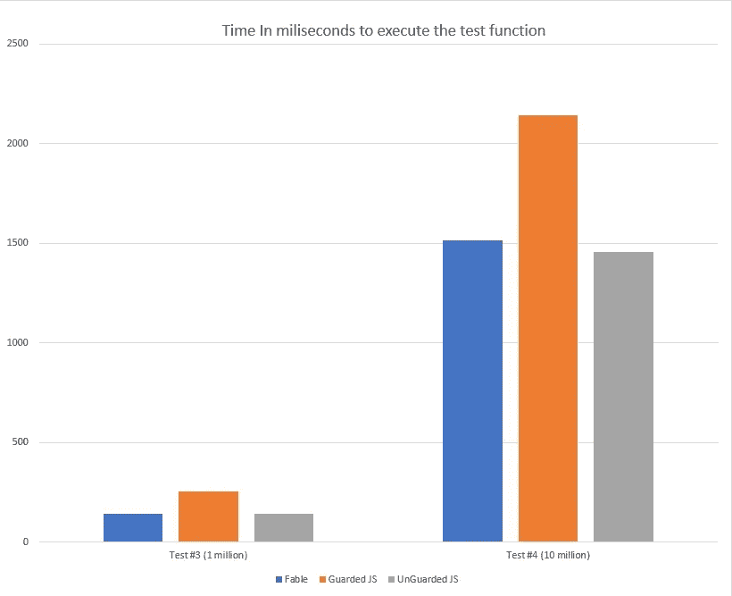

# 动态语言与严格类型语言的性能影响— Javascript 与 F#

> 原文：<https://itnext.io/performance-impact-of-dynamic-vs-strictly-typed-language-javascript-vs-f-97c70aacd695?source=collection_archive---------2----------------------->

如果你不熟悉静态类型语言和动态语言的概念，我将会介绍这两个概念的要点，并展示两者对性能的影响。

关于开发软件时**动态语言**是否比**静态类型语言更有效率，有几种思路。**

让我们正确定义静态或动态语言的含义:

> 如果变量的类型在编译时已知，那么语言就是静态类型的

因此，动态语言将是完全相反的，也就是说，在编译时变量的类型是未知的。(或者只是，根本没有编译器，所以永远不知道)

# 静态与动态编程语言——主要区别是什么，我应该选择哪一种？

两者之间的主要区别通常可以归结为:

*   使用静态语言你通常会变得效率低下，因为你必须编写类型并正确定义你的每一个变量类型(和函数)
*   静态语言有编译器来确保你定义的类型可以在你调用它们的上下文中使用。
*   **静态语言**会在编译时/IDE 中抛出错误，有时是关于如何出现错误类型用法的非常可疑的情况(主要适用于带有类型推断的语言)
*   动态语言不编译，它们只是立即运行，从不抱怨你写的代码，允许更快的开发周期
*   **动态语言**在运行时崩溃，通常很难测试你创建的每一条代码路径，这使得你的代码功能始终不确定

你可能会想，如果静态语言有这么多缺点，那它还有什么意义呢。它会降低你的速度，让你写更多的代码来达到同样的结果，你必须处理编译器的抱怨…

这张图表很好地解释了原因。随着你的应用程序变得越来越大，你最终会遇到一个点，那就是有太多的东西需要测试和尝试。你不可能一直手动测试所有不同的代码路径，否则，你将不得不编写许多单元测试来完成。

> 为了防止运行时错误和验证每个条目，您将被迫在动态代码中添加几个保护函数，因为没有编译器在后台检查您的代码，并让您知道您是否因更改其他内容而搞砸了某些事情。

重写代码变成了一项可怕的任务，维护一个老开发者做的东西是复杂的，因为你不知道每个变量的数据结构是什么。

当您的应用程序变得更大时，使用动态语言的成本是真实的，如果您的项目已经开发了几个月/几年，而您想要切换到另一种语言，这并不是一件容易的事情。

# 如何接近静态语言，知道它们是带来结果的“较慢”的选择

有时候**快**不代表**好**。**快**是如今一个普遍的主题，我们喜欢更快地完成事情，这样我们就可以转移到其他事情上。

快速食物很方便，因为你可以很快获得食物，但你知道这对你的健康不好，你必须为此付出代价。

使用动态语言构建一个相当大的应用程序就像吃快餐一样。是的，你可能会更快地拥有一些东西，但随着时间的推移，你将不得不应对许多成长的烦恼。

## 使用静态语言有助于解决成长中的烦恼，例如:

*   **用户报告的错误更少**(您得到的唯一错误是您自己的逻辑错误，而不是因为某些类型不匹配问题或缺少保护)
*   因为更多的时间花在考虑类型架构上，所以**更好的代码**通常会产生**减少逻辑问题**
*   **重构代码没有那么可怕**，编译器会抱怨一堆事情(减慢你正在做的事情)，这很好，因为你可以通过修改代码来修复你所产生的所有问题，这确保了应用程序的正常运行——如果它能编译，它就能工作！
*   一个好的打字系统会让你处理比平时更多的情况，从而带来更好的用户体验
*   类型让未来的开发者更容易理解你的代码，**结构被很好的定义了**，这成为了代码本身的文档。

使用动态语言，您可能会更快地得到结果，如果您正在构建一个不会扩展到整个业务的小东西，并且有开发团队在工作和维护它，这是很好的。

然而，如果您希望您的应用程序可靠且易于维护，您应该认真考虑您的语言选择，因为更改您的代码库并不总是一件容易的事情。

# 对动态语言(Javascript)和严格类型语言(F #/寓言)进行基准测试——都是为了 web。

为了编写良好和安全的动态代码，您通常需要在检查某些东西之前写下保护函数，以防止运行时错误。

在静态语言中，您需要的东西要少得多，所以我想进行基准测试，看看通过选择使用严格类型的语言，您在性能方面得到了多大的不同。

## 让我们测试一个简单的 Javascript 函数并比较它的性能

为了进行测试，我编写了一个简单的函数，该函数生成 employee 对象，将它们插入到一个数组中，然后将所有雇员的年龄相加，最终确定平均年龄。我必须在我的 Javascript 中编写一些防护措施，以确保无论谁调用我的函数都必须正确地调用它(并防止运行时崩溃)。

为了正确地测试和查看这段代码运行得有多好，代码中包含了一个测试平台，用来为几个用例收集计时数据。我们也将对用 F#编写的相同函数进行相同的测试。

## 让我们测试用 F#编写并转换成 Javascript 的相同函数，并对生成的代码运行相同的性能测试。

对于这个用例，我决定使用 F#和寓言(这是一个将 F#代码转换成 Javascript 代码的编译器)。您将在下面找到相同的改编代码。

由于 F#是一种静态类型语言，我们不需要同样的保护函数，因为编译器和我们的类型保护我们免受这些问题的影响。

## 我们将用来运行测试的代码

 [## f #/寓言测试平台，用于验证计时和性能

### 自己查看、运行、编译 F#代码！通过运行代码，您可以在这里找到自己的计时。

寓言. io](https://fable.io/repl/#?code=LYewJgrgNgpgBAQQG4wE4EMDmMCiwAOUIAnjDAtgFBw1wAux+8ACmgM4gB2cAvHAN7VawrDABccAJac6QmgF9KcuLDpxsnNOjoxWIQvE4RgvOMuGq4GTmBAm+AZWJsdwAHQAldDbsAKAJTmtAioGMRu0pJqRia+AGYQ3NJgMAAecAC0AHwCoqbWtu4Acml0vgCMADRw5QAMtf7ygcqW2HTIWtgUMADycXiEJGRscL4wBESkMGwSrKgc3Oih6MT+vEE0lnQgdOhQphvCiMvhcSBQYKMJiwDGN3DjhJk56HdwANQPE26ia7VfgymIyUR1o212+wA9ADJsM3AAZGCcTB0AAWShBtC20zoACEkTdUXAYutQTRDpYXEs1I5nK43AARbQwAAqkmAMDcRRAAHdMaDLEx9LBTBotDo9AZicZDpJMJwQKh4AAeAA+6hg7RQGC62D6A1h0zgQoM-KOliRYDZHNMThc40ZzOtnO5fLJKk19HZrJAIAA1qYxjZnZk4FTUHR-G4WTs9g4YDcuGA2ABuM3CfCoaR0OLcABELNR8Do3qkam2-voIGNqBAN2mIwApJJjewuHAeegm3Ewwmk2w89KTCWOTH-WadC58ZxCXAAJwLufKSd4glExcL5c46ezur1fdwSGQ8pwYCSKBQSRcLdTtc1fcPw-H-5ni9XzhAA&html=DwCwLgtgNgfAsAKAAQqaApgQwCb2ag4CdMTJcMABwFp0BHAVwEsA3AXgCIBhAewDsw6AdQAqAT0roOSAMb9BAzoIAeYAPThoAbhkhMAJwDOJNgzAAzagA4OeQhqy5EhAEY9sYu6mBq3HvD6asEA&css=Q) 

# 最终结果

为了正确地对我的测试进行基准测试，我运行了三个不同的测试

1.  用 F#编译成 Javascript 的寓言
2.  上面显示的代码的受保护的 Javascript 版本
3.  上面显示的代码的无保护 Javascript 版本

我已经在同一个硬件**上运行了所有三个不同的测试 10 次**，以收集数据并构建图形。该图显示了在我的硬件上执行每个功能所需的平均时间。

*我已经从图中去掉了测试#1 和测试#2，因为差别太小，没有用。*

您会注意到寓言和无保护的 Javascript 版本的测试在 100 万次测试中表现出非常相似的性能水平，但是有保护的 Javascript 版本有显著的差异(增加了大约 100 毫秒)。

对于 1000 万次测试，你会注意到，与**无防护的** Javascript 版本相比，寓言最终在性能上也下降了一点，但与**防护的**测试版本相比(大约 600 毫秒)，仍然上升了一点点。

按照正常的开发模式，您通常会构建单责任组件保护，因为您构建的是可重用组件，这些组件将用于您希望正确处理错误并确保其正常工作的多个上下文中。

不幸的是，在 Javascript 中，您没有其他选择，只能**编写实际运行时执行的代码**来验证这些条目，这最终证明是昂贵的，但是如果您认为自己高于一切，可以编写无保护的 Javascript 代码，那么您将从中获得稍微好一点的性能(因为寓言有一些用于某些数据操作的导入库)。

就常规比较(保护与被保护)而言，我们可以看到，对于从严格类型语言获得的安全性，与在代码中到处编写保护函数相比，您获得了相当大的性能。

> 我们在这里运行了一个非常简单的设置，想象一下这对一个更大的应用程序的影响，这个应用程序处理的事情要比这个复杂得多。

因为我们编写的保护代码更少，静态语言拥有更好的性能(至少对于那些在 web 上转换为 Javascript 的语言来说)，最终，这将在用户使用应用程序的体验中发挥作用。

当今天使用严格类型语言开发时，这当然是一个代价，但是当你不需要处理动态语言会给你带来的所有问题时，这个代价会不止一次地补偿它本身。

T **花额外的 10-20 分钟思考你的结构，正确地输入，正确地完成工作，这将对构建更强大、更快速、更可靠的应用程序大有帮助。**

我希望这篇文章对许多人来说是一个好的起点，并邀请他们在下次开始新项目时选择他们的架构和编程语言时做进一步的调查。

一个正在进行的项目也很有可能通过创建微服务来慢慢采用类型化语言，这些微服务被导入到您当前的代码库中，慢慢地将代码碎片剔除，直到您完全迁移。